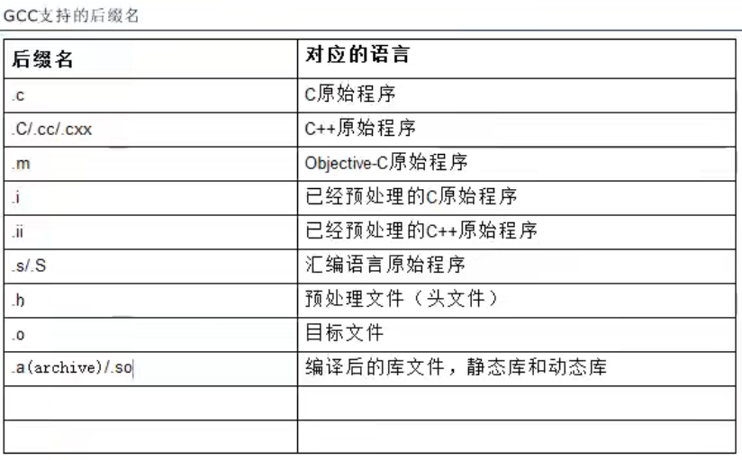
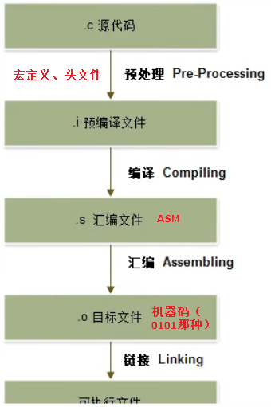

# 一、GCC基础

1. GCC （GNU C Compiler）：把源代码翻译成可执行文件。 GNU是一个开源组织。

2. gcc支持后缀名




3. 编译格式

 `gcc -o 输出文件名 输入文件名` 输出文件是可执行的

 `gcc 输入文件名 && ./文件名.out` （生成文件并执行）

 `gcc -v 输入文件名 ` 生成文件并查看生成过程

  

4. 编译过程（使用`gcc -v 输入文件名 ` 查看）




​	==“链接”一步在做什么？==连接系统标准库？

​	预处理 `cpp -o a.i 输入文件名.c` (gcc -E)

​		查看`a.i`文件：通过此方式生成`gcc -E -o a.i a.c`  ==查看编译和汇编文件方式类似==

​	编译` /usr/lib/gcc/x86_64-linux-gnu/9/cc1 -o /tmp/ccYcxRbE.s`  （`gcc -S`）

​	汇编`as -v --64 -o /tmp/ccxLbYBD.o ` (`gcc -c`)

​	链接` /usr/lib/gcc/x86_64-linux-gnu/9/collect2` (`gcc -o`)


# 二、C常见编译注意点

1. `#include <系统头文件>`、`#include "自定义头文件"`
2. ==包含路径==`#include "./include/a.h"` 或者 `#include "include/a.h"`

```shell
    .
    ├── a.c
    └── include
        └── a.h
```

​	另一种方案：`gcc -I 头文件目录`

​	`a.c`中写`#include "a.h"`，使用`gcc -I ./include a.c`

3. 编译错误：，{} 忘写了

   

4. 链接错误："原材料"不够或者多了

- 原材料不够

```c
#include<stdio.h>

void fun();

int main(){
    printf("Hello\n");
    fun();
    return 0;
}
```

编译错误``a.c:(.text+0x1a): undefined reference to `fun'``

- 原材料多了

比如重定义了`fun()`


# 三、预处理

1. 类型

   1. `#include`

   2. `#define`

      （1） `#define pi (3.14)`  ==注意此处不进行语法检测==。建议使用`(3.14)`，括号可以避免一些语法错误

      （2）`#define A(x) ((5+x))` 宏函数

   3. `#ifdef` `#else` `#endif` 条件编译

      

2. 预定义宏：

   `__FUNCTION__`：函数

   `__LINE__`：行号

   `__FILE__`：文件名

	```c
    #include<stdio.h>
   
    void fun();
   
    int main(){
        printf("%s\n %d\n %s\n", __FUNCTION__, __LINE__, __FILE__);
        return 0;
    }
	```

	输出

    ```shell
    main
     6
     a.c
    ```


3. 条件编译的使用

   ```c
   #include<stdio.h>
   // #define A 1
   
   int main(){
   #ifdef A
       printf("%s\n %d\n %s\n", __FUNCTION__, __LINE__, __FILE__);
   #else
       printf("Hello World!");
   #endif
       return 0;
   }
   ```
	
	- 如果定义了A就输出上一句，如果没定义就输出Hello World
	- `gcc -DA a.c` ==相当于a.c中定义了A==


4. 宏展开中的#和##

   `#` 字符串化，`#define A(x)  #x`

   `##` 连接符号，`#define A(x) A##x`

   

   ```c
   #include<stdio.h>
   
   #define A(x)    #x 
   #define DAY(x)  myday##x 
   
   int main(){
       int myday1 = 10;
       int myday2 = 20;
   	// AB\n 变成了 "AB\n"
       printf(A(AB\n));
       // DAY(1) 最终变成了变量名 myday1
       printf("the day is %d\n", DAY(1));
       return 0;
   }
   ```

   输出

   ```c
   AB
   the day is 10
   ```


# 四、gcc/g++常用参数分析

## 关于路径与链接

```bash
gcc main.c -o main -I /usr/local/include/freetype2  -L /home/hello/lib -lPocoFoundation
```

`-I` 寻找头文件时首先在`/usr/local/include/freetype2`中寻找

`-L` 寻找库文件时首先在`/home/hello/lib`中寻找

`-l` 链接`PocoFoundation`这个库（通常对应的文件是`libPocoFoundation.so`）
