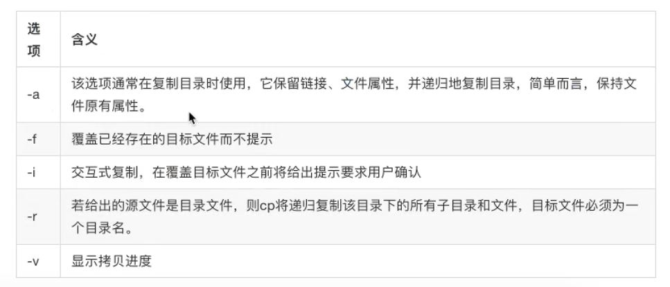
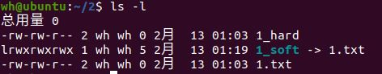
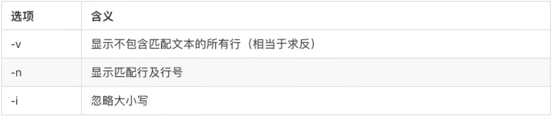
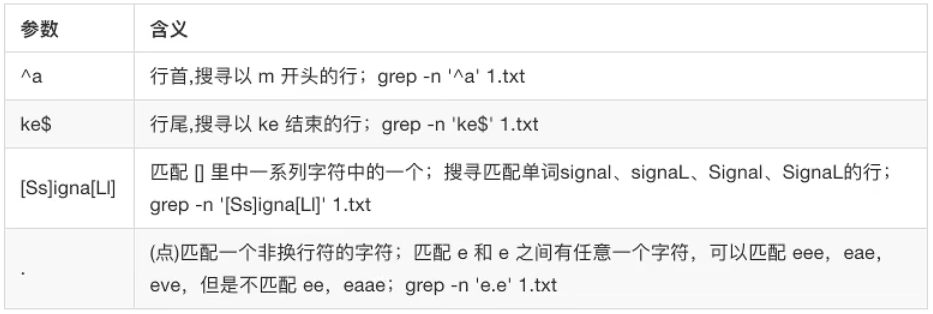
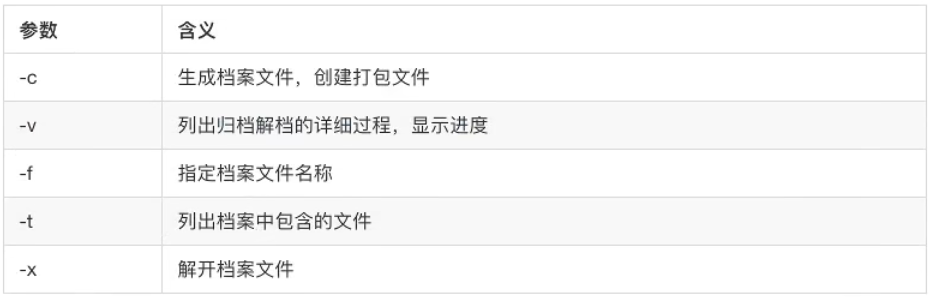
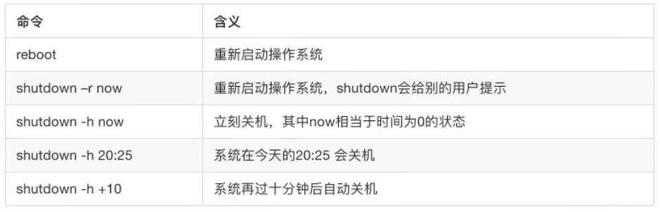

# 一、操作系统

1. 概念：硬件上的第一层软件。


2. 分类：
	- 桌面操作系统：Windows、macOS、linux
	- 移动移动端操作系统：Android、IOS
	- 服务器操作系统：Linux、Windows
	- 嵌入式操作系统：Android（底层为Linux）

   Linux免费、稳定、高效。
<!--more-->
3. Linux的分类
   内核：硬件和应用程序之间。

	- 稳定版：稳
	- 开发版：新

   发行版：在内核上加了一些软件。
   内核和发行版本之间的关系，类似于原生安卓和华为/小米系统之间关系。

```bash
   graph LR
      Linux-->Redhat系列
      Redhat系列-->RHEL
      Redhat系列-->CentOS
      Redhat系列-->Fedora

      Linux-->Debian系列
      Debian系列-->Debian
      Debian系列-->Ubuntu
```
（Hexo对mermaid支持不友好）

# 二、Linux基础

## （一）文件结构


1. 根目录```/```

2. ```/home```普通用户的家目录，```/root```系统管理员（超级用户）

3. ```/bin```可执行二进制文件目录（软件安装目录）

4. ```/media```(```/mnt```)挂载点

5. ```/etc```系统配置文件

6. ```/var```日志文件

   

## （二）常用命令

### 1. 小技巧

- ```clear```命令行清屏；

-  ```tab```键自动补全；

- ↑↓找命令，ctrl+c终止；

- ```命令 --help```显示帮助；

### 2. ```cd 路径```切换文件夹，

- ```pwd```查看当前路径，

- ```./```当前目录下一层，```../```当前目录上一层。```cd ../```

注：```cd ~```回到自己家，```cd -```相当于电视频道回看

### 3. ```ls```查看当前路径下文件目录

- ```ls -a```显示所有文件目录（包括隐藏文件）
- ```ls -l```或```ls -lh```显示文件目录，包括权限、所有者、创建时间
- ```ls 路径``` 显示这个路径下的文件
- ```ls a*```查看名以a开头的文件，```ls *d```查看名以d结尾的文件。\*称为通配符，可代表多个字符

不太重要的提示

- ```ls a?```中?表示任意的一个字符

- ```ls [abc]d ```列出名为abc中任意一个且以d结尾的文件，```ls [a-x]d```和之前的区别是从a到x的任意一个字符

- 当文件名为*x，查看时使用```ls \*x```

  

### 4. ```mkdir 路径+文件夹名```创建文件夹

- ```mkdir 路径+文件夹名 -p``` 自动创建父目录

- ```mkdir 路径+文件夹名 路径+文件夹名```或者```mkdir 路径/{文件夹名1,文件夹名2}```同时创建两个文件夹

  ```mkdir 2/{3,4}```

- ```mkdir .4```创建一个名称为4的隐藏文件夹

  

### 5. ```touch 文件名```创建文件

如```touch 1.txt```，但推荐```gedit 1.txt```创建并打开


### 6.```rm 文件名```删除文件

- ```rm 文件夹名 -r``` 删除文件夹
- ```rm *``` 删除所有文件，不包括隐藏文件


### 7. cp复制命令

- ```cp 1.txt a```将1.txt复制到文件夹a中
- ```cp 1.txt a/2.txt```将1.txt复制到文件夹a中，命名为2.txt
- ```cp a b -r```拷贝文件夹

不太重要的提示

<div align="center"> 
 
</div> 

### 8.mv移动命令（剪切）和重命名，

可直接参考cp命令，包含-f，-i，-v

- ```mv 1.txt 2.txt```相当于将1.txt==重命名==为2.txt

- 移动文件夹不需要-r

  

### 9. cat和重定向

- 重定向：将结果返回到其他地方，```>```覆盖，```>>```追加。

​		ls >1.txt```将本该显示在终端中的结果返回到1.txt中，若1.txt不存在，直接创建。

- cat：将文件的内容直接显示在终端中

​		```cat 1.txt```，```cat  1.txt 2.txt```

两个联合使用：```cat  1.txt 2.txt > 3.txt``` 将两个文件内容合并到3.txt中。


### 10. more 查看文件

如```more 1.txt``` 当1.txt文件内容比较多的时候，分页显示。空格\回车下滑，b上划，q退出


### 11. 管道```|```

将线左边的命令的输出作为线右边的命令的输入

比如```ls -l | more```，但b上划无效


##   （三）权限相关命令

### 1.  rwx权限

当使用```ls -l```查看时

```bash
# 权限 相同文件数 用户 组	大小	创建时间	文件夹名
drwxrwxr-x 2 wh wh 4096 2月  12 20:53 howaa
-rw-rw-r-- 1 wh wh    4 2月  12 22:58 test.txt
```

- 权限中d代表文件夹，-代表文件
- rwx rwx r-x，r可读，w可写，x可执行（若为目录，x表示是否可进入），-表示非。比如最后一个，可读不可写可执行。
- 权限分为三部分：文件拥有者的，文件拥有组的，当前组之外的用户
- 相同文件数是指文件内容相同，在硬链接处会用到


### 2. chmod

（1） chmod u/g/o/a +/-/= 文件名

- u：用户，g：组，o：其他，a：所有

- +：添加权限，-：减少权限，=：制定权限

例如```chmod g+w 1.txt```


（2）数字法

- 将rwx看成三位二进制数，1表示拥有该权限，0表示没有。如二进制的111表示可读可写可执行，而$(111)_2=(7)_{10}$
- 有三组权限，所以有三个十进制数字。如```chmod 777 1.txt```表示用户、组、其他用户均拥有读写执行权限。
- 对文件夹```-R```，```chmod 777 -R test```表示对test文件夹下所有文件的权限均变成777。

​	

## （四）链接和搜索

### 1. 软链接(快捷方式)

```ln -s 1.txt 1_soft```给1.txt创建一个名为1_soft的快捷方式。

快捷方式仅仅记录给出文件的名称。当名称相同的文件覆盖后，不影响快捷方式。

注意：

- 若不在本文件所在路径下创建，需要在源文件和软连接处==均使用绝对路径==。	
- 可给文件夹创建软连接

  

### 2. 硬链接（随时同步的备份）

```ln 1.txt 1_hard```给1.txt创建一个名为1_hard的快捷方式，但保存内容。

<div align="center"> 
 
</div> 

注意：

- 硬链接内容和源文件内容会同步变化
- 在源文件丢失后，硬链接内容不受影响
- 硬连接不能给目录创建


### 3. grep 搜索文件内容

- ```grep hello 1.txt```在1.txt中寻找"hello''

<div align="center"> 
 
</div> 

- ```grep hello a -r```在文件夹a下的所有文件中寻找"hello''
- ```grep -n ^h 1.txt```查找以h开头的，```grep -n h$ 1.txt```查找以h结尾的。==空格也算字符。==

<div align="center"> 
 
</div> 


### 4. find找文件

```find a -name  1.txt```在目录a下查找1.txt

```find a -name  '*.txt'```在目录a下查找名尾为".txt"的文件


## （五）打包与压缩

### 1. tar打包

- ```tar -cvf txt.tar 1.txt 2```将1.txt和文件夹2打包成名为txt.tar的文件，且显示进度
- ```tar -cvf txt.tar *.txt```将所有txt文件。。。
- ```tar -tf txt.tar```查看打包中的文件名单
- ```tar -xf txt.tar -C t2```将文件解包到t2文件夹中（但必须现有t2文件夹）


<div align="center"> 
 
</div> 


注意:

- f要在参数最后且必须包含，v在打包或解包都可用，t仅列出不解包

- -C解包指定目录

  

### 2. gzip 压缩

- ```gzip -r txt.tar``` 压缩txt.tar生成txt.tar.gz
- ```gzip -d txt.tar.gz``` 解压txt.tar.gz生成txt.tar


### 3.一步到位的打包和压缩（参数z）

- ```tar -czf txt.tar.gz *txt```直接生成txt.tar.gz

- ```tar -xzf txt.tar.gz -C tar```解压到tar

  

### 4. bzip2

- 用法和gzip相同，生成的是```.tar.bz2```文件
- 与tar结合一步到位时，使用参数j：
  - ```tar -cjf txt.tar.bz2 *txt```
  - ```tar -xjf txt.tar.bz2 *txt```

### 5. zip和unzip

- ```zip -r zz *txt```将所有txt文件压缩到名为```zz.zip```的压缩包下

- ```unzip -d zz zz.zip```将```zz.zip```解压到zz文件夹下（文件夹若不存在直接创建）

压缩率：zip<gzip<bzip2，bz2最好

通用性：zip>gzip>bzip2


## （六）账户相关

1. which 查看可执行程序位置，如```which vim```

2. 添加账户```sudo adduser username```
3. 删除账户```sudo userdel -r username ``` 

4. 切换到username用户```su username```

5. 设置账户密码```passwd```

   ```sudo passwd root```直接设置root账户密码

6. ```exit```退出当前账户（或终端）
7. 关闭某个用户```sudo pkill -u username```

8. ```who```查看当前所有登录的账户（或终端），ubuntu下只查看当前登录的账户

9. 关机与重启

<div align="center"> 
 
</div> 

​	一般来说就是用```sudo reboot```


## （七）vim记事本

1. ```vim 1.txt```打开1.txt
2. 在准备修改前，输入```i```
3. 编辑结束后，按```Esc```，退出编辑模式
4. 输入```:wq```（或```:wq!```），保存退出。