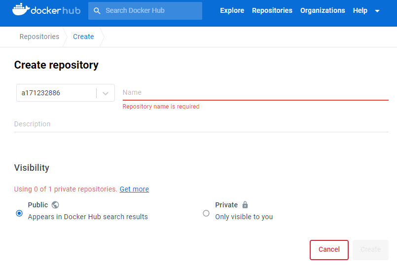
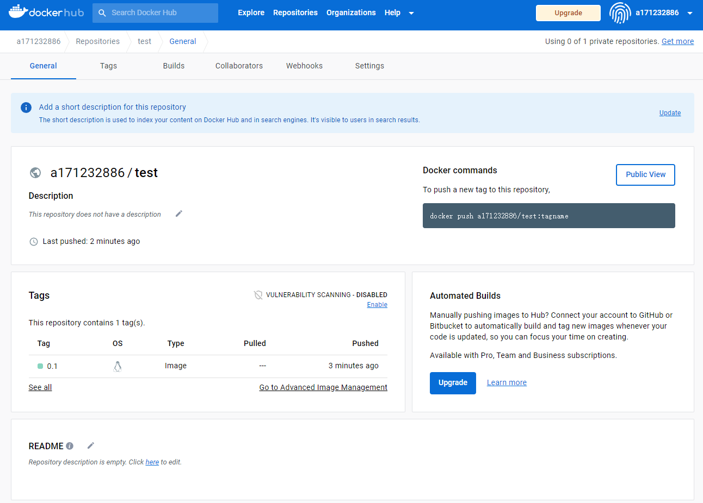

# 0. 安装

```bash
sudo wget -qO- https://get.docker.com/ | sh
docker --version
```


# 1. 镜像image

docker中的image类似于C++中的类


|             含义             |                         命令                          |         备注         |
| :--------------------------: | :---------------------------------------------------: | :------------------: |
|           下载镜像           |             sudo docker pull ubuntu:18.04             |                      |
|         查看本地镜像         |                  sudo docker images                   | sudo docker image ls |
|         删除本地镜像         |            sudo docker rmi -f ubuntu:20.04            |                      |
| 将容器**保存为**新的**镜像** | sudo docker commit \<container id>  \<new image name> |                      |
|         导出本地镜像         |       sudo docker save -o test.tar ubuntu:20.04       |    导出为test.tar    |
|           载入镜像           |              sudo docker load < test.tar              |     载入test.tar     |
|                              |                                                       |                      |


# 2. 容器container
docker中的container类似于C++中的对象

```bash
sudo docker ps # 查看当前在运行container, sudo docker container ls 也可以
sudo docker ps -a # 查看所有container
```


|            含义             |                          命令                          | 备注 |
| :-------------------------: | :----------------------------------------------------: | :--: |
|        创建container        | sudo docker run -it --name test ubuntu:20.04 /bin/bash |      |
|      停止指定container      |                 sudo docker stop test                  |      |
|  启动一个已停止的container  |                sudo docker start  test                 |      |
|      重启指定container      |                sudo docker restart test                |      |
| 进入一个正在运行的container |          sudo docker exec -it  test /bin/bash          |      |
|        删除container        |                  sudo docker rm test                   |      |


## 2.1 创建container的参数

````
sudo docker run -itd --name test ubuntu:20.04 /bin/bash
````


|          参数          |                             含义                             | 备注 |
| :--------------------: | :----------------------------------------------------------: | :--: |
|           -i           |                          交互式操作                          |      |
|           -t           |                             终端                             |      |
|           -d           |                           后台运行                           |      |
| -v ${PWD}:/home/liteos |          将当前目录挂载到container中/home/liteos下           |      |
|      --name test       |                      给该docker起个名字                      |      |
|      -p 4900:5000      | 将主机的4900端口映射到docker的5000端口，查看docker的网页输出访问192.168.41.70:4900 |      |
|                        |                                                              |      |
|                        |                                                              |      |


# 5. 技巧

将container的命令行提示部分变成彩色

在`~/.bashrc`中添加

```bash
PS1='${debian_chroot:+($debian_chroot)}\[\033[01;32m\]\u@\h\[\033[00m\]:\[\033[01;34m\]\w\[\033[00m\]\$ '
```


# 6. Dockerfile

通过Dockerfile构建镜像

## 6.1 准备文件

1. 在某个空文件夹（假设名为test）下编写Dockerfile文件

   ```dockerfile
   # 声明使用哪个基础镜像
   FROM ubuntu:20.04  
   # 声明该镜像的维护者
   MAINTAINER wh
   # 修改镜像中当前工作目录
   WORKDIR /media
   
   # 在镜像中执行命令
   RUN apt update \
       && apt install python -y
   RUN touch 123.txt
   
   # 将Dockerfile所在文件夹中的123.txt
   # 拷贝到镜像/media中，重命名为456.txt
   COPY 123.txt ./456.txt
   
   # 查看一些信息
   RUN python --version
   RUN pwd
   ```

   

2. 创建`123.txt`，其中包含

   ```
   Hello world!
   ```


## 6.2 构建镜像

```bash
cd test
sudo docker build -f Dockerfile -t t:0.1 .
```

输出，（在拉取ubuntu镜像和安装python时会有其他输出，下面是已下载完之后构建镜像时的输出）

```bash
Sending build context to Docker daemon  3.072kB
Step 1/8 : FROM ubuntu:20.04
 ---> d5447fc01ae6
Step 2/8 : MAINTAINER wh
 ---> Using cache
 ---> 2e4af756d4ad
Step 3/8 : WORKDIR /media
 ---> Using cache
 ---> a5211ddd26c0
Step 4/8 : RUN apt update     && apt install python -y
 ---> Using cache
 ---> a49ce33d6b8b
Step 5/8 : RUN touch 123.txt
 ---> Using cache
 ---> 6013b73f3452
Step 6/8 : COPY 123.txt ./456.txt
 ---> Using cache
 ---> 401fae70f5d5
Step 7/8 : RUN python --version
 ---> Using cache
 ---> a0cead0f2cd9
Step 8/8 : RUN pwd
 ---> Using cache
 ---> 9d5a6e529f3a
Successfully built 9d5a6e529f3a
Successfully tagged t:0.1
```

查看镜像

```bash
sudo docker images 
```
输出
```
REPOSITORY   TAG       IMAGE ID       CREATED          SIZE
t            0.1       9d5a6e529f3a   20 minutes ago   150MB
ubuntu       20.04     d5447fc01ae6   7 weeks ago      72.8MB
```

进入镜像

```bash
sudo docker run -it t:0.1 bash
```


## 6.3 上传docker hub

1. 注册账号

   https://hub.docker.com/

2. 本地登录账号。我的用户名是a171232886，注意进行替换

   ```bash
   sudo docker login -u 用户名
   ```
   
   Your password will be stored unencrypted in /root/.docker/config.json.

3. 修改镜像的repository，防止和其他用户的冲突

   ```bash
   sudo docker tag t:0.1 a171232886/test:0.1
   sudo docker images
   ```
   输出

   ```bash
   REPOSITORY        TAG       IMAGE ID       CREATED          SIZE
   t                 0.1       9d5a6e529f3a   44 minutes ago   150MB
   a171232886/test   0.1       9d5a6e529f3a   44 minutes ago   150MB
   ubuntu            20.04     d5447fc01ae6   7 weeks ago      72.8MB
   ```

4. 在Docker Hub中创建自己的repository

   

	可选pubilc还是private，只是private只能有一个

5. 上传镜像

   ```bash
   sudo docker push a171232886/test:0.1
   ```
   
   

6. 拉去镜像到本地

   ```bash
   sudo docker pull a171232886/test:0.1
   ```

   

# 7. Docker与python

https://docs.docker.com/engine/install/ubuntu/

https://docker-py.readthedocs.io/en/stable/


| bash | python          | 含义（bash）                                       | 含义（python）                                               |
| ---- | --------------- | -------------------------------------------------- | ------------------------------------------------------------ |
| --rm | **auto_remove** | Automatically remove the container when it exits   |                                                              |
| -d   | **detach**      | Run container in background and print container ID |                                                              |
| -p   | **ports**       |                                                    | Dict `{'2222/tcp': 3333}` will expose port 2222 inside the container as port 3333 on the host. 注意这里的顺序和bash不同 |
| -v   | **volumes**     |                                                    | ['/home/user1/:/mnt/vol2','/var/www:/mnt/vol1']              |
| -u   | **user**        |                                                    | 0                                                            |
| -e   | **environment** |                                                    | dict or list ["SOMEVARIABLE=xxx"]                            |


# 参考

1. https://www.runoob.com/docker/ubuntu-docker-install.html
2. https://blog.csdn.net/y353027520dx/article/details/88872643

