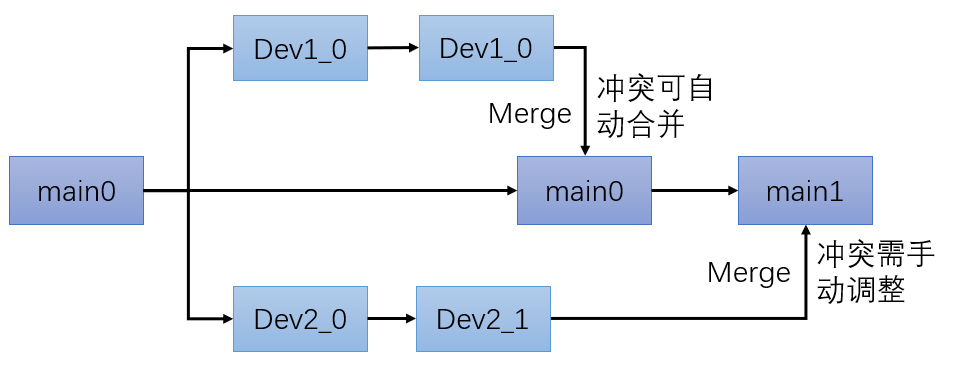
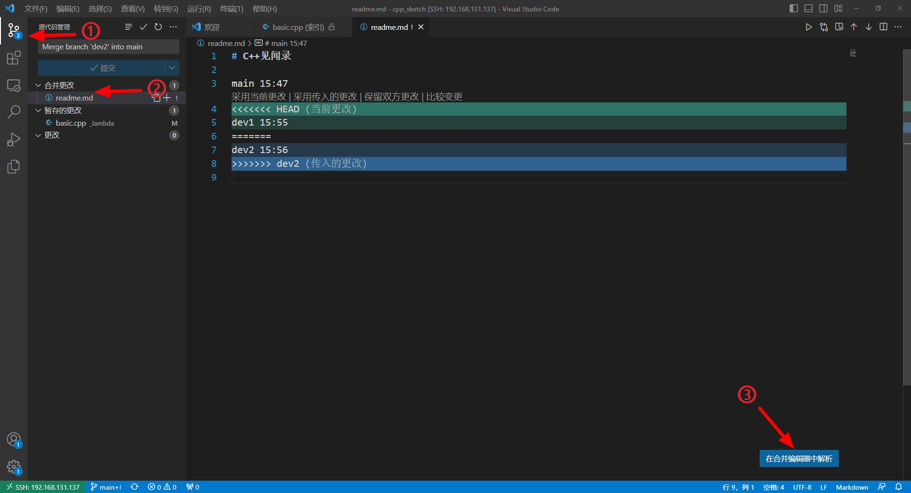
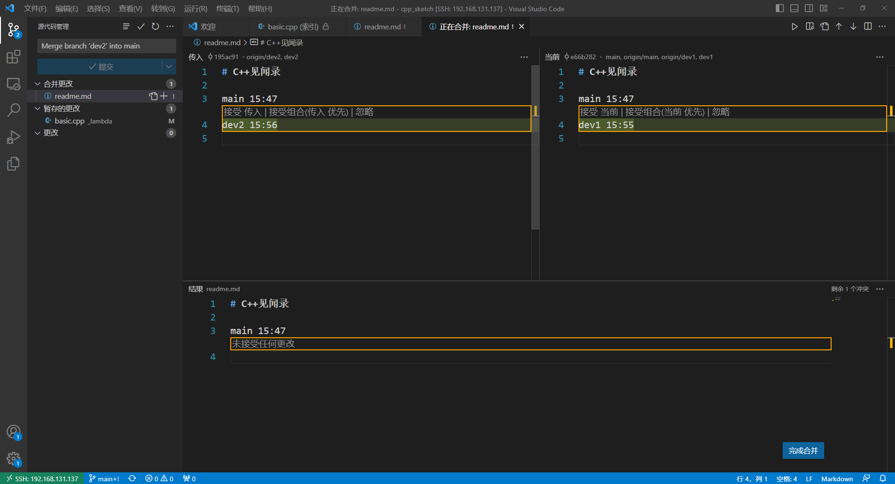

## 1. 本地管理

### 1.1 初始化

```bash
git init
git add -A
git commit -m "First"
```

<!--more-->  

查看哪些文件发生变动

```bash
git status
```


### 1.2 查看修改

在==修改之后，add之前==查看修改之处：

```
git diff readme.txt
```

输出：a/为已提交的版本， b/为当前修改尚未提交的版本

```
diff --git a/readme.md b/readme.md
index ed89f3d..958ad65 100644
--- a/readme.md
+++ b/readme.md
@@ -4,3 +4,6 @@
 
 
 fffffff
+
+
+ddddddddddd
```


注：`git diff`查看全部修改


### 1.3 撤销更改

```
git checkout -- readme.md
```

注：

1. 务必添加`--`
2. 若是在`git add`之前的修改，该命令回退到修改之前，也就是最近一次commit的样子
3. 若是在`git add`之后的修改，该命令回退最近一次add的样子


### 1.4 版本回退

1. 查看提交记录

   ```bash
   git log
   ```

	输出当前分支

   ```bash
   commit 82e043b615d12814acc0d96f9782ed7712e785f1 (HEAD -> master)
   Author: wh <wh@wh.com>
   Date:   Wed Mar 15 19:19:47 2023 -0700
    
      second
    
   commit 89fbcaf3803cc3b0c5bf7d23d17312c67ae79d0d
   Author: wh <wh@wh.com>
   Date:   Wed Mar 15 19:15:41 2023 -0700
    
      First
   ```

2. 回退到某个分支

   ```
   git reset --hard 89fbcaf3803cc3b0c5bf7d23d17312c67ae79d0d
   ```

3. 查看历史提交/回退记录

   ```
   git reflog
   ```

   可根据编号使用reset回退

   

## 2. 远程相关

### 2.1 提交远程仓库 & 下载

1. 添加远程仓库

   ```
   git remote add origin git@github.com:a171232886/test.git
   ```

	origin表示远程仓库（通常默认名为origin），后面是远程仓库的地址
	
	
	
2. 提交

   ```bash
   git branch -M main   	# 第一次提交时使用，把当前分支名改为main
   git push -u origin main # 把本地的当前main，提交到远程库origin
   ```

   注意，`git push`分为两种格式

   - `git push <远程库名> <分支>`，此时远程仓库和本地仓库的分支名相同

   - `git push <远程库名> <本地分支>:<远程分支>`，将本地仓库的`<本地分支>`提交到`<远程库名>:<远程分支>`上

     

 3. 从远程下载最新版本（主分支）

    ```
    git clone git@github.com:a171232886/test.git
    ```

    

 4. 从远程下载名为dev1的分支

    ```
    git clone git@github.com:a171232886/test.git -b dev1
    ```

    

​    

​    

### 2.2 删除本地记录的远程库

1. 查看

   ```
   git remote -v
   ```

   输出

   ```
   origin	git@github.com:a171232886/test.git (fetch)
   origin	git@github.com:a171232886/test.git (push)
   ```

   

2. 删除

   ```
   git remote rm origin
   ```

   

### 2.3 创建分支

1. 创建一个名为dev的分支

   ```
   git branch dev
   ```

   

2. 切换到dev分支

   ```bash
   git checkout dev # git switch dev 也可
   ```

   注：

   - 创建并切换可用`git checkout -b dev`

   - 此时执行`git push -u origin dev`会在将dev推送到远程仓库的dev分支（若没有则创建）

   

3. 删除分支

   ```
   git branch -d dev
   ```


4. 合并dev分支到当前分支

   ```bash
   git merge dev
   ```
   
   
   注：在对源代码进行增、删、改，通常均可自动合并。若出现以下对话，通常按`ctrl` +` x`
   
   ```bash
   GNU nano 4.8    /home/wh/Desktop/test/cpp_sketch/.git/MERGE_MSG               
   Merge branch 'dev3' into main
   # Please enter a commit message to explain why this merge is necessary,
   # especially if it merges an updated upstream into a topic branch.
   #
   # Lines starting with '#' will be ignored, and an empty message aborts
   # the commit.
   
   
   
   
   
   [ Read 6 lines ]
   ^G Get Help  ^O Write Out ^W Where Is  ^K Cut Text  ^J Justify   ^C Cur Pos
   ^X Exit      ^R Read File ^\ Replace   ^U Paste Text^T To Spell  ^_ Go To Line
   ```
   
   按`ctrl` +` x`，输出以下内容表示合并完成
   
   ```bash
   Merge made by the 'recursive' strategy.
    _auto/main.cpp | 10 ++++++----
    1 file changed, 6 insertions(+), 4 deletions(-)
   ```
   
   


### 2.4 分支冲突管理

#### 2.4.1 冲突产生原因分析

主分支之外有两个开发分支（通常是针对不同模块进行修改）。两个开发分支都是基于`main0`生成。

- 当`Dev1`修改完成，合并到`main0`时，冲突内容可自动合并
- 当`Dev2`修改完成，，合并到`main1`时，冲突需要手动调整
- 因为`Dev2`是基于`main0`生成，而此时主分支已经到了`main1`



#### 2.4.2 冲突解决

1. `git merge dev2`出现冲突

   ```bash
   Auto-merging readme.md
   CONFLICT (content): Merge conflict in readme.md
   Automatic merge failed; fix conflicts and then commit the result.
   ```

   

2. `git status`查看当前状态

   ```bash
   On branch main
   Your branch is up to date with 'origin/main'.
   
   You have unmerged paths.
   (fix conflicts and run "git commit")
   (use "git merge --abort" to abort the merge)
   
   Changes to be committed:
   modified:   _lambda/basic.cpp
   
   Unmerged paths:
   (use "git add <file>..." to mark resolution)
   both modified:   readme.md
   ```

   发现需要手动处理的文件是`readme.md`

3. 修改文件

   ```
   # C++见闻录
   
   main 15:47
   <<<<<<< HEAD
   dev1 15:55
   =======
   dev2 15:56
   >>>>>>> dev2
   ```

   注：`<<<<<<<` 表示冲突部分main分支的当前内容，`>>>>>>>`表示冲突部分dev2分支的当前内容

4. 修改好后，commit即可

   ```bash
   git commit -m "fix"
   ```

   

#### 2.4.3 基于vscode的冲突解决

1. 定位文件开始修改

   


2. 根据提示选择使用哪份内容，最后选择合并
   


## 3. 多人协作典型流程

1. 在主分支上创建自己的分支，假设名为`dev_my`，并下载

   ```bash
   git clone git@github.com:a171232886/test.git -d dev_my
   ```

   

2. 在`dev_my`上进行修改，完成后commit提交

   ```bash
   git add -A
   git commit -m "xxxx"
   ```

   

3. ==在push之前，先执行pull提前解决冲突==

   ```bash
   git pull origin main
   ```

   可能的输出

   ```bash
   From github.com:a171232886/test
    * branch            main       -> FETCH_HEAD
   Auto-merging readme.md
   CONFLICT (content): Merge conflict in readme.md
   Auto-merging _auto/main.cpp
   CONFLICT (content): Merge conflict in _auto/main.cpp
   Automatic merge failed; fix conflicts and then commit the result.
   ```

   

   当远程的`main`分支发生变化时，`dev_my`之后merge到`main`必须手动解决冲突。`pull`的作用是从一个仓库或者本地的分支拉取并且整合代码，也就是提前解决这些冲突，并保证当前分支所依照的`main`为最新版本。
   
   


4. push到`dev_my`

   ```
   git push origin dev_my
   ```


## 参看

1. https://www.liaoxuefeng.com/wiki/896043488029600
2. https://zhuanlan.zhihu.com/p/324219299
