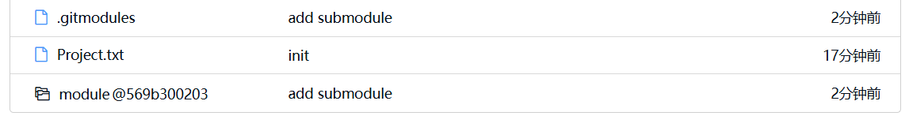
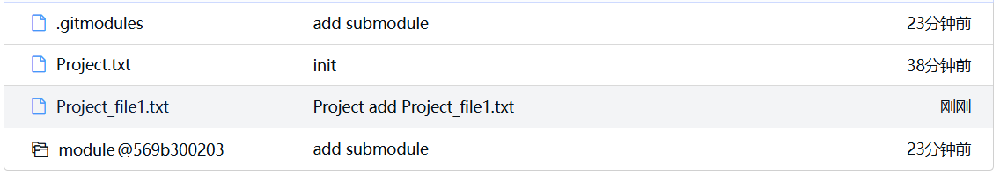
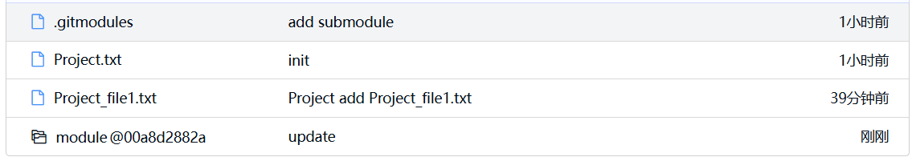

# 0. 背景和准备工作

项目代码太大，很多人一起开发，且不同组的人负责不同的模块。非常想把大仓库拆开，拆成若干个二级小仓库。


创建两个项目`module`和`project`，并同步到远端仓库(GitLink)

project是主项目，module是子项目


## 0.1 module

1. 目录结构

   ```
   module
   ├── file_1.txt
   └── Module.txt
   ```

2. git命令

   ```bash
   git init
   git add -A
   git commit -m "init"
   git remote add origin https://gitlink.org.cn/a171232886/module.git
   git push -f origin master
   ```

   

## 0.2 project

1. 目录结构

   ```
   project
   └── Project.txt
   ```

   


2. git命令

   ```bash
   git init
   git add -A
   git commit -m "init"
   git remote add origin https://gitlink.org.cn/a171232886/project.git
   git push -f origin master
   ```


# 1. submodule

## 1.1 添加submodule

1. 在project中

   ```bash
   git submodule add https://gitlink.org.cn/a171232886/module.git module
   ```

   将子项目放在新文件夹`module`下

2. project 目录结构

   ```
   ├── .git
   ├── .gitmodules
   ├── module
   │   ├── file_1.txt
   │   ├── .git
   │   └── Module.txt
   └── Project.txt
   ```

3. project 此时查看`git status`

   ```
   位于分支 master
   要提交的变更：
     （使用 "git restore --staged <文件>..." 以取消暂存）
           新文件：   .gitmodules
           新文件：   module
   ```

   产生了两个新文件

4. 提交更改

   ```bash
   git commit -m "add submodule"
   git push origin master
   ```

   在Gitlink上可以看到

   


## 1.2 基础操作

### 1.2.1 核心逻辑

**核心逻辑**：**主项目Project的git仅记录submodule的commit号**，并不管理其中的文件


1. 模拟开发

   - 模拟对子项目的修改：在`project/module/`文件夹下新建文件`file_2.txt` 

   - 模拟对主项目的修改：在`project`文件夹下新建文件`Project_file1.txt`

     

2. project 此时查看`git status`

   ```
   位于分支 master
   尚未暂存以备提交的变更：
     （使用 "git add <文件>..." 更新要提交的内容）
     （使用 "git restore <文件>..." 丢弃工作区的改动）
     （提交或丢弃子模组中未跟踪或修改的内容）
           修改：     module (未跟踪的内容)
   
   未跟踪的文件:
     （使用 "git add <文件>..." 以包含要提交的内容）
           Project_file1.txt
   
   修改尚未加入提交（使用 "git add" 和/或 "git commit -a"）
   ```

   - `file_2.txt`位于子项目中，主项目的git仅能感受到子项目发生了变化
   - `Project_file1.txt`位于主项目中，主项目的git正常使用

   

3. project中进行

   ```
   git add -A
   git status
   ```

   可以观察到主项目的git对`Project_file1.txt`和`file_2.txt` 不同操作

   ```
   位于分支 master
   要提交的变更：
     （使用 "git restore --staged <文件>..." 以取消暂存）
           新文件：   Project_file1.txt
   
   尚未暂存以备提交的变更：
     （使用 "git add <文件>..." 更新要提交的内容）
     （使用 "git restore <文件>..." 丢弃工作区的改动）
     （提交或丢弃子模组中未跟踪或修改的内容）
           修改：     module (未跟踪的内容)
   
   ```


4. 如果此时在project中进行commit和push，然后查看状态

   ```bash
   $ git commit -m "Project add Project_file1.txt"
   [master 32772c9] Project add Project_file1.txt
    1 file changed, 0 insertions(+), 0 deletions(-)
    create mode 100644 Project_file1.txt
    
   $ git push origin master
   枚举对象中: 3, 完成.
   对象计数中: 100% (3/3), 完成.
   使用 64 个线程进行压缩
   压缩对象中: 100% (2/2), 完成.
   写入对象中: 100% (2/2), 254 字节 | 254.00 KiB/s, 完成.
   总共 2 （差异 1），复用 0 （差异 0）
   remote: . Processing 1 references
   remote: Processed 1 references in total
   To https://gitlink.org.cn/a171232886/project.git
      488961b..32772c9  master -> master
      
   $ git status
   位于分支 master
   尚未暂存以备提交的变更：
     （使用 "git add <文件>..." 更新要提交的内容）
     （使用 "git restore <文件>..." 丢弃工作区的改动）
     （提交或丢弃子模组中未跟踪或修改的内容）
           修改：     module (未跟踪的内容)
   
   修改尚未加入提交（使用 "git add" 和/或 "git commit -a"）
   ```

   
   
   远程仓库
   
   
   
   （子项目的commit号没有发生变化）
   
   
   
   说明：
   
   - 主项目中的git仅管理非submodule的修改
   - 主项目对submodule仅记录commit号


### 1.2.2 对submodule的修改

1. 此时的主项目目录是

   ```
   project
   ├── .git
   ├── .gitmodules
   ├── module
   │   ├── file_1.txt
   │   ├── file_2.txt
   │   ├── .git
   │   └── Module.txt
   ├── Project_file1.txt
   └── Project.txt
   ```

   

   `git status`的结果是

   ```
   位于分支 master
   尚未暂存以备提交的变更：
     （使用 "git add <文件>..." 更新要提交的内容）
     （使用 "git restore <文件>..." 丢弃工作区的改动）
     （提交或丢弃子模组中未跟踪或修改的内容）
           修改：     module (未跟踪的内容)
   
   修改尚未加入提交（使用 "git add" 和/或 "git commit -a"）
   ```


2. 针对submoudle中文件更改，正确的方法是

   - 先进入submodule，然后add, commit, (push)
   - 返回project目录，add，commit，(push)

   （建议执行push，保证远端仓库的commit号永远可访问到）

   

3. 操作submodule

   ```
   cd module
   git add -A
   git commit -m "add file_2.txt"
   (git push origin master)
   ```

   

4. 回到project的目录, `git status`的结果是

   ```
   位于分支 master
   尚未暂存以备提交的变更：
     （使用 "git add <文件>..." 更新要提交的内容）
     （使用 "git restore <文件>..." 丢弃工作区的改动）
           修改：     module (新提交)
   
   修改尚未加入提交（使用 "git add" 和/或 "git commit -a"）
   ```

   可以看到，project的git感知到了submodule有个新提交，此时Project的git应该更新submodule的commit号

   ```
   git add -A
   git commit -m "update"
   (git push origin master)
   ```

   

5. 查看`git status`

   ```
   位于分支 master
   无文件要提交，干净的工作区
   ```

   远程仓库

   
   
   观察到module的commit号更新了


6. 通常来说在project中，仅对非submodule的部分进行更新。submodule由维护子项目的专门团队负责维护。


### 1.2.3 project的clone

1. 普通的`git clone`仅能将project中非module的部分下载下来

   ```bash
   git clone https://gitlink.org.cn/a171232886/project.git
   ```

   ```
   .
   ├── .git
   ├── .gitmodules
   ├── module
   ├── Project_file1.txt
   └── Project.txt
   ```

   

2. `git clone --recursive` 下载project的同时，也将全部的submodule下载下来

   ```bash
   $ git clone --recursive https://gitlink.org.cn/a171232886/project.git
   正克隆到 'project'...
   remote: Enumerating objects: 10, done.
   remote: Counting objects: 100% (10/10), done.
   remote: Compressing objects: 100% (8/8), done.
   remote: Total 10 (delta 2), reused 0 (delta 0), pack-reused 0
   展开对象中: 100% (10/10), 912 字节 | 456.00 KiB/s, 完成.
   子模组 'module'（https://gitlink.org.cn/a171232886/module.git）已对路径 'module' 注册
   正克隆到 '/home/lb/wh/code/test/project/module'...
   remote: Enumerating objects: 7, done.        
   remote: Counting objects: 100% (7/7), done.        
   remote: Compressing objects: 100% (6/6), done.        
   remote: Total 7 (delta 2), reused 0 (delta 0), pack-reused 0        
   子模组路径 'module'：检出 '00a8d2882a899e103b60e4b48357b195c810e875'
   ```

   **注意**：**clone下来的submodule对应的commit号，不是子项目最新的commit号，而是project最新commit中记录的子项目commit号**
   
   
   
   查看目录
   
   ```
   .
   ├── .git
   ├── .gitmodules
   ├── module
   │   ├── file_1.txt
   │   ├── file_2.txt
   │   ├── .git
   │   └── Module.txt
   ├── Project_file1.txt
   └── Project.txt


3. 如果仅使用`git clone`下载下来的project，下载submodule，可以使用

   ```bash
   git submodule update --init	--recursive
   ```

   此命令为初始化子模块，并更新到主项目中记录的 commit 号


### 1.2.4 查看和更新submodule

1. 查看主项目中的全部submodule及其对应的版本号

   ```bash
   $ git submodule status
    00a8d2882a899e103b60e4b48357b195c810e875 module (00a8d28)
   ```

   

2. 子项目中有了更新，现在project中想更新全部submodule

   ```bash
   git submodule update --remote --recursive
   ```

   

   若只想更新某个submodule

   ```bash
   git submodule update --remote /path/to/your/submodule
   ```

   或者进入submodule目录，然后进行常规的`git pull`


3. 注意：更新完submodule后，要在project中进行add，commit

   ```bash
   git add -A
   git commit -m "update module"
   ```


### 1.2.5 project的reset

1. 在主项目中

   ```bash
   git reset --hard 4ecff933b748013ecb8
   ```
   此时并不会对进行submoudle进行回退

2. 还要执行：submodule更新到主项目中记录的 commit 号

   ```bash
   git submodule update --init	--recursive
   ```

   

## 1.3 分支处理

1. git的分支的本质上是一群的commit

2. 主项目Project的git仅记录submodule的commit号，不会记录子项目对应的branch
   - 相当于直接操作更底层的commit


### 1.3.1 简单操作

如果不去修改submodule，project仅是对submodule读文件，

在submodule对应的`.gitmodules`中设置默认分支即可

```
[submodule "module"]
	path = module
	url = https://gitlink.org.cn/a171232886/module.git
	branch = dev
```

- project为master分支，此处branch设为master分支
- project为dev分支，此处branch设为dev分支即可

在project中

```bash
git checkout dev
git submodule update --init	--recursive		# 获取submodule的dev分支在project的当前commit中对应的commit
git submodule update --remote --recursive	# 获取submodule的dev分支的最新commit 
```


### 1.3.2 自动切换分支

1. git checkout 并没有提供对submodule的分支切换，需要手动完成

   ```bash
   git checkout dev
   git submodule foreach --recursive 'git checkout dev || git checkout master'
   ```

   第二行命令为，对子模块递归执行：切换到dev分支，如果失败就切换到master

   

2. 通常写一个脚本连接 (hook) 到git checkout上 

   ```
   touch /main-project/.git/hooks/post-checkout
   chmod +x /main-project/.git/hooks/post-checkout
   ```

   

   文件内容为

   ```bash
   #!/bin/bash
   
   # 获取当前分支名
   BRANCH=$(git rev-parse --abbrev-ref HEAD)
   
   # 递归更新子模块
   git submodule foreach --recursive 'git checkout $BRANCH || git checkout main'
   ```
   
   注意：本地的git hook不会上传到远端仓库。
   
   通常写一个脚本，在clone后完成这个hook的构建


# 2. subtree

相比于submodule，subtree更接近于一个以核心仓库为核心的简化版分仓库管理：

- 子项目不是通过像submodule引用的方式使用，而是直接将文件出现在主项目仓库中
- 使用subtree管理的主项目中，只有一个`.git`


## 2.1 添加subtree

1. 在project中

   ```bash
   git subtree add --prefix=module https://gitlink.org.cn/a171232886/module.git master
   ```
   命令说明
   ```
   git subtree add --prefix=<子目录路径> <子仓库URL> <分支>
   ```
   
   - `--prefix=<子目录路径>`：指定子仓库在主仓库中的存放路径。
   - `<子仓库URL>`：子仓库的远程地址。
   - `<分支>`：子仓库的分支。
   - `--squash`：将子仓库的所有提交合并为一个提交，以减少主仓库的历史记录。
   
   
   
   可以看到，下载下来的文件与在主项目中新建的无异
   
   ```
   project
   ├── .git
   ├── module
   │   ├── file_1.txt
   │   └── Module.txt
   └── Project.txt
   ```
   


2. 注意：**慎重使用`--squash`选项**，git的merge是需要寻找共同commit起点的，使用该选项后，可能找不到和远程仓库的共同commit

   建议使用以下命令，将子仓库的全部commit记录合并到project的commit记录中

   ```
   git subtree add --prefix=<子目录路径> <子仓库URL> <分支>
   ```

   

2. project中添加module的远程仓库，方便后续操作

   ```bash
   git remote add module https://gitlink.org.cn/a171232886/module.git
   ```

   

## 2.2 项目修改

1. 模拟开发
   - 模拟对子项目的修改：在`project/module/`文件夹下新建文件`file_2.txt` 

   - 模拟对主项目的修改：在`project`文件夹下新建文件`Project_file1.txt`


2. `git status`

   ```
   位于分支 master
   未跟踪的文件:
     （使用 "git add <文件>..." 以包含要提交的内容）
           Project_file_1.txt
           module/file_2.txt
   
   提交为空，但是存在尚未跟踪的文件（使用 "git add" 建立跟踪）
   ```

   即，在子项目内外的修改，主项目的git并不会区别对待


3. 在add，commit，push，pull 等命令中，主项目的git并不会区别对待子项目内外的修改
   - 因为subtree直接管理的是文件


## 2.3 子项目仓库同步

1. 在module项目中创建`file_3.txt`，提交并上传

2. 在project中，拉取module的修改

   ```bash
   git subtree pull --prefix=<子目录路径> <子仓库URL> <分支>
   ```
   
   推送

   ```bash
   git subtree push --prefix=<子目录路径> <子仓库URL> <分支>
   ```
   
   
   
   例如：
   
   ```bash
   git subtree push --prefix=module module master
   ```
   


## 2.4 split (不建议)

假设在主项目中的module已经修改很多次，要和module子项目仓库进行同步

- 此时可以先将和module相关的commit都提取出来，形成一个单独的分支


1. 我们在`project/module`中添加文件`file_project.txt`，然后add， commit

   ```
   commit d2a77708c0ad32294f22e088f87dabb3008cced7 (HEAD -> master)
   Author: muzibin123 <bill-315@163.com>
   Date:   Wed Mar 26 14:44:53 2025 +0800
   
       add file_project
   ```

   

2. project中分支拆分

   ```bash
   git subtree split --prefix=module --branch=module
   ```

   

   切换到`module`分支，查看目录

   ```
   project
   ├── file_1.txt
   ├── file_2.txt
   ├── file_3.txt
   ├── file_4.txt
   ├── .git
   └── Module.txt
   ```

   仅剩和module相关的文件

   

3. 在该`module`分支中查看`git log`

   ```
   commit e9c3bd13d629a9737302c1deda2aa50de0567949 (HEAD -> module)
   Author: muzibin123 <bill-315@163.com>
   Date:   Wed Mar 26 14:44:53 2025 +0800
   
       add file_project
   ```

   可以看到：**同一次提交`add file_project`,在master和module分支却对应不同的commit号**

   - master分支中：d2a77708c0ad32294f22e088f87dabb3008cced7
   - module分支中：e9c3bd13d629a9737302c1deda2aa50de0567949

   因此，**不推荐使用`git subtree`命令**


4. 在`module`分支中，更新子项目的远程仓库

   ```bash
   git pull module master				# 拉取module远程仓库的最新提交 
   git push module module:master		# 将本地的module分支，上传到远程仓库module的master分支上
   ```

   - `git push <远程库名> <本地分支>:<远程分支>`

   - 假设`git pull`执行后的commit对应为95515abe1fb4d2


5. 将本地仓库的module分支的修改同步到master分支上

   ```
   git subtree pull --prefix=<子目录路径> <子仓库URL> <分支>
   ```

   或者

   ```
   git subtree merge --prefix module 95515abe1fb4d2
   ```

   **错误做法**：`git merge module`


## 2.5 小节

如果使用subtree，只需记住三条命令即可

- `git subtree add --prefix=<子目录路径> <子仓库URL> <分支>`
- `git subtree pull --prefix=<子目录路径> <子仓库URL> <分支>`
- `git subtree push --prefix=<子目录路径> <子仓库URL> <分支>`


  # 参考

- https://zhuanlan.zhihu.com/p/614299771
- DeepSeek
- Qwen
