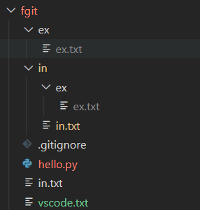

# 1. 常用的gitignore样式

参考：https://www.atlassian.com/git/tutorials/saving-changes/gitignore

**强烈建议花费15-20分钟时间按顺序阅读上述连接中的`Git ignore patterns`部分**

1. 直接通过vscode的文件栏对应文件名颜色可知状态：若为灰色，git则忽略
2. gitignore的目的是让一些Git还未跟踪的文件不被跟踪，**已跟踪的文件不受影响**
2. 本篇笔记中的名词：
   - 模式：gitignore中一行路径
   - 匹配：模式匹配到的实际路径
   - 屏蔽：完成路径匹配后，git忽略对应的文件或文件夹

## 1.1 基础

1. `*.txt`：路径中最后是`*.txt`的文件
2. `**/log/log.txt`：路径中最后是`log/log.txt`的文件
3. `**/log`：路径中最后是`log`的文件夹或文件，并自动屏蔽`log`文件夹下全部内容

## 1.2 升级

1. `/log.txt`：只屏蔽当前目录下的`log.txt`

   `log.txt`：相当于`*log.txt`，屏蔽所有`log.txt`

2. `log`：相当于`**log`，屏蔽所有目录下名为log的文件夹或者文件

   `log/`：相当于`**log/`，屏蔽所有目录下名为log的文件夹

**总结**：

1. 当直接指定文件名或文件夹名时（`log`），相当于在全局范围内匹配

2. 当包含部分路径时（`log/log.txt`），若想全局匹配，需在前添加`**/`，否则就仅匹配当前路径下的``log/log.txt``

3. `log/`表示文件夹，`log`表示文件夹或文件

   

## 1.3 ！的使用

1. `!`

   ```
   *.txt
   !in.txt
   ```

   匹配除`in.txt`外的所有`*.txt`

6. **注意**

   ```
   /log
   !/log/log.txt
   ```

   仍然会匹配到log下所有文件。此为git的怪癖：当父目录被匹配到，排除文件无效


## 1.4 check-ignore

查看当前文件是否会被屏蔽，可以使用check-ignore

```
git check-ignore -v log/log.txt
```

输出

```
.gitignore:1:log        log/log.txt
```

说明`log/log.txt`会被屏蔽，是由于`.gitignore`第1行的`log`导致的

无输出则不会被屏蔽


# 2. gitignore官方的讲解

官方讲解，提供了一些信息，但细节模糊并且在一些地方有冲突，不建议观看

## 2.1 概要

1. 功能：指定git忽略的文件
2. gitignore的方式：
   1. 每行是一个模式匹配
   2. （如有冲突）最后一行决定最终情况
   3. 高层级目录中的gitignore会被低层级的覆盖
3. 注意：
   - **已跟踪的文件不受影响**
   - gitignore的目的是让一些Git还未跟踪的文件不被跟踪
   - 对于已被跟踪的文件
     - 先使用`git rm --cached`
     - 后在gitignore中添加

4. 名词：
   - 模式pattern：gitignore的一行

## 2.2 书写规则

1. 允许空行
2. `#`开头为注释。`\`为hash？
3. 末尾的空格被忽略，除非以`\`结束
4. `!`否定模式，之前被排除的会被再次加入
5. `/`路径分隔符
   - 若一个pattern中（开头和中间）含有`/`，则pattern中路径的书写方式，应为**相对于gitignore所在位置的相对路径**
   - 若（开头和中间）不含`/`，pattern中路径会被理解为gitignore所在位置下的**任何与pattern路径相同的**路径
   - 若在结尾含`/`，表示只匹配目录，而不是文件
   - 若在结尾不含`/`，既匹配目录也匹配文件

6. `*`表示任何内容，除了`/`
7. `?`表示任何字符，除了`/`
8. 与完整路径名匹配的模式中的两个连续星号 `**`
   - `**/`表示匹配**任何层级下**相同的目录或文件。比如`**/foo`表示当前路径下所有foo文件夹或文件
   - `/**`表示匹配文件夹下所有文件。比如`abc/**`
   - `/**/`表示中间有0级或多级目录。比如`a/**/b` matches `a/b`, `a/x/b`, "`a/x/y/b`" and so on

## 2.3 例子

1. The pattern `foo/*`, matches `foo/test.json` (a regular file), `foo/bar` (a directory), but it does not match `foo/bar/hello.c`

2. Example to exclude everything except a specific directory `foo/bar`

   ```
   # exclude everything except directory foo/bar
   /*
   !/foo
   /foo/*
   !/foo/bar
   ```


按其定义，那为什么不能写成？实在是令人疑惑

```
/**
!/foo/bar
```


# 3. 其他

## 3.1 vscode颜色



几种常见颜色：

- 灰色：git忽略的文件或文件夹
- 白色：文件无修改
- 黄色：修改未commit
- 红色：文件中有语法错误
- 绿色：新建文件

## 3.2 git注意

1. git status 仅显示文件，而不显示文件夹


# 参考

1. 教程：https://git-scm.com/docs/gitignore
2. 常用的gitignore：https://github.com/github/gitignore
3. gitignore实用技巧：https://www.atlassian.com/git/tutorials/saving-changes/gitignore
