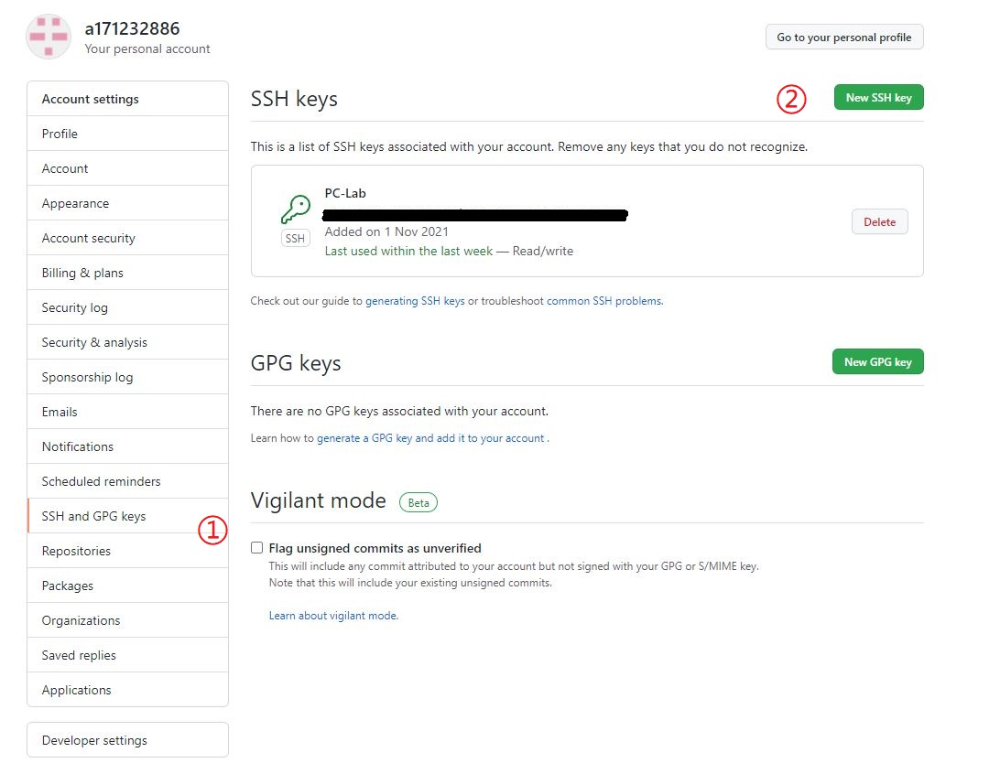

# 0. 前言

好不容易做完一个论文代码，要公开到Github上，此时有两种选择：

- 在GitHub上进行拖拽上传
- Git命令上传

对于文件数不多的程序可以用拖拽上传，但动辄文件数上百的程序这样显然就不合适，因为每次拖拽上传最大文件数有限制。你总不能直接上传一个压缩包吧，那样也太显示你的水平了。


这时就要用到Git命令了。尽管Git是一个优秀的版本控制命令，但对于我这种单人小项目并且在固定服务器上运行的程序编写者而言，Git的价值不大。搞一堆Git控制命令，有粘贴复制方便吗，有直接开两个窗口直接对比程序异同直观吗？

因此，Git命令在目前阶段（2021.11，此时尚未硕士毕业）对我最大的用处是上传Github。但这涉及的命令并不简单，探索了一点时间才解决，故在此处整理出来。


**前置条件**：

1. 拥有Github账号
2. 此时可以访问Github，（不能访问的别问我怎么办，我也不知道）
3. 安装好了Git软件


**参考**：

- [官网安装Git](https://git-scm.com/downloads)

- Git推荐教程：[廖雪峰](https://www.liaoxuefeng.com/wiki/896043488029600/896067074338496)

  


# 1. 初始化并上传

一共三部分，核心9条命令，依次来

## 1.1 Git初始设置

1. 设置本地Git用户名

   ```
   git config --global user.name "Name" 
   git config --global user.email "email@example.com"
   ```

   例如，Name 和 email@example.com 可分别为 twodog 和 twodog@qq.com


2. 用你在注册Github账户是的邮箱，然后一路回车
   ```bash
   ssh-keygen -t rsa -C "youremail@example.com"
   ```
   
   
   
3. 进入`C:\Users\WH\.ssh`，找一个叫`id_rsa.pub`的文件（公钥）

   

4. 然后按照图中的数字顺序，在Github中创建SSH密钥，方便以后免密上传

    


## 1.2 本地仓库初始化

（这么说肯定不标准，还望各位大佬别笑）实际上是用Git对本地程序建立一个“变更记录”

1. 进入到程序文件夹

   （别学我，最好别有中文路径）

   ```bash
   cd C:\Users\WH\Desktop\新建文件夹\TIR
   ```


2. 初始化并提交

   ```bash
   git init
   git add --all   # 添加所有文件
   git commit -m "first"  # 提交修改
   ```

   


## 1.3 上传Github
1. 修改一下分支名

   ```bash
   git branch -M main # 为了和Github默认分支保持一致
   ```

   

2. 添加远端库名

   比如，你刚在Github上创建了一个库，库名为TIR。现在告诉Git，要把这些程序上传到这个库TJUMMG/TIR，这个库在本地命名为origin

   ```bash
   git remote add origin git@github.com:TJUMMG/TIR.git
   ```

   

3. 上传

   ```bash
   git push -u origin main
   ```

   
