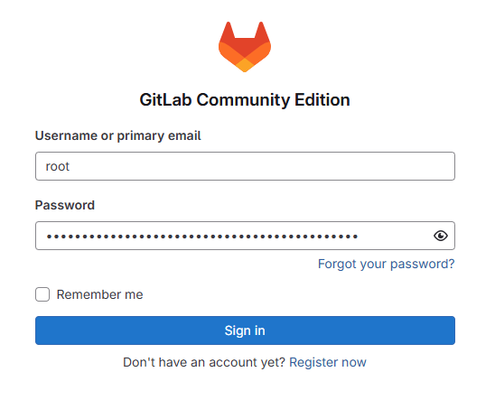

# 1. 版本介绍

## 1.1 官方

**注意要使用ce版本（社区版）**

1. 官方：https://about.gitlab.com/
   - 官方安装文档：https://about.gitlab.com/install/
   
2. 官方ce版本deb安装包：https://packages.gitlab.com/gitlab/gitlab-ce

3. 官方docker镜像：https://hub.docker.com/r/gitlab/gitlab-ce

4. 官方docker安装教程：
   - https://docs.gitlab.com/ee/install/docker.html

   **注意此为ee版（企业版），需在拉取镜像时配置替换为`gitlab-ce`**
   
5. 官方配置说明：https://docs.gitlab.com/install/docker/configuration/


## 1.2 中国代理

**建议直接使用原版，不使用中国代理版**

1. 中国官方介绍：https://gitlab.cn/is-it-any-good/

   - gitlab-ce是社区版，gitlab-ee是企业版，gitlab-jh是中国企业版
   - 极狐是Gitlab的中国代理
2. 中国官方安装文档：https://gitlab.cn/install/

   - Ubuntu存在apt install的简易安装方式
   - 未对Windows提供安装包


# 2. 部署&初始化

## 2.1 准备Docker Compose

相关笔记可查看：https://github.com/a171232886/Note/blob/main/Docker%E7%AC%94%E8%AE%B0.md

1. 安装 docker （以及 docker compose）

   ```
   sudo wget -qO- https://get.docker.com/ | sh
   docker --version
   ```

   

2. 可选：将当前用户添加到docker用户组

   - 后续执行docker命令时，不必添加 sudo

   ```
   sudo usermod -aG docker <用户名>
   ```


3. GitLab镜像下载

   ```
   docker pull gitlab/gitlab-ce
   ```

   编写文档此时latest对应的版本是18.1.1-ce.0

   上条命令相当于

   ```
   docker pull gitlab/gitlab-ce:18.1.1-ce.0
   ```


## 2.2 部署

1. 网络环境介绍

   ```
   公网访问：121.36.110.23:7004 → 路由器/NAT → 内网访问：192.168.1.4:9080 → Docker容器 9080:80 → GitLab服务
   公网访问：121.36.110.23:7005 → 路由器/NAT → 内网访问：192.168.1.4:9022 → Docker容器 9022:22 → GitLab服务
   ```

   

2. 编写`compose.yaml`

   ```yaml
   services:
     gitlab:
       image: gitlab/gitlab-ce
       container_name: gitlab
       user: root								# 出于异地重建容器的需要
       restart: always
       ports:
         - "9443:443"
         - "9080:80"
         - "9022:22"
       volumes:
         - "./config:/etc/gitlab"
         - "./logs:/var/log/gitlab"
         - "./data:/var/opt/gitlab"
       logging:
         driver: journald      				# 使用宿主机日志系统，防止日志过多占满磁盘
       shm_size: 256m							# 调整共享内存大小，防止运行过慢
   ```


3. 启动容器

   ```
   docker compose up
   ```

   

   - 可观察到docker在本地创建三个文件夹，用于保存运行信息

     **只要这三个文件夹没有被删除，GitLab就能重现**
   
     ```
     .
     ├── compose.yaml
     ├── config
     ├── data
     └── logs
     ```

     

   - 需要稍等几分钟，访问网页
   
     ```
     http://localhost:9080/
     ```

     如果确信网络转发没问题，可以直接访问
   
     ```
     http://121.36.110.23:7004/
     ```


## 2.3 初始化

### 2.3.1 管理员账号登录&密码修改

1. 获取管理员账号（root）初始登录密码

   ```
   docker exec -it gitlab cat /etc/gitlab/initial_root_password
   ```

   输出

   ```
   # WARNING: This value is valid only in the following conditions
   #          1. If provided manually (either via `GITLAB_ROOT_PASSWORD` environment variable or via `gitlab_rails['initial_root_password']` setting in `gitlab.rb`, it was provided before database was seeded for the first time (usually, the first reconfigure run).
   #          2. Password hasn't been changed manually, either via UI or via command line.
   #
   #          If the password shown here doesn't work, you must reset the admin password following https://docs.gitlab.com/ee/security/reset_user_password.html#reset-your-root-password.
   
   Password: Z5cTCIh+MSozFIEVOxGp47jrAxWVIT0qob7gyv5LREk=
   
   # NOTE: This file will be automatically deleted in the first reconfigure run after 24 hours.
   ```

   因此：

   - 用户名：root

   - 密码：Z5cTCIh+MSozFIEVOxGp47jrAxWVIT0qob7gyv5LREk=

     

1. 登录

   - 浏览器访问`http://121.36.110.23:7004/`，
   - 或者在部署gitlab的机器上访问`http://localhost:9080/`

   

   

2. 密码更改

   对应网址

   ```
   http://121.36.110.23:7004/-/user_settings/password/edit
   ```

   


### 2.3.2 中文与时区设置

1. 设置中文显示（看个人喜好）

   对应网址

   ```
   http://121.36.110.23:7004/-/profile/preferences
   ```

   


2. 时区设置

   对应网址

   ```
   http://121.36.110.23:7004/-/user_settings/profile
   ```

   


### 2.3.3 设置代码仓库前缀

1. 设置代码仓库的http默认前缀

   对应网址

   ```
   http://121.36.110.23:7004/admin/application_settings/general#js-visibility-settings
   ```

   直接使用外网访问地址

   

   


2. 调整配置文件，正确设置SSH Clone URL

   https://docs.gitlab.com/install/docker/configuration/#expose-gitlab-on-different-ports

   （此为最广泛且根本的配置方法）

   - 进入容器

     ```bash
     docker exec -it gitlab bash
     ```

   - 编辑配置

     ```bash
     vi /etc/gitlab/gitlab.rb
     ```

     添加

     ```
     gitlab_rails['gitlab_ssh_host'] = '121.36.110.23'	# SSH 公网地址
     gitlab_rails['gitlab_shell_ssh_port'] = 7005		# SSH 公网端口
     ```
   
   - 配置生效
   
     ```
     gitlab-ctl reconfigure
     ```
   
     另外，重启命令是`gitlab-ctl restart`
   
   
   
   注：可在`compose.yaml`中直接添加对应配置（但不推荐）
   
   ```yaml
   services:
     gitlab:
       image: gitlab/gitlab-ce
       container_name: gitlab
       user: root
       restart: always
       ports:
         - "9443:443"
         - "9080:80"
         - "9022:22"
       volumes:
         - "./config:/etc/gitlab"
         - "./logs:/var/log/gitlab"
         - "./data:/var/opt/gitlab"
       environment:
         GITLAB_OMNIBUS_CONFIG: "gitlab_rails['gitlab_shell_ssh_port'] = 7005; gitlab_rails['gitlab_ssh_host'] = '121.36.110.23'"			# 添加项
       logging:
         driver: journald      
       shm_size: 256m
   ```
   
   
   
   


### 2.3.4 初始化SSH


1. 初始化SSH 并添加到管理员的SSH密钥中

   - 进入容器

     ```
     docker exec -it gitlab bash
     ```

     初始化SSH

     ```
     ssh-keygen -t ed25519
     ```

     

   - 将`id_ed25519.pub`添加到SSH密钥中

     （添加哪个密钥取决于需求）

     对应网址

     ```
     http://121.36.110.23:7004/-/user_settings/ssh_keys
     ```

     

   


# 3. 基础使用

## 3.1 账号注册

1. 注册账号

   对应网址

   ```
   http://121.36.110.23:7004/users/sign_up
   ```

   

2. 管理员账号审核通过，然后才能正常登录

   对应网址

   ```
   http://121.36.110.23:7004/admin/users
   ```

   

   

   

   在编辑中，可以重置普通用户的密码，调整权限等


3. 常用主机的SSH密钥添加

   - 比如将`~/.ssh/id_rsa.pub`添加到GitLab的SSH密钥中

   对应网址

   ```
   http://121.36.110.23:7004/-/user_settings/ssh_keys
   ```

   

## 3.2 项目创建

1. 创建项目

   对应网址

   ```
   http://121.36.110.23:7004/projects/new#blank_project
   ```

   

   


2. 访问项目

   对应网址

   ```
   http://121.36.110.23:7004/wh/example
   ```

   
   
   - 可以看到端口号是正确的
   - 注意默认分支是`main`，不是`master`


3. git clone/push/pull 正常使用即可
   - 在git clone 时推荐使用 HTTP 克隆，每次push/pull时都手动输入用户名和密码，更安全 


# 4. 基于Docker部署的常见问题

## 4.1 容器占用空间过大

解决方案：journald

https://docs.docker.com/config/containers/logging/journald/

1. 将日志驱动程序设置为 `journald`，这样日志会被发送到系统日志中，而不是占用容器的磁盘空间。

   - 由系统日志管理器（如 systemd-journald）负责管理

   ```
   docker run --log-driver=journald your_image_name
   ```

2. (LLM回答)：在大多数 Linux 系统上，系统日志文件通常位于 `/var/log/` 目录下。对于 Journald，它的日志数据通常存储在 `/run/log/journal/` 或 `/var/log/journal/` 目录中，具体位置可能会根据你的 Linux 发行版和配置而有所不同。 **Journald 通常会对日志进行自动轮转和压缩，以限制日志文件的大小并节省磁盘空间。**

   


## 4.2 反应速度过慢

访问Gitlab经常会报500或者502

https://docs.gitlab.cn/jh/install/docker.html#devshm-mount-%E5%9C%A8-docker-%E5%AE%B9%E5%99%A8%E4%B8%AD%E6%B2%A1%E6%9C%89%E8%B6%B3%E5%A4%9F%E7%9A%84%E7%A9%BA%E9%97%B4

1. **在容器中**查看``/dev/shm``的占用情况

   ```
   df /dev/shm -lh
   ```

   如果可用空间为0，可以尝试以下方法

   

2. 禁用Prometheus Metrics

   **登录管理账户**

   对应网址
   
   ```
   http://121.36.110.23:7004/admin/application_settings/metrics_and_profiling#js-prometheus-settings
   ```
   
   


3. 加大共享内存到至少 256MB

   ```
   docker run --shm-size 256m ...
   ```

   

