# 1. 介绍
## 1.1 Jenkins

一个完全开源的CI&CD软件

1. 官网：https://www.jenkins.io/zh/
2. Ubuntu上安装教程
   - https://www.jenkins.io/zh/doc/book/installing/#debianubuntu

3. Docker安装教程
   - https://www.jenkins.io/zh/doc/book/installing/#docker （比较老旧）
   - 官方镜像：https://hub.docker.com/r/jenkins/jenkins


## 1.2 整体目标

1. 持续集成（CI, Continuous Integration）

   开发人员频繁地将代码变更合并到共享的主干分支（如每天多次），每次提交都会触发自动化构建和测试。

   

2. 工作流程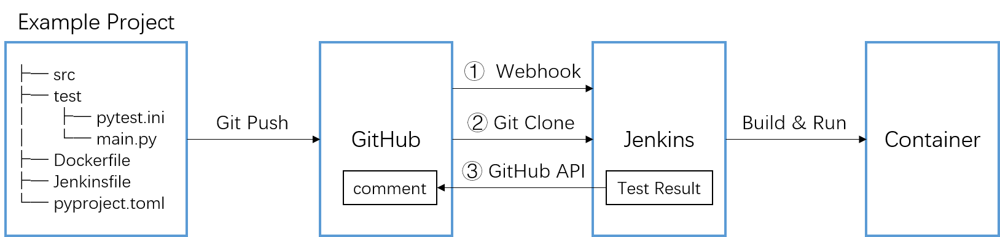


# 2. 样例工程介绍

代码链接：https://github.com/a171232886/example_ci_pytest_jenkins


## 2.1 目录结构

```bash
example_ci_pytest_jenkins
├── dockerfile							# Docker image 构造配置文件
├── Jenkinsfile							# Jenkins pipeline配置文件
├── pyproject.toml						# python 打包配置文件
├── readme.md							# 衬衫的价格是九磅十五便士
├── src									# 源码目录
│   └── example
│       ├── __init__.py
│       └── server.py
└── test								# 测试目录
    ├── conftest.py						# pytest共用fixture						
    ├── pytest.ini    					# pytest 配置文件
    ├── main.py							# 测试入口
    ├── data							# 数据和测试用例
    │   ├── data.csv
    │   ├── test_api_1.yaml
    │   └── test_api_2.yaml
    ├── tests							# 测试用例程序
    │   └── test_demo.py
    └── utils							# 相关工具
        ├── __init__.py
        ├── load.py
        ├── mock_server.py
        └── validate.py
```


1. 参考Python官方推荐目录结构：[Packaging Python Projects - Python Packaging User Guide](https://packaging.python.org/en/latest/tutorials/packaging-projects/#creating-the-package-files)

   ```
   packaging_tutorial/
   ├── LICENSE
   ├── pyproject.toml
   ├── README.md
   ├── src/
   │   └── example_package_YOUR_USERNAME_HERE/
   │       ├── __init__.py
   │       └── example.py
   └── tests/
   ```

   

2. 关于`.gitingore` 的语法，可以参考笔记：[gitignore.md](https://github.com/a171232886/Note/blob/main/Git/gitignore.md)

   网上有很多通用的`.gitingore`，不必自己从头写


## 2.2 内容介绍

### 2.2.1 pyproject.toml

1. python官方推荐的package时的配置文件

   - 会逐步替代`setup.py`

   

2. pyproject.toml

   基于 TOML（Tom's Obvious, Minimal Language) 语法编写，简单明了

   ```toml
   [project]
   name = "example"										# package 的名称
   version = "1.0.0"										# package 的版本
   description = "example"
   requires-python = ">=3.11"
   authors = [
       { name = "WH", email = "wh@wh.com" }
   ]
   
   # TODO: Add version control for each dependency			# 所需依赖
   dependencies = [
       "build",
       "pytest",
       "fastapi",
       "uvicorn",
       "requests",
       "pytest-result-log",
       "allure-pytest",
       "pyyaml",
       "jsonschema",
       "jsonpath-ng"
   ]
   
   [tool.pypi]
   index-url = "https://pypi.tuna.tsinghua.edu.cn/simple"	# 使用清华源
   
   
   [build-system]
   requires = ["setuptools>=42", "wheel"]					# 使用 setuptools 进行打包
   build-backend = "setuptools.build_meta"
   ```


3. 三个常用命令

   - 生成`.whl`安装包

     ```
     python -m build
     ```

   - 直接安装到系统中

     ```
     pip install .
     ```

   - 以可编辑模式安装到系统中，用于调试

     ```
     pip install -e .
     ```

   

   **注意**：

   - **需要先进入到项目目录中**
   - 三个命令可独立执行，没有依赖关系


4. 强制重新安装，即使版本相同

   ```
   pip install --force-reinstall .
   ```

   


### 2.2.2 dockerfile

1. 为准确复现运行环境，会提供一份基于公开镜像构建的dockerfile，来构建当前项目所需环境的基础镜像

   - 通常为了减少自动化测试耗时，这份基础镜像都会提构建好
   - 项目某次具体的commit，会在这份基础镜像上进行微调

   ```mermaid
   flowchart LR
   	A["python:3.12\n(公开镜像)"] --> B["example:v1.0\n(项目基础镜像)"]
   	B --> C1["commit 1对应镜像"]
   	B --> C2["commit 2对应镜像"]
   ```

2. dockerfile文件

   ```dockerfile
   # 使用官方 Python 3.12 镜像（基于 Debian）
   FROM python:3.12.1
   
   # 设置工作目录
   WORKDIR /app
   
   
   # 安装依赖（Java + curl）
   RUN apt-get update && \
       apt-get install -y --no-install-recommends openjdk-17-jre-headless curl && \
       rm -rf /var/lib/apt/lists/*
   
   # 安装 Allure
   RUN curl -o allure-2.24.0.tgz -Ls https://repo.maven.apache.org/maven2/io/qameta/allure/allure-commandline/2.24.0/allure-commandline-2.24.0.tgz && \
       tar -zxvf allure-2.24.0.tgz -C /opt/ && \
       ln -s /opt/allure-2.24.0/bin/allure /usr/bin/allure && \
       rm -rf allure-2.24.0.tgz
   
   # 验证安装
   RUN allure --version
   
   
   # 配置 PyPI 清华镜像并安装依赖
   COPY . ./example
   RUN pip install ./example
   RUN rm -rf ./example
   
   # 可选：验证 Python 和 pip 版本
   RUN pip list
   
   # 设置默认启动命令（可根据需求修改）
   CMD ["bash"]
   ```

   整体上分两步：

   - 安装allure及其所需环境
   - 下载并安装当前项目所需的pip包


3. 构建镜像

   ```bash
   cd example_ci_pytest_jenkins
   docker build -t example:v1.0 .
   ```

   


### 2.2.3 Pytest简要介绍

详细可以参考pytest笔记：[pytest.md](https://github.com/a171232886/Note_Python/blob/main/pytest.md)

1. 测试用例发现规则：

   - 打开以`test_`开头或以`_test`结尾的python文件

   - 寻找以`test_`开头的函数

     ```python
     def test_demo():
     	pass
     	assert 1 == 1
     ```

     

2. 标记 mark

   - 用于给测试用例分类，或者使用一些pytest预置功能
   - 在配置文件`pytest.ini`

   

3. 参数化标记 `parametrize`

   可用于数据驱动测试

   ```python
   @pytest.mark.parametrize("arg1, arg2", [
       (1, 2),
       (2, 3),
   ])
   def test_add(arg1, arg2):
       assert arg1 + 1 == arg2
   ```

   相当于构造了两个测试用例

   - 共用一份测试程序

   - 两份测试数据：`arg1 = 1, arg2 = 2 `和 `arg1 = 2, arg2 = 3 `


4. 夹具 `fixture`

   - 理解成python中的装饰器即可，为测试函数在执行前和执行后，添加处理逻辑

   - 所有测试用例共用的夹具，放在`conftest.py` 中

     

5. 配置文件`pytest.ini`

   ```ini
   [pytest]
   
   addopts = --alluredir=cache --clean-alluredir
   markers = 
       unit: 单元测试
       api: 接口测试
       ddt: 数据驱动测试
       
   ...
   ```


6. allure 是一个测试框架

   - `allure-pytest` 该插件可用于生成美观的网页测试报告

   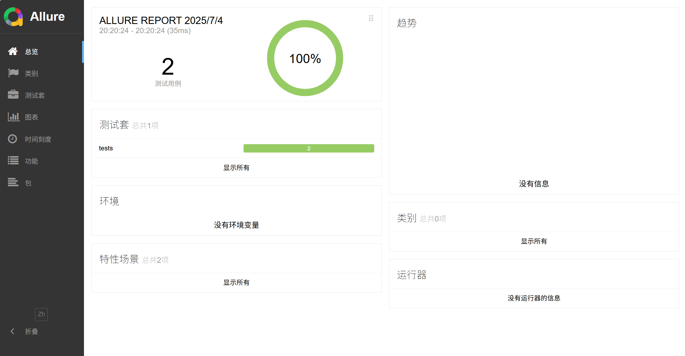


7. pytest测试入口：`test/main.py`

   ```python
   import os
   import pytest
   
   pytest.main(["-v"])
   os.system("allure generate -o report -c cache")
   ```

   

### 2.2.4 Jenkinsfile

用于定义Jinkins中的Pipeline，即自动化测试流程

- 基于 groovy 语法编写
- 后续有详细介绍

```groovy
pipeline {
    agent {
        docker {
            // docker环境设置
        }
    }
    environment {
        // 声明环境变量
    }
    tools {
        // 声明可调用工具
    }
    stages {
        stage('Setup') {
            steps {
                // 环境准备相关
            }
        }
        stage('Test') {
            steps {
                sh 'cd test && python main.py'
            }
            post {
				// 后处理逻辑
            }
        }
    }
}

```


## 2.3 运行测试

### 2.3.1 环境安装

1. 安装allure

   - https://allurereport.org/docs/install-for-linux/#install-from-a-deb-package
   - https://github.com/allure-framework/allure2/releases/tag/2.34.1

   下载对应`deb`包，然后`sudo dpkg -i <allure包>.deb`

   ```bash
   wget https://github.com/allure-framework/allure2/releases/download/2.34.1/allure_2.34.1-1_all.deb
   sudo dpkg -i allure_2.34.1-1_all.deb
   
   # 如遇错误（通常是未安装java相关），使用apt自动修复，并再次安装
   sudo apt update
   sudo apt install -f
   sudo dpkg -i allure_2.34.1-1_all.deb
   ```

   查看allure的版本

   ```
   allure --version
   ```


2. 安装example_ci_pytest_jenkins包

   ```bash
   cd example_ci_pytest_jenkins
   pip install .
   ```

   安装结束后，执行`pip show example`可以看到
   
   ```
   Name: example
   Version: 1.0.0
   Summary: example
   Home-page: 
   Author: 
   Author-email: WH <wh@wh.com>
   License: 
   Location: /home/wh/miniconda3/envs/pytest/lib/python3.13/site-packages
   Requires: allure-pytest, build, fastapi, jsonpath-ng, jsonschema, pytest, pytest-result-log, pyyaml, requests, uvicorn
   Required-by:
   ```
   
   


### 2.3.2 执行测试

1. 启动模拟服务端

   ```bash
   cd example_ci_pytest_jenkins/test
   python utils/mock_server.py
   ```

   

2. 执行测试

   ```
   cd example_ci_pytest_jenkins/test
   python main.py
   ```

   可以看到

   ```
   ============================== test session starts ==============================
   platform linux -- Python 3.13.5, pytest-8.4.1, pluggy-1.6.0 -- /home/wh/miniconda3/envs/pytest/bin/python
   cachedir: .pytest_cache
   rootdir: /home/wh/code/example_s1/test
   configfile: pytest.ini
   plugins: anyio-4.9.0, allure-pytest-2.14.3, result-log-1.2.2
   collected 2 items                                                                                                                                   
   
   tests/test_demo.py::test_demo[send0-validate0-extract0] PASSED                                                                                [ 50%]
   tests/test_demo.py::test_demo[send1-validate1-extract1] PASSED                                                                                [100%]
   
   =============================== 2 passed in 0.10s ===============================
   Report successfully generated to report
   ```

   并可以看到`example_ci_pytest_jenkins/test`下新生成三个文件夹：

   - cache：allure的数据文件
   - logs：测试日志（`pytest-result-log`插件的输出）
   - report：allure生成的网页测试报告


3. 查看报告

   - VScode中可以安装**Live Server**插件

     https://marketplace.visualstudio.com/items?itemName=ritwickdey.LiveServer

   - 对`example_ci_pytest_jenkins/test/report/index.html`右键，Open With Live Server

     


# 3. Docker部署Jenkins

## 3.1 环境准备

1. Docker下载

   ```bash
   sudo wget -qO- https://get.docker.com/ | sh
   ```


2. 将当前用户添加到docker用户组

   ```bash
   sudo usermod -aG docker <用户名>
   ```


3. Jenkins镜像下载

   ```bash
   docker pull jenkins/jenkins:2.517
   ```

   https://hub.docker.com/r/jenkins/jenkins/tags


4. 网络环境介绍

   ```
   公网访问：121.36.110.23:7003 → 路由器/NAT → 内网访问：192.168.1.4:8080 → Docker容器 8080:8080 → Jenkins服务
   ```

   使用云主机搭建路由器/NAT，构造虚拟局域网（VLAN）

   - 可以参考笔记 [frp服务搭建.md](https://github.com/a171232886/Note/blob/main/frp服务搭建.md) 

     

## 3.2 部署

1. 编写`compose.yaml`

   ```yaml
   services:
     jenkins:
       image: jenkins/jenkins:2.517
       container_name: jenkins
       user: root
       restart: unless-stopped
       ports:
         - "8080:8080"													# Jenkins Web UI 使用
         - "50000:50000"												# Jenkins 之间通信使用
       volumes:
         - "./data:/var/jenkins_home"									# Jenkins 运行数据保存位置
         - "/var/run/docker.sock:/var/run/docker.sock"					# Jenkins 中可以直接使用宿主机的 docker
         - "/usr/bin/docker:/usr/bin/docker"							# Jenkins 中可以启动 docker
       environment:													# Jenkins 插件使用清华源
         JENKINS_UC: https://mirrors.tuna.tsinghua.edu.cn/jenkins/
         JENKINS_UC_DOWNLOAD: https://mirrors.tuna.tsinghua.edu.cn/jenkins/
         JENKINS_UPDATE_CENTER: https://mirrors.tuna.tsinghua.edu.cn/jenkins/updates/update-center.json
   ```
   
   
   
2. 启动

   ```
   docker compose up
   ```

   

## 3.3 初始化

1. 获取初始密码

   ```
   docker exec -it jenkins cat /var/jenkins_home/secrets/initialAdminPassword
   ```

   （在执行`docker compose up`后的输出中，也可以找到）

   

2. 登录，并等待其初始化完成

   ```bash
   http://192.168.1.4:8080				# 内网访问
   http://121.36.110.23:7003			# 外网访问
   ```

   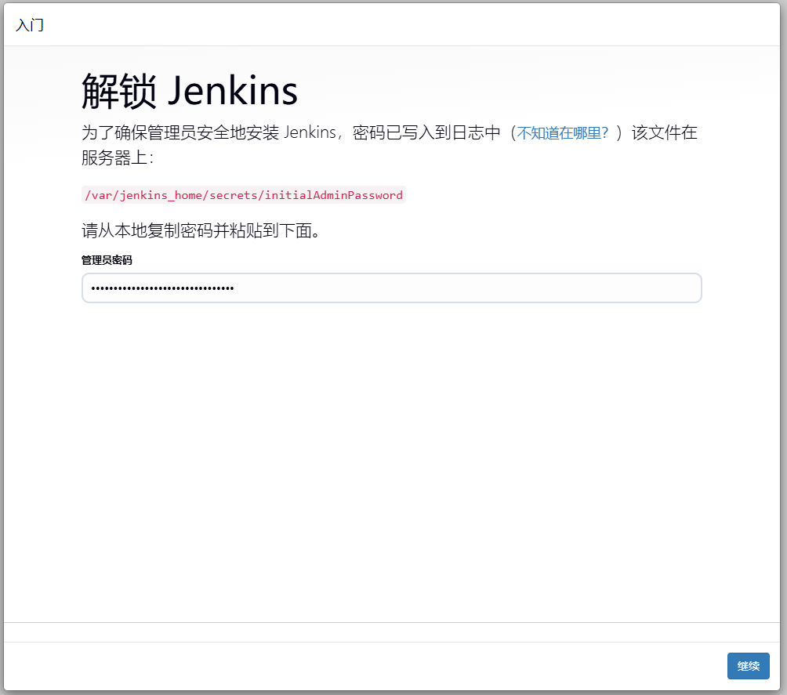


3. 安装推荐插件，等待其完成

   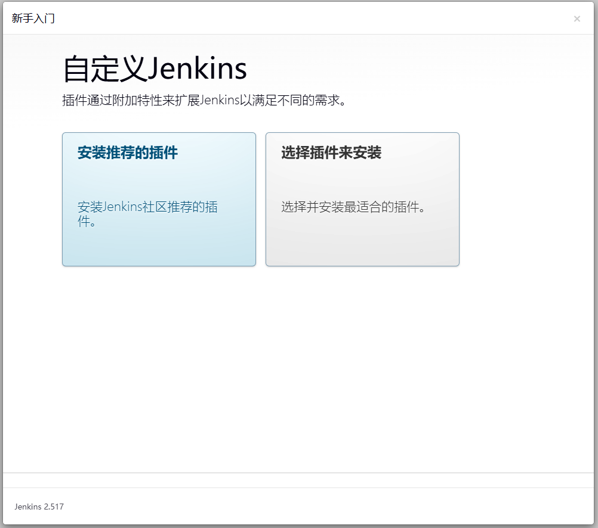

   

4. 创建第一个管理员用户，并进行实例配置

   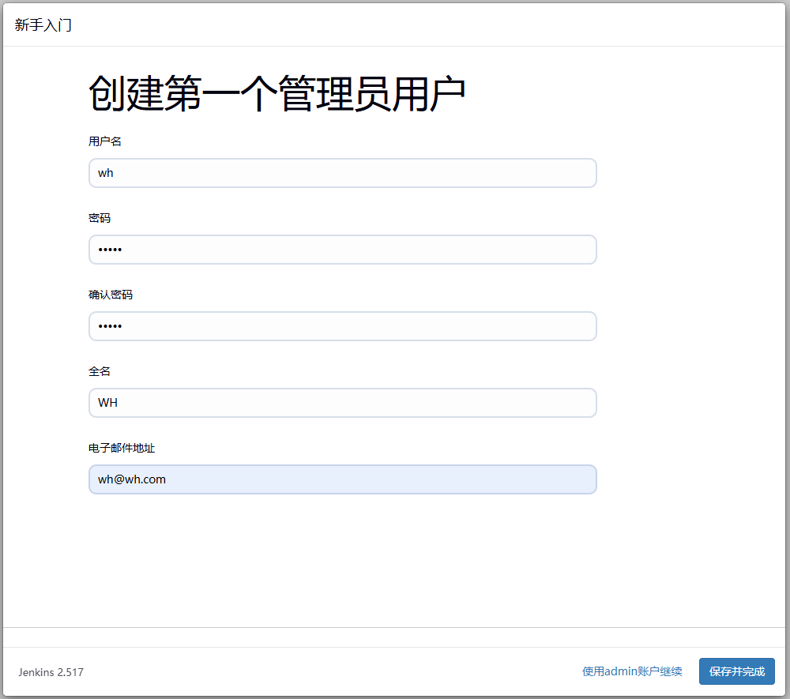
   
   直接写外网访问的URL
   
   
   
5. 查看系统信息

   ```
   http://121.36.110.23:7003/systemInfo
   ```

   - 在环境变量中查看`JENKINS_VERSION`，输出2.517
   
     
   
6. 时区设置

   ```
   http://121.36.110.23:7003/user/wh/account/
   ```

   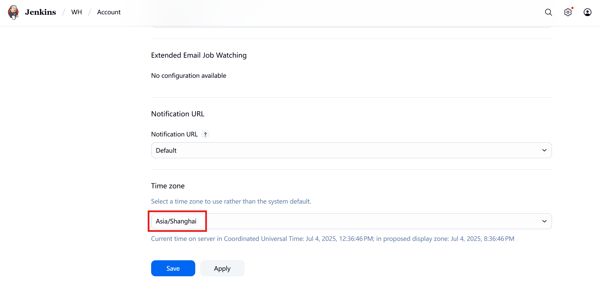


## 3.4 安装插件

1. 对应网址

   ```
   http://121.36.110.23:7003/manage/pluginManager/
   ```

   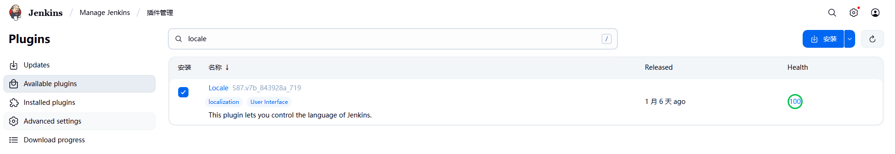


2. 安装以下插件

      - locale

      - Docker Pipeline（核心插件，提供 `docker` agent 支持）

      - Docker API（可选，增强 Docker 集成）

      - Allure


3. 安装完成后重启

   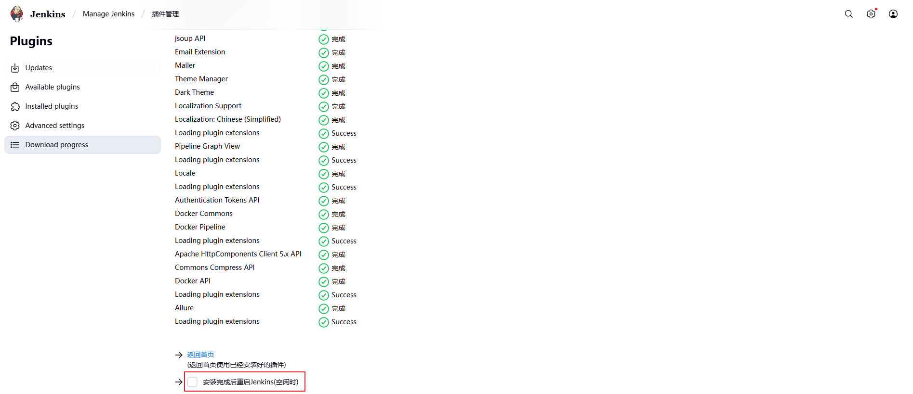


4. 设置全英文

   对应网址

   ```
   http://121.36.110.23:7003/manage/appearance/
   ```

   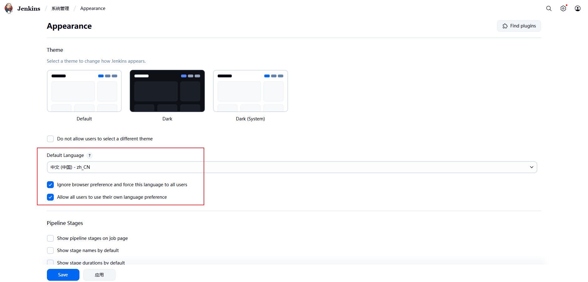

   

5. 重启

   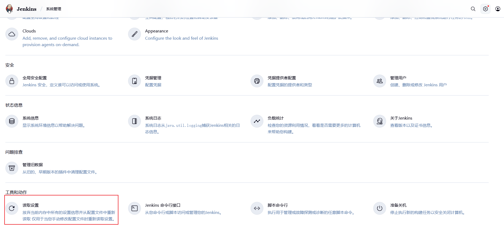


## 3.5 设置allure插件

对应网址

```
http://121.36.110.23:7003/manage/configureTools/
```

添加allure命令行，并设置名称

- **注意**：这个名称必须与 Pipeline 脚本中 `tools` 部分指定的名称完全一致

- Jenkinsfile中添加tool，然后就可以在pipeline中使用了

  ```groovy
  tools {
  	allure 'allure_2.34.1' // 必须与全局工具配置中的名称一致
  }
  ```

  

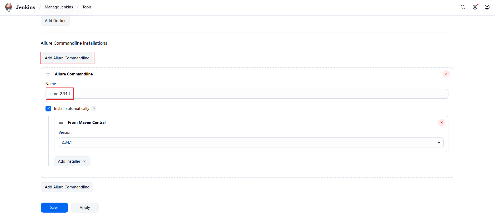


## 3.6 SSH设置&凭据管理

1. 进入容器

   ```
   docker exec -it jenkins bash 
   ```


2. **容器**生成公钥

   ```
   ssh-keygen
   ```


3. 提前获取 GitHub 的 SSH 公钥，并存储到**容器** `~/.ssh/known_hosts` 文件中

   ```
   ssh-keyscan github.com >> ~/.ssh/known_hosts
   ```


4. **容器**的**私钥**添加到Jenkins中，命名为GitHub，后续访问

   容器中获取私钥

   ```
   cat ~/.ssh/id_rsa
   ```

   

   对应网址

   ```
   http://121.36.110.23:7003/manage/credentials/
   ```

   

   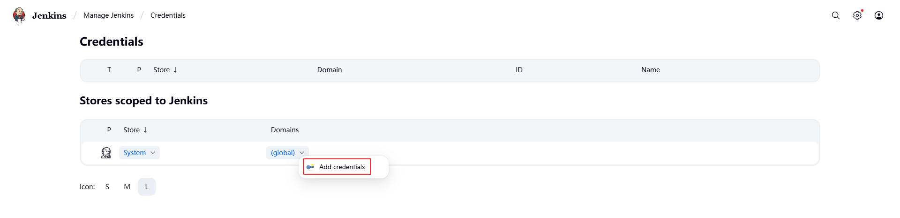

   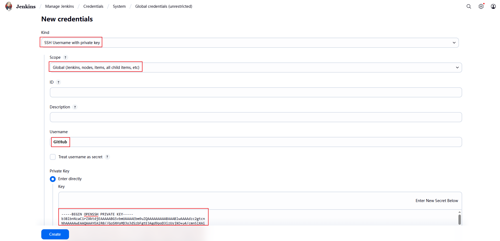

   

5. **容器**公钥添加到Github中

   容器中获取私钥

   ```
   cat ~/.ssh/id_rsa.pub
   ```

   对应网址

   ```
   https://github.com/settings/keys
   ```

   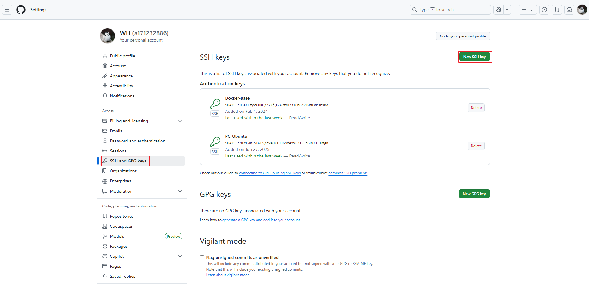

6. 容器中进行连接测试

   ```
   ssh -T git@github.com
   ```

   输出

   ```
   Hi a171232886! You've successfully authenticated, but GitHub does not provide shell access.
   ```

   

# 4. 新建项目

## 4.1 创建项目

1. 创建pipeline类型的item

   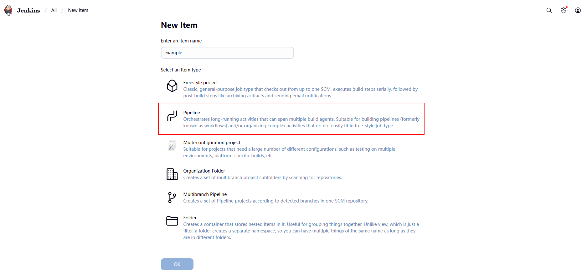

2. 填写Pipeline的相关设置
   
   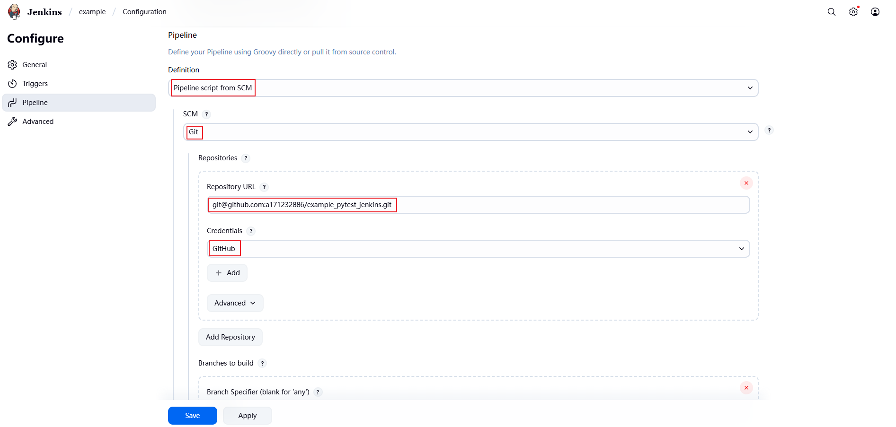
   
   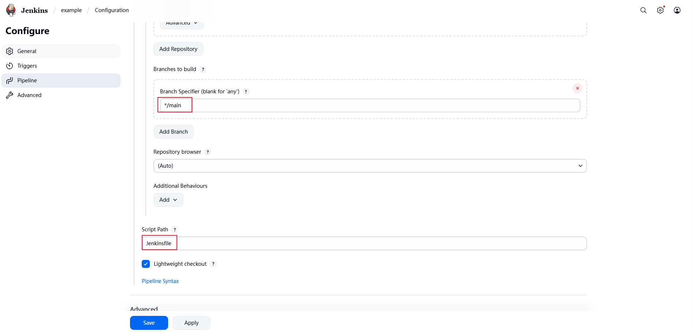
   
   - 这设置六项连起来就是：
   
     > 通过Git的方式，使用名为GitHub的私钥（第3.6节中添加），从`git@github.com:a171232886/example_pytest_jenkins.git`代码仓库的main分支上，获取代码
     >
     > 从代码中Jenkinsfile文件，获取Pipeline脚本
   
   - 推荐使用SSH和凭据获取代码，这种方式无论代码仓库的可见权限是private还是public，Jenkins都能获取到代码


## 4.2 编写Jenkinsfile

项目根目录下，创建 `Jenkinsfile`

```groovy
pipeline {
    agent {
        docker {
            image 'example:v1.0'
            args '-v ${WORKSPACE}:/workspace'
        }
    }
    tools {
        allure 'allure_2.34.1'
    }
    stages {
        stage('Setup') {
            steps {
                sh 'pip install --force-reinstall .'
                sh 'nohup python test/utils/mock_server.py &'
            }
        }
        stage('Test') {
            steps {
                sh 'cd test && python main.py'
            }
            post {
                always {
                    allure([
                        reportBuildPolicy: 'ALWAYS',
                        results: [[path: 'test/cache']]
                    ])
                }
            }
        }
    }
}
```


1. pipeline常用的四部分：
   - agent：在哪里执行测试
   - tool：可用哪些工具
   - environment：设置哪些环境变量
   - stages：执行流程，每个stage名称可任意指定
     - Setup：初始化
     - Test：测试
2. 每个`steps`中可以写多行命令

3. `post`部分

   - `post`表示后处理，

   - `always`表示无论测试结果正确还是失败都执行

   - `allure`为固定写法，

     - **注意**：结果路径对应的是数据文件`test/cache`，而不是网页报告`test/report`

       

## 4.3 执行测试

**前置准备**：在部署Jenkins容器的宿主机上，先构建项目所需环境的基础镜像，以节约测试耗时

```
cd example_ci_pytest_jenkins
docker build -t example:v1.0 .
```


1. 进行构建

   对应网址

   ```
   http://121.36.110.23:7003/job/example/
   ```

   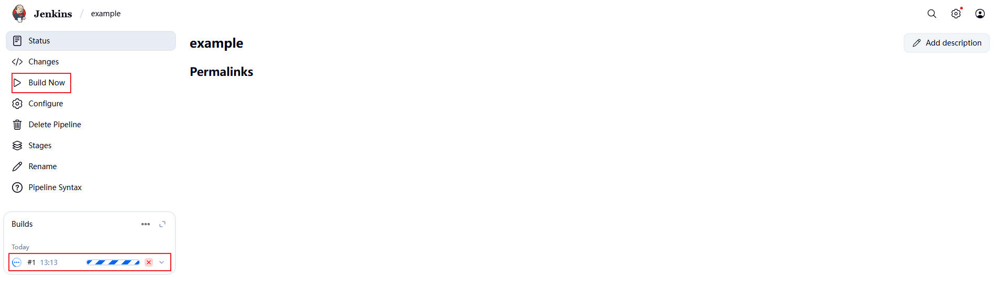

   点击对应的构建历史（`#1`）可以查看详细信息

   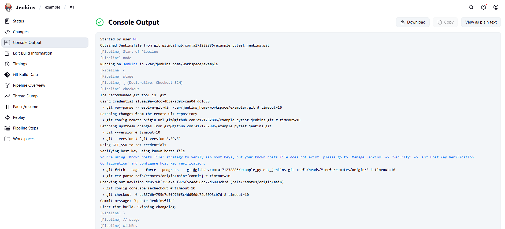

   如果构建成功，在Console Output的最后会输出
   
   ```
   ...
   [Pipeline] // withDockerContainer
   [Pipeline] }
   [Pipeline] // withEnv
   [Pipeline] }
   [Pipeline] // node
   [Pipeline] End of Pipeline
   Finished: SUCCESS
   ```
   
   

2. 构建结果保存在
   - 容器内：`/var/jenkins_home/jobs/example/builds/1`
   - 宿主机：`./data/jobs/example/builds/1`


3. allure的网页报告可以点击以下任意一个图标处获得

   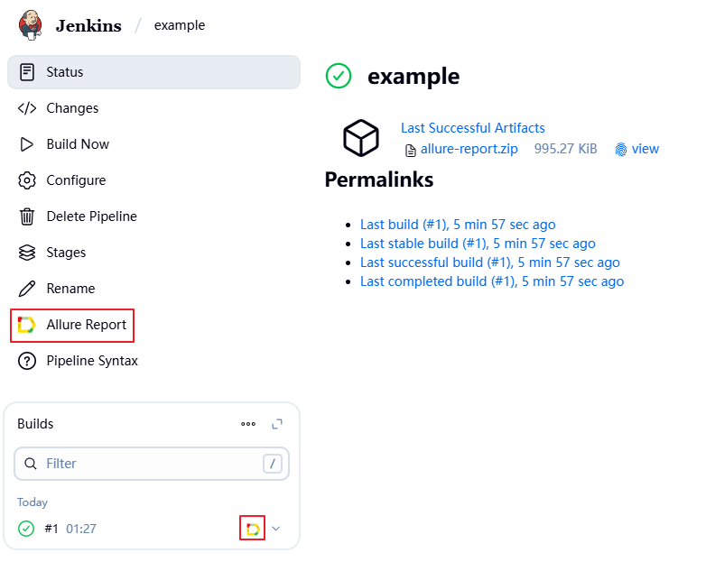


# 5. GitHub Webhook & API 使用 

## 5.1 介绍

### 5.1.1 Webhook

1. Webhook相当于事件触发的通知发送
2. GitHub中
   - Webhook介绍：https://docs.github.com/en/webhooks/about-webhooks
   - 可用事件类型：https://docs.github.com/en/webhooks/webhook-events-and-payloads

3. 常用的Webhook事件

   | **事件类型**   | **触发条件**                                                 |
   | :------------- | :----------------------------------------------------------- |
   | `push`         | 当代码被推送到仓库的分支（包括 `git push` 或 `force push`）。 |
   | `pull_request` | 当创建、更新、合并、关闭或重新打开 Pull Request（PR）。      |
   | `issues`       | 当 Issue 被创建、修改、关闭、重新打开、分配等。              |
   | `delete`       | 当分支或标签被删除。                                         |
   | `release`      | 当发布（Release）被创建、编辑、发布或删除。                  |
   | `fork`         | 当仓库被 Fork。                                              |
   | `star`         | 当仓库被加星（Star）或取消星标。                             |


### 5.1.2 API

1. Github 允许用户通过一些 Rest API 接口，来进行仓库管理
   - https://docs.github.com/en/rest?apiVersion=2022-11-28

2. 常用的API

   | **功能**           | **HTTP 方法** | **API**                                               | **接口说明**                                                 |
   | :----------------- | :------------ | :---------------------------------------------------- | ------------------------------------------------------------ |
   | 列出Commits        | `GET`         | `/repos/{owner}/{repo}/commits`                       | [List commits](https://docs.github.com/en/rest/commits/commits?apiVersion=2022-11-28#list-commits) |
   | 对Commit创建评论   | `POST`        | `/repos/{owner}/{repo}/commits/{commit_sha}/comments` | [Create a commit comment](https://docs.github.com/en/rest/commits/comments?apiVersion=2022-11-28#create-a-commit-comment) |
   | 列出仓库 Issues    | `GET`         | `/repos/{owner}/{repo}/issues`                        | [List repository issues](https://docs.github.com/en/rest/issues/issues?apiVersion=2022-11-28#list-repository-issues) |
   | 创建 Issue         | `POST`        | `/repos/{owner}/{repo}/issues`                        | [Create an issue](https://docs.github.com/en/rest/issues/issues?apiVersion=2022-11-28#create-an-issue) |
   | 创建 Pull Requests | `POST`        | `/repos/{owner}/{repo}/pulls`                         | [Create a pull request](https://docs.github.com/en/rest/pulls/pulls?apiVersion=2022-11-28#create-a-pull-request) |
   | 获取 Pull Requests | `GET`         | `/repos/{owner}/{repo}/pulls`                         | [List pull requests](https://docs.github.com/en/rest/pulls/pulls?apiVersion=2022-11-28#list-pull-requests) |
   | 合并 Pull Requests | `PUT`         | `/repos/{owner}/{repo}/pulls/{pr_number}/merge`       | [Merge a pull request](https://docs.github.com/en/rest/pulls/pulls?apiVersion=2022-11-28#merge-a-pull-request) |


## 5.2 添加触发器

1. Jenkins 设置触发器

   对应网址

   ```
   http://121.36.110.23:7003/job/example/configure
   ```

   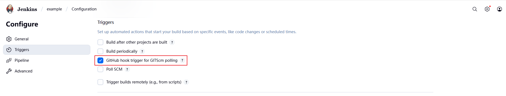

2. GitHub 中设置

   对应网址

   ```
   https://github.com/a171232886/example_pytest_jenkins/settings/hooks
   ```

   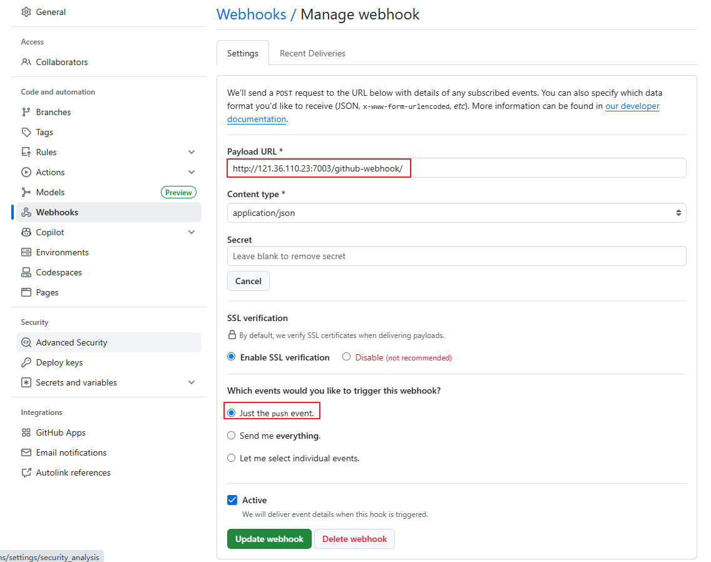
   
   其中：
   
   - URL 就是 Jenkins 的外网链接加上`/github-webhook/`
   
     

3. 此时可进行测试
   - 在Github上新增commit
   - Jenkins应该收到Github发送的Webhook，并进行build


4. Github发送Hook历史可以在Jenkins中查看

   ```
   http://121.36.110.23:7003/job/example/GitHubPollLog/
   ```

   


## 5.3 结果返回

Jenkins对代码进行自动测试，将测试结果通过 GitHub API 返回给代码仓库


### 5.3.1 添加Token

1. Github上获取Token

   ```
   https://github.com/settings/tokens
   ```

   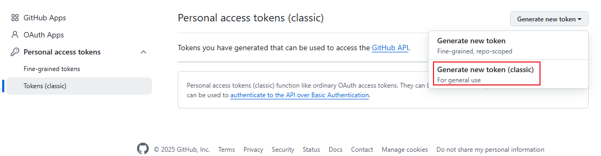

   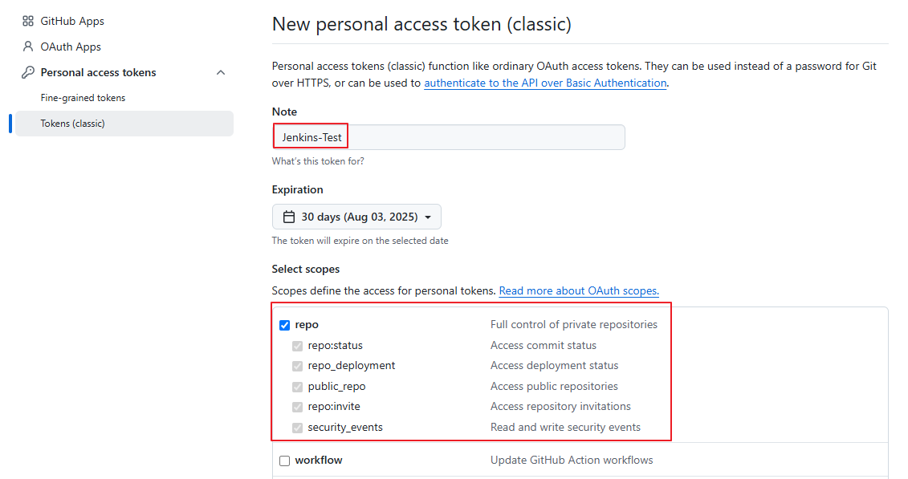

   填写名称，并至少赋予`repo`权限

   

2. Jenkins添加密钥

   对应网址
   
   ```
   http://121.36.110.23:7003/manage/credentials/
   ```
   
   - 选择为secret_text
   
   - ID必须填写，可自定义为`GitHub-Token`
   
     要与后续Jenkinsfile中的environment中的一致
   
     ```groovy
         environment {
             // 使用 Secret text 类型的凭据
             GITHUB_TOKEN = credentials('GitHub-Token')
         }
     ```
   
     
   
   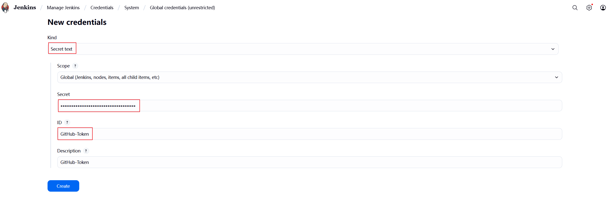


### 5.3.2 调整jenkinsfile

1. jenkinsfile 增加调用 GitHub API 的逻辑

   ```groovy
   pipeline {
       agent {
           docker {
               image 'example:v1.0'
               args '-v ${WORKSPACE}:/workspace'
           }
       }
       environment {
           // 使用 Secret text 类型的凭据
           GITHUB_TOKEN = credentials('GitHub-Token')
           // 获取 Git 提交 SHA
           GIT_COMMIT = sh(script: 'git rev-parse HEAD', returnStdout: true).trim()
           // GitHub 仓库路径（避免硬编码）
           GITHUB_REPO = sh(
               script: 'git remote -v | head -n1 | awk \'{print $2}\' | sed \'s|git@github.com:||; s|https://github.com/||; s|.git$||\'',
               returnStdout: true
           ).trim()
       }
       tools {
           allure 'allure_2.34.1'
       }
       stages {
           stage('Setup') {
               steps {
                   sh 'pip install --force-reinstall .'
                   sh 'nohup python test/utils/mock_server.py &'
               }
           }
           stage('Test') {
               steps {
                   sh 'cd test && python main.py'
               }
               post {
                   always {
                       allure([
                           reportBuildPolicy: 'ALWAYS',
                           results: [[path: 'test/cache']]
                       ])
                       
                       script {
                           def testResult = currentBuild.currentResult
                           def resultEmoji = testResult == 'SUCCESS' ? '✅' : '❌'
                           def resultText = testResult == 'SUCCESS' ? '通过' : '失败'
                           
                           // 构建评论内容（使用单引号避免变量插值）
                           def comment = """${resultEmoji} Jenkins 测试${resultText}\n构建详情: ${env.BUILD_URL}\nAllure 报告: ${env.BUILD_URL}allure/"""
                           
                           // 使用临时文件存储JSON数据
                           writeFile file: 'comment.json', text: groovy.json.JsonOutput.toJson([body: comment])
   
                           sh '''#!/bin/bash
                               curl -s -X POST \\
                               -H "Authorization: token ${GITHUB_TOKEN}" \\
                               -H "Accept: application/vnd.github.v3+json" \\
                               -H "Content-Type: application/json" \\
                               "https://api.github.com/repos/${GITHUB_REPO}/commits/${GIT_COMMIT}/comments" \\
                               --data-binary @comment.json
                            '''
                       }
                   }
               }
           }
       }
   }
   
   ```


2. 使用环境变量，避免硬编码

   ```groovy
   environment {
       // 使用 Secret text 类型的凭据
       GITHUB_TOKEN = credentials('GitHub-Token')
       // 获取 Git 提交 SHA
       GIT_COMMIT = sh(script: 'git rev-parse HEAD', returnStdout: true).trim()
       // GitHub 仓库路径（避免硬编码）
       GITHUB_REPO = sh(
           script: 'git remote -v | head -n1 | awk \'{print $2}\' | sed \'s|git@github.com:||; s|https://github.com/||; s|.git$||\'',
           returnStdout: true
       ).trim()
   }
   ```

   - 在使用时，用`${变量名}`获取值即可，比如`${GITHUB_REPO}`
   - `git remote -v` 获取远程仓库 URL（如 `git@github.com:a171232886/example_pytest_jenkins.git` 或 `https://github.com/a171232886/example_pytest_jenkins`）。通过 `sed` 移除 `git@github.com:`、`https://github.com/` 和 `.git` 后缀，最终得到 `a171232886/example_ci_pytest_jenkins`。


3. `script` 使用的是 groovy 语法，并同时使用了 Jenkins 内置变量和函数


4. `def` 用于定义变量

   - 创建变量`testResult`， 值为`currentBuild.currentResult`

     ```groovy
     def testResult = currentBuild.currentResult
     ```

   - 创建变量`resultText`，值为三目表达式` testResult == 'SUCCESS' ? '通过' : '失败'`

     若`testResult`为``SUCCESS``，返回`'通过'`，否则返回`'失败'`

     ```groovy
     def resultText = testResult == 'SUCCESS' ? '通过' : '失败'
     ```

   

5. 将评论内容转换为 JSON 格式并写入临时文件，内容为`comment` 变量值

   ```groovy
   writeFile file: 'comment.json', text: groovy.json.JsonOutput.toJson([body: comment])
   ```

   

6. 执行脚本，调用 [Create a commit comment](https://docs.github.com/en/rest/commits/comments?apiVersion=2022-11-28#create-a-commit-comment) 这个API

   ```bash
   #!/bin/bash
   curl -s -X POST \\
   	-H "Authorization: token ${GITHUB_TOKEN}" \\
   	-H "Accept: application/vnd.github.v3+json" \\
   	-H "Content-Type: application/json" \\
   	"https://api.github.com/repos/${GITHUB_REPO}/commits/${GIT_COMMIT}/comments" \\
   	--data-binary @comment.json
   ```

   关于 HTTP 报文的基本知识，可以看这篇笔记：[HTTP笔记.md](https://github.com/a171232886/Note_Python/blob/main/HTTP笔记.md)


## 5.4 执行测试

1. GitHub上新增一个commit

   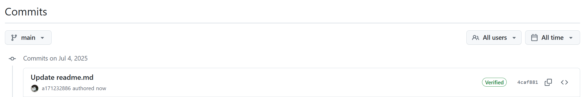

   

2. Jenkins收到后自动测试

   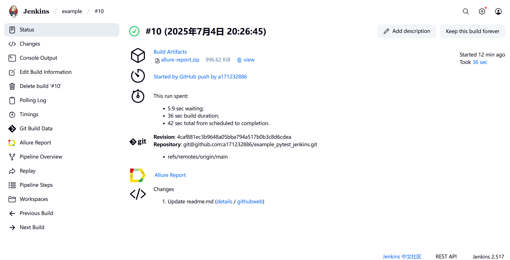

3. commit上新增comment

   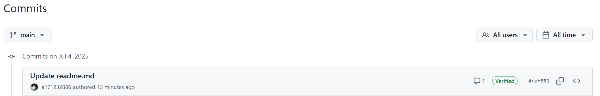
   
   
   
   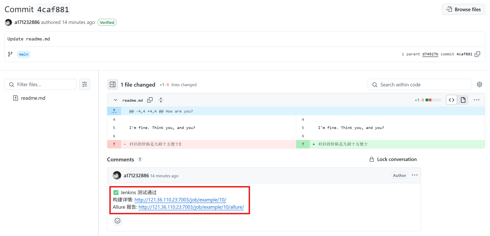
