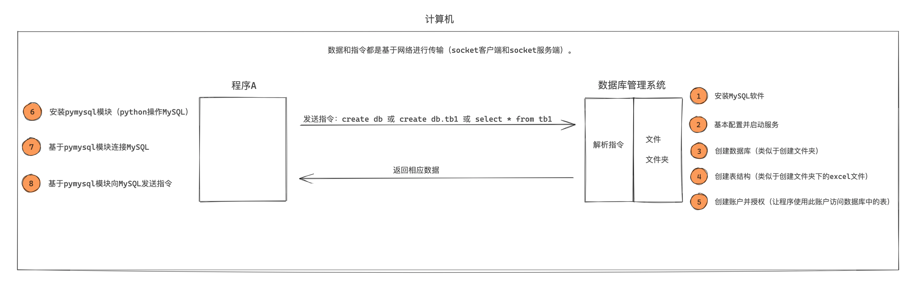
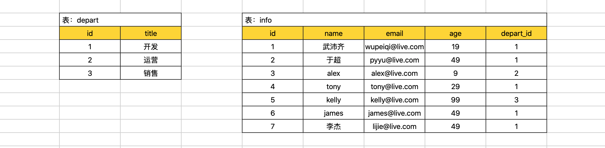

# MySQL

1. 官网：https://dev.mysql.com/doc/refman/8.3/en/installing.html

1. 视频教程：https://www.bilibili.com/video/BV15R4y1b7y9/

   


# 0. 背景介绍

现在，有那么一个叫：数据库管理系统（DBMS，Database Management System）的软件，可以帮助我们实现对文件夹中的文件进行操作，而我们只要学习DBMS能识别的指令， 就能控制它去帮助我们实现的文件和文件夹的处理。例如：


数据库管理系统（DBMS）专注于帮助开发者解决数据存储的问题，这样开发者就可以把主要精力放在实现业务功能上了。

业内有很多的的数据库管理系统产品，例如：

- **MySQL**，原来是sun公司，后来被甲骨文收购。现在互联网企业几乎都在使用。【免费 + 收费】
- Oracle，甲骨文。收费，一般国企、事业单位居多。【收费】
- Microsoft SQL Server，微软。【收费】
- DB2，IBM。【免费 + 收费】
- SQLite，D. Richard Hipp个人开发。【免费】
- Access， 微软。【收费】
- PostgreSQL，加州大学伯克利分校。【免费】
- 等众多..

由于各大公司都是使用MySQL，所以我们课程主要给大家讲解MySQL数据库。

在项目开发中想要基于MySQL来进行数据存储，大致应该怎么做呢？




# 1. 快速使用

## 1.1 docker构建

1. 目录结构

   ```txt
   .
   |-- Dockerfile	# 构建mysql
   |-- datafile	# 存放数据的文件夹（可为空）
   |-- init.sql	# 初始化数据库（可为空）
   |-- my.cnf		# 数据库连接信息设置
   `-- run.sh  	# 运行脚本
   ```

2. 文件内容

   - Dockerfile

     ```dockerfile
     # 使用官方MySQL镜像
     FROM mysql:latest
     # 设置root用户的密码
     ENV MYSQL_ROOT_PASSWORD=123456
     # 设置字符集
     ENV LANG=C.UTF-8
     # 将自定义配置文件复制到镜像中
     COPY my.cnf /etc/mysql/my.cnf
     # 将初始化SQL脚本复制到镜像中
     COPY init.sql /docker-entrypoint-initdb.d/
     ```

   - my.cnf

     ```
     [mysqld]
     character-set-server=utf8mb4
     collation-server=utf8mb4_unicode_ci
     max_connections=100
     ```

   - run.sh

     ```bash
     # 根据Dockerfile构建一个名为mysql的镜像
     docker build -t mysql .
     
     # 文件存储位置为datafile目录
     if [ ! -d "datafile" ]; then
         # 如果不存在，则创建文件夹B
         mkdir -p datafile
     fi
     
     # 在本地启动一个名为 mysql_server 的服务，端口为3306，
     docker run -itd -p 3306:3306 -v $(pwd)/datafile:/var/lib/mysql mysql
     ```


## 1.2 连接数据库

### 1.2.1 命令行

1. 进入docker

   ```bash
   docker exec -it <container_id> /bin/bash
   ```

   

2. 进入mysql

   ```mysql
   mysql -u root -p
   ```

   可见

   ```
   mysql>
   ```

   

3. 退出mysql

   ```
   exit
   ```


### 1.2.2 Navicat Premium

1. 新建连接 -> Mysql，填入必要信息

   - IP:Port
   - 用户名（默认root），密码

   


# 2. 数据库管理基础

1. 数据库与数据表的关系

   | 日常      | MySQL  |
   | --------- | ------ |
   | 文件夹    | 数据库 |
   | Excel文件 | 数据表 |


2. 连接上MySQL之后，执行指令（一般称为SQL语句），就可以对MySQL的数据进行操作

   - mysql命令以`;`结尾
   - mysql语句中的注释为`--`

3. Python可以使用`pymysql`对mysql进行操作

   

## 2.1 查看数据库

   ```mysql
   show databases;
   ```

   默认的4个库

   ```
   +--------------------+
   | Database           |
   +--------------------+
   | information_schema |
   | mysql              |
   | performance_schema |
   | sys                |
   +--------------------+
   ```

## 2.2 创建数据库

   ```mysql
   create database 数据库名 DEFAULT CHARSET utf8 COLLATE utf8_general_ci;
   ```

   - ```DEFAULT CHARSET utf8 COLLATE utf8_general_ci```指定编码规则为utf8

   

## 2.3 删除数据库

   ```mysql
   drop database 数据库名;
   ```

   

## 2.4 进入数据库

   ```mysql
   use 数据库名;
   ```

   

## 2.5 查看数据库下的数据表

   ```mysql
   show tables;
   ```


# 3. 数据表管理基础


进入数据库 `use 数据库;`，查看当前所有表：`show tables;`

## 3.1 创建表


  

1. 简单样例

   ```sql
   create table 表名(
   	列名 类型,
   	列名 类型,
   	列名 类型
   )default charset=utf8;
   ```

   ```mysql
   create table tb1(id int, name varchar(16), age int) default charset=utf8;
   ```

   

2. 复杂样例

   ```sql
   create table tb2(
   	id int primary key,			-- 主键（不允许为空、不能重复）
   	name varchar(16) not null,  -- 不允许为空
   	email varchar(32) null,		-- 允许为空（默认）
   	age int default 3			-- 默认值为3
   )default charset=utf8;
   ```

   - 主键用于单条记录的索引
   - 若定义为`auto_increment primary key`（主键&自增），数据库实现id号+1。一个表中只能有一个自增列。
   - 数据库会对主键进行优化，用于加快检索速度。


## 3.2 查看表的列

```
desc tb2;
```

```
+-------+-------------+------+-----+---------+-------+
| Field | Type        | Null | Key | Default | Extra |
+-------+-------------+------+-----+---------+-------+
| id    | int         | NO   | PRI | NULL    |       |
| name  | varchar(16) | NO   |     | NULL    |       |
| email | varchar(32) | YES  |     | NULL    |       |
| age   | int         | YES  |     | 3       |       |
| hello | int         | YES  |     | 3       |       |
+-------+-------------+------+-----+---------+-------+
```


## 3.3 删除&清空

1. 删除整个表

   ```sql
   drop table 表名;
   ```

2. 清空表中的数据

   ```sql
   delete from 表名;
   ```

   

## 3.4 列操作

1. 添加列

   ```mysql
   alter table <表名> add <列名> <类型> <其他设置>;
   ```

   例如

   ```sql
   alter table tb1 add hello int default 3;
   ```

   

2. 删除列

   ```sql
   alter table <表名> drop column <列名>
   ```


3. 修改列 类型

    ```sql
    alter table 表名 modify column 列名 类型;
    ```


4. 修改列 类型 + 名称

    ```sql
    alter table 表名 change 原列名 新列名 新类型;
    ```

    ```sql
    alter table  tb change id nid int not null;
    alter table  tb change id id int not null default 5;
    alter table  tb change id id int not null primary key auto_increment;
    
    alter table  tb change id id int; -- 允许为空，删除默认值，删除自增。
    ```


5. 修改列 默认值

    ```sql
    ALTER TABLE 表名 ALTER 列名 SET DEFAULT 1000;
    ```


6. 删除列 默认值

    ```sql
    ALTER TABLE 表名 ALTER 列名 DROP DEFAULT;
    ```


7. 添加主键

    ```sql
    alter table 表名 add primary key(列名);
    ```


8. 删除主键

    ```sql
    alter table 表名 drop primary key;
    ```


# 4. 数据行管理基础

```sql
create table tb1(
    id int auto_increment primary key, 
    name varchar(16),
    password varchar(16),
    age int default 10
) default charset=utf8;
```


## 4.1 新**增**数据

  ```sql
  insert into 表名 (列名,列名,列名) values(对应列的值,对应列的值,对应列的值);
  ```

  ```sql
  insert into tb1(name,password) values('武沛齐','123123');
  insert into tb1(name,password) values('武沛齐','123123'),('alex','123');
  
  insert into tb1 values('武沛齐','123123'),('alex','123'); -- 如果表中只有2列
  ```


## 4.2 **删**除数据

  ```sql
  delete from 表名;
  delete from 表名 where 条件;
  ```

  ```sql
  delete from tb1;
  delete from tb1 where name="wupeiqi";
  delete from tb1 where name="wupeiqi" and password="123";
  delete from tb1 where id>9;
  ```


## 4.3 修**改**数据

  ```sql
  update 表名 set 列名=值;
  update 表名 set 列名=值 where 条件;
  ```

  ```sql
  update tb1 set name="wupeiqi";
  update tb1 set name="wupeiqi" where id=1;
  
  update tb1 set age=age+1;  -- 整型
  update tb1 set age=age+1 where id=2;
  
  update L3 set name=concat(name,"db");
  update L3 set name=concat(name,"123")  where id=2;  -- concat一个函数，可以拼接字符串
  ```


## 4.4 **查**询数据

  ```sql
  select * from 表名;
  select 列名,列名,列名 from 表名;
  select 列名,列名 as 别名,列名 from 表名;
  select * from 表名 where 条件;
  ```

  ```sql
  select * from tb1;
  select id,name,age from tb1;
  select id,name as N,age from tb1;
  select id,name as N,age 111 from tb1;
  
  select * from tb1 where id = 1;
  select * from tb1 where id > 1;
  select * from tb1 where id != 1;
  select * from tb1 where name="wupeiqi" and password="123";
  ```


# 5 数据类型

```sql
create table 表(
	id int,
    name varchar(16)
)default charset=utf8;
```

## 5.1 整形

1. `int[(m)][unsigned][zerofill]`

   - `int`：表示有符号，取值范围：-2147483648 ～ 2147483647

   - `int unsigned`：表示无符号，取值范围：0 ～ 4294967295

   - `int(5) zerofill`：仅用于显示，当不满足5位时，按照左边补0，例如：00002；满足时，正常显示。

     

   ```mysql
   mysql> create table L1(id int, uid int unsigned, zid int(5) zerofill) default charset=utf8;
   Query OK, 0 rows affected (0.03 sec)
   
   mysql> insert into L1(id,uid,zid) values(1,2,3);
   Query OK, 1 row affected (0.00 sec)
   
   mysql> insert into L1(id,uid,zid) values(2147483641,4294967294,300000);
   Query OK, 1 row affected (0.00 sec)
   
   mysql> select * from L1;
   +------------+------------+--------+
   | id         | uid        | zid    |
   +------------+------------+--------+
   |          1 |          2 |  00003 |
   | 2147483641 | 4294967294 | 300000 |
   +------------+------------+--------+
   2 rows in set (0.00 sec)
   
   mysql> insert into L1(id,uid,zid) values(214748364100,4294967294,300000);
   ERROR 1264 (22003): Out of range value for column 'id' at row 1
   mysql>
   ```

   

2. `tinyint[(m)] [unsigned] [zerofill]`
   - 有符号，取值范围：-128 ～ 127.
   - 无符号，取值范围：0 ～ 255


3. `bigint[(m)][unsigned][zerofill]`
   - 有符号，取值范围：-9223372036854775808 ～ 9223372036854775807
   - 无符号，取值范围：0  ～  18446744073709551615


## 5.2 浮点型

1. `decimal[(m[,d])] [unsigned] [zerofill]`

    - 准确的小数值，**m是数字总个数**（负号不算），d是小数点后个数。 
    - m最大值为65，d最大值为30

    例如
    
    ```sql
    create table L2(
        id int not null primary key auto_increment,
        salary decimal(8,2)
    )default charset=utf8;
    ```
    
    

    ```sql
    mysql> create table L2(id int not null primary key auto_increment,salary decimal(8,2))default charset=utf8;
    Query OK, 0 rows affected (0.03 sec)
    
    mysql> insert into L2(salary) values(1.28);
    Query OK, 1 row affected (0.01 sec)
    
    # 自动四舍五入
    mysql> insert into L2(salary) values(5.289);  
    Query OK, 1 row affected, 1 warning (0.00 sec)
    
    # 自动四舍五入
    mysql> insert into L2(salary) values(5.282);
    Query OK, 1 row affected, 1 warning (0.00 sec)
    
    mysql> insert into L2(salary) values(512132.28);
    Query OK, 1 row affected (0.00 sec)
    
    # 自动四舍五入
    mysql> insert into L2(salary) values(512132.283);
    Query OK, 1 row affected, 1 warning (0.00 sec)
    
    mysql> select * from L2;
    +----+-----------+
    | id | salary    |
    +----+-----------+
    |  1 |      1.28 |
    |  2 |      5.29 |
    |  3 |      5.28 |
    |  4 | 512132.28 |
    |  5 | 512132.28 |
    +----+-----------+
    5 rows in set (0.00 sec)
    
    mysql> insert into L2(salary) values(5121321.283);
    ERROR 1264 (22003): Out of range value for column 'salary' at row 1
    mysql>
    ```

2. `FLOAT[(M,D)] [UNSIGNED] [ZEROFILL]`

   单精度浮点数，非准确小数值，m是数字总个数，d是小数点后个数。

   

3. `DOUBLE[(M,D)] [UNSIGNED] [ZEROFILL]`

   双精度浮点数，非准确小数值，m是数字总个数，d是小数点后个数。


## 5.3 字符串

### 5.3.1 定长字符串

1. `char(m)`定长字符串，m代表字符串的长度，最多可容纳255个字符。

   - 定长的体现：**即使内容长度小于m，也会占用m长度。**

     

2. 例如：char(5)

   - 数据是：yes，底层也会占用5个字符；

   - **如果超出m长度限制（默认MySQL是严格模式，所以会报错）**。

     

4. 如果在配置文件中加入如下配置

   ```
   sql-mode="NO_AUTO_CREATE_USER,NO_ENGINE_SUBSTITUTION"
   ```

   保存并重启，此时MySQL则是非严格模式，此时超过长度则自动截断（不报错）。。
   
   
   
   注意：默认底层存储是固定的长度（不够则用空格补齐），但是查询数据时，会自动将空白去除。 如果想要保留空白，在``sql-mode`中加入 `PAD_CHAR_TO_FULL_LENGTH` 即可。
   
   - 查看模式``sql-mode`，执行命令：
   
     ```
     show variables  like 'sql_mode';
     ```
   
     

5. 一般适用于：固定长度的内容。

   ```sql
   create table L3(
       id int not null primary key auto_increment,
       name varchar(5),
       depart char(3)
   )default charset=utf8;
   
   insert into L3(name,depart) values("alexsb","sbalex");
   ```


### 5.3.2 变长字符串 

1. `varchar(m)`变长字符串，m代表字符串的长度，最多可容纳65535个字节。

   - 如果是UTF-8编码，1个字符占3个字节

2. 变长的体现：

   - 内容小于m时，会按照真实数据长度存储；
   - 如果超出m长度限制（（默认MySQL是严格模式，所以会报错）。

3. 如果在配置文件中加入如下配置，

   ```
   sql-mode="NO_AUTO_CREATE_USER,NO_ENGINE_SUBSTITUTION"
   ```


   保存并重启，此时MySQL则是非严格模式，此时超过长度则自动截断（不报错）。

4. 例如

   ```sql
   create table L3(
       id int not null primary key auto_increment,
       name varchar(5),
       depart char(3)
   )default charset=utf8;
   ```

   

```sql
mysql> create table L3(id int not null primary key auto_increment,name varchar(5),depart char(3))default charset=utf8;
Query OK, 0 rows affected (0.03 sec)

-- 插入多行
mysql> insert into L3(name,depart) values("wu","WU"),("wupei","ALS");
Query OK, 2 rows affected (0.00 sec)
Records: 2  Duplicates: 0  Warnings: 0

mysql> select * from L3;
+----+-------+--------+
| id | name  | depart |
+----+-------+--------+
|  1 | wu    | WU     |
|  2 | wupei | ALS    |
+----+-------+--------+
2 rows in set (0.00 sec)

-- 非严格模式下，不会报错。
mysql> insert into L3(name,depart) values("wupeiqi","ALS");
ERROR 1406 (22001): Data too long for column 'name' at row 1
mysql> insert into L3(name,depart) values("wupei","ALSB");
ERROR 1406 (22001): Data too long for column 'depart' at row 1
mysql>

-- 如果 sql-mode 中加入了 PAD_CHAR_TO_FULL_LENGTH ，则查询时char时空白会保留。
mysql> select name,length(name),depart,length(depart) from L3;
+-------+--------------+--------+----------------+
| name  | length(name) | depart | length(depart) |
+-------+--------------+--------+----------------+
| wu    |            2 | WU     |              3 |
| wupei |            5 | ALS    |              3 |
+-------+--------------+--------+----------------+
4 rows in set (0.00 sec)
mysql>
```


### 5.3.3 大字符串

1. `text`用于保存变长的大字符串，可以组多到65535 (2**16 − 1)个字符。

   一般情况下，长文本会用text类型。例如：文章、新闻等。

   ```sql
   create table L4(
   	id int not null primary key auto_increment,
       title varchar(128),
   	content text
   )default charset=utf8;
   ```


2. `mediumtext`

   A TEXT column with a maximum length of 16,777,215 (2**24 − 1) characters.

   

3. `longtext`

   A TEXT column with a maximum length of 4,294,967,295 or 4GB (2**32 − 1)

  

### 5.3.4 时间

1. `datetime`

    ```
    YYYY-MM-DD HH:MM:SS（1000-01-01 00:00:00/9999-12-31 23:59:59）
    ```

    对于DATETIME，不做任何改变，原样输入和输出。

    

2. `timestamp`

    ```
    YYYY-MM-DD HH:MM:SS（1970-01-01 00:00:00/2037年）
    ```

    对于TIMESTAMP，它把客户端插入的时间从当前时区转化为UTC（世界标准时间）进行存储，查询时，将其又转化为客户端当前时区进行返回。
    
    
    
    两者对比
    
    ```sql
    mysql> create table L5(
        -> id int not null primary key auto_increment,
        -> dt datetime,
        -> tt timestamp
        -> )default charset=utf8;
    Query OK, 0 rows affected (0.03 sec)
    
    mysql> insert into L5(dt,tt) values("2025-11-11 11:11:44", "2025-11-11 11:11:44");
    
    mysql> select * from L5;
    +----+---------------------+---------------------+
    | id | dt                  | tt                  |
    +----+---------------------+---------------------+
    |  1 | 2025-11-11 11:11:44 | 2025-11-11 11:11:44 |
    +----+---------------------+---------------------+
    1 row in set (0.00 sec)
    
    mysql> show variables like '%time_zone%';
    +------------------+--------+
    | Variable_name    | Value  |
    +------------------+--------+
    | system_time_zone | CST    | 
    | time_zone        | SYSTEM |
    +------------------+--------+
    2 rows in set (0.00 sec)
    -- “CST”指的是MySQL所在主机的系统时间，是中国标准时间的缩写，China Standard Time UT+8:00
    
    mysql> set time_zone='+0:00';
    Query OK, 0 rows affected (0.00 sec)
    
    mysql> show variables like '%time_zone%';
    +------------------+--------+
    | Variable_name    | Value  |
    +------------------+--------+
    | system_time_zone | CST    |
    | time_zone        | +00:00 |
    +------------------+--------+
    2 rows in set (0.01 sec)
    
    mysql> select * from L5;
    +----+---------------------+---------------------+
    | id | dt                  | tt                  |
    +----+---------------------+---------------------+
    |  1 | 2025-11-11 11:11:44 | 2025-11-11 03:11:44 |
    +----+---------------------+---------------------+
    1 row in set (0.00 sec)
    ```
    
    

3. `date`

    ```
    YYYY-MM-DD（1000-01-01/9999-12-31）
    ```

    

4. `time`

    ```
    HH:MM:SS（'-838:59:59'/'838:59:59'）
    ```


MySQL还有很多其他的数据类型，例如：*set、enum、TinyBlob、Blob、MediumBlob、LongBlob 等*，详细见官方文档：https://dev.mysql.com/doc/refman/5.7/en/data-types.html


# 5. Python操作

## 5.1 pymysql

1. 安装

   ```
   pip install pymysql
   ```

2. 简单使用

   基本上就是在终端执行SQL语句

   ```python
   import pymysql
   
   conn = pymysql.connect(
       host="192.168.84.144",
       port=3306,
       user="root",
       passwd="123456",
       charset="utf8",
       db="b1"
   )
   cursor = conn.cursor()
   
   # 1.新增（需commit）
   cursor.execute("insert into tb1(name,password) values('武沛齐','123123')")
   conn.commit()
   
   
   # 2.删除（需commit）
   cursor.execute("delete from tb1 where id=1")
   conn.commit()
   
   
   # 3.修改（需commit)
   cursor.execute("update tb1 set name='xx' where id=1")
   conn.commit()
   
   
   # 4.查询
   
   cursor.execute("select * from tb where id>10")
   data = cursor.fetchone() # cursor.fetchall()
   print(data)
   
   
   # 关闭连接
   cursor.close()
   conn.close()
   ```

   

3. 关于查询

   按元组返回
   
   ```sql
   cursor = conn.cursor()
   
   cursor.execute("select id, age from tran where age=10")
   # cursor.fetchall() 返回 ( (1,10), (2,10) )
   # cursor.fetchone() 返回 (1,10)
   result = cursor.fetchone()
   ```

   按字典返回
   
   ```python
   cursor = conn.cursor(pymysql.cursors.DictCursor)
   
   cursor.execute("select id, age from tran where age=10")
   # cursor.fetchall() 返回 ( {"id":1,"age":10}, {"id":2,"age":10} ) 
   # cursor.fetchone() 返回 {"id":1,"age":10}
   result = cursor.fetchone()
   ```
   
   

## 5.2 关于SQL注入

假如，你开发了一个用户认证的系统，应该用户登录成功后才能正确的返回相应的用户结果。 

```python
import pymysql

# 输入用户名和密码
user = input("请输入用户名：") # ' or 1=1 -- 
pwd = input("请输入密码：") # 123


conn = pymysql.connect(host='127.0.0.1', port=3306, user='root', passwd='root123', charset="utf8",db='usersdb')
cursor = conn.cursor()

# 基于字符串格式化来 拼接SQL语句
# sql = "select * from users where name='alex' and password='123'"
# sql = "select * from users where name='' or 1=1 -- ' and password='123'"
sql = "select * from users where name='{}' and password='{}'".format(user, pwd)
cursor.execute(sql)

result = cursor.fetchone()
print(result) # None，不是None

cursor.close()
conn.close()
```


如果用户在输入user时，输入了：   ` ' or 1=1 --   `    ，这样即使用户输入的密码不存在，也会可以通过验证。

**为什么呢？**

因为在SQL拼接时，拼接后的结果是：

```
select * from users where name='' or 1=1 -- ' and password='123'
```

注意：在MySQL中 `--` 表示注释。


**那么，在Python开发中 如何来避免SQL注入呢？**

切记，SQL语句不要在使用python的字符串格式化，而是使用pymysql的execute方法。

```python
import pymysql

# 输入用户名和密码
user = input("请输入用户名：")
pwd = input("请输入密码：")

conn = pymysql.connect(host='127.0.0.1', port=3306, user='root', passwd='root123', charset="utf8", db='userdb')

cursor = conn.cursor()

cursor.execute("select * from users where name=%s and password=%s", [user, pwd])
# 或
# cursor.execute("select * from users where name=%(n1)s and password=%(n2)s", {"n1": user, 'n2': pwd})

result = cursor.fetchone()
print(result)

cursor.close()
conn.close()
```


# 6. 必备SQL语句

上一节讲解了最基础SQL语句：增删改查，其实在日常的开发中还有很多必备的SQL语句。

这一部分的SQL语句都是围绕着对表中的数据进行操作的。


例如：现在创建如下两张表。



```sql
create database day26db default charset utf8 collate utf8_general_ci;
```

```sql
create table depart(
	id int not null auto_increment primary key,
    title varchar(16) not null
)default charset=utf8;


create table info(
	id int not null auto_increment primary key,
    name varchar(16) not null,
    email varchar(32) not null,
    age int,
    depart_id int
)default charset=utf8;
```

```sql
insert into depart(title) values("开发"),("运营"),("销售");

insert into info(name,email,age,depart_id) values("武沛齐","wupeiqi@live.com",19,1);
insert into info(name,email,age,depart_id) values("于超","pyyu@live.com",49,1);
insert into info(name,email,age,depart_id) values("alex","alex@live.com",9,2);
insert into info(name,email,age,depart_id) values("tony","tony@live.com",29,1);
insert into info(name,email,age,depart_id) values("kelly","kelly@live.com",99,3);
insert into info(name,email,age,depart_id) values("james","james@live.com",49,1);
insert into info(name,email,age,depart_id) values("李杰","lijie@live.com",49,1);
```


## 6.1 条件

根据条件搜索结果。


```sql
select * from info where age > 30;
select * from info where id > 1;
select * from info where id = 1;
select * from info where id >= 1;
select * from info where id != 1;
select * from info where id between 2 and 4;   -- id大于等于2、且小于等于4

select * from info where name = '武沛齐' and age = 19;
select * from info where name = 'alex' or age = 49;
select * from info where (name = '李杰' or email="pyyu@live.com")  and age=49;  -- 使用()表示优先级

select * from info where id in (1,4,6);
select * from info where id not in (1,4,6);
select * from info where id in (select id from depart);    -- 使用搜索结果
# select * from info where id in (1,2,3);

# exists <query> 如果查询结果存在，则为真；查询结果为空，则为假。
select * from info where exists (select * from depart where id=5);   
select * from info where not exists (select * from depart where id=5);

# 把查询结果集作为一个表 (...) as ..., 在这个结果中进行查询
# 把info中id>2的结果作为表T，在T中查找age>10的
select * from (select * from info where id>2) as T where age > 10;

# 指定列的所属
select * from info, depart where info.id > 10;
```


## 6.2 通配符

一般用于模糊搜索。


```sql
select * from info where name like "%沛%";  -- % 表示n个字符
select * from info where name like "%沛";
select * from info where email like "%@live.com";
select * from info where name like "武%齐";
select * from info where name like "k%y";
select * from info where email like "wupeiqi%";


select * from info where email like "_@live.com";	-- _表示1个字符
select * from info where email like "_upeiqi@live.com";
select * from info where email like "__peiqi@live.com";
select * from info where email like "__peiqi_live.co_";
```

注意：数量少的情况下可使用。数据量大的搜索，不适合，效率低。


## 6.3 映射


### 6.3.1 select与子查询

1. 基础使用

    ```sql
    select * from info;
    
    select id, name				from info;
    select id, name as NM 		from info;		-- 搜索结果中name显示为NM
    select id, name as NM, 123  from info;		-- 搜索结果中增加一列123
    
    ```
    注意：

    - as的结合方式是`name as NM`，而不是`id, name as NM`

    - 少些select * ，根据自己需求选择列，避免传输开销。

      

2. 子查询语句

    ```sql
    select 
        id,
        name,
        666 as num,
        ( select max(id) from depart ) as mid, -- max/min/sum
        ( select min(id) from depart) as nid, -- max/min/sum
        age
    from info;
    ```
    
    - `666 as num`搜索结果中新增一列num，值为666
    - `select max(id) from depart`获取最大的id值，此处返回3
    - `( select max(id) from depart ) as mid`，相当于搜索结果中新增一列mid，值为3 
    
    
    
3. 子查询的样例
   
    ```sql
    select 
        id,
        name,
        ( select title from depart where depart.id=info.depart_id) as x1,
        ( select title from depart where depart.id=info.id) as x2
    from info;
    ```
	效率较低


### 6.3.2 case

1. case语句

   `case <列名> when <条件> then <val1> else <val2> end <name>`

   对`<列名>`的查询结果，在查询结果中的`<name>`列中显示，如果`<条件>`成立则显示`<val1>`，不成立则显示`<val2>`

   - `case <列名> when <条件>`可写成`case when <条件>`

   ```sql
   select 
       id,
       name,
       case depart_id when 1 then "第1部门" end v1,
       case depart_id when 1 then "第1部门" else "其他" end v2,
       case depart_id when 1 then "第1部门" when 2 then "第2部门" else "其他" end v3,
       case when age<18 then "少年" end v4,
       case when age<18 then "少年" else "油腻男" end v5,
       case when age<18 then "少年" when age<30 then "青年" else "油腻男" end v6
   from info;
   ```

   


## 6.4 排序


```sql
select * from info order by age desc; -- 降序，根据age
select * from info order by age asc;  -- 升序

select * from info order by id desc;
select * from info order by id asc;
select * from info order by age asc,id desc; -- 优先按照age从小到大；如果age相同则按照id从大到小。

-- where的优先级高于order by
select * from info where id>10 order by age asc,id desc;
select * from info where id>6 or name like "%y" order by age asc,id desc;
```


```sql
select *
from info
where
	id>6 
	or name like "%y"
order by age asc,id desc;	
```


## 6.5 取部分

一般要用于获取部分数据。


```sql
select * from info limit 5;   										-- 获取前5条数据（根据默认规则排序）
select * from info order by id desc limit 3;						-- 先排序，再获取前3条数据
select * from info where id > 4 order by id desc limit 3;			-- 先排序，再获取前3条数据

```

- 优先级：where > order by > limit

  

```sql
select * from info limit 3 offset 2;	-- 从位置2开始，向后获取前3数据
```


数据库表中：1000条数据。（注意从0开始）

- 第一页：`select * from info limit 10 offset 0;`
- 第二页：`select * from info limit 10 offset 10;`
- 第三页：`select * from info limit 10 offset 20;`
- 第四页：`select * from info limit 10 offset 30;`
- ...


## 6.6 分组


### 6.6.1 group by

```sql
select age from info group by age;
```
- 根据age分组，搜索结果中显示分组后的age

  ```
  +------+
  | age  |
  +------+
  |   19 |
  |   49 |
  |    9 |
  |   29 |
  |   99 |
  +------+
  ```

  

```sql
select age,count(1) from info group by age;
select age,count(id) from info group by age;
```
- `count(1)`/`count(id)`：（分组后）该组有几个元素

  

```sql
select age,max(id),min(id),count(id),sum(id),avg(id) from info group by age;
```

- `max(id)`：（分组后）该组中id最大的值

- `count(id)`：（分组后）该组有几个元素

- `sum(id)`：（分组后）该组所有元素的id之和

- `avg(id)`：（分组后）该组所有元素的id的平均

  ```
  +------+---------+---------+-----------+---------+---------+
  | age  | max(id) | min(id) | count(id) | sum(id) | avg(id) |
  +------+---------+---------+-----------+---------+---------+
  |   19 |       1 |       1 |         1 |       1 |  1.0000 |
  |   49 |       7 |       2 |         3 |      15 |  5.0000 |
  |    9 |       3 |       3 |         1 |       3 |  3.0000 |
  |   29 |       4 |       4 |         1 |       4 |  4.0000 |
  |   99 |       5 |       5 |         1 |       5 |  5.0000 |
  +------+---------+---------+-----------+---------+---------+
  ```


### 6.6.2 分组与条件


```sql
select depart_id,count(id) from info group by depart_id;
```

```sql
select depart_id,count(id) from info group by depart_id having count(id) > 2; -- 聚合条件放在having后面
```

根据depart_id进行分组，并且只显示`count(id) > 2`大于2的部分

- 注意对分组后的结果进行二次筛选，要使用having


### 6.6.3 优先级

到目前为止SQL执行顺序：

- where 

- group by

- having 

- order by

- limit 

  

==**案例**==

```sql
select age,count(id) from info where id > 2 group by age having count(id) > 1 order by age desc limit 1;
```

- 要查询的表info

- 条件 id>2

- 根据age分组

- 对分组后的数据再根据聚合条件过滤 count(id)>1

- 根据age从大到小排序

- 获取第1条

  

## 6.7 左右连表

多个表可以连接起来进行查询。 使用`join ... on`


展示用户信息&部门名称


### 6.7.1 left...

**推荐使用**

```
表1 left outer join 表2 on 表1.x = 表2.id   left outer join 表3 on 表1.x = 表3.id 
```


```
select * from info left outer join depart on ....
简写：`select * from depart left join info on ....`
```


1. 例子1

    ```sql
    select * from info left outer join depart on info.depart_id = depart.id;
    ```

    ```
    +----+-----------+------------------+------+-----------+------+--------+
    | id | name      | email            | age  | depart_id | id   | title  |
    +----+-----------+------------------+------+-----------+------+--------+
    |  1 | 武沛齐    | wupeiqi@live.com |   19 |         1 |    1 | 开发   |
    |  2 | 于超      | pyyu@live.com    |   49 |         1 |    1 | 开发   |
    |  3 | alex      | alex@live.com    |    9 |         2 |    2 | 运营   |
    |  4 | tony      | tony@live.com    |   29 |         1 |    1 | 开发   |
    |  5 | kelly     | kelly@live.com   |   99 |         3 |    3 | 销售   |
    |  6 | james     | james@live.com   |   49 |         1 |    1 | 开发   |
    |  7 | 李杰      | lijie@live.com   |   49 |         1 |    1 | 开发   |
    +----+-----------+------------------+------+-----------+------+--------+
    ```


2. 例子2

    ```sql
    select info.id,info.name,info.email,depart.title from info left outer join depart on info.depart_id = depart.id;
    ```
    
    ```
    +----+-----------+------------------+--------+
    | id | name      | email            | title  |
    +----+-----------+------------------+--------+
    |  1 | 武沛齐    | wupeiqi@live.com | 开发   |
    |  2 | 于超      | pyyu@live.com    | 开发   |
    |  3 | alex      | alex@live.com    | 运营   |
    |  4 | tony      | tony@live.com    | 开发   |
    |  5 | kelly     | kelly@live.com   | 销售   |
    |  6 | james     | james@live.com   | 开发   |
    |  7 | 李杰      | lijie@live.com   | 开发   |
    +----+-----------+------------------+--------+


### 6.7.2  right...


```
表2 right outer join 表1 on 表1.x = 表2.id
```
1. 例子1
    ```sql
    select info.id,info.name,info.email,depart.title from info right outer join depart on info.depart_id = depart.id;
    ```
    ```
    +------+-----------+------------------+--------+
    | id   | name      | email            | title  |
    +------+-----------+------------------+--------+
    |    7 | 李杰      | lijie@live.com   | 开发   |
    |    6 | james     | james@live.com   | 开发   |
    |    4 | tony      | tony@live.com    | 开发   |
    |    2 | 于超      | pyyu@live.com    | 开发   |
    |    1 | 武沛齐    | wupeiqi@live.com | 开发   |
    |    3 | alex      | alex@live.com    | 运营   |
    |    5 | kelly     | kelly@live.com   | 销售   |
    +------+-----------+------------------+--------+
    ```


### 6.7.3 区别

为了更加直接的查看效果，我们分别在 depart 表 和 info 中额外插入一条数据。

```sql
insert into depart(title) values("运维");
```

这样一来主从表就有区别：

- 以info数据为主，depart为辅。

  ```sql
  select info.id,info.name,info.email,depart.title from info left outer join depart on info.depart_id = depart.id;
  ```

  ```
  +----+-----------+------------------+--------+
  | id | name      | email            | title  |
  +----+-----------+------------------+--------+
  |  1 | 武沛齐    | wupeiqi@live.com | 开发   |
  |  2 | 于超      | pyyu@live.com    | 开发   |
  |  3 | alex      | alex@live.com    | 运营   |
  |  4 | tony      | tony@live.com    | 开发   |
  |  5 | kelly     | kelly@live.com   | 销售   |
  |  6 | james     | james@live.com   | 开发   |
  |  7 | 李杰      | lijie@live.com   | 开发   |
  +----+-----------+------------------+--------+
  ```

  

- 以depart数据为主，info为辅。

  ```sql
  select info.id,info.name,info.email,depart.title from info right outer join depart on info.depart_id = depart.id;
  ```
  
  ```
  +------+-----------+------------------+--------+
  | id   | name      | email            | title  |
  +------+-----------+------------------+--------+
  |    7 | 李杰      | lijie@live.com   | 开发   |
  |    6 | james     | james@live.com   | 开发   |
  |    4 | tony      | tony@live.com    | 开发   |
  |    2 | 于超      | pyyu@live.com    | 开发   |
  |    1 | 武沛齐    | wupeiqi@live.com | 开发   |
  |    3 | alex      | alex@live.com    | 运营   |
  |    5 | kelly     | kelly@live.com   | 销售   |
  | NULL | NULL      | NULL             | 运维   |
  +------+-----------+------------------+--------+


### 6.7.4 内连接

```
表  inner join 表  on 条件
```

- 不分主从表
- 只显示两个表中都涉及的元素


1. 例子

   ```sql
   select * from info inner join depart on info.depart_id=depart.id;
   ```

   ```
   +----+-----------+------------------+------+-----------+----+--------+
   | id | name      | email            | age  | depart_id | id | title  |
   +----+-----------+------------------+------+-----------+----+--------+
   |  1 | 武沛齐    | wupeiqi@live.com |   19 |         1 |  1 | 开发   |
   |  2 | 于超      | pyyu@live.com    |   49 |         1 |  1 | 开发   |
   |  3 | alex      | alex@live.com    |    9 |         2 |  2 | 运营   |
   |  4 | tony      | tony@live.com    |   29 |         1 |  1 | 开发   |
   |  5 | kelly     | kelly@live.com   |   99 |         3 |  3 | 销售   |
   |  6 | james     | james@live.com   |   49 |         1 |  1 | 开发   |
   |  7 | 李杰      | lijie@live.com   |   49 |         1 |  1 | 开发   |
   +----+-----------+------------------+------+-----------+----+--------+
   ```

   - 没有depart的`运维`这项元素


### 6.7.5 优先级

1. 到目前为止SQL执行顺序
   - join 
   - on 
   - where 
   - group by
   - having 
   - order by
   - limit


## 6.8 联合


表的上下两部分连接

1. 样例1
    ```sql
    select id,title from depart 
    union
    select id,name from info;
    ```
    输出
    ```
    +----+-----------+
    | id | title     |
    +----+-----------+
    |  1 | 开发      |
    |  2 | 运营      |
    |  3 | 销售      |
    |  4 | 运维      |
    |  1 | 武沛齐    |
    |  2 | 于超      |
    |  3 | alex      |
    |  4 | tony      |
    |  5 | kelly     |
    |  6 | james     |
    |  7 | 李杰      |
    +----+-----------+
    ```
    
    ```sql
    select id,title from depart 
    union
    select email,name from info;
    -- 列数需相同
    ```
    
2. 样例2
    ```sql
    select id from depart 
    union
    select id from info;
    
    -- 自动去重
    ```

3. 样例3
    ```sql
    select id from depart 
    union all
    select id from info;
    
    -- 保留所有
    ```


# 7. 表关系

在开发项目时，需要根据业务需求去创建很多的表结构，以此来实现业务逻辑，一般表结构有三类：

- 单表，单独一张表就可以将信息保存。
  
- 一对多，需要两张表来存储信息，且两张表存在 `一对多` 或 `多对一`关系。
  
- 多对多，需要三张表来存储信息，两张单表 + 关系表，创造出两个单表之间`多对多关系`。
  


在上述的表：一对多的 `info.depart_id`字段、多对多的 `boy_girl.boy_id` 、`girl_id` 直接用整型存储就可以，因为他们只要存储关联表的主键ID即可。

在开发中往往还会为他们添加一个 **外键约束**，保证某一个列的值必须是其他表中的特定列已存在的值，例如：`info.depart_id`的值必须是 `depart.id`中已存在的值。


## 7.1 外键

### 7.1.1 定义

1. 定义两个数据表

   ```sql
   -- 创建主表（例如，学生表）  
   create table students (  
       student_id int primary key auto_increment,  
       student_name varchar(255) not null  
   )default charset=utf8;
     
   -- 创建从表（例如，成绩表），并定义外键  
   create table grades (  
       grade_id int primary key auto_increment,  
       student_id int,  
       subject varchar(255),  
       score int,  
       constraint fk_grades_students foreign key (student_id) references students(student_id)  
   )default charset=utf8;
   ```

   - 外键的写法

     ```sql
     constraint <外键名> foreign key <当前表>(<列名>) references <管理表>(<列名>)
     ```
     也可忽略外键名（系统自动生成），简写成以下形式（不推荐，对外键管理时需要用到外键名）
     
     ```sql
     foreign key <当前表>(<列名>) references <管理表>(<列名>)
     ```
     
   - 注意：**外键不会单独成列**，只是定义的一种关系

     ```
     +------------+--------------+------+-----+---------+----------------+
     | Field      | Type         | Null | Key | Default | Extra          |
     +------------+--------------+------+-----+---------+----------------+
     | grade_id   | int          | NO   | PRI | NULL    | auto_increment |
     | student_id | int          | YES  | MUL | NULL    |                |
     | subject    | varchar(255) | YES  |     | NULL    |                |
     | score      | int          | YES  |     | NULL    |                |
     +------------+--------------+------+-----+---------+----------------+
     ```

     

   

2. 定义外键的是从表，被外键引用的是主表

   ```mermaid
   graph LR
   	从表 --外键--> 主表
   ```

   在此样例中，

      - grades是从表，students是主表，

      - students的一行可能对应grades的多行（一对多）

    

### 7.1.2 应用

1. 外键的使用

   - 插入

       ```sql
       -- 插入学生数据  
       INSERT INTO students (student_name) VALUES ('张三');  
       INSERT INTO students (student_name) VALUES ('李四');  

       -- 插入成绩数据（注意，这里的学生ID必须是students表中已存在的ID）  
       INSERT INTO grades (student_id, subject, score) VALUES (1, '数学', 90);  
       INSERT INTO grades (student_id, subject, score) VALUES (2, '数学', 85);
       ```

   - 查询（通过join on）

       ```sql
       select students.student_id, students.student_name, grades.subject, grades.score
       	from grades left outer join students on grades.student_id=students.student_id
       ;
       ```

       ```
       +------------+--------------+---------+-------+
       | student_id | student_name | subject | score |
       +------------+--------------+---------+-------+
       |          1 | 张三         | 数学    |    90 |
       |          2 | 李四         | 数学    |    85 |
       +------------+--------------+---------+-------+
       ```

       

   

2. 外键的作用

   - **引用完整性**：确保从表中的外键值在主表中存在。如果尝试插入一个不存在的外键值，MySQL将抛出一个错误。

     ```sql
     INSERT INTO grades (student_id, subject, score) VALUES (3, '数学', 85);
     ```

     ```
     ERROR 1452 (23000): Cannot add or update a child row: a foreign key constraint fails (`test`.`grades`, CONSTRAINT `fk_info_depart` FOREIGN KEY (`student_id`) REFERENCES `students` (`student_id`))
     ```

     

   - **数据一致性**：通过外键约束，可以确保两个表之间的数据关系始终保持一致。例如，如果您尝试删除`students`表中的一个学生，但该学生的成绩仍在`grades`表中，MySQL将阻止该删除操作，除非您首先删除了相关的成绩记录或设置了级联删除（CASCADE）。

     ```sql
     delete from students where student_id=1;
     ```

     ```
     ERROR 1451 (23000): Cannot delete or update a parent row: a foreign key constraint fails (`test`.`grades`, CONSTRAINT `fk_info_depart` FOREIGN KEY (`student_id`) REFERENCES `students` (`student_id`))
     ```

     此时可以先删除从表中与student_id=1有关的元素，然后再删主表中student_id=1的元素

     

3. 级联删除

   在定义外键时，添加选项`on delete cascade`

   ```sql
   constraint fk_grades_students foreign key (student_id) references students(student_id) on delete cascade
   ```

   此时，可以直接删除主表中student_id=1的元素，从表中与student_id=1相关的元素，也同时被删除

   

   

   

   

   


## 7.2 一对多


1. 创建带外键的表
    ```sql
    create table depart(
        id int not null auto_increment primary key,
        title varchar(16) not null
    )default charset=utf8;
    
    create table info(
        id int not null auto_increment primary key,
        name varchar(16) not null,
        email varchar(32) not null,
        age int,
        depart_id int not null,
        constraint fk_info_depart foreign key (depart_id) references depart(id)
    )default charset=utf8;
    ```

2. 如果表结构已创建好了，额外想要增加外键：

    ```sql
    alter table info add constraint fk_info_depart foreign key info(depart_id) references depart(id);
    ```

3. 删除外键：

    ```sql
    alter table info drop foreign key fk_info_depart;
    ```


## 7.3 多对多


1. 创建表
    ```sql
    create table boy(
        id int not null auto_increment primary key,
        name varchar(16) not null
    )default charset=utf8;
    
    create table girl(
        id int not null auto_increment primary key,
        name varchar(16) not null
    )default charset=utf8;
    
    -- 创建关系表，包含两个外键
    create table boy_girl(
        id int not null auto_increment primary key,
        boy_id int not null,
        girl_id int not null,
        constraint fk_boy_girl_boy foreign key boy_girl(boy_id) references boy(id),
        constraint fk_boy_girl_girl foreign key boy_girl(girl_id) references girl(id)
    )default charset=utf8;
    ```
    
2. 如果表结构已创建好了，额外想要增加外键：

    ```sql
    alter table boy_girl add constraint fk_boy_girl_boy foreign key boy_girl(boy_id) references boy(id);
    alter table boy_girl add constraint fk_boy_girl_girl foreign key boy_girl(girl_id) references girl(id);
    ```

3. 删除外键：

    ```sql
    alter table info drop foreign key fk_boy_girl_boy;
    alter table info drop foreign key fk_boy_girl_girl;
    ```


# 8. 授权管理

之前我们无论是基于Python代码 or 自带客户端 去连接MySQL时，均使用的是 **root** 账户，拥有对MySQL数据库操作的所有权限。


如果有多个程序的数据库都放在同一个MySQL中，如果程序都用root账户就存在风险了。

**这种情况怎么办呢？**

> 在MySQL中支持创建账户，并给账户分配权限，例如：只拥有数据库A操作的权限、只拥有数据库B中某些表的权限、只拥有数据库B中某些表的读权限等。


## 8.1 用户管理

1. 在MySQL的默认数据库 `mysql` 中的 `user` 表中存储着所有的账户信息（含账户、权限等）。

    ```sql
    select user,authentication_string,host from  mysql.user;
    ```
    
    ```
    +----------------------------------+-------------------------------------------+-------------------------------+
    | user                             | authentication_string                     | host                          |
    +----------------------------------+-------------------------------------------+-------------------------------+
    | root                             | *FAAFFE644E901CFAFAEC7562415E5FAEC243B8B2 | localhost                     |
    | mysql.session                    | *THISISNOTAVALIDPASSWORDTHATCANBEUSEDHERE | localhost                     |
    | mysql.sys                        | *THISISNOTAVALIDPASSWORDTHATCANBEUSEDHERE | localhost                     |
    +----------------------------------+-------------------------------------------+-------------------------------+
    ```


### 8.1.1 创建和删除用户

```sql
create user '用户名'@'连接者的IP地址' identified by '密码';
```

```sql
create user wupeiqi1@127.0.0.1 identified by 'root123';
drop user wupeiqi1@127.0.0.1;

create user wupeiqi2@'127.0.0.%' identified by 'root123';   -- % 占位符
drop user wupeiqi2@'127.0.0.%';

create user wupeiqi3@'%' identified by 'root123';
drop user wupeiqi3@'%';

create user 'wupeiqi4'@'%' identified by 'root123';
drop user 'wupeiqi4'@'%';
```


### 8.1.2 修改用户

```sql
rename user '用户名'@'IP地址' to '新用户名'@'IP地址';
```

```sql
rename user wupeiqi1@127.0.0.1 to wupeiqi1@localhost;

rename user 'wupeiqi1'@'127.0.0.1' to 'wupeiqi1'@'localhost';
```


### 8.1.3 修改密码

```sql
set password for '用户名'@'IP地址' = Password('新密码')
```

```sql
set password for 'wupeiqi4'@'%' = Password('123123');
```


## 8.2 授权管理

创建好用户之后，就可以为用户进行授权了。


### 8.2.1 查看授权

```
show grants for '用户'@'IP地址'
```

```sql
show grants for 'wupeiqi'@'localhost';
show grants for 'wupeiqi4'@'%';
```


### 8.2.2 授权

```
grant 权限 on 数据库.表 to   '用户'@'IP地址'
```

```sql
grant all privileges on *.* TO 'wupeiqi'@'localhost';         -- 用户wupeiqi拥有所有数据库的所有权限
grant all privileges on day26.* TO 'wupeiqi'@'localhost';     -- 用户wupeiqi拥有数据库day26的所有权限
grant all privileges on day26.info TO 'wupeiqi'@'localhost';  -- 用户wupeiqi拥有数据库day26中info表的所有权限

grant select on day26.info TO 'wupeiqi'@'localhost';          -- 用户wupeiqi拥有数据库day26中info表的查询权限
grant select,insert on day26.* TO 'wupeiqi'@'localhost';      -- 用户wupeiqi拥有数据库day26所有表的查询和插入权限

grant all privileges on day26db.* to 'wupeiqi4'@'%';


注意：flush privileges;   -- 将数据读取到内存中，从而立即生效。
```


授权命令中的数据库和数据表的写法

```
数据库名.*            数据库中的所有
数据库名.表名          指定数据库中的某张表
数据库名.存储过程名     指定数据库中的存储过程
*.*                  所有数据库
```


权限对应关系

```
all privileges  除grant外的所有权限
select          仅查权限
select,insert   查和插入权限
...
usage                   无访问权限
alter                   使用alter table
alter routine           使用alter procedure和drop procedure
create                  使用create table
create routine          使用create procedure
create temporary tables 使用create temporary tables
create user             使用create user、drop user、rename user和revoke  all privileges
create view             使用create view
delete                  使用delete
drop                    使用drop table
execute                 使用call和存储过程
file                    使用select into outfile 和 load data infile
grant option            使用grant 和 revoke
index                   使用index
insert                  使用insert
lock tables             使用lock table
process                 使用show full processlist
select                  使用select
show databases          使用show databases
show view               使用show view
update                  使用update
reload                  使用flush
shutdown                使用mysqladmin shutdown(关闭MySQL)
super                   􏱂􏰈使用change master、kill、logs、purge、master和set global。还允许mysqladmin􏵗􏵘􏲊􏲋调试登陆
replication client      服务器位置的访问
replication slave       由复制从属使用
```


### 8.2.3 取消授权

```
revoke 权限 on 数据库.表 from '用户'@'IP地址'
```

```sql
revoke ALL PRIVILEGES on day26.* from 'wupeiqi'@'localhost';

revoke ALL PRIVILEGES on day26db.* from 'wupeiqi4'@'%';
注意：flush privileges;   -- 将数据读取到内存中，从而立即生效。
```


一般情况下，在很多的正规公司，数据库都是由 DBA 来统一进行管理，DBA为每个项目的数据库创建用户，并赋予相关的权限。


# 9. 索引

在数据库中索引最核心的作用是：**加速查找**。  例如：在含有300w条数据的表中查询，无索引需要700秒，而利用索引可能仅需1秒。

```
mysql> select * from big where password="81f98021-6927-433a-8f0d-0f5ac274f96e";
+----+---------+---------------+--------------------------------------+------+
| id | name    | email         | password                             | age  |
+----+---------+---------------+--------------------------------------+------+
| 11 | wu-13-1 | w-13-1@qq.com | 81f98021-6927-433a-8f0d-0f5ac274f96e |    9 |
+----+---------+---------------+--------------------------------------+------+
1 row in set (0.70 sec)

mysql> select * from big where id=11;
+----+---------+---------------+--------------------------------------+------+
| id | name    | email         | password                             | age  |
+----+---------+---------------+--------------------------------------+------+
| 11 | wu-13-1 | w-13-1@qq.com | 81f98021-6927-433a-8f0d-0f5ac274f96e |    9 |
+----+---------+---------------+--------------------------------------+------+
1 row in set (0.00 sec)

mysql> select * from big where name="wu-13-1";
+----+---------+---------------+--------------------------------------+------+
| id | name    | email         | password                             | age  |
+----+---------+---------------+--------------------------------------+------+
| 11 | wu-13-1 | w-13-1@qq.com | 81f98021-6927-433a-8f0d-0f5ac274f96e |    9 |
+----+---------+---------------+--------------------------------------+------+
1 row in set (0.00 sec)
```

在开发过程中会为哪些 经常会被搜索的列 创建索引，以提高程序的响应速度。例如：查询手机号、邮箱、用户名等。


## 9.1 索引原理

为什么加上索引之后速度能有这么大的提升呢？ 因为索引的底层是基于B+Tree的数据结构存储的。


很明显，如果有了索引结构的查询效率比表中逐行查询的速度要快很多且数据量越大越明显。

B+Tree结构连接：https://www.cs.usfca.edu/~galles/visualization/BPlusTree.html


数据库的索引是基于上述B+Tree的数据结构实现，但在创建数据库表时，如果指定不同的引擎，底层使用的B+Tree结构的原理有些不同。

- myisam引擎，非聚簇索引（数据 和 索引结构 分开存储）

- **innodb引擎，聚簇索引（数据 和 主键索引结构 存储在一起）**


### 9.1.1 非聚簇索引（mysiam引擎）

```sql
create table 表名(
    id int not null auto_increment primary key, 
    name varchar(32) not null,
    age int
)engine=myisam default charset=utf8;
```


索引存储的是每行数据的地址


### 9.1.2 聚簇索引（innodb引擎）

视频讲解：https://www.bilibili.com/video/BV1au4y1D7Qj

通常使用的引擎，默认引擎

```sql
create table 表名(
    id int not null auto_increment primary key, 
    name varchar(32) not null,
    age int
)engine=innodb default charset=utf8;
```


- 根据主键（id）创建的B+树，存储的是每行数据


- 根据辅助索引（name）创建的B+树，存储的是每行的主键值


在MySQL文件存储中的体现：

```bash
root@192 userdb # pwd
/usr/local/mysql/data/userdb
root@192 userdb # ls -l
total 1412928
-rw-r-----  1 _mysql  _mysql       8684 May 15 22:51 big.frm，innodb表结构。
-rw-r-----  1 _mysql  _mysql  717225984 May 15 22:51 big.ibd，innodb数据和索引结构。
-rw-r-----  1 _mysql  _mysql       8588 May 16 11:38 goods.frm
-rw-r-----  1 _mysql  _mysql      98304 May 16 11:39 goods.ibd
-rw-r-----  1 _mysql  _mysql       8586 May 26 10:57 t2.frm，mysiam表结构
-rw-r-----  1 _mysql  _mysql          0 May 26 10:57 t2.MYD，mysiam数据
-rw-r-----  1 _mysql  _mysql       1024 May 26 10:57 t2.MYI，mysiam索引结构
```


上述 聚簇索引 和 非聚簇索引 底层均利用了B+Tree结构结构，只不过内部数据存储有些不同罢了。

在企业开发中一般都会使用 innodb 引擎（内部支持事务、行级锁、外键等特点），在MySQL5.5版本之后默认引擎也是innodb。

```sql
mysql> show create table users \G;
*************************** 1. row ***************************
       Table: users
Create Table: CREATE TABLE `users` (
  `id` int(11) NOT NULL AUTO_INCREMENT,
  `name` varchar(32) DEFAULT NULL,
  `password` varchar(64) DEFAULT NULL,
  `ctime` datetime DEFAULT NULL,
  `age` int(11) DEFAULT '5',
  PRIMARY KEY (`id`)
) ENGINE=InnoDB AUTO_INCREMENT=11 DEFAULT CHARSET=utf8
1 row in set (0.00 sec)

ERROR:
No query specified

mysql> show index from users \G;
*************************** 1. row ***************************
        Table: users
   Non_unique: 0
     Key_name: PRIMARY
 Seq_in_index: 1
  Column_name: id
    Collation: A
  Cardinality: 3
     Sub_part: NULL
       Packed: NULL
         Null:
   Index_type: BTREE   -- 虽然显示BTree，但底层数据结构基于B+Tree。
      Comment:
Index_comment:
1 row in set (0.00 sec)

ERROR:
No query specified

mysql>
```

innodb引擎，一般创建的索引：聚簇索引。


## 9.2 常见索引

1. 基本索引类型

    假设数据表中存在5列：id，name，age，country，info，身份证号

    |   类别   |            含义            | 单个数据表可创建最多数量 |      例子       |   关键字    |
    | :------: | :------------------------: | :----------------------: | :-------------: | :---------: |
    | 普通索引 |     允许索引值出现重复     |           多个           |      name       |    index    |
    | 唯一索引 |         索引值唯一         |           多个           | id 或 身份证号  |   unique    |
    | 主键索引 |             id             |            1             |       id        | primary key |
    | 联合索引 | 将多列的值放在一起作为索引 |           多个           | (country，age） |             |


2. 创建方式

   ```sql
   CREATE TABLE my_table (
       id INT AUTO_INCREMENT PRIMARY KEY,     -- 主键索引，并且是自增
       email VARCHAR(50) UNIQUE,			   -- 唯一索引
       name VARCHAR(50),                
       country VARCHAR(50),
       age int,
       index idx_name (name),						-- 普通索引
       index idx_country_age(name, age)          -- 联合索引
   )default charset=utf8;
   ```

   或者先声明列，后声明索引

   ```sql
   CREATE TABLE my_table2 (
       id int(11) NOT NULL AUTO_INCREMENT,
       name varchar(32) DEFAULT NULL,
       email varchar(64) DEFAULT NULL,
       password varchar(64) DEFAULT NULL,
       age int(11) DEFAULT NULL,
       PRIMARY KEY (id),                       -- 主键索引
       UNIQUE KEY big_unique_email (email),  -- 唯一索引
       index ix_name_pwd (name,password)     -- 联合索引
   ) DEFAULT CHARSET=utf8;
   ```

   

3. 主键索引和唯一索引，可以是多列共同

   ```sql
   create table 表名(
       id int not null auto_increment,
       name varchar(32) not null,
       primary key(列1,列2)          -- 如果有多列，称为联合主键（不常用且myisam引擎支持）
   );
   ```

   ```sql
   create table 表名(
       id int not null auto_increment,
       name varchar(32) not null,
       unique (列1,列2)               -- 如果有多列，称为联合唯一索引。
   );
   ```

   


4. 创建后添加索引

    ```sql
    create index 索引名 on 表名(列名);
    create unique index 索引名 on 表名(列名);
    ```
    
    ```sql
    drop index 索引名 on 表名;
    drop unique index 索引名 on 表名;
    ```
    
    

    


## 9.3 操作表

在表中创建索引后，查询时一定要命中索引。


在数据库的表中创建索引之后优缺点如下：

- 优点：查找速度快、约束（唯一、主键、联合唯一）
- 缺点：插入、删除、更新速度比较慢，因为每次操作都需要调整整个B+Tree的数据结构关系。

所以，在表中不要无节制的去创建索引啊。。。


在开发中，我们会对表中经常被搜索的列创建索引，从而提高程序的响应速度。


```sql
CREATE TABLE `big` (
    `id` int(11) NOT NULL AUTO_INCREMENT,
    `name` varchar(32) DEFAULT NULL,
    `email` varchar(64) DEFAULT NULL,
    `password` varchar(64) DEFAULT NULL,
    `age` int(11) DEFAULT NULL,
    PRIMARY KEY (`id`),                       -- 主键索引
    UNIQUE KEY `big_unique_email` (`email`),  -- 唯一索引
    index `ix_name_pwd` (`name`,`password`)     -- 联合索引
) ENGINE=InnoDB DEFAULT CHARSET=utf8
```


一般情况下，我们针对只要通过索引列去搜搜都可以 `命中` 索引（通过索引结构加速查找）。

```sql
select * from big where id = 5;
select * from big where id > 5;
select * from big where email = "wupeiqi@live.com";
select * from big where name = "武沛齐";
select * from big where name = "kelly" and password="ffsijfs";
...
```


但是，还是会有一些特殊的情况，让我们无法命中索引（即使创建了索引），这也是需要大家在开发中要注意的。


- 类型不一致

  ```sql
  select * from big where name = 123;		-- 未命中
  select * from big where email = 123;	-- 未命中
  
  特殊的主键：
  	select * from big where id = "123";	-- 命中
  ```

- 使用不等于

  ```sql
  select * from big where name != "武沛齐";				-- 未命中
  select * from big where email != "wupeiqi@live.com";  -- 未命中
  
  特殊的主键：
  	select * from big where id != 123;	-- 命中
  ```

- or，当or条件中有未建立索引的列才失效。

  ```sql
  select * from big where id = 123 or password="xx";			-- 未命中
  select * from big where name = "wupeiqi" or password="xx";	-- 未命中
  特别的：
  	select * from big where id = 10 or password="xx" and name="xx"; -- 命中
  ```

- 排序，当根据索引排序时候，选择的映射如果不是索引，则不走索引。

  ```sql
  select * from big order by name asc;     -- 未命中
  select * from big order by name desc;    -- 未命中
  
  特别的主键：
  	select * from big order by id desc;  -- 命中
  ```

- like，模糊匹配时。

  ```sql
  select * from big where name like "%u-12-19999";	-- 未命中
  select * from big where name like "_u-12-19999";	-- 未命中
  select * from big where name like "wu-%-10";		-- 未命中
  
  特别的：
  	select * from big where name like "wu-1111-%";	-- 命中
  	select * from big where name like "wuw-%";		-- 命中
  ```

- 使用函数

  ```sql
  select * from big where reverse(name) = "wupeiqi";  -- 未命中
  
  特别的：
  	select * from big where name = reverse("wupeiqi");  -- 命中
  ```

- 最左前缀，如果是联合索引，要遵循最左前缀原则。

  ```sql
  如果联合索引为：(name,password)
      name and password       -- 命中
      name                 	-- 命中
      password                -- 未命中
      name or password       	-- 未命中
  ```

  

常见的无法命中索引的情况就是上述的示例。

对于大家来说会现在的最大的问题是，记不住，哪怎么办呢？接下来看执行计划。


## 9.4 执行计划

MySQL中提供了执行计划，让你能够预判SQL的执行（只能给到一定的参考，不一定完全能预判准确）。

```sql
explain + SQL语句;
```


其中比较重要的是 type，SQL性能比较重要的标志，

性能从低到高依次：`all < index < range < index_merge < ref_or_null < ref < eq_ref < system/const` 

- ALL，**全表扫描**，数据表从头到尾找一遍。(一般未命中索引，都是会执行权标扫描)

  ```sql
  select * from big;
  
  特别的：如果有limit，则找到之后就不在继续向下扫描.
  	select * from big limit 1;
  ```

- INDEX，全索引扫描，对索引从头到尾找一遍

  ```sql
  explain select id from big;
  explain select name from big;
  ```

- RANGE，对索引列进行范围查找

  ```sql
  explain select * from big where id > 10;
  explain select * from big where id in (11,22,33);
  explain select * from big where id between 10 and 20;
  explain select * from big where name > "wupeiqi" ;
  ```

- INDEX_MERGE，合并索引，使用多个单列索引搜索

  ```sql
  explain select * from big where id = 10 or name="武沛齐";
  ```

- REF，根据 索引 直接去查找（非键）。

  ```sql
  select *  from big where name = '武沛齐';
  ```

- EQ_REF，根据索引，连表操作时常见。

  ```sql
  explain select big.name,users.id from big left join users on big.age = users.id;
  ```

- CONST，根据索引，表最多有一个匹配行,因为仅有一行,在这行的列值可被优化器剩余部分认为是常数,const表很快。

  ```sql
  explain select * from big where id=11;					-- 主键
  explain select * from big where email="w-11-0@qq.com";	-- 唯一索引
  ```

- SYSTEM，表仅有一行(=系统表)。这是const联接类型的一个特例。

  ```sql
   explain select * from (select * from big where id=1 limit 1) as A;
  ```


其他列：

```
id，查询顺序标识

z，查询类型
    SIMPLE          简单查询
    PRIMARY         最外层查询
    SUBQUERY        映射为子查询
    DERIVED         子查询
    UNION           联合
    UNION RESULT    使用联合的结果
    ...
    
table，正在访问的表名

partitions，涉及的分区（MySQL支持将数据划分到不同的idb文件中，详单与数据的拆分）。 一个特别大的文件拆分成多个小文件（分区）。

possible_keys，查询涉及到的字段上若存在索引，则该索引将被列出，即：可能使用的索引。
key，显示MySQL在查询中实际使用的索引，若没有使用索引，显示为NULL。例如：有索引但未命中，则possible_keys显示、key则显示NULL。

key_len，表示索引字段的最大可能长度。(类型字节长度 + 变长2 + 可空1)，例如：key_len=195，类型varchar(64)，195=64*3+2+1

ref，连表时显示的关联信息。例如：A和B连表，显示连表的字段信息。

rows，估计读取的数据行数（只是预估值）
	explain select * from big where password ="025dfdeb-d803-425d-9834-445758885d1c";
	explain select * from big where password ="025dfdeb-d803-425d-9834-445758885d1c" limit 1;
filtered，返回结果的行占需要读到的行的百分比。
	explain select * from big where id=1;  -- 100，只读了一个1行，返回结果也是1行。
	explain select * from big where password="27d8ba90-edd0-4a2f-9aaf-99c9d607c3b3";  -- 10，读取了10行，返回了1行。
	注意：密码27d8ba90-edd0-4a2f-9aaf-99c9d607c3b3在第10行
	
extra，该列包含MySQL解决查询的详细信息。
    “Using index”
    此值表示mysql将使用覆盖索引，以避免访问表。不要把覆盖索引和index访问类型弄混了。
    “Using where”
    这意味着mysql服务器将在存储引擎检索行后再进行过滤，许多where条件里涉及索引中的列，当（并且如果）它读取索引时，就能被存储引擎检验，因此不是所有带where子句的查询都会显示“Using where”。有时“Using where”的出现就是一个暗示：查询可受益于不同的索引。
    “Using temporary”
    这意味着mysql在对查询结果排序时会使用一个临时表。
    “Using filesort”
    这意味着mysql会对结果使用一个外部索引排序，而不是按索引次序从表里读取行。mysql有两种文件排序算法，这两种排序方式都可以在内存或者磁盘上完成，explain不会告诉你mysql将使用哪一种文件排序，也不会告诉你排序会在内存里还是磁盘上完成。
    “Range checked for each record(index map: N)”
    这个意味着没有好用的索引，新的索引将在联接的每一行上重新估算，N是显示在possible_keys列中索引的位图，并且是冗余的。
```


# 10. 函数

MySQL中提供了很多函数，为我们的SQL操作提供便利，例如：

```
mysql> select * from d1;
+----+-----------+
| id | name      |
+----+-----------+
|  1 | 武沛齐    |
|  3 | xxx       |
|  4 | pyyu      |
+----+-----------+
3 rows in set (0.00 sec)

mysql> select count(id), max(id),min(id),avg(id) from d1;
+-----------+---------+---------+---------+
| count(id) | max(id) | min(id) | avg(id) |
+-----------+---------+---------+---------+
|         3 |       4 |       1 |  2.6667 |
+-----------+---------+---------+---------+
1 row in set (0.00 sec)

mysql>
mysql>
mysql> select id,reverse(name) from d1;
+----+---------------+
| id | reverse(name) |
+----+---------------+
|  1 | 齐沛武        |
|  3 | xxx           |
|  4 | uyyp          |
+----+---------------+
3 rows in set (0.00 sec)

mysql> select id, reverse(name),concat(name,name), NOW(), DATE_FORMAT( NOW(),'%Y-%m-%d %H:%i:%s')  from d1;
+----+---------------+--------------------+---------------------+-----------------------------------------+
| id | reverse(name) | concat(name,name)  | NOW()               | DATE_FORMAT( NOW(),'%Y-%m-%d %H:%i:%s') |
+----+---------------+--------------------+---------------------+-----------------------------------------+
|  1 | 齐沛武        | 武沛齐武沛齐       | 2021-05-27 09:18:07 | 2021-05-27 09:18:07                     |
|  3 | xxx           | xxxxxx             | 2021-05-27 09:18:07 | 2021-05-27 09:18:07                     |
|  4 | uyyp          | pyyupyyu           | 2021-05-27 09:18:07 | 2021-05-27 09:18:07                     |
+----+---------------+--------------------+---------------------+-----------------------------------------+
3 rows in set (0.00 sec)

mysql> select concat("alex","sb");
+---------------------+
| concat("alex","sb") |
+---------------------+
| alexsb              |
+---------------------+
1 row in set (0.00 sec)

mysql> select sleep(1);
+----------+
| sleep(1) |
+----------+
|        0 |
+----------+
1 row in set (1.00 sec)
```


部分函数列表：

```
CHAR_LENGTH(str)
    返回值为字符串str 的长度，长度的单位为字符。一个多字节字符算作一个单字符。
    对于一个包含五个二字节字符集, LENGTH()返回值为 10, 而CHAR_LENGTH()的返回值为5。

CONCAT(str1,str2,...)
    字符串拼接
    如有任何一个参数为NULL ，则返回值为 NULL。
CONCAT_WS(separator,str1,str2,...)
    字符串拼接（自定义连接符）
    CONCAT_WS()不会忽略任何空字符串。 (然而会忽略所有的 NULL）。

CONV(N,from_base,to_base)
    进制转换
    例如：
        SELECT CONV('a',16,2); 表示将 a 由16进制转换为2进制字符串表示

FORMAT(X,D)
    将数字X 的格式写为'#,###,###.##',以四舍五入的方式保留小数点后 D 位， 并将结果以字符串的形式返回。若  D 为 0, 则返回结果不带有小数点，或不含小数部分。
    例如：
        SELECT FORMAT(12332.1,4); 结果为： '12,332.1000'
INSERT(str,pos,len,newstr)
    在str的指定位置插入字符串
        pos：要替换位置其实位置
        len：替换的长度
        newstr：新字符串
    特别的：
        如果pos超过原字符串长度，则返回原字符串
        如果len超过原字符串长度，则由新字符串完全替换
INSTR(str,substr)
    返回字符串 str 中子字符串的第一个出现位置。

LEFT(str,len)
    返回字符串str 从开始的len位置的子序列字符。

LOWER(str)
    变小写

UPPER(str)
    变大写

LTRIM(str)
    返回字符串 str ，其引导空格字符被删除。
RTRIM(str)
    返回字符串 str ，结尾空格字符被删去。
SUBSTRING(str,pos,len)
    获取字符串子序列

LOCATE(substr,str,pos)
    获取子序列索引位置

REPEAT(str,count)
    返回一个由重复的字符串str 组成的字符串，字符串str的数目等于count 。
    若 count <= 0,则返回一个空字符串。
    若str 或 count 为 NULL，则返回 NULL 。
REPLACE(str,from_str,to_str)
    返回字符串str 以及所有被字符串to_str替代的字符串from_str 。
REVERSE(str)
    返回字符串 str ，顺序和字符顺序相反。
RIGHT(str,len)
    从字符串str 开始，返回从后边开始len个字符组成的子序列

SPACE(N)
    返回一个由N空格组成的字符串。

SUBSTRING(str,pos) , SUBSTRING(str FROM pos) SUBSTRING(str,pos,len) , SUBSTRING(str FROM pos FOR len)
    不带有len 参数的格式从字符串str返回一个子字符串，起始于位置 pos。带有len参数的格式从字符串str返回一个长度同len字符相同的子字符串，起始于位置 pos。 使用 FROM的格式为标准 SQL 语法。也可能对pos使用一个负值。假若这样，则子字符串的位置起始于字符串结尾的pos 字符，而不是字符串的开头位置。在以下格式的函数中可以对pos 使用一个负值。

    mysql> SELECT SUBSTRING('Quadratically',5);
        -> 'ratically'

    mysql> SELECT SUBSTRING('foobarbar' FROM 4);
        -> 'barbar'

    mysql> SELECT SUBSTRING('Quadratically',5,6);
        -> 'ratica'

    mysql> SELECT SUBSTRING('Sakila', -3);
        -> 'ila'

    mysql> SELECT SUBSTRING('Sakila', -5, 3);
        -> 'aki'

    mysql> SELECT SUBSTRING('Sakila' FROM -4 FOR 2);
        -> 'ki'

TRIM([{BOTH | LEADING | TRAILING} [remstr] FROM] str) TRIM(remstr FROM] str)
    返回字符串 str ， 其中所有remstr 前缀和/或后缀都已被删除。若分类符BOTH、LEADIN或TRAILING中没有一个是给定的,则假设为BOTH 。 remstr 为可选项，在未指定情况下，可删除空格。

    mysql> SELECT TRIM('  bar   ');
            -> 'bar'

    mysql> SELECT TRIM(LEADING 'x' FROM 'xxxbarxxx');
            -> 'barxxx'

    mysql> SELECT TRIM(BOTH 'x' FROM 'xxxbarxxx');
            -> 'bar'

    mysql> SELECT TRIM(TRAILING 'xyz' FROM 'barxxyz');
            -> 'barx'   
```

更多函数：https://dev.mysql.com/doc/refman/5.7/en/functions.html


当然，MySQL中也支持让你去自定义函数。

- 创建函数

  ```sql
  delimiter $$
  create function f1(
      i1 int,
      i2 int)
  returns int
  BEGIN
      declare num int;
      declare maxId int;
      select max(id) from big into maxId;
      
      set num = i1 + i2 + maxId;
      return(num);
  END $$
  delimiter ;
  ```

- 执行函数

  ```sql
  select f1(11,22);
  
  select f1(11,id),name from d1;
  ```

- 删除函数

  ```sql
  drop function f1;
  ```


# 11. 存储过程

存储过程，是一个存储在MySQL中的SQL语句集合，当主动去调用存储过程时，其中内部的SQL语句会按照逻辑执行。


- 创建存储过程

  ```sql
  delimiter $$
  create procedure p1()
  BEGIN
      select * from d1;
  END $$
  delimiter ;
  ```

- 执行存储过程

  ```sql
  call p1();
  ```

  ```python
  #!/usr/bin/env python
  # -*- coding:utf-8 -*-
  import pymysql
  
  conn = pymysql.connect(host='127.0.0.1', port=3306, user='root', passwd='root123', db='userdb')
  cursor = conn.cursor(cursor=pymysql.cursors.DictCursor)
  # 执行存储过程
  cursor.callproc('p1')
  result = cursor.fetchall()
  
  cursor.close()
  conn.close()
  
  print(result)
  ```

- 删除存储过程

  ```sql
  drop procedure proc_name;
  ```

  

## 11.1 参数类型

存储过程的参数可以有如下三种：

- in，仅用于传入参数用
- out，仅用于返回值用
- inout，既可以传入又可以当作返回值（接近于C++中引用的概念）

```sql
delimiter $$
create procedure p2(
    in i1 int,
    in i2 int,
    inout i3 int,
    out r1 int
)
BEGIN
    DECLARE temp1 int;
    DECLARE temp2 int default 0;
    
    set temp1 = 1;

    set r1 = i1 + i2 + temp1 + temp2;
    
    set i3 = i3 + 100;

end $$
delimiter ;
```

```sql
set @t1 =4;					-- 声明变量t1
set @t2 = 0;
CALL p2 (1, 2 ,@t1, @t2);
SELECT @t1,@t2;
```

```python
#!/usr/bin/env python
# -*- coding:utf-8 -*-
import pymysql

conn = pymysql.connect(host='127.0.0.1', port=3306, user='root', passwd='root123', db='userdb')
cursor = conn.cursor(cursor=pymysql.cursors.DictCursor)

# 执行存储过程
cursor.callproc('p2',args=(1, 22, 3, 4))

# 获取执行完存储的参数
cursor.execute("select @_p2_0,@_p2_1,@_p2_2,@_p2_3")
result = cursor.fetchall()
# {"@_p2_0":11 }

cursor.close()
conn.close()

print(result)
```


## 11.2 返回值 & 结果集

```sql
delimiter $$
create procedure p3(
    in n1 int,
    inout n2 int,
    out n3 int
)
begin
    set n2 = n1 + 100;
    set n3 = n2 + n1 + 100;
    select * from d1;
end $$
delimiter ;
```

```sql
set @t1 =4;
set @t2 = 0;
CALL p3 (1,@t1, @t2);
SELECT @t1,@t2;
```

```python
#!/usr/bin/env python
# -*- coding:utf-8 -*-
import pymysql

conn = pymysql.connect(host='127.0.0.1', port=3306, user='root', passwd='root123', db='userdb')
cursor = conn.cursor(cursor=pymysql.cursors.DictCursor)
# 执行存储过程
cursor.callproc('p3',args=(22, 3, 4))
table = cursor.fetchall() # 得到执行存储过中的结果集

# 获取执行完存储的参数
cursor.execute("select @_p3_0,@_p3_1,@_p3_2")
rets = cursor.fetchall()

cursor.close()
conn.close()

print(table)
print(rets)
```


## 11.3 事务 & 异常

事务，成功都成功，失败都失败。

```sql
delimiter $$
create PROCEDURE p4(
    OUT p_return_code tinyint
)
BEGIN 
  DECLARE exit handler for sqlexception 
  BEGIN 
    -- ERROR 
    set p_return_code = 1; 
    rollback; 
  END; 
 
  DECLARE exit handler for sqlwarning 
  BEGIN 
    -- WARNING 
    set p_return_code = 2; 
    rollback; 
  END; 
 
  START TRANSACTION;  -- 开启事务
    delete from d1;
    insert into tb(name)values('seven');
  COMMIT;  -- 提交事务
 
  -- SUCCESS 
  set p_return_code = 0; 
 
  END $$
delimiter ; 
```

```sql
set @ret =100;
CALL p4(@ret);
SELECT @ret;
```

```python
#!/usr/bin/env python
# -*- coding:utf-8 -*-
import pymysql

conn = pymysql.connect(host='127.0.0.1', port=3306, user='root', passwd='root123', db='userdb')
cursor = conn.cursor(cursor=pymysql.cursors.DictCursor)
# 执行存储过程
cursor.callproc('p4',args=(100))

# 获取执行完存储的参数
cursor.execute("select @_p4_0")
rets = cursor.fetchall()

cursor.close()
conn.close()

print(table)
print(rets)
```


## 11.4 游标

```sql
delimiter $$
create procedure p5()
begin 
    declare sid int;
    declare sname varchar(50); 
    declare done int default false;


    declare my_cursor CURSOR FOR select id,name from d1;
    
    DECLARE CONTINUE HANDLER FOR NOT FOUND SET done = TRUE;
    
    open my_cursor;
        xxoo: LOOP
            fetch my_cursor into sid,sname;
            IF done then 
                leave xxoo;
            END IF;
            insert into t1(name) values(sname);
        end loop xxoo;
    close my_cursor;
end $$
delimiter ; 
```

```sql
call p5();
```


# 12. 视图

视图其实是一个虚拟表（非真实存在），其本质是【根据SQL语句获取动态的数据集，并为其命名】，用户使用时只需使用【名称】即可获取结果集，并可以将其当作表来使用。

```sql
SELECT
    *
FROM
    (SELECT nid,name FROM tb1 WHERE nid > 2) AS A
WHERE
    A.name > 'alex';
```

- 创建视图

  ```sql
  create view v1 as select id,name from d1 where id > 1;
  ```

- 使用视图

  ```sql
  select * from v1;
  
  -- 实际情况 select * from (select id,name from d1 where id > 1) as v1;
  ```

- 删除视图

  ```sql
  drop view v1;
  ```

- 修改视图

  ```sql
  alter view v1 as SQL语句
  ```


注意：**基于视图只能查询**，针对视图不能执行 增加、修改、删除。 如果源表发生变化，视图表也会发生变化。


# 13. 触发器


对某个表进行【增/删/改】操作的前后如果希望触发某个特定的行为时，可以使用触发器。

```sql
# 插入前：
# BEFORE INSERT ON tb1 在向tb1插入数据之前
# FOR EACH ROW 每一行（插入前）都执行以下语句
CREATE TRIGGER tri_before_insert_tb1 BEFORE INSERT ON tb1 FOR EACH ROW
BEGIN
    ...
END

# 插入后
CREATE TRIGGER tri_after_insert_tb1 AFTER INSERT ON tb1 FOR EACH ROW
BEGIN
    ...
END

# 删除前
CREATE TRIGGER tri_before_delete_tb1 BEFORE DELETE ON tb1 FOR EACH ROW
BEGIN
    ...
END

# 删除后
CREATE TRIGGER tri_after_delete_tb1 AFTER DELETE ON tb1 FOR EACH ROW
BEGIN
    ...
END

# 更新前
CREATE TRIGGER tri_before_update_tb1 BEFORE UPDATE ON tb1 FOR EACH ROW
BEGIN
    ...
END

# 更新后
CREATE TRIGGER tri_after_update_tb1 AFTER UPDATE ON tb1 FOR EACH ROW
BEGIN
    ...
END
```

```sql
DROP TRIGGER tri_after_insert_tb1;     -- 删除触发器
```


示例：

- 在 t1 表中插入数据之前，先在 t2 表中插入一行数据。

  ```sql
  delimiter $$
  CREATE TRIGGER tri_before_insert_t1 BEFORE INSERT ON t1 FOR EACH ROW
  BEGIN
  	-- NEW 指向t1插入的新数据， NEW.<key> 指新数据的key对应的值
  	-- INSERT INTO t2 (name) VALUES();
  	IF NEW.name = 'alex' THEN
          INSERT INTO t2 (name) VALUES(NEW.id);
      END IF;
  
  END $$
  delimiter ;
  ```

  ```
  insert into t1(id,name,email)values(1,"alex","xxx@qq.com")
  ```

- 在t1表中删除数据之后，再在t2表中插入一行数据。

  ```sql
  delimiter $$
  CREATE TRIGGER tri_after_insert_t1 AFTER DELETE ON t1 FOR EACH ROW
  BEGIN
  
  -- OLD 指在t1中删除的数据
  IF OLD.name = 'alex' THEN
      INSERT INTO t2 (name) VALUES(OLD.id);
  END IF;
  
  END $$
  delimiter ;
  ```

特别的：NEW表示新数据，OLD表示原来的数据。


# 14. 事务

innodb引擎中支持事务，myisam不支持。

```sql
CREATE TABLE `users` (
  `id` int(11) NOT NULL AUTO_INCREMENT PRIMARY KEY,
  `name` varchar(32) DEFAULT NULL,
  `amount` int(11) DEFAULT NULL
) ENGINE=InnoDB DEFAULT CHARSET=utf8;
```


例如：李杰 给 武沛齐 转账 100，那就会涉及2个步骤。

- 李杰账户 减100
- 武沛齐账户 加 100

这两个步骤必须同时完成才算完成，并且如果第一个完成、第二步失败，还是回滚到初始状态。

事务，就是来解决这种情况的。  大白话：要成功都成功；要失败都失败。


## 14.1 事务的特性

事务的具有四大特性（ACID）：

- 原子性（Atomicity）

  ```
  原子性是指事务包含的所有操作不可分割，要么全部成功，要么全部失败回滚。
  ```

- 一致性（Consistency）

  ```
  执行的前后数据的完整性保持一致。
  ```

- 隔离性（Isolation）

  ```
  一个事务执行的过程中,不应该受到其他事务的干扰。
  ```

- 持久性（Durability）

  ```
  事务一旦结束,数据就持久到数据库
  ```


## 14.2 MySQL客户端

```sql
begin;
...
commit; 或者 rollback;
```

注意：**如果不使用begin...commit声明事务，那单独一句sql语句就是一个事务**（自动提交模式，Autocommit Mode）。

```sql
mysql> select * from users;
+----+---------+---------+
| id | name    | amount  |
+----+---------+---------+
|  1 | wupeiqi |    5    |
|  2 |  alex   |    6    |
+----+---------+---------+
3 rows in set (0.00 sec)

mysql> begin;  -- 开启事务 start transaction;
Query OK, 0 rows affected (0.00 sec)

mysql> update users set amount=amount-2 where id=1;   -- 执行操作
Query OK, 1 row affected (0.00 sec)
Rows matched: 1  Changed: 1  Warnings: 0

mysql> update users set amount=amount+2 where id=2;   -- 执行操作
Query OK, 1 row affected (0.00 sec)
Rows matched: 1  Changed: 1  Warnings: 0

mysql> commit;  -- 提交事务  rollback;
Query OK, 0 rows affected (0.00 sec)

mysql> select * from users;
+----+---------+---------+
| id | name    | amount  |
+----+---------+---------+
|  1 | wupeiqi |    3    |
|  2 |  ale x  |    8    |
+----+---------+---------+
3 rows in set (0.00 sec)
```


```sql
mysql> select * from users;
+----+---------+---------+
| id | name    | amount  |
+----+---------+---------+
|  1 | wupeiqi |    3    |
|  2 |  ale x  |    8    |
+----+---------+---------+
3 rows in set (0.00 sec)

mysql> begin; -- 开启事务
Query OK, 0 rows affected (0.00 sec)

mysql> update users set amount=amount-2 where id=1; -- 执行操作（此时数据库中的值已修改）
Query OK, 1 row affected (0.00 sec)
Rows matched: 1  Changed: 1  Warnings: 0

mysql> rollback; -- 事务回滚（回到原来的状态）
Query OK, 0 rows affected (0.00 sec)

mysql> select * from users;
+----+---------+---------+
| id | name    | amount  |
+----+---------+---------+
|  1 | wupeiqi |    3    |
|  2 |  ale x  |    8    |
+----+---------+---------+
3 rows in set (0.00 sec)
```


## 14.3 Python代码

```sql
import pymysql

conn = pymysql.connect(host='127.0.0.1', port=3306, user='root', passwd='root123', charset="utf8", db='userdb')
cursor = conn.cursor()

# 开启事务
conn.begin()

try:
    cursor.execute("update users set amount=1 where id=1")
    int('asdf')
    cursor.execute("update tran set amount=2 where id=2")
except Exception as e:
    # 回滚
    print("回滚")
    conn.rollback()
else:
    # 提交
    print("提交")
    conn.commit()

cursor.close()
conn.close()
```


# 15. 锁

在用MySQL时，不知你是否会疑问：同时有很多做更新、插入、删除动作，MySQL如何保证数据不出错呢？


## 15.1 概念

### 15.1.1 种类

1. 从锁的范围分：

   - 表级锁，即A操作表时，其他人对整个表都不能操作，等待A操作完之后，才能继续。

   - 行级锁，即A操作表时，其他人对指定的行数据不能操作，其他行可以操作，等待A操作完之后，才能继续。


2. 从锁的功能分：
   - `for update`，排它锁，加锁之后，其他人不可以读写。
   - `lock in share mode` ，共享锁，加锁之后，其他可读但不可写。

注意：

- 实际上有四种锁，比如：排他+行级锁
- MYISAM只支持表锁，InnoDB引擎支持行锁和表锁。


### 15.1.2 代码作用域

- ==对于begin... commit 声明事务，作用域是从获取锁开始，到commit结束。锁由commit释放。==
  - ==（获取锁的类型取决于事务中具体语句）==
- 对于未使用begin声明事务，作用域就在单条sql语句中


## 15.2  锁与操作

（==基于在InnoDB引擎==）

1. 如果是**基于索引的操作是行级锁**，否则就是表锁


2. 三种操作

   - **update**（更新）
   - **insert**（增加）
   - **delete**（删除）

   数据库内部都会

   - **先申请锁（==排它锁；使用索引为行锁，否则为表锁==）**，
   - 申请到之后才执行相关操作，
   - **最后再释放锁**

   


3. 注意：

   - 当多个人同时像数据库执行：insert、update、delete等操作时，数据库内部加锁后会排队逐一执行

   - ==select则默认不会申请锁，因此即便是行或表被锁定时，select不会被阻塞，可正常查询==


4. 接下来的操作就基于innodb引擎来操作：

   ```sql
   CREATE TABLE `L1` (
     `id` int(11) NOT NULL AUTO_INCREMENT,
     `name` varchar(255) DEFAULT NULL,
     `count` int(11) DEFAULT NULL,
     PRIMARY KEY (`id`)
   ) ENGINE=InnoDB  DEFAULT CHARSET=utf8;
   ```

   

   


   如果想要让select去申请锁，则需要配合 事务 + 特殊语法 实现。

   - `for update`，排它锁，加锁之后，其他人不可以读写。

       ```sql
       begin; 
       select * from L1 where name="武沛齐" for update;    -- name列不是索引（表锁）
       commit;
       ```

       ```sql
       begin; -- 或者 start transaction;
       select * from L1 where id=1 for update;			  -- id列是索引（行锁）
       commit;
       ```

   - `lock in share mode` ，共享锁，加锁之后，其他可读但不可写。

       ```sql
       begin; 
       select * from L1 where name="武沛齐" lock in share mode;    -- 假设name列不是索引（表锁）
       commit;
       ```

       ```sql
       begin; -- 或者 start transaction;
       select * from L1 where id=1 lock in share mode;           -- id列是索引（行锁）
       commit;
       ```


## 15.3 应用场景

### 15.3.1 排它锁 

排它锁（ `for update`），加锁之后，其他事务不可以读写。

应用场景：总共100件商品，每次购买一件需要让商品个数减1 。

```sql
A: 访问页面查看商品剩余 100
B: 访问页面查看商品剩余 100

此时 A、B 同时下单，那么他们同时执行SQL：
	update goods set count=count-1 where id=3
由于Innodb引擎内部会加锁，所以他们两个即使同一时刻执行，内部也会排序逐步执行。


但是，当商品剩余 1个时，就需要注意了。
A: 访问页面查看商品剩余 1
B: 访问页面查看商品剩余 1

此时 A、B 同时下单，那么他们同时执行SQL：
	update goods set count=count-1 where id=3
这样剩余数量就会出现 -1，很显然这是不正确的，所以应该怎么办呢？
```

```sql
这种情况下，可以利用 排它锁，在更新之前先查询剩余数量，只有数量 >0 才可以购买，所以，下单时应该执行：
	begin; -- start transaction;
	select count from goods where id=3 for update;
	-- 获取个数进行判断
	if 个数>0:
		update goods set count=count-1 where id=3;
	else:
		-- 已售罄
	commit;
```


基于Python代码示例：

```python
import pymysql
import threading


def task():
    conn = pymysql.connect(host='127.0.0.1', port=3306, user='root', passwd='root123', charset="utf8", db='userdb')
    cursor = conn.cursor(pymysql.cursors.DictCursor)
    # cursor = conn.cursor()
	
    # 开启事务
    conn.begin()

    cursor.execute("select id,age from tran where id=2 for update")
    result = cursor.fetchone()
    current_age = result['age']
    
    if current_age > 0:
        cursor.execute("update tran set age=age-1 where id=2")
    else:
        print("已售罄")

    conn.commit()

    cursor.close()
    conn.close()


def run():
    for i in range(5):
        t = threading.Thread(target=task)
        t.start()


if __name__ == '__main__':
    run()

```


## 15.3.2 共享锁

（较少用到）

共享锁（ `lock in share mode`），可以读，但不允许写。

加锁之后，后续其他事物可以可以进行读，但不允许写（update、delete、insert），因为写的默认也会加锁。


**Locking Read Examples**

Suppose that you want to insert a new row into a table `child`, and make sure that the child row has a parent row in table `parent`. Your application code can ensure referential integrity throughout this sequence of operations.

First, use a consistent read to query the table `PARENT` and verify that the parent row exists. Can you safely insert the child row to table `CHILD`? No, because some other session could delete the parent row in the moment between your `SELECT` and your `INSERT`, without you being aware of it.

To avoid this potential issue, perform the [`SELECT`](https://dev.mysql.com/doc/refman/5.7/en/select.html) using `LOCK IN SHARE MODE`:

```sql
SELECT * FROM parent WHERE NAME = 'Jones' LOCK IN SHARE MODE;
```

After the `LOCK IN SHARE MODE` query returns the parent `'Jones'`, you can safely add the child record to the `CHILD` table and commit the transaction. Any transaction that tries to acquire an exclusive lock in the applicable row in the `PARENT` table waits until you are finished, that is, until the data in all tables is in a consistent state.


# 16. 数据库连接池


在操作数据库时需要使用数据库连接池。

```
pip3.9 install pymysql
pip3.9 install dbutils
```

```python
import threading
import pymysql
from dbutils.pooled_db import PooledDB

MYSQL_DB_POOL = PooledDB(
    creator=pymysql,  # 使用链接数据库的模块
    maxconnections=5,  # 连接池允许的最大连接数，0和None表示不限制连接数
    mincached=2,  # 初始化时，链接池中至少创建的空闲的链接，0表示不创建
    maxcached=3,  # 链接池中最多闲置的链接，0和None不限制
    blocking=True,  # 连接池中如果没有可用连接后，是否阻塞等待。True，等待；False，不等待然后报错
    setsession=[],  # 开始会话前执行的命令列表。如：["set datestyle to ...", "set time zone ..."]
    ping=0,
    # ping MySQL服务端，检查是否服务可用，同常设为0.
    # 如：0 = None = never, 1 = default = whenever it is requested, 
    # 2 = when a cursor is created, 4 = when a query is executed, 7 = always
    host='127.0.0.1',
    port=3306,
    user='root',
    password='root123',
    database='userdb',
    charset='utf8'
)


def task():
    # 去连接池获取一个连接
    conn = MYSQL_DB_POOL.connection()
    cursor = conn.cursor(pymysql.cursors.DictCursor)
    
    cursor.execute('select sleep(2)')
    result = cursor.fetchall()
    print(result)

    cursor.close()
    # 将连接交换给连接池
    conn.close()

def run():
    for i in range(10):
        t = threading.Thread(target=task)
        t.start()


if __name__ == '__main__':
    run()

```


# 17. SQL工具类

基于数据库连接池开发一个公共的SQL操作类，方便以后操作数据库。


## 17.1 单例和方法

```sql
# db.py
import pymysql
from dbutils.pooled_db import PooledDB


class DBHelper(object):

    def __init__(self):
        # TODO 此处配置，可以去配置文件中读取。
        self.pool = PooledDB(
            creator=pymysql,  # 使用链接数据库的模块
            maxconnections=5,  # 连接池允许的最大连接数，0和None表示不限制连接数
            mincached=2,  # 初始化时，链接池中至少创建的空闲的链接，0表示不创建
            maxcached=3,  # 链接池中最多闲置的链接，0和None不限制
            blocking=True,  # 连接池中如果没有可用连接后，是否阻塞等待。True，等待；False，不等待然后报错
            setsession=[],  # 开始会话前执行的命令列表。如：["set datestyle to ...", "set time zone ..."]
            ping=0,
            # ping MySQL服务端，检查是否服务可用。# 如：0 = None = never, 1 = default = whenever it is requested, 2 = when a cursor is created, 4 = when a query is executed, 7 = always
            host='127.0.0.1',
            port=3306,
            user='root',
            password='root123',
            database='userdb',
            charset='utf8'
        )

    def get_conn_cursor(self):
        conn = self.pool.connection()
        cursor = conn.cursor(pymysql.cursors.DictCursor)
        return conn, cursor

    def close_conn_cursor(self, *args):
        for item in args:
            item.close()

    def exec(self, sql, **kwargs):
        conn, cursor = self.get_conn_cursor()

        cursor.execute(sql, kwargs)
        conn.commit()

        self.close_conn_cursor(conn, cursor)

    def fetch_one(self, sql, **kwargs):
        conn, cursor = self.get_conn_cursor()

        cursor.execute(sql, kwargs)
        result = cursor.fetchone()

        self.close_conn_cursor(conn, cursor)
        return result

    def fetch_all(self, sql, **kwargs):
        conn, cursor = self.get_conn_cursor()

        cursor.execute(sql, kwargs)
        result = cursor.fetchall()

        self.close_conn_cursor(conn, cursor)

        return result


db = DBHelper()

```

```sql
from db import db

db.exec("insert into d1(name) values(%(name)s)", name="武沛齐666")

ret = db.fetch_one("select * from d1")
print(ret)

ret = db.fetch_one("select * from d1 where id=%(nid)s", nid=3)
print(ret)

ret = db.fetch_all("select * from d1")
print(ret)

ret = db.fetch_all("select * from d1 where id>%(nid)s", nid=2)
print(ret)

```


## 17.2 上下文管理

如果你想要让他也支持 with 上下文管理。

```
with 获取连接：
	执行SQL（执行完毕后，自动将连接交还给连接池）

```


```python
# db_context.py
import threading
import pymysql
from dbutils.pooled_db import PooledDB

POOL = PooledDB(
    creator=pymysql,  # 使用链接数据库的模块
    maxconnections=5,  # 连接池允许的最大连接数，0和None表示不限制连接数
    mincached=2,  # 初始化时，链接池中至少创建的空闲的链接，0表示不创建
    maxcached=3,  # 链接池中最多闲置的链接，0和None不限制
    blocking=True,  # 连接池中如果没有可用连接后，是否阻塞等待。True，等待；False，不等待然后报错
    setsession=[],  # 开始会话前执行的命令列表。如：["set datestyle to ...", "set time zone ..."]
    ping=0,
    host='127.0.0.1',
    port=3306,
    user='root',
    password='root123',
    database='userdb',
    charset='utf8'
)


class Connect(object):
    def __init__(self):
        self.conn = conn = POOL.connection()
        self.cursor = conn.cursor(pymysql.cursors.DictCursor)

    def __enter__(self):
        return self

    def __exit__(self, exc_type, exc_val, exc_tb):
        self.cursor.close()
        self.conn.close()

    def exec(self, sql, **kwargs):
        self.cursor.execute(sql, kwargs)
        self.conn.commit()

    def fetch_one(self, sql, **kwargs):
        self.cursor.execute(sql, kwargs)
        result = self.cursor.fetchone()
        return result

    def fetch_all(self, sql, **kwargs):
        self.cursor.execute(sql, kwargs)
        result = self.cursor.fetchall()
        return result

```

```python
from db_context import Connect

with Connect() as obj:
    # print(obj.conn)
    # print(obj.cursor)
    ret = obj.fetch_one("select * from d1")
    print(ret)

    ret = obj.fetch_one("select * from d1 where id=%(id)s", id=3)
    print(ret)

```


