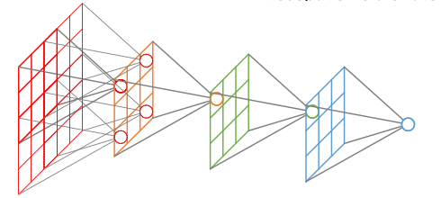
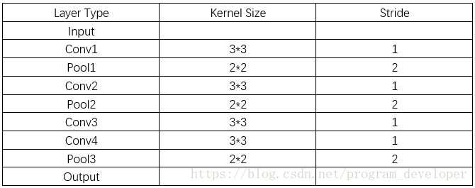

# 概念
感受野 (receptive field, RF)是卷积神经网络每一层输出的特征图上的像素点在**原始图像**上映射的区域大小。

在网上看到了一张很好的图，可以表示整个关系。

 
 

[图片来源](https://www.cnblogs.com/objectDetect/p/5947169.html)

 

注意：计算感受野大小时，忽略了图像边缘的影响，即**不考虑padding的大小**。

<!--more-->

# 计算公式
第k层的的感受野：

$${l_i}={l_{i-1}} + (\prod_{n = 1}^{i - 1} s_n )( {k_i}-1 )$$

其中，$k_i$ 表示第$i$层卷积核大小，$s_n$表示步长。**注意连乘中只到$i-1$，不包含$i$**。

做一道题

 
 

 

可以得到

| $i$  | $k_i-1$ | $s_i$ | $l_i$ |
| :--: | :-----: | :---: | :---: |
|  0   |    -    |   1   |   1   |
|  1   |    2    |   1   |   3   |
|  2   |    1    |   2   |   4   |
|  3   |    2    |   1   |   8   |
|  4   |    1    |   2   |  10   |
|  5   |    2    |   1   |  18   |
|  6   |    2    |   1   |  26   |
|  7   |    1    |   2   |  30   |

这里边把输入看做第0层，第0层的感受野为1。**并将池化层等同卷积层处理。**

# 参考
1. [卷积神经网络物体检测之感受野大小计算](https://www.cnblogs.com/objectDetect/p/5947169.html)
2. [A guide to convolution arithmetic for deep learning](https://arxiv.org/abs/1603.07285)
3. [Calculating Receptive Field of CNN](http://shawnleezx.github.io/blog/2017/02/11/calculating-receptive-field-of-cnn/)