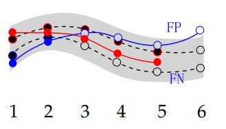

# 专栏前言
这是目标跟踪专栏第一篇文章。看论文需要记笔记，否则忘得很快。这姑且算是给自己看的阅读笔记，但又希望别人也看，因为别人能提出一些我注意不到的问题或是直接纠正某些错误。但整体上是给自己看的，所以不像其他阅读笔记，这里只包含我认为的重点和我的疑问。

<!--more-->

# 本文前言
一直觉得了解一个领域方向，应该先了解这个方向的评价指标和数据集。因为这两样东西定义了研究的问题和前进方向。现在了解的是多目标跟踪，因此选了一篇较为经典的《MOT16: A Benchmark for Multi-Object Tracking》

[原文链接](https://arxiv.org/abs/1603.00831)

[MOT官网链接](https://motchallenge.net/)

# 数据集简介
一共14个视频，7个训练，7个测试。测试集没给真值。标注分为两部分，一部分是每帧检测结果det.txt，另一部分是gt.txt。
## 分类
分为三大类，12小类。总之，作者在一番精彩论述和分析后，在评价指标中重点关注行人（Pedestrian）这一类。
## 标注
### det.txt
论文中举例
```bash
1, -1, 794.2, 47.5, 71.2, 174.8, 67.5, -1, -1
1, -1, 164.1, 19.6, 66.5, 163.2, 29.4, -1, -1
1, -1, 875.4, 39.9, 25.3, 145.0, 19.6, -1, -1
2, -1, 781.7, 25.1, 69.2, 170.2, 58.1, -1, -1
```
对应含义为

```bash
帧号，轨迹ID，四个值组成的BBox，无效，无效
```
其中BBox=（x，y，w，h），x和y是目标左上角点坐标。在实际的数据集文件中，无效的“-1”有三个，而论文中只有两个。

### gt.txt
论文中举例

```bash
1, 1, 794.2, 47.5, 71.2, 174.8, 1, 1, 0.8
1, 2, 164.1, 19.6, 66.5, 163.2, 1, 1, 0.5
2, 4, 781.7, 25.1, 69.2, 170.2, 0, 12, 1.
```
对应含义为

```bash
帧号，轨迹ID，四个值组成的BBox，标志位，目标类别，目标可见比例
```
其中，

 - 标志位为1时在计算评估指标时考虑该目标的跟踪情况，为0时不考虑。
 - 目标类别是指该目标所属文中列出12种目标的哪一类。
 - 由于在对数据集进行标注时，标注的真值会对目标遮挡部分或画面外部分进行估计。也就是真值的BBox区域可能会有一部分是看不见目标的。目标可见比例，就是指可见部分和整个BBox的比例，应该是面积之比，文中未提到。

# 评估指标
## 两个前提假设
一方面，人们为了好给跟踪器排名，希望找到一个综合性的指标。但另一方面，人们又担心一个指标，所包含的信息，不如多个指标，（类似于均值和方差所代表的实际意义不能相互替代）。作者明显倾向于后者，并确立了两个基本出发点。

### TP,FP,FN的定义
文中原文“It is a true positive (TP) that describes an actual (annotated) target, or whether the output is a false alarm (or false positive, FP)”“A target that is missed by any hypothesis is a false negative (FN). ”

结合后文的例子，**我的理解是，TP是指能正确匹配的目标，FP是指错误匹配的目标，FN是指未进行匹配的目标。**（此处如有问题，请指正，不胜感激！）

### 一一映射
即，一个真值只能和一个跟踪结果对应，一个跟踪结果只能和一个真值对应。

### 文中举例
<div align="center"> 
 
</div> 

根据文中表述，上图虚线表示真值轨迹，灰色区域代表匹配时的阈值范围。红线或蓝线表示跟踪结果的轨迹（红色和蓝色表示不同跟踪结果）。实心圆表示该目标正确匹配，空心圆表示该目标未能正确匹配。数字表示第几帧。同一帧中两个圆的距离，应该是表示检测结果之间和检测结果与真值之间的距离。

文中认为上图FP有4个，FN有5个。黑色空心框5个表示未匹配的目标，蓝色空心框表示错误匹配的目标。套用上文我对TP,FP和FN的理解正好能解释。

（这部分文中共列举了四种跟踪中的情况，对MOTA的理解很有帮助，建议阅读原文）

## MOTA
全称Multiple Object Tracking Accuracy，取值范围$(-\infty, 1]$，

$$\mathrm{MOTA}=1-\frac{\sum_{t}\left(\mathrm{FN}_{t}+\mathrm{FP}_{t}+\mathrm{IDSW}_{t}\right)}{\sum_{t} \mathrm{GT}_{t}}$$
其中，$t$表示第$t$帧，${GT}_{t}$表示第$t$帧上全部的标注目标数量，${FN}_{t}$表示第$t$帧上全部未匹配目标数量，${FP}_{t}$表示第$t$帧上全部匹配错误目标数量，${IDSW}_{t}$表示第$t$帧上ID变换总数。Identity Switch，IDSW，指目标轨迹号的变化次数，越低越好。一条轨迹理想情况下，跟踪结果的轨迹号不会发生变化，但实际情况不然，详见文中共列举了四种跟踪情况的第一种。

## MOTP
全称Multiple Object Tracking Precision，**注意是衡量正确匹配的目标和真值之间**，
$$\mathrm{MOTP}=\frac{\sum_{t, i} d_{t, i}}{\sum_{t} c_{t}}$$
其中，$c_{t}$表示第$t$帧正确匹配的数量，$d_{t, i}$表示第$t$帧上第$i$个目标跟踪结果的BBox和标注BBox之间的IoU.

## MT和ML

 - 对于一条轨迹，能成功跟踪轨迹的80%以上，（不考虑轨迹号是否发生变化），称这个目标MT（Mostly Tracked）
 - 对于一条轨迹，能成功跟踪轨迹的20%以下，称这个目标MT（Mostly Lost）。
 - 介于80%和20%之间的，称为PT（Partially Tracked）。

## FM
原文：the number of track fragmentations (FM) counts how many times a ground truth trajectory is
interrupted (untracked).
计算方式：we also provide the relative number of fragmentations as FM / Recall

## IDSW
原文：identity switch, IDSW is counted if a ground truth target i is matched to track j and the last known assignment was k != j. 

计算方式：We also state the relative number of ID switches, which is computed as IDSW / Recall

# 疑问
1. 在4.1.3（2）中 “All result boxes that overlap > 50% with one of these classes (distractor, static person, reflection, person on vehicle) are removed from the solution.” 如果遮挡物和目标的IoU大于50%怎么办？

2. FM指标从文中的表述来看是统计标注真值的评价指标？

3. 表7中MOTA下面的$\pm$9.2等，是文中所提出的Robustness，即MOTA在各个视频下的标准差？