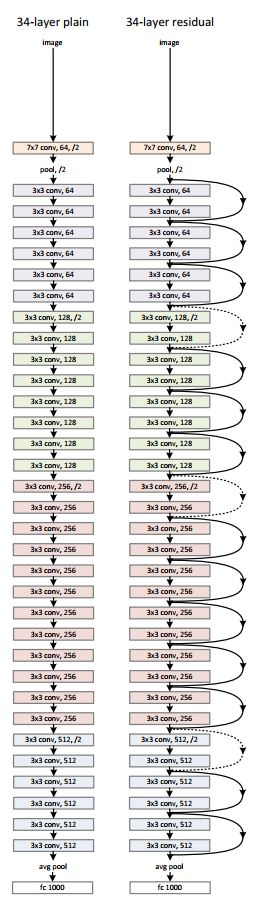
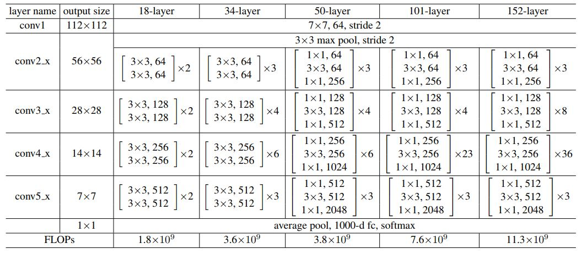
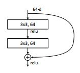
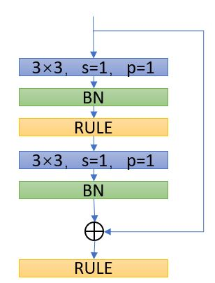
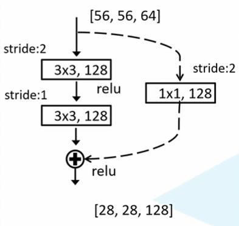
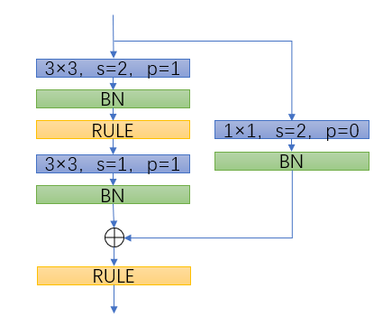
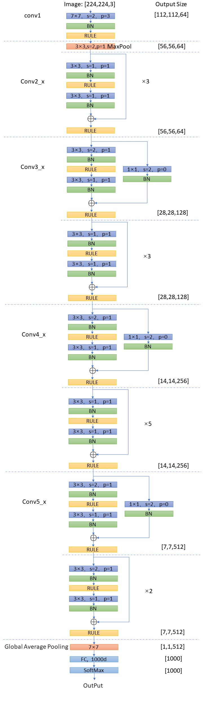
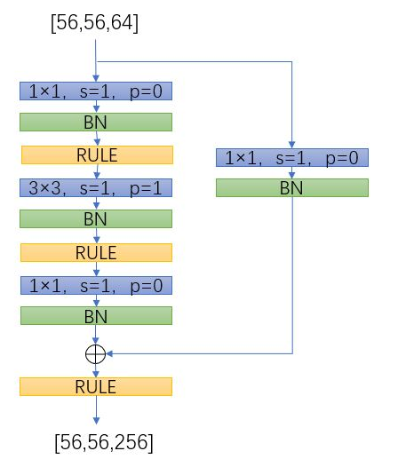
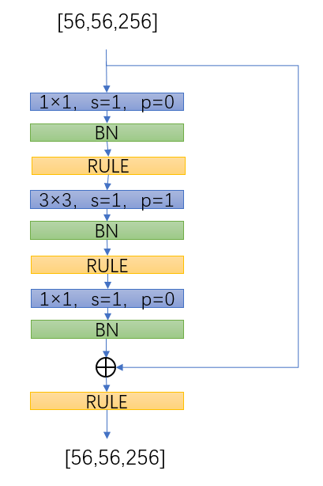
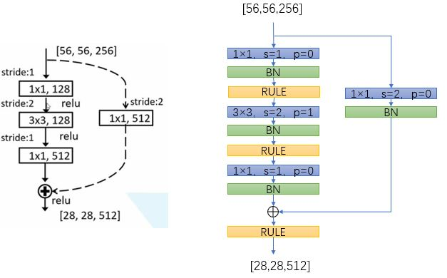

# ResNet的层数34,50,101到底指什么？

答案并不直接，得分两步来看。

<!--more-->

## 首先看ResNet34的对比图
不用看细节，也不用自己数。

 
 

 

这里的34层实际上是指左面的“34-layer-plain”中有34个层需要有可训练参数（卷积层和全连接层）。那么直接对比过来，ResNet34是指**除去残差连接中的卷积层**中的卷积层和全连接层。

你可能会问，残差连接不就一条线吗，哪来的可训练参数？但事实是，实线处没有，虚线处是有卷积层的，为了保证尺度相等。

## 然后再看这个表

 
 

 
以34为例，34=1+2*（3+4+6+3）+1。
也就是，最上面的多少层是在**不考虑残差连接层中的卷积层**下，数出来“plain结构”中的可训练网络层，包含卷积层和全连接层；**而不是ResNet中所有的可训练网络层**。

这一点搞了好久才搞清楚。

# ResNet 到底是个什么结构
你可能像我一样天真地认为，不就一个残差连接吗？那么好，有以下两个问题：（1）尺度不同怎么相加（2）如果采用Padding，具体参数是多少，是否一样？

事实上，ResNet-34和ResNet-50的基础结构是不一样的，这一点论文中明确指出了

## ResNet-34
残差结构是这个样子，和表中可以明显的对应，也对应第一张图中的**实线连接**结构。

 
 

 
让我们具体一点，紫色代表卷积层。这里为了通用性，没有画输入输出通道数。

 
 

 

### 虚线结构
比如ResNet34的Conv2_x的第一个卷积块，这里直接记为Conv3_1。它的输入是[56,56,64]（可根据conv2_x的输出[112,112,64]计算得到），但是Conv3_1的输出是[28,28,128]，**维度不相等没有办直接相加，因此，添加了一个卷积层**。

 
 

 

具体一点，

 
 

 

有这两个结构以后就可以搭建整个网络了。

 
 

 

## ResNet-50
有了ResNet34的分析，再看这个就简单了。但是有一个不同在于一个残差单元内，ResNet50的维度发生了变化，比如从64到128。所以出现了三种不同的结构。

### 第一种：只用于conv2_1

 
 

 

### 第二种：所有的Block中的非第一个
以Conv2_2为例

 
 

 

### 第三种：conv3_1和conv4_1和conv5_1
相当于ResNet34的虚线结构，以conv3_1为例。此处以代码实现版本为准。需要同时处理尺度和维度的变化。

 
 

 

以下是代码作者的注释

注意：原论文中，在虚线残差结构的主分支上，第一个1x1卷积层的步距是2，第二个3x3卷积层步距是1。
但在pytorch官方实现过程中是第一个1x1卷积层的步距是1，第二个3x3卷积层步距是2，
这么做的好处是能够在top1上提升大概0.5%的准确率。可参考Resnet v1.5 
    https://ngc.nvidia.com/catalog/modelscripts/nvidia:resnet_50_v1_5_for_pytorch

# 总结

- 当通道需要增加或者H和W需要减半时，残差连接中是有卷积层的，卷积核1*1，步长为2，填充为0。
- 整个网络，无论主分支还是残差连接，在进行H和W减半时，是依赖的stride=2完成的。而padding只是负责当stride=1时，保证输入输出H和W相等。
- 回过头来看那张表，至少隐去了残差连接中的卷积层等相关信息，变成了笼统的将一个结构复制几遍。padding，stride，in_channel，out_channel等重要信息，需要自行补充后，才能搭建网络。

# 参考
基本上就是按照https://www.bilibili.com/video/BV1T7411T7wa?spm_id_from=333.999.0.0分析的
代码来源https://github.com/WZMIAOMIAO/deep-learning-for-image-processing，也是这位UP主的。

感谢这位UP带我走出了很多误区！