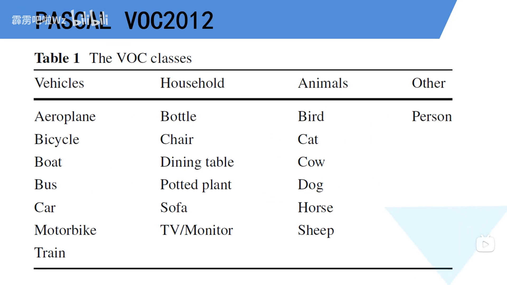
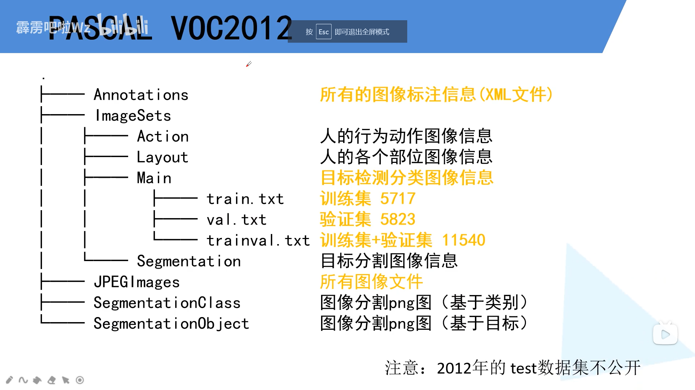
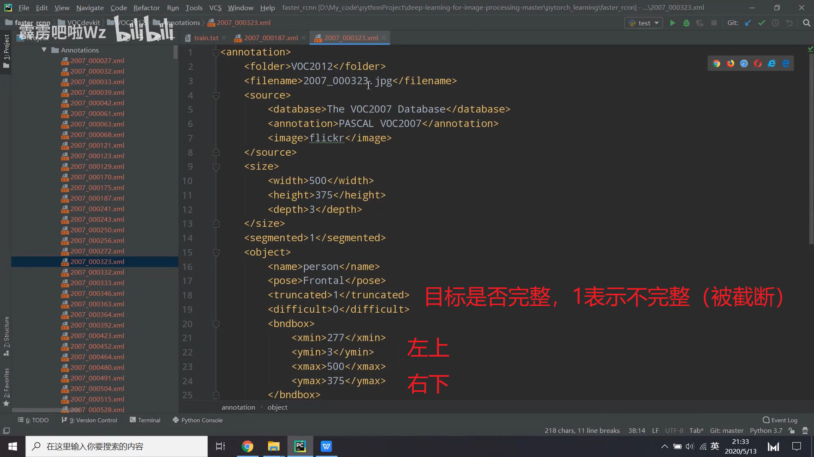
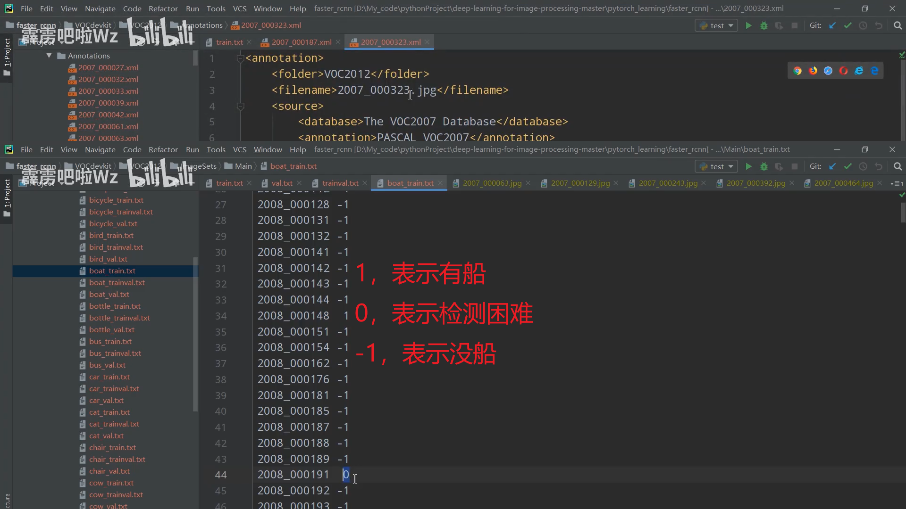
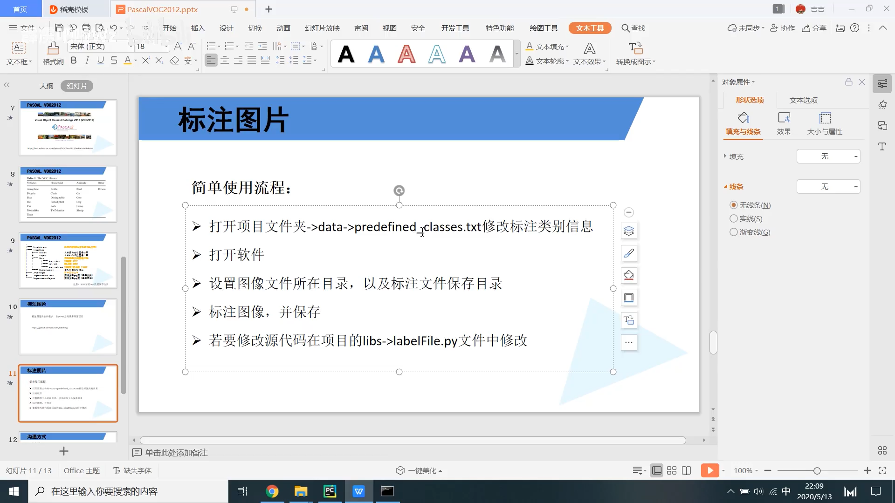
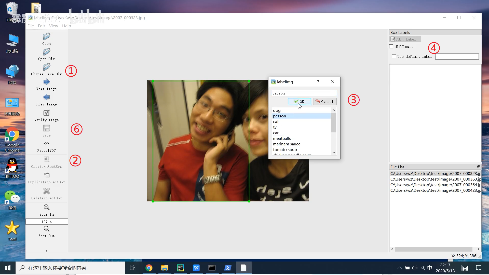
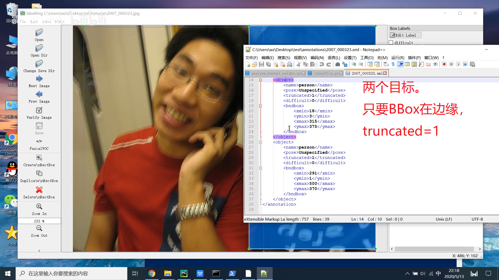

# 前言 
实际上就是看[PASCAL VOC2012数据集讲解与制作自己的数据集](https://www.bilibili.com/video/BV1kV411k7D8?spm_id_from=333.999.0.0)的一点笔记，把重点的记下来了。

# VOC2012
数据集官方地址：http://host.robots.ox.ac.uk/pascal/VOC/voc2012/index.html

<!--more-->

<div align="center"> 
 
</div> 
<div align="center"> 
 
</div> 
<div align="center"> 
 
</div> 

<div align="center"> 
 
</div> 

# labelImg标注工具
官方地址：https://github.com/tzutalin/labelImg

## 安装(Ubuntu)

```bash
pip install labelImg
```
使用
```bash
labelImg [IMAGE_PATH] [PRE-DEFINED CLASS FILE]
```
<div align="center"> 
 
</div> 
<div align="center"> 
 
</div> 
<div align="center"> 
 
</div> 


# 参考

 [1] [PASCAL VOC2012数据集讲解与制作自己的数据集](https://www.bilibili.com/video/BV1kV411k7D8?spm_id_from=333.999.0.0)
