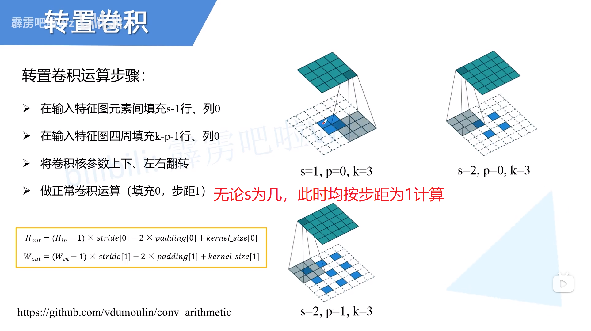
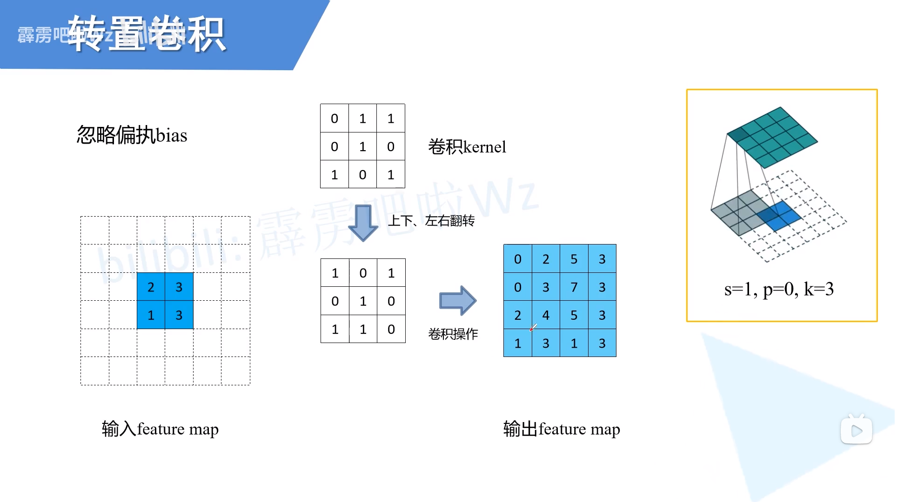
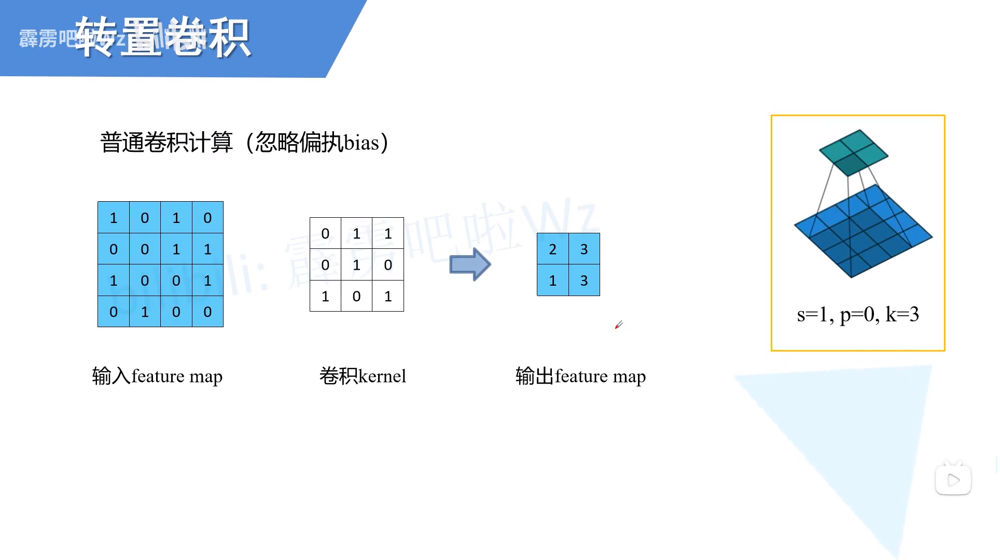
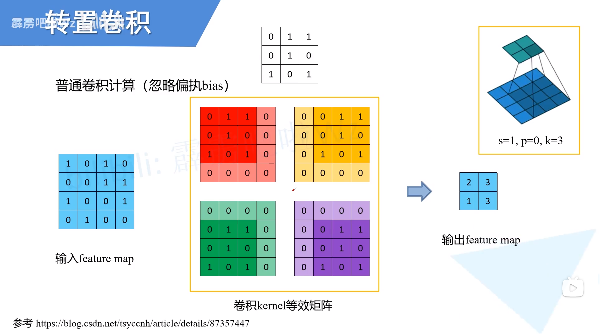
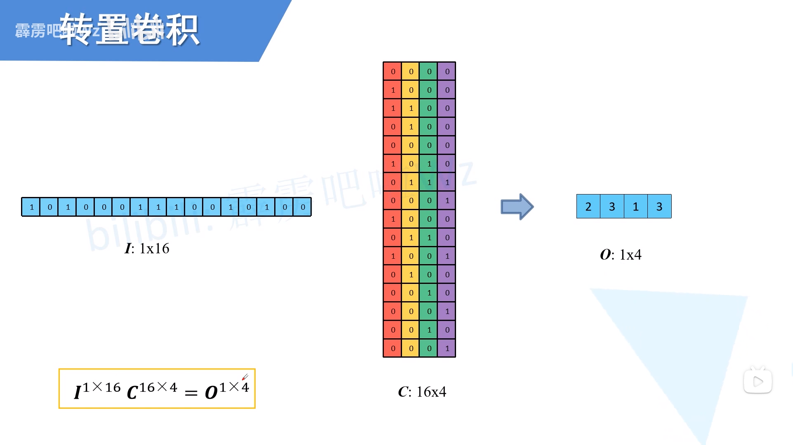
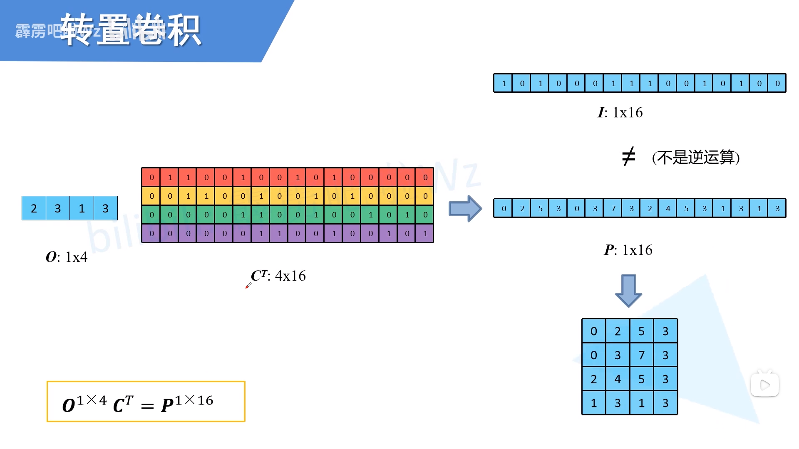
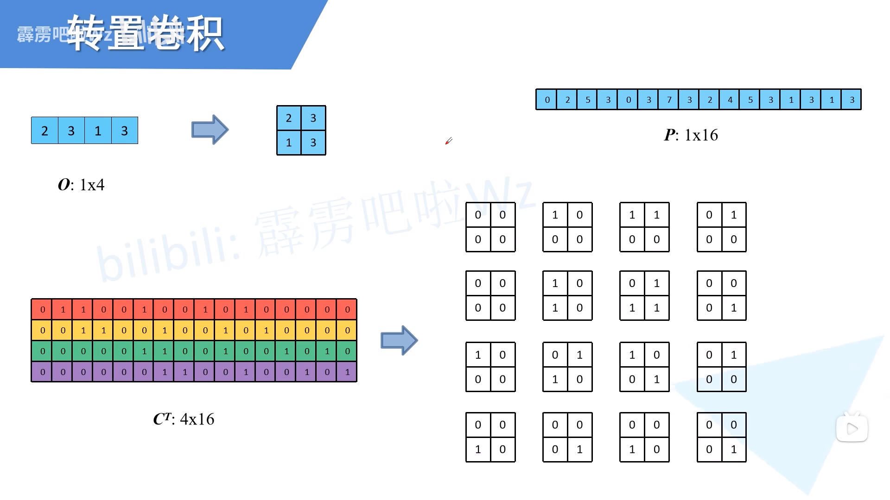
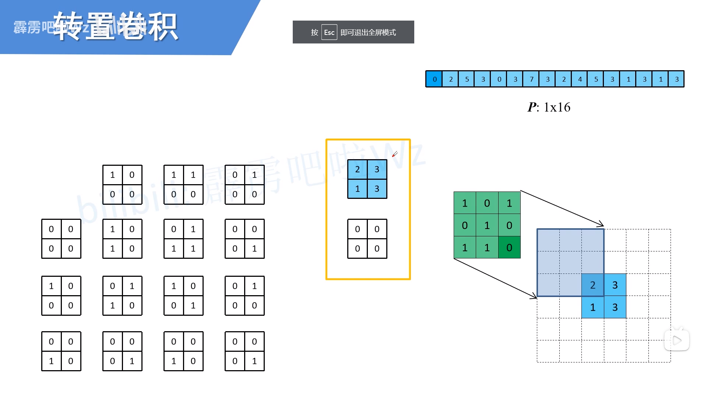
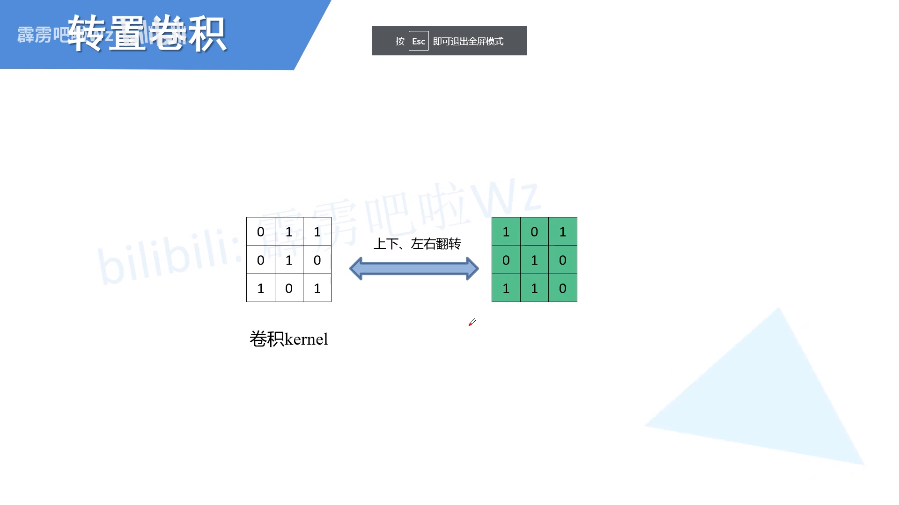

# 前言 
上次从公式角度研究了转置卷积。这次想进一步从矩阵计算角度研究。内容基本上参考这位大神在B站讲解的[转置卷积（transposed convolution）](https://www.bilibili.com/video/BV1mh411J7U4?spm_id_from=333.999.0.0)，他在CSDN也有对应的博文[转置卷积（Transposed Convolution）](https://blog.csdn.net/qq_37541097/article/details/120709865)。强烈建议大家去看看B站的视频。我这里的图片都来源于这位大神。

<!--more-->

这里只是把我感兴趣的地方做个记录，以便后来查找。我感兴趣的是，**从矩阵运算的角度讲，转置卷积为什么能放大图片**

转置卷积原文：[A guide to convolution arithmetic for deep learning](https://arxiv.org/abs/1603.07285)

# 转置卷积的计算流程

 
 

 
在填充之后的卷积运算，等效为

 
 

 

# 转置卷积和普通卷积的关系
首先明确，**转置卷积不是标准卷积的逆运算**

## 普通卷积

 
 

 
这步都能看得懂，下面开始施展魔法

### 填充卷积核以代替平移

 
 

 

### 将卷积核和输入展平
展平顺序是先行后列

 
 

 
这样一来，一个复杂的卷积过程，就化简为一个矩阵乘法。将输出reshape，即可得到我们最开始学习卷积的结果。

## 转置卷积
上面那个式子， $I·C=O$。如果已知长度较小的O，想把它变长，怎么办？ 等式两边乘上$C^T$，于是
$$ I·C·C^T = O·C^T $$

从维度上看$O·C^T$ 为1 *16，但因为$C·C^T $不是单位阵，
 $$ I \neq O·C^T $$
 
**因此，转置卷积只起到了放大的作用，并不是卷积的逆过程。**

 
 

 

# 转置卷积核和普通卷积核的关系
我得先说，这里可以不用去看。**因为在实际使用的时候，转置卷积核是经过训练得到的，并不会通过上下左右翻转得到**与其了解两者的关系，不如直接把转置卷积直接当做一种特殊的卷积。

但是我还是记录一下大佬的讲解。

首先将经过转置的卷积核还原成单个卷积核

 
 

 
根据运算关系，可以得到转置卷积核

 
 

 
结果发现，转置卷积核就是普通卷积核的上下翻转后左右翻转。

 
 

 

# 总结
用我研究语义分割同学的话说：转置卷积就是一个会更精细一点的上采样，因为它可训练。

# 参考
 [1] https://www.bilibili.com/video/BV1mh411J7U4?spm_id_from=333.999.0.0

 [2] https://blog.csdn.net/tsyccnh/article/details/87357447