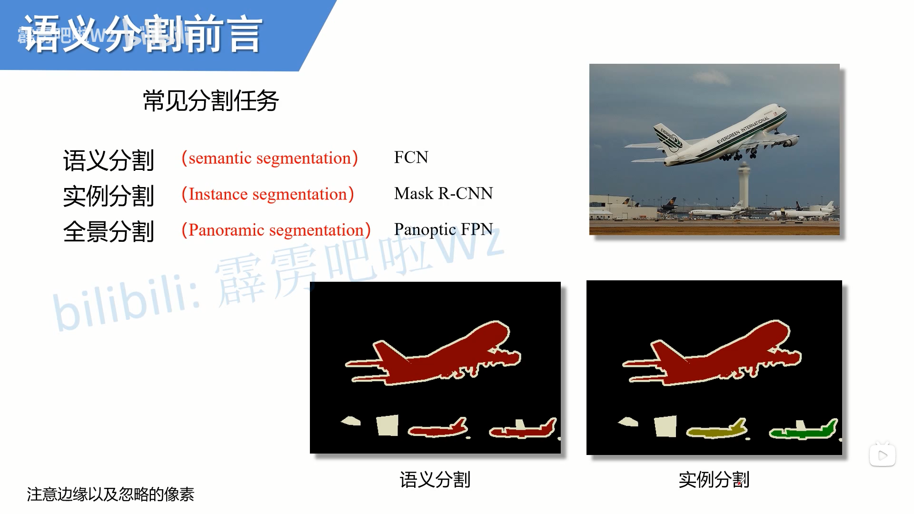
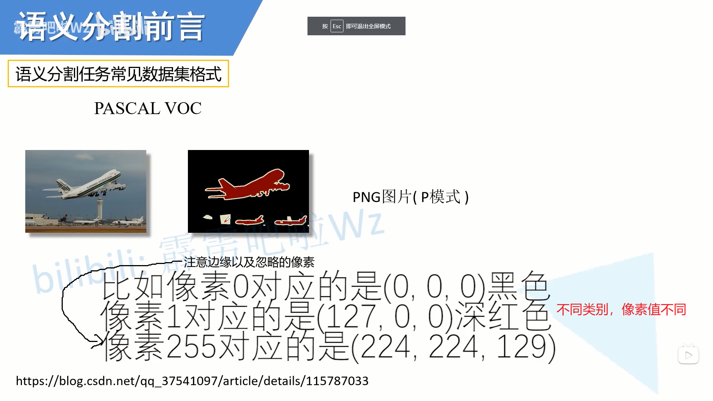
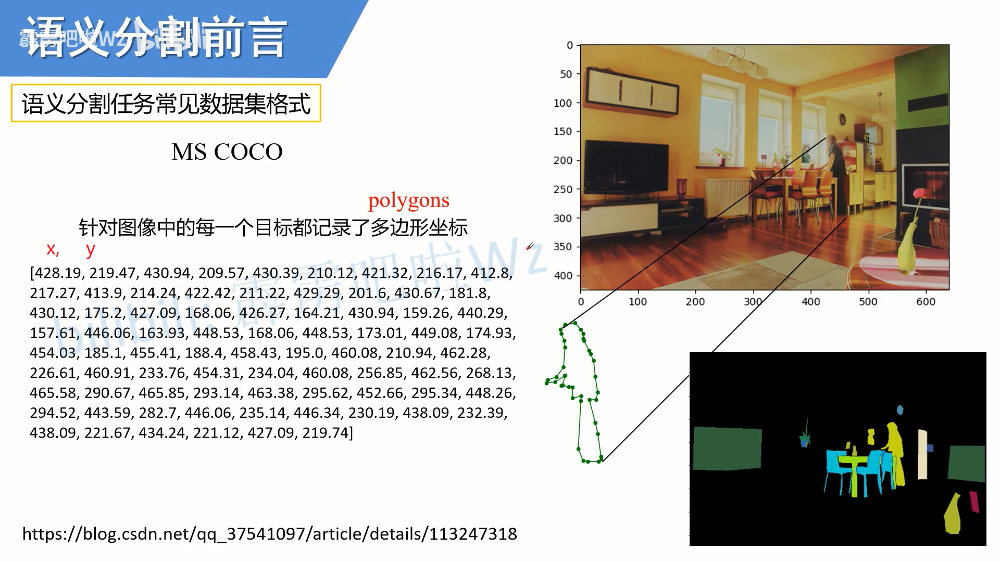
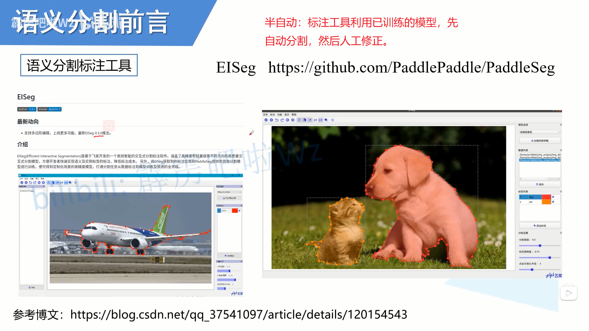
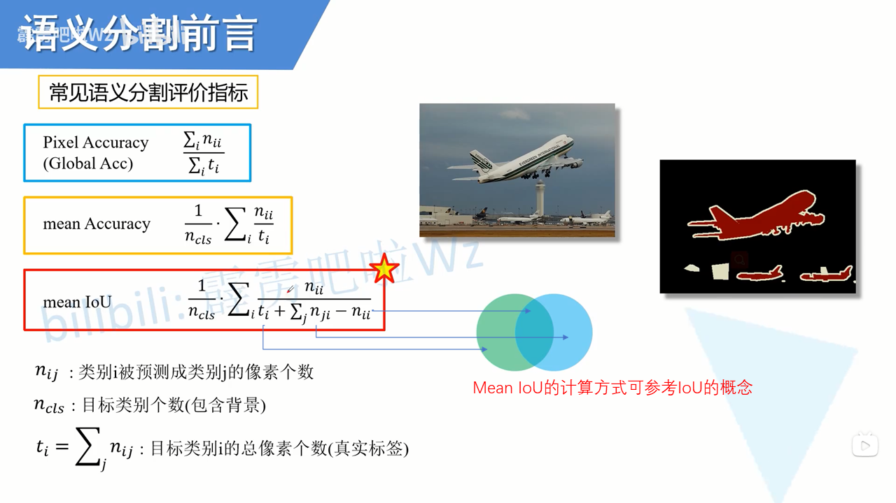
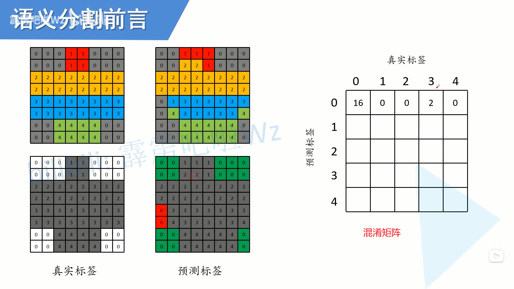
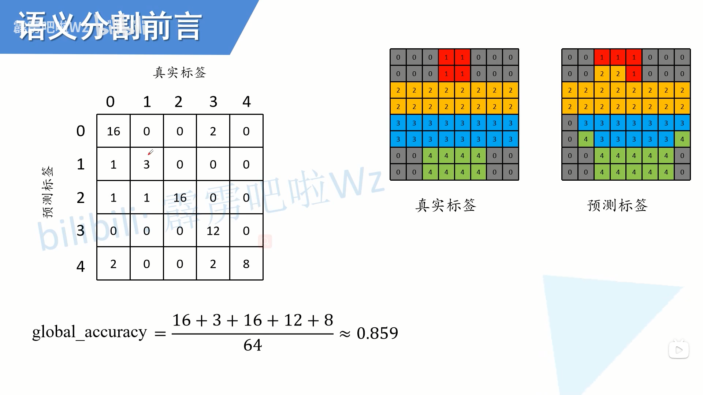
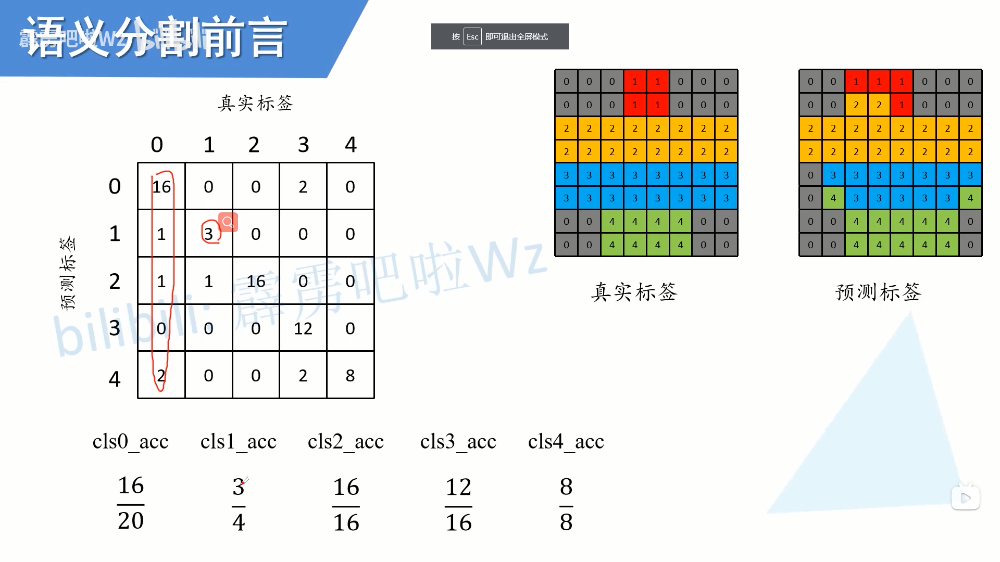
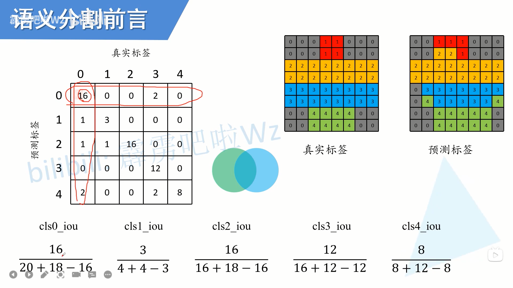

# 前言
这是我看大佬讲[语义分割前言](https://www.bilibili.com/video/BV1ev411P7dR?spm_id_from=333.999.0.0)记的笔记。如果对这块内容有需要，建议直接看他视频。

这是他B站主页，https://space.bilibili.com/18161609

<!--more-->

# 分割任务
语义分割：区分类别
实例分割：区分同一类别的不同个体
全景分割：在实例分割的基础上，区分背景（如天空，草地）

 
 

 

# 数据集标注方式

 
 

 
COCO针对目标标注若干个点，用点之间的连线把目标圈出来

 
 

 

# 标注工具
只记了一个半自动的工具

 
 

 

# 评价指标

## 定义
和下边的计算方式结合看，效果更好。

 
 

 

## 计算方式
### 混淆矩阵
语义分割本质上是对每个像素点的分类。因此，可以构建一个矩阵，矩阵的值为该像素点对应的类别。可得到真是标签的矩阵和预测标签的矩阵。

然后，构建一个矩阵，横坐标是真实标签，纵坐标是预测标签。矩阵第(i,j)个值代表，真实标签为j的被预测为i的个数。此时，这个矩阵叫混淆矩阵，对角线是正确分类的个数。

插句题外话：对角线元素相当于TP，所在行之和减去对角线元素相当于FP，所在列之和减去对角线元素相当于FN，矩阵的其他行列元素之和对该类别而言为TN

 
 

 

### Global Acc

对角线上所有元素之和=所有类别正确分类的元素数
n个类别所属像素的总数=全图像素数=混淆矩阵所有元素之和

 
 

 

### Mean Acc
每个类别的所属像素总数=每列元素总数
由此可得每个类别的分类精确度，然后再求平均

 
 

 

### Mean IoU
以第零个类别为例，
正确分类像素数=16
真实所属第零类像素数=第一列元素和=20
预测所属第零类像素数=第一行元素和=18

于是第零个类别的iou=16/(20+18)

然后多个类别再平均

 
 

 

# 总结
混淆矩阵真是个好东西

# 参考
1. https://www.bilibili.com/video/BV1ev411P7dR?spm_id_from=333.999.0.0