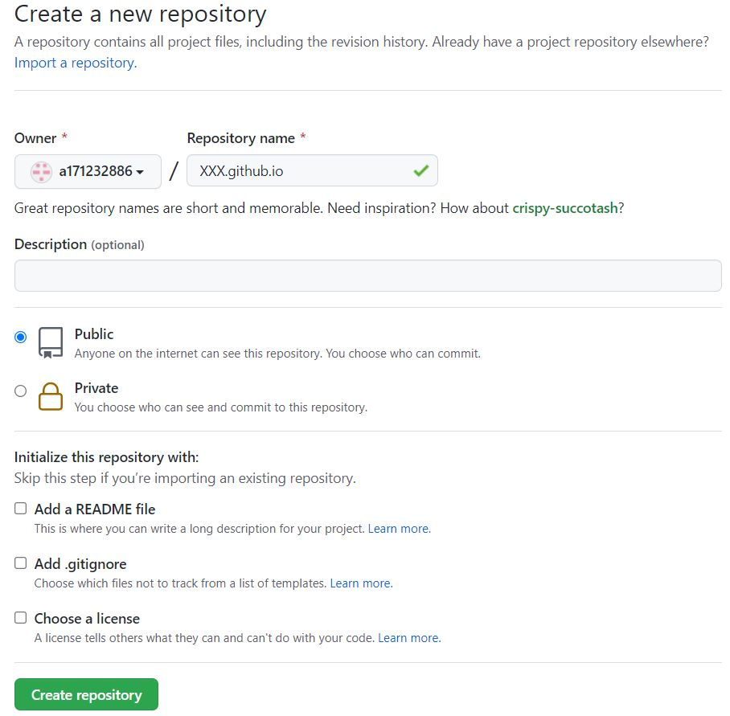

# 前言
某晚，像孩童般充满好奇心的Y同学在努力探索如何在GitHub上搭建个人博客。小王在各种失败的打击后，已经不再对任何事情感到好奇并愿意探究。但以前确实见过以github.io为名的网站。查了一下视频教程短的仅有5分钟，详细的也不过30分钟，再加上小王早已对CSDN的弹窗广告不满，所以决定尝试一下。于是在一个忙里偷闲的晚上，终于建立自己的网站。

<!--more-->

在一番探索后，小王决定记录一下这个过程。整体流程主要参考[保姆级Hexo+github搭建个人博客](https://www.bilibili.com/video/BV1mU4y1j72n?spm_id_from=333.1007.top_right_bar_window_custom_collection.content.click)


# 前期准备
## Git 下载和安装
1.  在[官方网站](https://git-scm.com/downloads) ，找到合适的安装包并下载。
2. 安装过程就是一路Next，没有什么需要注意的
3. 附带推荐一份Git教程：[廖雪峰的Git教程](https://www.liaoxuefeng.com/wiki/896043488029600)
4. 装好了可以查看一下版本

```bash
git --version
```

## Node.js
1. [官方网站](https://nodejs.org/en/download/) 
2. 找了一个写的很好的安装教程推荐：[刘奇云的安装教程](https://www.cnblogs.com/liuqiyun/p/8133904.html)
3. 总结一下就是，下载安装包，一路Next，然后更改缓存位置并设置环境变量
4. 查看一下node.js的安装情况
```bash
node -v  # 查看Node.js的版本
npm -v   # 查看Node.js自带的npm的版本，npm相当于python中的pip
```

## 注册Github账号并建库
1. 在[Github官网](https://github.com/)的“Sign Up”处直接注册就行，需要一个已有的邮箱即可。
2. 新建一个库，库名为XXX.github.io，其中XXX是你的用户名，比如a171232886.github.io。这样写，GitHub才能把这个库“翻译”成网页。然后点击Create repository。
<div align="center"> 
 
</div> 


# 第一步：Git和GitHub的初步配置

主要解决一下文件传输问题

## 设置本地Git用户名

```bash
git config --global user.name "Name" 
git config --global user.email "email@example.com"
```
例如，Name 和 email@example.com 可分别为 twodog 和 twodog@qq.com

## 设置和Github的SSH传输密钥
1. 用你在注册Github账户是的邮箱，然后一路回车
```bash
ssh-keygen -t rsa -C "youremail@example.com"
```
2. 进入```C:\Users\WH\.ssh```，找一个叫‘id_rsa.pub’的文件（公钥）
2. 登入Github，进入Setting，设置SSH keys。里面需要用到公钥，就把id_rsa.pub文件中的内容输入
<div align="center"> 
 
</div> 

# 第二步：安装Hexo
Hexo是一个写网页的框架，可以理解为深度学习力的Pytorch

## 安装Hexo
-g表示全局安装
```bash
npm install hexo-cli -g
```

**如果出现关于权限问题的错误，以管理员身份运行cmd，再执行以上命令。**

# 第三步：建立博客并上传到Github

## 建立Hexo博客
其实关于这里，[Hexo官网](https://hexo.io/)已经讲得很清楚了。建议**以管理员身份运行cmd**

### 1. 使用Hexo初始化

新建一个文件夹用于存放Blog文件，比如E:\\Blog，然后初始化

```bash
E:        # windows下跳转到E盘
cd Blog   # 进入Blog文件夹
hexo init # 初始化
```
此处的初始化命令，可能会受到访问Github的网速影响（Github是外网，但没被大陆屏蔽）。比如出现以下情况：

```bash
E:\\Blog>hexo init
INFO  Cloning hexo-starter https://github.com/hexojs/hexo-starter.git
fatal: unable to access 'https://github.com/hexojs/hexo-starter.git/': OpenSSL SSL_read: Connection was reset, errno 10054
WARN  git clone failed. Copying data instead
FATAL {
  err: [Error: EPERM: operation not permitted, mkdir 'E:\'] {
    errno: -4048,
    code: 'EPERM',
    syscall: 'mkdir',
    path: 'E:\\'
  }
} Something's wrong. Maybe you can find the solution here: %s http://hexo.io/docs/troubleshooting.html
```

如果你有代理可在cmd中进行以下操作，对当前cmd的网络连接进行**临时**代理，1080是端口号，取决于你的代理设置。详见[windows终端命令行下使用网络代理](https://www.cnblogs.com/macrored/p/12190799.html)

```bash
set HTTP_PROXY=http://127.0.0.1:1080
set HTTPS_PROXY=http://127.0.0.1:1080
```
取消临时代理

```bash
netsh winhttp reset proxy
```

那么如何获取代理呢？我不知道，你自己找！

### 2. 打开本地服务器，进行网页本地预览

```bash
hexo s
```
cmd中会显示，访问http://localhost:4000，即可看到预览效果

```powershell
INFO  Hexo is running at http://localhost:4000 . Press Ctrl+C to stop.
```
<div align="center"> 
 
</div> 

### 3. 设置_config.yml
1. 找到E:\\Blog\\_config.yml文件，用记事本打开，如果你用VSCode更好。
2. 在底部的

```bash
# Deployment
## Docs: https://hexo.io/docs/one-command-deployment
deploy:
  type: ''
```
改为一下，当然需要你把“a171232886”替换成你自己的Github用户名

```bash
# Deployment
## Docs: https://hexo.io/docs/one-command-deployment
deploy: 
  type: git
  repository: git@github.com:a171232886/a171232886.github.io.git
  branch: main
```
这一步是告诉Hexo，网页和相关文件往哪传。**注意是main，不是master。**


### 4. 生成网页并上传
1. 生成

```bash
hexo g
```
2. 安装一个包，方便上传部署。 别忘了**以管理员身份运行cmd**。**要在博客目录下进行**，成功之后会看见```.deploy_git```文件夹

```bash
npm install --save hexo-deployer-git
```
否则执行hexo d 会出现

```bash
ERROR Deployer not found: git
```
3. 上传

```bash
hexo d
```

# 第四步：欣赏网页
1. 直接访问XXX.github.io，XXX是你的Github账号，比如a171232886.github.io
2. 现在你就可以看到部署到Github上的博客了，并且全世界都可以访问
3. 停下来，休息一下，喝杯咖啡，给小王点个赞。