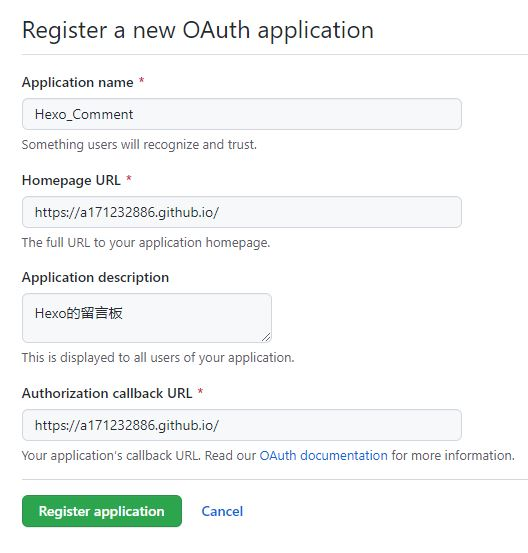
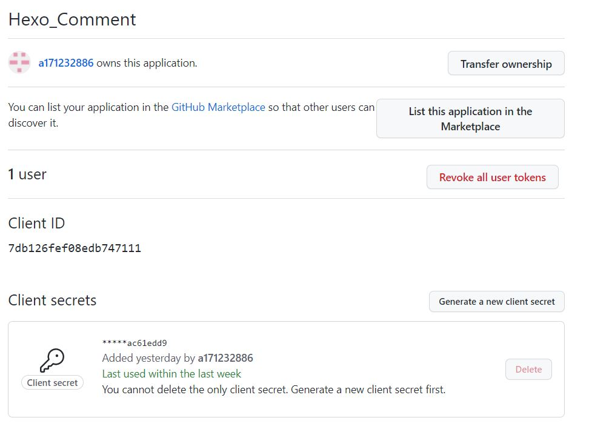
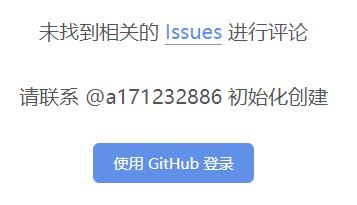
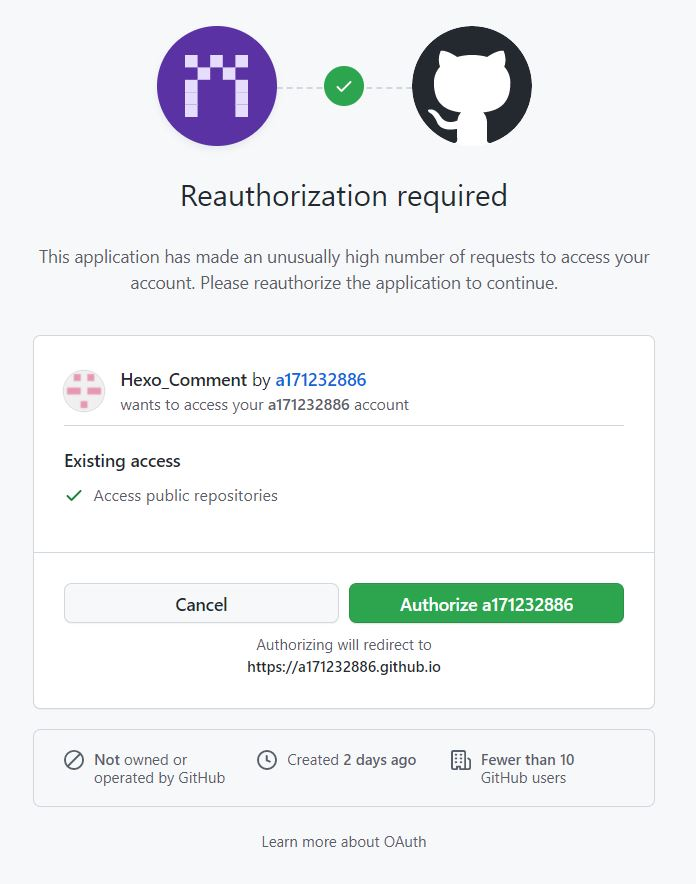
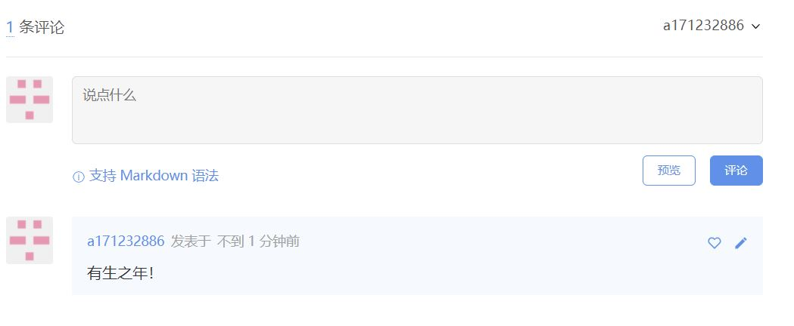
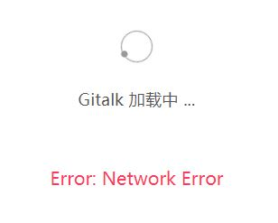

# 前言 
作为一个博客，总得有评论区吧。而评论区的插件需要第三方来完成，有些还需要单独注册。本着尽量少注册，尽量少泄露信息的原则，我使用Gitalk作为评论区插件。NexT主题已经集成了Gitalk。这也是我使用NexT主题的直接原因。

<!--more-->

网上这么多教程，那你为什么要再写一篇呢？因为那些十篇有九篇不能用。不是说那些博客写错了，是过时了。因为**现在NexT的版本已经到8.8**，很多东西已经不一样了。

我现在的相关程序均采用截至到2021/11/8最新的版本，hexo 5.4.0，node 16.13.0，NexT 8.8.1。

# Github的OAuth
这东西可以理解为，一个口令
1. 登录Github，依次找到Settings/Developer settings/OAuth Apps，然后New OAuth App，进入[申请](https://github.com/settings/applications/new)。按以下格式填写就可以。**注意，用https**
<div align="center"> 
 
</div> 
<div align="center"> 
 
</div> 
当然，要是忘记Client secrets，可以再申请一个新的，并将以前的作废。

# 配置NexT
找到E:\\Blog\\themes\\next\\_config.yml。**注意是next文件下下面，不是根目录下面。**

1. 启用评论区
```bash
# Multiple Comment System Support
comments:
  # Available values: tabs | buttons
  style: tabs
  # Choose a comment system to be displayed by default.
  # Available values: disqus | disqusjs | changyan | livere | gitalk | utterances
  active: gitalk
  # Setting `true` means remembering the comment system selected by the visitor.
  storage: true
  # Lazyload all comment systems.
  lazyload: false
  # Modify texts or order for any naves, here are some examples.
  nav:
    gitalk:
     order: -1
```

2. 配置gitalk相关信息，把刚才的client_id和client_secret填入。其他部分参照以下代码修改。
```bash
# Gitalk
# For more information: https://gitalk.github.io
gitalk:
  enable: true
  github_id: a171232886 # GitHub repo owner
  repo: a171232886.github.io # Repository name to store issues
  client_id: 7db126fef08edb747111 # GitHub Application Client ID
  client_secret: ************ac61edd9 # GitHub Application Client Secret
  admin_user: a171232886 # GitHub repo owner and collaborators, only these guys can initialize gitHub issues
  distraction_free_mode: true # Facebook-like distraction free mode
  # When the official proxy is not available, you can change it to your own proxy address
  proxy: https://cors-anywhere.azm.workers.dev/https://github.com/login/oauth/access_token
  # https://cors-anywhere.azm.workers.dev/https://github.com/login/oauth/access_token # This is official proxy address
  # Gitalk's display language depends on user's browser or system environment
  # If you want everyone visiting your site to see a uniform language, you can set a force language value
  # Available values: en | es-ES | fr | ru | zh-CN | zh-TW
  language: zh-CN
```

# 初始化评论区
1. 首先执行以下代码

```bash
hexo clean  # 清除缓存
hexo g
hexo d
```
2. 打开网页以后会看到
<div align="center"> 
 
</div> 
3. 登录，会弹出一个授权询问，授权。
<div align="center"> 
 
</div> 
4. 最终可以看到
<div align="center"> 
 
</div> 


# 致谢
1. [hexo主题next中gitalk配置与评论初始化](https://www.toimc.com/hexo-usage-3/)


#  问题解答
Q：出现这种状况怎么办？
<div align="center"> 
 
</div> 
A：查一下 E:\\Blog\\theme\\next\\_config.yml 中的gitalk的proxy是不是https://github.com/login/oauth/access_token


如果是，改为`https://cors-anywhere.azm.workers.dev/https://github.com/login/oauth/access_token`

因为github官方API，可能会限制调用！