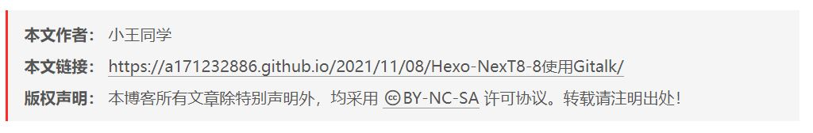

# 前言
写完文章以后，想加个版权协议保护一下自己的劳动成果。（小声说：写的文章本来就没人看，根本用不着版权保护。而且版权保护只针对尊重版权的人。）

为什么要写这篇博客，写完还单独列出来？因为网上的教程都过时了，无法在NexT8.8上成功使用。

以下是经过探索后的正确方法。

<!--more-->

# 修改配置文件
打开E:\\Blog\\themes\\next\\_config.yml，找到creative_commons，修改为以下即可。
```bash
# Creative Commons 4.0 International License.
# See: https://creativecommons.org/about/cclicenses/
creative_commons:
  # Available values: by | by-nc | by-nc-nd | by-nc-sa | by-nd | by-sa | cc-zero
  license: by-nc-sa
  # Available values: big | small
  size: small
  sidebar: false
  post: true
  # You can set a language value if you prefer a translated version of CC license, e.g. deed.zh
  # CC licenses are available in 39 languages, you can find the specific and correct abbreviation you need on https://creativecommons.org
  language: zh-CN
```

# 效果
<div align="center"> 
 
</div> 

