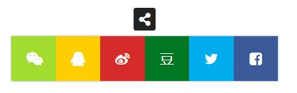

# 前言
能评论，还要能分享。好在NexT已经集成了一些插件。

<!--more-->

# 插件Need More Share
首先要提一下，[NexT官方](https://github.com/theme-next/awesome-next)提供了一些插件，还都不错。集成分享功能在这个页面：https://github.com/theme-next/hexo-next-share

1.  管理员身份打开cmd，安装

    ```bash
    E:        # windows下跳转到E盘
    cd Blog   # 进入Blog文件夹
    npm install theme-next/hexo-next-share
    ```

2. NexT官方提供三个分享插件：Likely，Need More Share和Share.js。比较了一下，选择Need More Share。进入其[项目页面](https://github.com/revir/need-more-share2)，需要安装：

    ```bash
    npm install -g grunt
    ```

# 配置文件
1. 在E:\\Blog\\themes\\next\\_config.yml中添加以下代码片段

    ```bash
    # NeedMoreShare2
    # Dependencies: https://github.com/theme-next/theme-next-needmoreshare2
    # For more information: https://github.com/revir/need-more-share2
    # iconStyle: default | box
    # boxForm: horizontal | vertical
    # position: top / middle / bottom + Left / Center / Right
    # networks:
    # Weibo | Wechat | Douban | QQZone | Twitter | Facebook | Linkedin | Mailto | Reddit | Delicious | StumbleUpon | Pinterest
    # GooglePlus | Tumblr | GoogleBookmarks | Newsvine | Evernote | Friendfeed | Vkontakte | Odnoklassniki | Mailru
    needmoreshare:
      enable: true
      cdn:
        js: //cdn.jsdelivr.net/gh/theme-next/theme-next-needmoreshare2@1/needsharebutton.min.js
        css: //cdn.jsdelivr.net/gh/theme-next/theme-next-needmoreshare2@1/needsharebutton.min.css
      postbottom:
        enable: true
        options:
          iconStyle: box
          boxForm: horizontal
          position: bottomCenter
          networks: Wechat,QQZone,Weibo,Douban,Twitter,Facebook
      float:
        enable: false
        options:
          iconStyle: box
          boxForm: horizontal
          position: middleRight
          networks: Wechat,QQZone,Weibo,Douban,Twitter,Facebook
    ```
2. 更新

    ```bash
    hexo clean
    hexo g -d
    ```

    最终会在文章尾见到，以下图标
<div align="center"> 
 
</div> 
