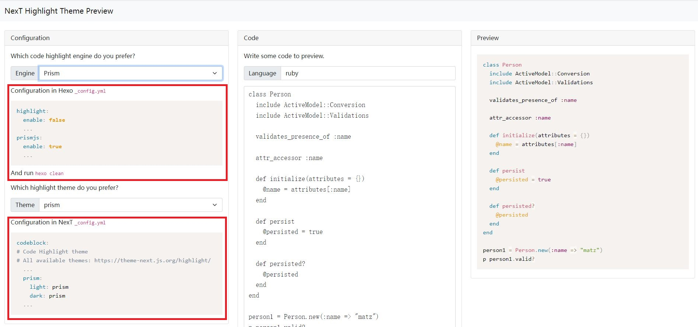
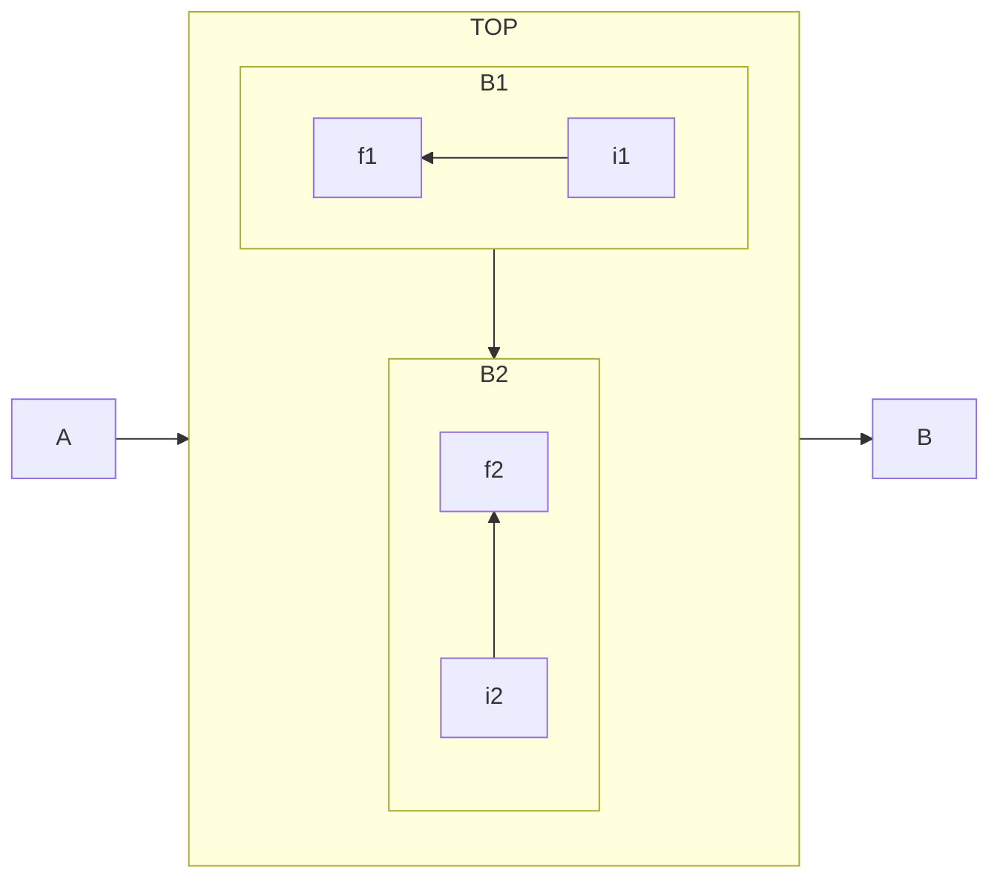

一些实用技巧记录，随时更新
<!--more-->

# 添加右上角图标folk github
1. 找到自己喜欢的样式：http://tholman.com/github-corners/, 并复制代码

2. 打开： E:\\Blog\\themes\\next\\layout\\_layout.njk，添加

```bash
<div class="headband"></div>
<!--下面一行插入复制代码，注意换成自己的github地址：href="https://github.com/a171232886"-->
<a href="https://github.com/a171232886" class="github-corner" aria-label="View source on GitHub"><svg width="80" height="80" viewBox="0 0 250 250" style="fill:#151513; color:#fff; position: absolute; top: 0; border: 0; right: 0;" aria-hidden="true"><path d="M0,0 L115,115 L130,115 L142,142 L250,250 L250,0 Z"></path><path d="M128.3,109.0 C113.8,99.7 119.0,89.6 119.0,89.6 C122.0,82.7 120.5,78.6 120.5,78.6 C119.2,72.0 123.4,76.3 123.4,76.3 C127.3,80.9 125.5,87.3 125.5,87.3 C122.9,97.6 130.6,101.9 134.4,103.2" fill="currentColor" style="transform-origin: 130px 106px;" class="octo-arm"></path><path d="M115.0,115.0 C114.9,115.1 118.7,116.5 119.8,115.4 L133.7,101.6 C136.9,99.2 139.9,98.4 142.2,98.6 C133.8,88.0 127.5,74.4 143.8,58.0 C148.5,53.4 154.0,51.2 159.7,51.0 C160.3,49.4 163.2,43.6 171.4,40.1 C171.4,40.1 176.1,42.5 178.8,56.2 C183.1,58.6 187.2,61.8 190.9,65.4 C194.5,69.0 197.7,73.2 200.1,77.6 C213.8,80.2 216.3,84.9 216.3,84.9 C212.7,93.1 206.9,96.0 205.4,96.6 C205.1,102.4 203.0,107.8 198.3,112.5 C181.9,128.9 168.3,122.5 157.7,114.1 C157.9,116.9 156.7,120.9 152.7,124.9 L141.0,136.5 C139.8,137.7 141.6,141.9 141.8,141.8 Z" fill="currentColor" class="octo-body"></path></svg></a><style>.github-corner:hover .octo-arm{animation:octocat-wave 560ms ease-in-out}@keyframes octocat-wave{0%,100%{transform:rotate(0)}20%,60%{transform:rotate(-25deg)}40%,80%{transform:rotate(10deg)}}@media (max-width:500px){.github-corner:hover .octo-arm{animation:none}.github-corner .octo-arm{animation:octocat-wave 560ms ease-in-out}}</style>
```

# 添加站内搜索

一个实用的NexT[指导网站](https://theme-next.iissnan.com/)

1. 安装
```bash
npm install hexo-generator-searchdb --save
```

2. 编辑E:\\Blog\\ _config.yml，任意位置新增
```bash
search:
  path: search.xml
  field: post
  format: html
  limit: 10000
```

3. 编辑E:\\Blog\\themes\\next\\_config.yml，修改
```bash
# Local search
local_search:
  enable: true
```

# 主页显示项目
1. 编辑E:\\Blog\\themes\\next\\_config.yml，修改
```bash
menu:
  home: / || fa fa-home
  #tags: /tags/ || fa fa-tags
  categories: /categories/ || fa fa-th
  archives: /archives/ || fa fa-archive
  about: /about/ || fa fa-user
  #schedule: /schedule/ || fa fa-calendar
  #sitemap: /sitemap.xml || fa fa-sitemap
  #commonweal: /404/ || fa fa-heartbeat
```

2. 新建相应文件，比如categories
```bash
hexo new page categories
```
3. 修改categories\index.md

```bash
---
title: 分类
date: 2021-11-08 20:06:58
type: 'categories'
---
```


# moon-cake 进度显示和上下滑动
1. 下载，[官方链接](https://github.com/jiangtj-lab/hexo-cake-moon-menu)
```bash
npm install hexo-cake-moon-menu
```

2. 编辑E:\\Blog\\themes\\next\\_config.yml，添加
```bash
moon_menu:
  back2top:
    enable: true
    icon: fas fa-chevron-up
    order: -1
  back2bottom:
    enable: true
    icon: fas fa-chevron-down
    order: -2
```

# 代码颜色
[官方的代码颜色的可用方案](https://theme-next.js.org/highlight/)

包括了种类，预览效果和使用方式。

<div align="center"> 
 
</div> 


1. 首先修改 Hexo的 _config.yml
2. 再修改 NexT的 _config.yml
3. 执行```hexo clean```，再```hexo g```

# 首页只显示文章摘要
以前那种每页显示固定字数的选项没了，现在手动设置：
1. 整体设置 NexT的 _config.yml
   将```excerpt_description: true```设为```true```
2. 在每个文章中插入```<!--more-->```,然后首页只显示该行以上的部分。

# NexT8动画背景Canvas Nest
添加图片作为背景，但找不到合适的图片。NexT8自带的Canvas ribbon，每次点击背景变化过大，不太好。找来找去，就Nest挺合适，但NexT8已经不在集成Nest效果。

这部分完全转载自[blog - hexo NexT主题下配置和美化](https://hxhowl.com/posts/e6f9a475/)，实测有效。

1. 首先在hexo目录下安装动画库：
```bash
cd themes/next
git clone https://github.com/theme-next/theme-next-canvas-nest source/lib/canvas-nest
```

2. 在next主题下的_config.yml找到canvas_ribbon，在下面添加Canvas-nest动画的配置
```bash
# Canvas-nest
# Dependencies: https://github.com/theme-next/theme-next-canvas-nest
canvas_nest:
  enable: true
  onmobile: true # display on mobile or not
  color: "0,0,255" # RGB values, use ',' to separate
  opacity: 0.5 # the opacity of line: 0~1
  zIndex: -1 # z-index property of the background
  count: 99 # the number of lines
```

3. 在博客根目录下的source文件夹，创建_data文件夹
```bash
cd source
mkdir _data
```

4. 创建footer.swig文件，添加内容
```bash
<script color="0,0,255" opacity="0.5" zIndex="-1" count="99" src="https://cdn.jsdelivr.net/npm/canvas-nest.js@1/dist/canvas-nest.js"></script>
```

5. 在next主题下的_config.yml找到_config.yml中找到custom_file_path添加一行配置```footer: source/_data/footer.swig```
```bash
# Define custom file paths.
# Create your custom files in site directory `source/_data` and uncomment needed files below.
custom_file_path:
  #head: source/_data/head.njk
  #header: source/_data/header.njk
  #sidebar: source/_data/sidebar.njk
  #postMeta: source/_data/post-meta.njk
  #postBodyEnd: source/_data/post-body-end.njk
  #footer: source/_data/footer.njk
  footer: source/_data/footer.swig
  #bodyEnd: source/_data/body-end.njk
  #variable: source/_data/variables.styl
  #mixin: source/_data/mixins.styl
  #style: source/_data/styles.styl
```

6. 重启hexo
```bash
hexo clean
hexo g
hexo s
```

# 修改链接样式

对```./themes/next/source/css/_common/components/post/post-body.styl```最后添加内容：
```bash
.post-body a {
  color: #428BCA;
  font-weight: bold;
}
```

# LaTeX公式编辑问题
研究了好久，决定还是使用```mathjax```，其实```KaTeX```也挺好的。

1. 卸载默认的marked，安装新的pandoc
  ```bash
    npm un hexo-renderer-marked
    npm i hexo-renderer-pandoc
  ```

2. 设置next下的_config.yml，将```mathjax```启用
   ```yml
    mathjax:
      enable: true
      # Available values: none | ams | all
      tags: none
   ```

3. 注意：**Hexo下的Mathjax没有那么智能，整体公式写法尽量简单，能少加括号的就少加。否则会出现Mathjax官方可以识别出来，但是Hexo编译不出来的情况。**

4. [mathjax官方demo](https://www.mathjax.org/#demo)，可以在上面试试公式

5. 尽管mathjax遵循LaTeX语法，但有可能还会出现一些不同的地方。这有两个参考：
   - [MathJax basic tutorial and quick reference](https://math.meta.stackexchange.com/questions/5020/mathjax-basic-tutorial-and-quick-reference)
   - [在Hexo中渲染MathJax数学公式](https://blog.csdn.net/weixin_30725467/article/details/96659102)

# 使用mermaid绘制流程图
```bash
npm install --save hexo-filter-mermaid-diagrams
```
修改NexT的_config.yml
```yml
# Mermaid tag
mermaid:
  enable: true
  # Available themes: default | dark | forest | neutral
  theme:
    light: default
    dark: dark
```


## mermaid的flowchart基础语法

```bash
  ```mermaid
  flowchart LR
    subgraph TOP
      direction TB
      subgraph B1
          direction RL
          i1 -->f1
      end
      subgraph B2
          direction BT
          i2 -->f2
      end
    end
    A --> TOP --> B
    B1 --> B2
```




# 访客统计
next的_config.yml中busuanzi_count的enable设为true即可。
```yml
# Show Views / Visitors of the website / page with busuanzi.
# For more information: http://ibruce.info/2015/04/04/busuanzi/
busuanzi_count:
  enable: true
  total_visitors: true
  total_visitors_icon: fa fa-user
  total_views: true
  total_views_icon: fa fa-eye
  post_views: true
  post_views_icon: far fa-eye
```

# 文章目录相关
## 默认展开
如果文章内容是多级目录，默认二级目录是合并的。这样给阅读带来不便，可设置为默认展开。
next的_config.yml中toc的expand_all设为true
```yml
toc:
  enable: true
  # Automatically add list number to toc.
  number: true
  # If true, all words will placed on next lines if header width longer then sidebar width.
  wrap: false
  # If true, all level of TOC in a post will be displayed, rather than the activated part of it.
  expand_all: true
  # Maximum heading depth of generated toc.
  max_depth: 6
```

## 取消自动编号
`number: false`

## 每行目录显示全部
`wrap: true`，此时每行过长的目录标题会转行显示。


# 网站运行天数
在```.\themes\next\layout\_partials\footer.njk```最后添加，注意修改```var grt= new Date("12/1/2021 00:00:00");```中的时间。

```html
<div>
<span id="timeDate">载入天数...</span><span id="times">载入时分秒...</span>
<script>
    var now = new Date();
    function createtime() {
        var grt= new Date("12/1/2021 00:00:00");
        now.setTime(now.getTime()+250);
        days = (now - grt ) / 1000 / 60 / 60 / 24; dnum = Math.floor(days);
        hours = (now - grt ) / 1000 / 60 / 60 - (24 * dnum); hnum = Math.floor(hours);
        if(String(hnum).length ==1 ){hnum = "0" + hnum;} minutes = (now - grt ) / 1000 /60 - (24 * 60 * dnum) - (60 * hnum);
        mnum = Math.floor(minutes); if(String(mnum).length ==1 ){mnum = "0" + mnum;}
        seconds = (now - grt ) / 1000 - (24 * 60 * 60 * dnum) - (60 * 60 * hnum) - (60 * mnum);
        snum = Math.round(seconds); if(String(snum).length ==1 ){snum = "0" + snum;}
        document.getElementById("timeDate").innerHTML = "本站已安全运行 "+dnum+" 天 ";
        document.getElementById("times").innerHTML = hnum + " 小时 " + mnum + " 分 " + snum + " 秒";
    }
setInterval("createtime()",250);
</script>
</div>
```

# 网页底部去掉“强力驱动”
比如想去掉“由 Hexo & NexT.Gemini 强力驱动”，在```.\themes\next\layout\_partials\footer.njk```中将以下代码注释掉。

```html

  <div class="powered-by">
    
    {{- __('footer.powered', next_url('https://hexo.io', 'Hexo') + ' & ' + next_url(next_site, 'NexT.' + theme.scheme)) }}
  </div>

```
但我认为Hexo和NexT应该在我的网页上留有名字，毕竟帮了我很大忙，于是将其放在了友情链接中。

# 友情链接的设置
next的_config.yml中Blog rolls进行设置
```yml
# Blog rolls
links_settings:
  icon: fa fa-globe
  title: 友情链接
  # Available values: block | inline
  layout: inline

  links:
  Hexo: https://hexo.io
  NexT: https://theme-next.js.org/
```

# 社交链接添加图标
## 添加社交连接
在next的_config.yml中social中进行设置。
```yml
social:
  GitHub: https://github.com/a171232886 || fab fa-github
  CSDN: https://blog.csdn.net/a171232886 || fa fa-book-open

social_icons:
  enable: true
  icons_only: false
  transition: false
```

## 添加图标
添加的图标应该是[Font Awesome](https://fontawesome.dashgame.com/)这里面已经有的图标。找到合适的图标，复制代码在上面```||```后直接时候即可。注意不要删掉原有的fa或者fab。

# 头像设置
在next的_config.yml中avatar设置。将头像图片放在```./source/images/```中，修改url地址。
```yml
# Sidebar Avatar
avatar:
  # Replace the default image and set the url here.
  url: /images/header.jpg
  # If true, the avatar will be displayed in circle.
  rounded: true
  # If true, the avatar will be rotated with the cursor.
  rotated: true
```

# 致谢

1. [馨客栈分享](https://www.bilibili.com/video/BV16W411t7mq?spm_id_from=333.1007.top_right_bar_window_history.content.click)
2. [next6、7博客主题美化 2020-04-10](https://www.jianshu.com/p/644264a8af2c)
3. [blog - hexo NexT主题下配置和美化](https://hxhowl.com/posts/e6f9a475/)
4. [让 Hexo Next (v8.0.0) 支持 LaTeX 数学公式](https://dog.wtf/tech/making-hexo-next-theme-latex-math-equation-supported/)
5. [Hexo+next主题配置踩的坑](https://blog.csdn.net/qq_44219883/article/details/105178206)
6. [Hexo博客优化之Next主题美化](https://blog.csdn.net/nightmare_dimple/article/details/86661502)
