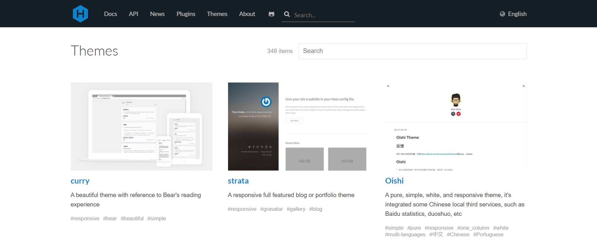
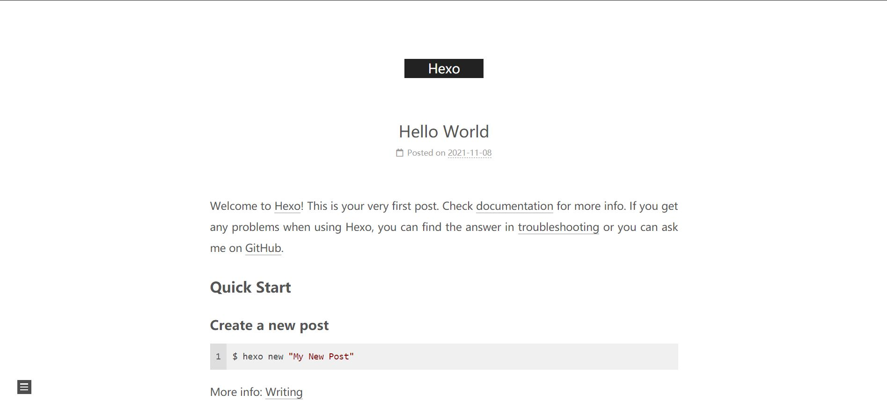

# 前言
上次说到用Hexo在Github上建立个人博客。Hexo博客所使用的主题默认是Landscape，其实挺简洁大方的。但是由于种种原因，也许是因为功能少，现在需要更换一个主题，比如NexT。

同时，现在要开始完成自己的第一篇博客。

<!--more-->

# Hexo的主题
官方在https://hexo.io/themes/, 罗列了348种主题。挑一款自己最喜欢的吧。同时，使用Hexo的大佬们也会在自己的Github网站分享自己的改良版主题。由于NexT主题集成的插件多（网上的教程多），小王转向了NexT。
<div align="center"> 
 
</div> 

## NexT主题
 [NexT主题官网](https://github.com/next-theme/hexo-theme-next)上提供了各种丰富的资源
 
### 主题切换
1. 下载主题，首先打开cmd

```bash
E:        # windows下跳转到E盘
cd Blog   # 进入Blog文件夹
git clone https://github.com/next-theme/hexo-theme-next themes/next 
```
2. 配置文件

找到E:\\Blog\\_config.yml文件，用记事本打开，如果你用VSCode更好。
将
```bash
theme: landscape
```
改为以下并保存
```bash
theme: next
```

3. 补充安装

```bash
 npm i hexo-renderer-swig
```
否则，你在hexo g 会看见

```bash
 
```

4. 本地预览

```bash
hexo g
hexo s
```
访问http://localhost:4000/
<div align="center"> 
 
</div> 
5. 上传GitHub

```bash
hexo d
```

# 创建第一篇博客
Hexo提供了[官方中文文档](https://hexo.io/zh-cn/docs/)，里面写的已经较为详细。
1. 创建一篇文章名为test

```bash
hexo new test
```
然后会显示

```bash
INFO  Created: E:\\Blog\\source\\_posts\\test.md
```
2. 打开E:\\Blog\\source\\_posts\test.md进行编辑。Markdown语法如果不会的话，可以看看CSDN给你的第一篇博客，里面很详细。总之，Markdown比LaTex要简单很多。比如以下这样，

```bash
---
title: test
date: 2021-11-08 13:49:15
tag：
---

test

```

3. 生成网页并上传

```bash
hexo g -d
```

# 文章分类
如果文章过多，肯定需要分类处理，对md文件头可以这样处理。

```bash
---
title: test
date: 2021-11-08 13:49:15
categories: 
- [笔记]
---
```
此时，这篇文章就会被分到“笔记”中。

#  配置文件的其他更改
找到E:\\Blog\\_config.yml文件，可修改以下几处：
1. 网页Site的相关设置，剩下的可以自己探索：

```bash
# Site
title: 小王同学
subtitle: ''
description: ''
keywords:
author: 小王同学
language: zh-CN
timezone: 'Asia/Shanghai'
```

2. URL改成自己的网址

```bash
# URL
## Set your site url here. For example, if you use GitHub Page, set url as 'https://username.github.io/project'
url: https://a171232886.github.io/
permalink: :year/:month/:day/:title/
permalink_defaults:
pretty_urls:
  trailing_index: true # Set to false to remove trailing 'index.html' from permalinks
  trailing_html: true # Set to false to remove trailing '.html' from permalinks

```

# 致谢
1. https://blog.csdn.net/qq_41170983/article/details/109381893