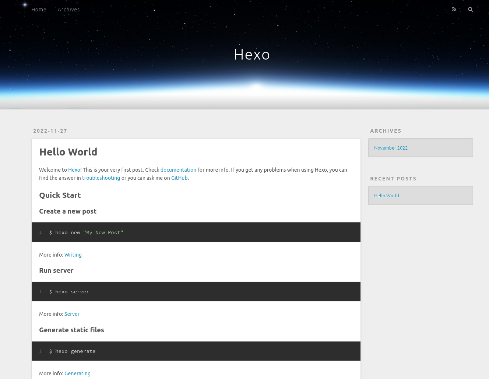
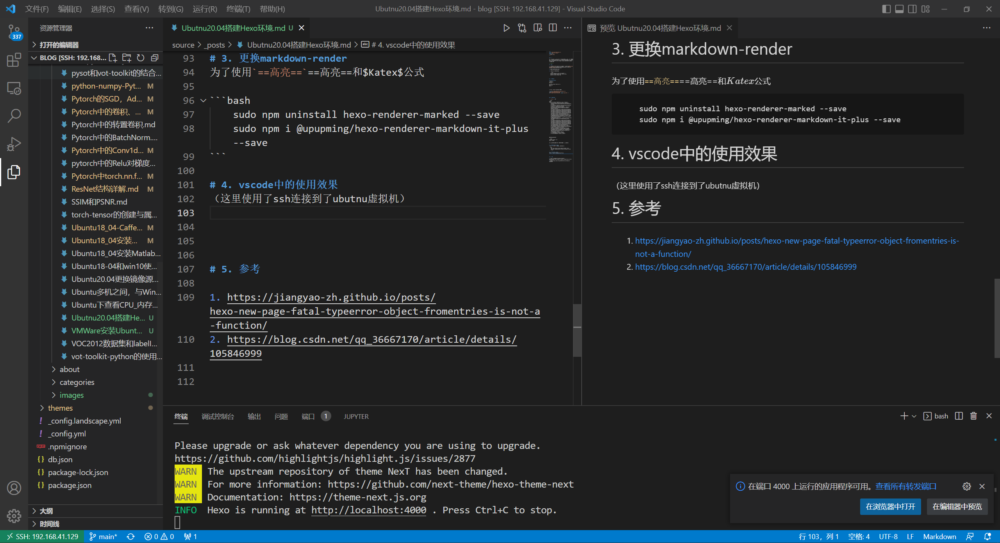

# 0. 前言

这几天，特别是双11，小王实在忍受不了CSDN的广告。于是准备重操旧业，使用git+hexo记笔记，做博客。而之前在win10上的环境都没了，现在打算在Ubuntu中创建环境，因为在VMware+Ubuntu的环境管理和迁移很方便。

<!--more-->

# 1. 预备

1. 安装VMware，并创建Ubuntu环境，可以参照我之前的[VMWare安装Ubuntu20.04虚拟机](https://a171232886.github.io/2022/11/27/VMWare安装Ubuntu20.04虚拟机/)

2. （可选）Win10安装vscode

3. 在Ubuntu中安装以下工具

   ```bash
   sudo apt update && sudo apt upgrade -y
   sudo apt install git gcc g++ ssh vim tree
   sudo apt install nodejs npm
   ```

   

# 2. 安装hexo

## 2.1 安装和构建
```bash
mkdir blog
cd blog

sudo npm install hexo-cli -g
hexo init
hexo s
```


浏览器打开http://localhost:4000/




## 2.2 问题解决

执行`hexo s `出现

```bash
FATAL 
TypeError: Object.fromEntries is not a function
    at exists.then.filter.then.modules (/home/test/Desktop/blog/node_modules/hexo/lib/hexo/load_plugins.js:43:19)
    at tryCatcher (/home/test/Desktop/blog/node_modules/bluebird/js/release/util.js:16:23)
    at Promise._settlePromiseFromHandler (/home/test/Desktop/blog/node_modules/bluebird/js/release/promise.js:547:31)
    at Promise._settlePromise (/home/test/Desktop/blog/node_modules/bluebird/js/release/promise.js:604:18)
    at Promise._settlePromise0 (/home/test/Desktop/blog/node_modules/bluebird/js/release/promise.js:649:10)
    at Promise._settlePromises (/home/test/Desktop/blog/node_modules/bluebird/js/release/promise.js:729:18)
    at Promise._fulfill (/home/test/Desktop/blog/node_modules/bluebird/js/release/promise.js:673:18)
    at MappingPromiseArray.PromiseArray._resolve (/home/test/Desktop/blog/node_modules/bluebird/js/release/promise_array.js:127:19)
    at MappingPromiseArray.init (/home/test/Desktop/blog/node_modules/bluebird/js/release/promise_array.js:75:18)
    at Promise._settlePromise (/home/test/Desktop/blog/node_modules/bluebird/js/release/promise.js:601:21)
    at Promise._settlePromise0 (/home/test/Desktop/blog/node_modules/bluebird/js/release/promise.js:649:10)
    at Promise._settlePromises (/home/test/Desktop/blog/node_modules/bluebird/js/release/promise.js:729:18)
    at _drainQueueStep (/home/test/Desktop/blog/node_modules/bluebird/js/release/async.js:93:12)
    at _drainQueue (/home/test/Desktop/blog/node_modules/bluebird/js/release/async.js:86:9)
    at Async._drainQueues (/home/test/Desktop/blog/node_modules/bluebird/js/release/async.js:102:5)
    at Immediate.Async.drainQueues [as _onImmediate] (/home/test/Desktop/blog/node_modules/bluebird/js/release/async.js:15:14)
    at runCallback (timers.js:705:18)
    at tryOnImmediate (timers.js:676:5)
    at processImmediate (timers.js:658:5)
```


需要更新nodejs版本

```bash
sudo npm install -g n
sudo n stable
```

网络原因，可能需要尝试几次。然后重新执行2.1的命令


# 3. 更换markdown-render
为了使用`==高亮==`==高亮==和$Katex$公式

```bash
    sudo npm uninstall hexo-renderer-marked --save
    sudo npm i @upupming/hexo-renderer-markdown-it-plus --save
```

# 4. vscode中的使用效果
（这里使用了ssh连接到了ubutnu虚拟机）
左侧编辑，右侧预览，也能在win10中的浏览器打开预览版的网页，只是地址变成了`http://localhost:4001/`。




# 5. 参考

1. https://jiangyao-zh.github.io/posts/hexo-new-page-fatal-typeerror-object-fromentries-is-not-a-function/
2. https://blog.csdn.net/qq_36667170/article/details/105846999

