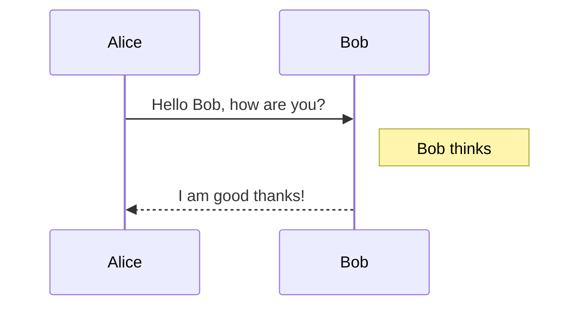
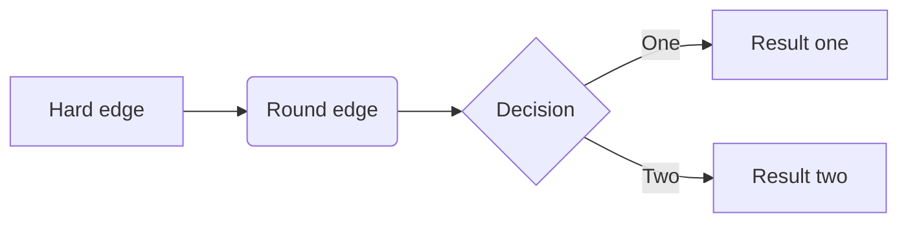
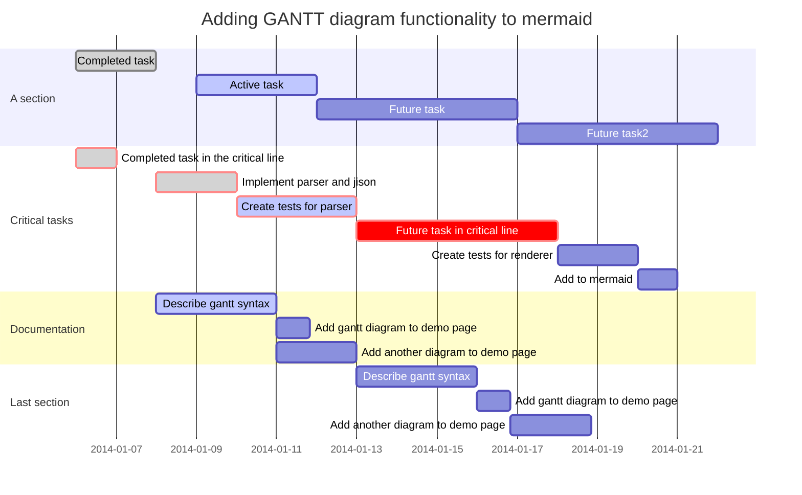
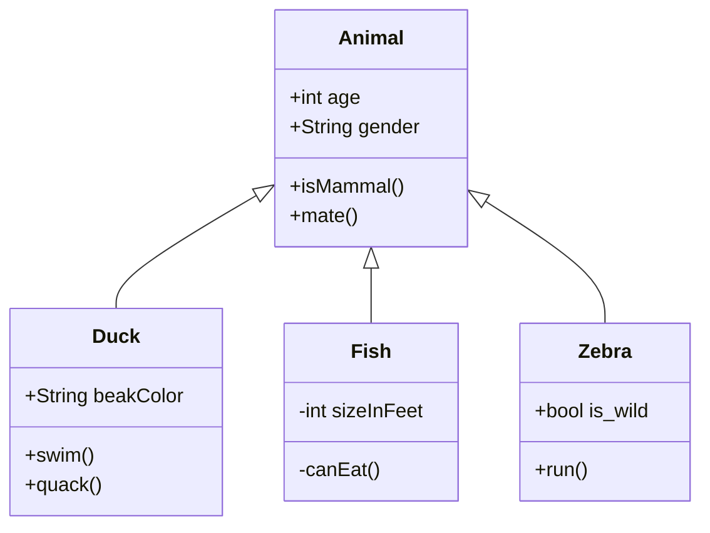
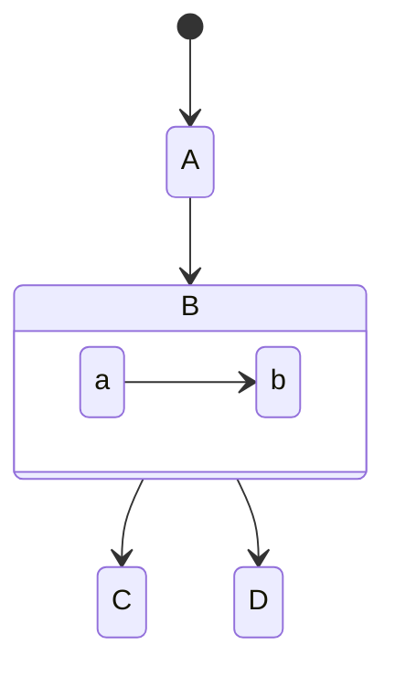
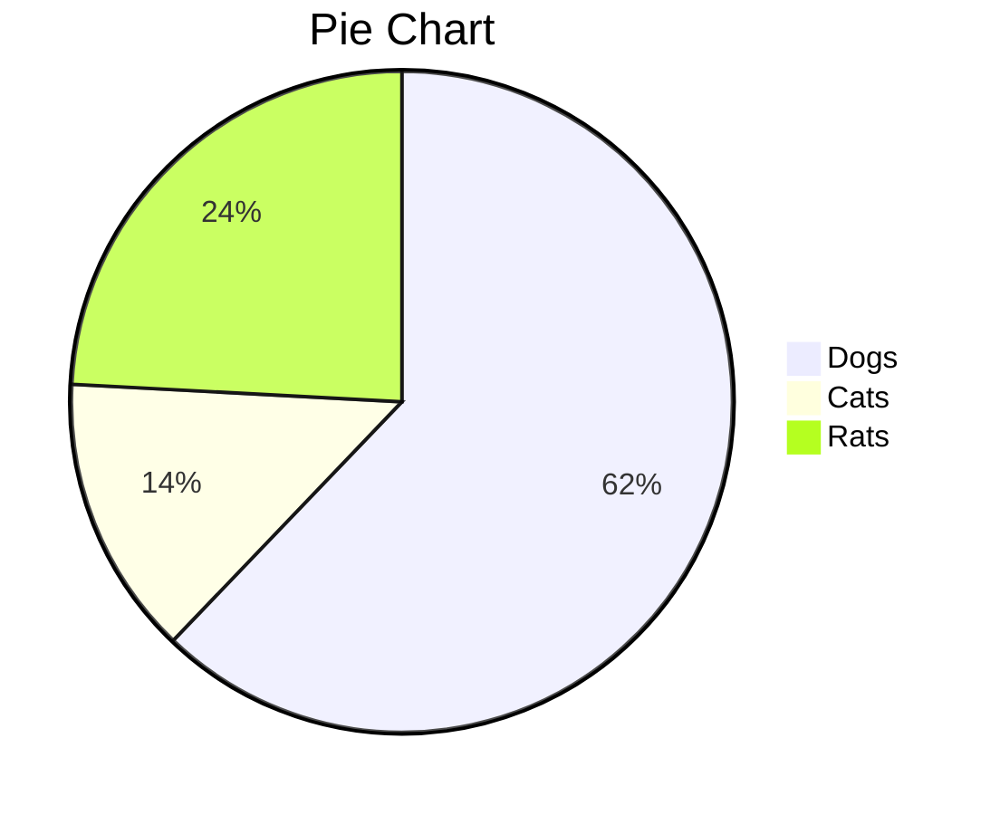

# 前言
因为打算使用Markdown做笔记，想找一种方法可在Markdown中插入思维导图。这种方法必须满足三点：（1）免费（2）简单（3）插入导图可编辑。网上一通找，在见到各种千奇百怪的方法之后，看见人家Typora官方给出了方法，而CSDN的帮助文档也有简单教程插入Mermaid流程图。==按照[Typora官方的方法](https://support.typora.io/Draw-Diagrams-With-Markdown/)，在CSDN上测试发现基本没问题==。于是，我把它翻译成中文放在这里，示例代码已经过改良。

想直接看思维导图的，直接看目录中的```另一种Flowcharts```即可。

<!--more-->

# 在Markdown中画（流程）图
Typora集成了几种画（流程）图的方法，在设置中启用即可。但Typora仍推荐使用插入图片的方法插流程图。因为Markdown像其他格式文件转换可能会出现问题。（但我们就用Markdown，所以这个问题不存在。）


# Mermaid插件
[Mermaid官网](https://mermaid-js.github.io/mermaid/#/)除了Sequence图和Flowcharts两种，还支持Gantt图，class图，state图和饼图。


## Sequence Diagrams（UML图）
使用了[js-sequence](https://bramp.github.io/js-sequence-diagrams/)，按照代码生成一个渲染后的图表。CSDN和Typora可直接使用。

```bash
	sequenceDiagram
	Alice->>Bob: Hello Bob, how are you?
	Note right of Bob: Bob thinks
	Bob-->>Alice: I am good thanks!
```



## Flowcharts
使用[flowchart.js](http://flowchart.js.org/)
```bash
	flowchat
	st=>start: Start
	op=>operation: Your Operation
	cond=>condition: Yes or No?
	e=>end

	st->op->cond
	cond(yes)->e
	cond(no)->op
```
不推荐的原因：CSDN、Typora、Hexo互不相同！

## 另一种Flowcharts
<font face="黑体"  color=#FF0000 size=4>**个人推荐，可用做思维导图**。</font>
 
```Bash
graph LR
A[Hard edge] -->B(Round edge)
B --> C{Decision}
C -->|One| D[Result one]
C -->|Two| E[Result two]

```



## Gantt图（甘特图）
可参考[Gantt diagrams](https://mermaid-js.github.io/mermaid/#/gantt)
```bash
        gantt
        dateFormat  YYYY-MM-DD
        title Adding GANTT diagram functionality to mermaid

        section A section
        Completed task            :done,    des1, 2014-01-06,2014-01-08
        Active task               :active,  des2, 2014-01-09, 3d
        Future task               :         des3, after des2, 5d
        Future task2               :         des4, after des3, 5d

        section Critical tasks
        Completed task in the critical line :crit, done, 2014-01-06,24h
        Implement parser and jison          :crit, done, after des1, 2d
        Create tests for parser             :crit, active, 3d
        Future task in critical line        :crit, 5d
        Create tests for renderer           :2d
        Add to mermaid                      :1d

        section Documentation
        Describe gantt syntax               :active, a1, after des1, 3d
        Add gantt diagram to demo page      :after a1  , 20h
        Add another diagram to demo page    :doc1, after a1  , 48h

        section Last section
        Describe gantt syntax               :after doc1, 3d
        Add gantt diagram to demo page      : 20h
        Add another diagram to demo page    : 48h
```




## Class图（类图）
可参考[Class diagrams](https://mermaid-js.github.io/mermaid/#/classDiagram)

```bash
	classDiagram
	      Animal <|-- Duck
	      Animal <|-- Fish
	      Animal <|-- Zebra
    	  Animal : +int age
      	  Animal : +String gender
	      Animal: +isMammal()
	      Animal: +mate()
	      class Duck{
	          +String beakColor
	          +swim()
	          +quack()
	      }
	      class Fish{
	          -int sizeInFeet
	          -canEat()
	      }
	      class Zebra{
	          +bool is_wild
	          +run()
	      }

```




##  State 图
这个图CSDN帮助文档中没有引入，但实际上可以生成，只是大小不能控制。此处效果图为Tpyora截图。

而Tpyora(v0.11.18)不支持```direction LR```选项。

但这个State图如果开发好的话，是比Flowcharts好的。
```bash
	stateDiagram
	    [*] --> A
	    A --> B
	    B --> C
	    
	    state B {
            direction LR
	        a --> b
	    }
	    B --> D
```




## 饼图

	```
	pie
	    title Pie Chart
	    "Dogs" : 386
	    "Cats" : 85
	    "Rats" : 150 
	```




# 参考文献
1. [Typora官方的方法](https://support.typora.io/Draw-Diagrams-With-Markdown/)
2. [mermaid](https://mermaid-js.github.io/mermaid/)