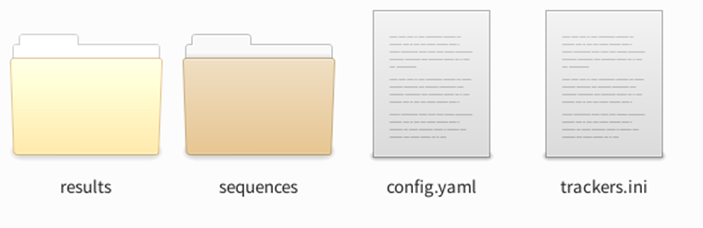
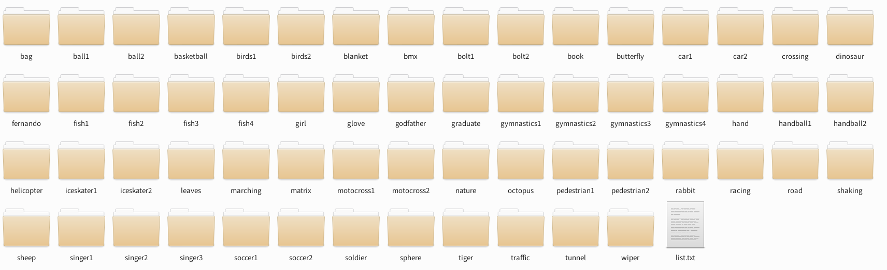

# 前言
可能[VOT官方](https://www.votchallenge.net/)心里是这么想的：你们这群连工具都配不好的菜鸡，不配使用我们的数据集。就你们这个技术，更不必参与比赛。

这个数据集的[Python版教程](https://www.votchallenge.net/howto/tutorial_python.html)，一个是写的过于简略，一个没有及时更新，一些东西已经不对应了。不过人家最开始的Matlab教程写的还挺好，但现在Python兴起，用Matlab研究跟踪的人越来越少了。

下面内容，没必要指出和官方的区别在哪。我直接写一份正确的教程。标红的地方，都是我踩过的坑。

<!--more-->

# 下载和安装
假设你的电脑可以翻墙或者现在恰好可以畅通无阻的访问Github，那我推荐你直接执行以下命令，确实是下载安装一条龙服务

```bash
pip install git+https://github.com/votchallenge/vot-toolkit-python
```

## 备用方案
<font face="黑体"  color=#FF0000 size=4> 那要这台电脑连不到Github呢？</font>
也就是如何离线安装。达到和```pip install git+url```同样的效果，需要分三步：

1. 想办法下载[官方工具包](https://github.com/votchallenge/toolkit)，拷贝到当前电脑（服务器）上
	`Download Zip`或者

	```bash
	git clone https://github.com/votchallenge/toolkit.git
	```
2. 安装所需环境
	进入文件夹目录下（文件夹我重命名为“vot_toolkit”）
	```bash
	cd vot_toolkit
	pip install -r requirements.txt
	```
3. 安装这个库
	```bash
	python setup.py install
	```
	附：如果你以这种方式，可以查看```./build/lib/vot/utilities/cli.py```下面的输入参数的含义。<font face="黑体"  color=#FF0000 size=4> 这是vot-toolkit定义输入参数的地方。</font> 

为了方便，我粘贴出来放在这

```python
    parser = argparse.ArgumentParser(description='VOT Toolkit Command Line Utility', prog="vot")
    parser.add_argument("--debug", "-d", default=False, help="Backup backend", required=False, action='store_true')
    parser.add_argument("--registry", default=".", help='Tracker registry paths', required=False, action=EnvDefault, \
        separator=os.path.pathsep, envvar='VOT_REGISTRY')

    subparsers = parser.add_subparsers(help='commands', dest='action', title="Commands")

    test_parser = subparsers.add_parser('test', help='Test a tracker integration on a synthetic sequence')
    test_parser.add_argument("tracker", help='Tracker identifier', nargs="?")
    test_parser.add_argument("--visualize", "-g", default=False, required=False, help='Visualize results of the test session', action='store_true')
    test_parser.add_argument("--sequence", "-s", required=False, help='Path to sequence to use instead of dummy')

    workspace_parser = subparsers.add_parser('initialize', help='Setup a new workspace and download data')
    workspace_parser.add_argument("--workspace", default=os.getcwd(), help='Workspace path')
    workspace_parser.add_argument("--nodownload", default=False, required=False, help="Do not download dataset if specified in stack", action='store_true')
    workspace_parser.add_argument("stack", nargs="?", help='Experiment stack')

    evaluate_parser = subparsers.add_parser('evaluate', help='Evaluate one or more trackers in a given workspace')
    evaluate_parser.add_argument("trackers", nargs='+', default=None, help='Tracker identifiers')
    evaluate_parser.add_argument("--force", "-f", default=False, help="Force rerun of the entire evaluation", required=False, action='store_true')
    evaluate_parser.add_argument("--persist", "-p", default=False, help="Persist execution even in case of an error", required=False, action='store_true')
    evaluate_parser.add_argument("--workspace", default=os.getcwd(), help='Workspace path')

    analysis_parser = subparsers.add_parser('analysis', help='Run analysis of results')
    analysis_parser.add_argument("trackers", nargs='*', help='Tracker identifiers')
    analysis_parser.add_argument("--workspace", default=os.getcwd(), help='Workspace path')
    analysis_parser.add_argument("--format", choices=("html", "latex", "pdf", "json", "yaml"), default="html", help='Analysis output format')
    analysis_parser.add_argument("--name", required=False, help='Analysis output name')
    analysis_parser.add_argument("--workers", default=1, required=False, help='Number of parallel workers', type=int)
    analysis_parser.add_argument("--nocache", default=False, required=False, help="Do not cache data to disk", action='store_true')

    pack_parser = subparsers.add_parser('pack', help='Package results for submission')
    pack_parser.add_argument("--workspace", default=os.getcwd(), help='Workspace path')
    pack_parser.add_argument("tracker", help='Tracker identifier')
```

# 测试官方的样例tracker
分为四步，主要难在initialize：
## initialize
初始化环境，并进行配置，以vot2016为例

### 初始化文件夹和下载数据集
1. 任意地方新建一个空文件夹，比如名为```vot-test```，进入
	```bash
	cd vot-test
	vot initialize vot2016
	```
	此时或自动初始化该文件夹并下载数据集。文件结构为
	
	<div align="center"> 
	 
	</div> 

	`sequences`文件夹下就是对应的vot2016视频序列，每个视频对应一个文件夹

	<div align="center"> 
	 
	</div> 
	<font  face="黑体"  color=#FF0000 size=4> 因此每个initialize只能对应一个数据集。</font> 
	
2. 如果之前已经下载好了数据集，在初始化文件夹时执行以下命令，不再重复下载数据集。
	
	```bash
	cd vot-test
	vot initialize vot2016 --nodownload
	```

	按照上文
	`sequences`的文件夹格式重命名数据集。
	<font  face="黑体"  color=#FF0000 size=4> 注意大小写，VOT2016和vot2016不同</font> 

### 修改trackers.ini文件
相当于告诉vot关于tracker的信息

1. 下载[官方样例](https://github.com/votchallenge/integration)，我们只用python文件夹下面的```python_ncc.py```和```vot.py```

	<font  face="黑体"  color=#FF0000 size=4> 需要把```vot.py```重命名，否则和已安装的vot工具包冲突</font> 

	比如重命名为```vot_py.py```
	同时把python_ncc.py中的```import vot```改为```import vot_py as vot```
	
2. 配置trackers.init
	严格按照以下格式写
	```shell
	[pytest]
	label = pytest
	protocol = traxpython  
	command = python_ncc.py     
	paths = /media/HardDisk_new/wh/others/pysot-master/vot-test/   
	env_PATH = /home/wh/anaconda3/envs/others/bin/python;${PATH}  
	```
	<font  face="黑体"  color=#FF0000 size=4> 千万不要在每行后加注释，会报错。```command```后面不要加‘.py’，在文件结构复杂情况下会报错。</font> 


## test
执行

```bash
vot test pytest
```
会看到以下信息（结尾部分），恭喜你测试成功！
```bash
Updating on frame 49/49
@@TRAX:frame "file:///tmp/vot_dummy_50_640_480/color/00000050.jpg" 
@@TRAX:state "395.0000,167.0000,100.0000,113.0000" "confidence=0.9970868825912476" 
Stopping tracker
@@TRAX:quit 
Test concluded successfuly
```

如果只能测一轮，并看到
```bash
Error during tracker execution: Server terminated the session
```
在trackers.ini中添加下面一行，即可解决
```restart = true```


## evaluate
一般来说测试成功后，vot-toolkit和代码的配置就没问题了。执行，在vot2016上进行评估
```bash
vot evaluate pytest
```
运行结束后会得到一个```results```的文件夹

## analysis
```bash
vot analysis pytest --nocache
```
运行结束后会得到一个```analysis```的文件夹，包含刚运行的分析结果文件夹，找到```report.html```，即为结果。

# 参考
1. [vot-toolkit-python运行](https://blog.csdn.net/qq_33890822/article/details/112379934)


