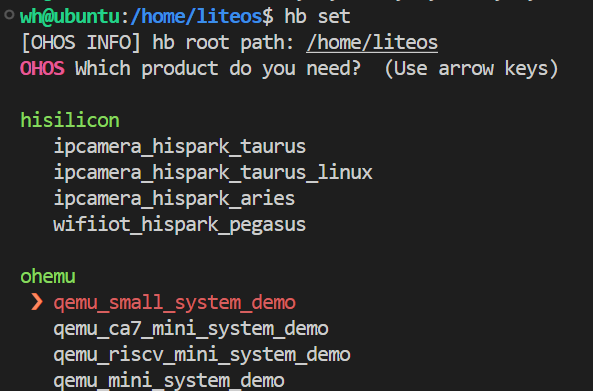

# 0. 前言

出于个人兴趣，也出于对国产操作系统的好奇，想尝试一下以LiteOS为内核的Openharmony。但过程相当不顺利，主要原因是官方文档内容组织的不敢恭维。挺好的东西，不把说明书写好，让用户怎么用？我研究的核心问题就一个：如何在基于Qemu仿真的Openharmony中输出一个hello world。大家可以看看这个官方网站：https://www.openharmony.cn/mainPlay，看看能不能找到教程，能不能找到从安装环境到用Qemu仿真的教程。


你不能让只是好奇的用户直接去买板子吧。可看看官方教程写的，全是各种设备的操作。这是文档组织者的傲慢。如果Openharmony官方文档写得足够好，这篇博客本不该存在。

好，牢骚发完了。说一下这篇博客大致在干什么事。这篇博客基于在VMware上新创建的Ubuntu 20.04.1，搭建Openharmony的运行环境，如何正确编译并进入Qemu的仿真。

<!--more-->

# 1. 安装Ubuntu

版本为20.04.1

## 1.1  更换华为源

这一步本身不是必须，但为了未雨绸缪，还是把ubuntu的源换成huawei源，和他们开发人员保持一致。

```bash
sudo gedit /etc/apt/sources.list
```

替换为以下内容

```bash
# See http://help.ubuntu.com/community/UpgradeNotes for how to upgrade to
# newer versions of the distribution.
deb http://repo.huaweicloud.com/ubuntu/ focal main restricted
# deb-src http://repo.huaweicloud.com/ubuntu/ focal main restricted

## Major bug fix updates produced after the final release of the
## distribution.
deb http://repo.huaweicloud.com/ubuntu/ focal-updates main restricted
# deb-src http://repo.huaweicloud.com/ubuntu/ focal-updates main restricted

## N.B. software from this repository is ENTIRELY UNSUPPORTED by the Ubuntu
## team. Also, please note that software in universe WILL NOT receive any
## review or updates from the Ubuntu security team.
deb http://repo.huaweicloud.com/ubuntu/ focal universe
# deb-src http://repo.huaweicloud.com/ubuntu/ focal universe
deb http://repo.huaweicloud.com/ubuntu/ focal-updates universe
# deb-src http://repo.huaweicloud.com/ubuntu/ focal-updates universe

## N.B. software from this repository is ENTIRELY UNSUPPORTED by the Ubuntu
## team, and may not be under a free licence. Please satisfy yourself as to
## your rights to use the software. Also, please note that software in
## multiverse WILL NOT receive any review or updates from the Ubuntu
## security team.
deb http://repo.huaweicloud.com/ubuntu/ focal multiverse
# deb-src http://repo.huaweicloud.com/ubuntu/ focal multiverse
deb http://repo.huaweicloud.com/ubuntu/ focal-updates multiverse
# deb-src http://repo.huaweicloud.com/ubuntu/ focal-updates multiverse

## N.B. software from this repository may not have been tested as
## extensively as that contained in the main release, although it includes
## newer versions of some applications which may provide useful features.
## Also, please note that software in backports WILL NOT receive any review
## or updates from the Ubuntu security team.
deb http://repo.huaweicloud.com/ubuntu/ focal-backports main restricted universe multiverse
# deb-src http://repo.huaweicloud.com/ubuntu/ focal-backports main restricted universe multiverse

## Uncomment the following two lines to add software from Canonical's
## 'partner' repository.
## This software is not part of Ubuntu, but is offered by Canonical and the
## respective vendors as a service to Ubuntu users.
# deb http://archive.canonical.com/ubuntu focal partner
# deb-src http://archive.canonical.com/ubuntu focal partner

deb http://repo.huaweicloud.com/ubuntu/ focal-security main restricted
# deb-src http://repo.huaweicloud.com/ubuntu/ focal-security main restricted
deb http://repo.huaweicloud.com/ubuntu/ focal-security universe
# deb-src http://repo.huaweicloud.com/ubuntu/ focal-security universe
deb http://repo.huaweicloud.com/ubuntu/ focal-security multiverse
# deb-src http://repo.huaweicloud.com/ubuntu/ focal-security multiverse
```


```bash
sudo apt update
```


## 1.2 安装必要工具

```bash
sudo apt install ssh net-tools tree vim
```


# 2. 下载代码

Openharmony v3.0.6 下载地址： 
https://gitee.com/link?target=https%3A%2F%2Frepo.huaweicloud.com%2Fopenharmony%2Fos%2F3.0.6%2Fcode-v3.0.6-LTS.tar.gz

说明文档：
https://gitee.com/openharmony/docs/blob/master/zh-cn/release-notes/OpenHarmony-v3.0.6-LTS.md

## 2.1 解压与目录设置

```
sudo chmod 777 code-v3.0.6-LTS.tar.gz
tar -xvzf code-v3.0.6-LTS.tar.gz -C /home/liteos/
```


# 3. 配置环境

## 3.1 安装库和工具


```bash
sudo apt update
sudo apt install binutils binutils-dev gcc g++ git git-lfs gnupg flex bison gperf build-essential zip curl zlib1g-dev
sudo apt install libc6-dev-amd64  x11proto-core-dev libx11-dev  ccache libgl1-mesa-dev libxml2-utils xsltproc unzip m4 bc gnutls-bin python3.8 python3-pip python3.8-distutils qemu-system-arm

sudo apt install ruby genext2fs device-tree-compiler make libffi-dev e2fsprogs pkg-config perl openssl libssl-dev libelf-dev libdwarf-dev u-boot-tools mtd-utils cpio doxygen liblz4-tool openjdk-8-jre texinfo dosfstools mtools default-jre default-jdk libncurses5 apt-utils wget scons  tar rsync git-core libxml2-dev lib32z-dev grsync xxd libglib2.0-dev libpixman-1-dev kmod jfsutils reiserfsprogs xfsprogs squashfs-tools pcmciautils quota ppp libtinfo-dev libtinfo5 libncurses5-dev libncursesw5 libstdc++6 gcc-arm-none-eabi vim ssh locales libxinerama-dev libxcursor-dev libxrandr-dev libxi-dev

sudo apt install gcc-arm-linux-gnueabi lib32ncurses5-dev lib32z1-dev

```

注：与官方文档相比，少安装`libc6-dev-i386 ` （在安装gcc-arm-linux-gnueabi时自动安装）。`gcc-multilib`和`g++-multilib`放弃安装，原因在**问题1**中分析。多了qemu-system-arm。


Docker中无法安装libc6-dev-amd64


## 3.2 设置python版本

```bash
# 查看Python 3.8的位置, 我这里是/usr/bin/python3.8
# 因此下面也用这个地址
which python3.8

sudo update-alternatives --install /usr/bin/python python /usr/bin/python3.8 1
sudo update-alternatives --install /usr/bin/python3 python3 /usr/bin/python3.8 1

# 验证
python --version
```


## 3.3 安装编译工具hb

```bash
pip3 install --user build/lite
vim ~/.bashrc 

# .bashrc 中写入 export PATH=~/.local/bin:$PATH

source ~/.bashrc
```


查看 hb 工具

```bash
hb -h
```

打印以下内容

```bash
usage: hb

OHOS build system

positional arguments:
  {build,set,env,clean}
    build               Build source code
    set                 OHOS build settings
    env                 Show OHOS build env
    clean               Clean output

optional arguments:
  -h, --help            show this help message and exit
```


卸载 hb 工具

```bash
pip3 uninstall ohos-build
```


## 3.4 切换dash为bash

```bash
sudo dpkg-reconfigure dash  # 选择 no
```

这一步很重要，否则可能在后续编译中会出现

```
[2158/2644] ACTION //kernel/liteos_a:make(//build/lite/toolchain:linux_x86_64_ohos_clang)
FAILED: obj/kernel/liteos_a/make_build_ext_components.txt 
/usr/bin/python3 ../../../build/lite/build_ext_components.py .........
```


# 4. 编译

## 4.1 hb构建

```bash
# （第一次时）输入文件路径
# 并选择 qemu_small_system_demo 对应 LiteOS-A
hb set
```




```
hb build -f
```


## 4.2 启动qemu

```
./qemu-run -f
```


输出

```
01-01 00:00:10.446 9 43 I 015C0/dsoftbus_standard: [COMM]LoopTask[Loop-default], stop ==1
01-01 00:00:10.446 9 43 I 015C0/dsoftbus_standard: [COMM]LoopTask[Loop-default], running =0
01-01 00:00:10.447 9 16 I 015C0/dsoftbus_standard: [COMM][Loop-default] get running = 0
01-01 00:00:10.447 9 16 I 015C0/dsoftbus_standard: [COMM][Loop-default] destroy
01-01 00:00:10.447 9 16 E 015C0/dsoftbus_standard: [COMM]softbus framework init failed.   # 此时需要按一下回车进入OHOS

OHOS:/$ 
```

**注意**：

1. 输出无更新时，按一下回车，进入OHOS
2. 退出qemu仿真环境，先按`ctrl+a`再按`x`


# 5. 第二种环境配置方案

## 5.1 前置步骤

依次执行：

- 2 下载代码
- 按照3.1中的软件包列表，或者`OpenHarmony/docs/docker/Dockerfile`中的软件包列表进行安装


## 5.2 更改环境变量

```
sudo vim ~/.bashrc
```

添加以下内容

```
export PATH=/home/wh/code/code-v3.0.6-LTS/OpenHarmony/prebuilts/clang/ohos/linux-x86_64/llvm/bin:$PATH
export PATH=~/.local/bin:$PATH
export PATH=/home/wh/code/code-v3.0.6-LTS/OpenHarmony/prebuilts/build-tools/linux-x86/bin:$PATH
export PATH=/home/wh/code/code-v3.0.6-LTS/OpenHarmony/prebuilts/gcc/linux-x86/arm/gcc-linaro-7.5.0-arm-linux-gnueabi/bin:$PATH
export PATH=/home/wh/code/code-v3.0.6-LTS/OpenHarmony/prebuilts/cmake/linux-x86/bin:$PATH
```

```
source  ~/.bashrc
```


没错，这一步的目的主要是使用代码包中已有的各种关键工具。


## 5.3 后续步骤

从 3.2 设置python版本开始，继续执行


# 6. 问题

**问题1：** gcc-multilib和gcc-arm-linux-gnueabi冲突

```bash
wh@ubuntu:/home/liteos$ sudo apt install gcc-arm-linux-gnueabi
Reading package lists... Done
Building dependency tree       
Reading state information... Done
The following packages were automatically installed and are no longer required:
  libc6-dev:i386 libcrypt-dev:i386 linux-libc-dev:i386
Use 'sudo apt autoremove' to remove them.
The following additional packages will be installed:
  binutils-arm-linux-gnueabi cpp-9-arm-linux-gnueabi cpp-arm-linux-gnueabi gcc-10-cross-base gcc-9-arm-linux-gnueabi
  gcc-9-arm-linux-gnueabi-base gcc-9-cross-base libasan5-armel-cross libatomic1-armel-cross libc6-armel-cross libc6-dev-armel-cross
  libgcc-9-dev-armel-cross libgcc-s1-armel-cross libgomp1-armel-cross libstdc++6-armel-cross libubsan1-armel-cross
  linux-libc-dev-armel-cross
Suggested packages:
  binutils-doc gcc-9-locales cpp-doc gcc-9-multilib-arm-linux-gnueabi gcc-9-doc autoconf automake libtool gdb-arm-linux-gnueabi
  gcc-doc
The following packages will be REMOVED:
  gcc-multilib
The following NEW packages will be installed:
  binutils-arm-linux-gnueabi cpp-9-arm-linux-gnueabi cpp-arm-linux-gnueabi gcc-10-cross-base gcc-9-arm-linux-gnueabi
  gcc-9-arm-linux-gnueabi-base gcc-9-cross-base gcc-arm-linux-gnueabi libasan5-armel-cross libatomic1-armel-cross libc6-armel-cross
  libc6-dev-armel-cross libgcc-9-dev-armel-cross libgcc-s1-armel-cross libgomp1-armel-cross libstdc++6-armel-cross
  libubsan1-armel-cross linux-libc-dev-armel-cross
0 upgraded, 18 newly installed, 1 to remove and 0 not upgraded.
Need to get 26.0 MB of archives.
After this operation, 90.9 MB of additional disk space will be used.
Do you want to continue? [Y/n] 
```

方案：考虑到安装gcc-arm-linux-gnueabi后，可以安装gcc-9-multilib-arm-linux-gnueabi，放弃gcc-multilib

```bash
sudo apt install gcc-arm-linux-gnueabi -y
sudo apt install gcc-9-multilib-arm-linux-gnueabi -y
```


# 7. 参考文献 

1. https://gitee.com/openharmony/docs/blob/master/zh-cn/device-dev/quick-start/Readme-CN.md#/openharmony/docs/blob/master/zh-cn/device-dev/quick-start/quickstart-pkg-prepare.md

2. 同时也感谢L同学的大力支持


# 其他
## v3.2 beta1版本

首先需要对`./foundation/arkui/ace_engine_lite/frameworks/BUILD.gn：54`修改

```
  # if (ohos_kernel_type == "liteos_m") {
  #   sources -= [
  #     "$ACE_LITE_PATH/src/core/context/ace_ability.cpp",
  #     "$ACE_LITE_PATH/src/core/modules/dfx_module.cpp",
  #   ]
  # }

  sources -= [
      "$ACE_LITE_PATH/src/core/context/ace_ability.cpp",
      "$ACE_LITE_PATH/src/core/modules/dfx_module.cpp",
    ]
```

即去掉ace_ability.cpp，否则选择qemu_small_system_demo后 hb build时，出错
