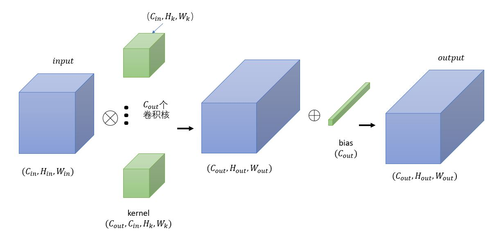
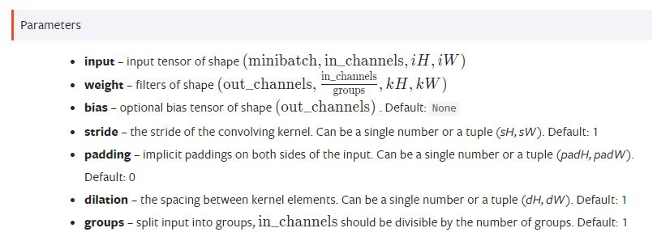
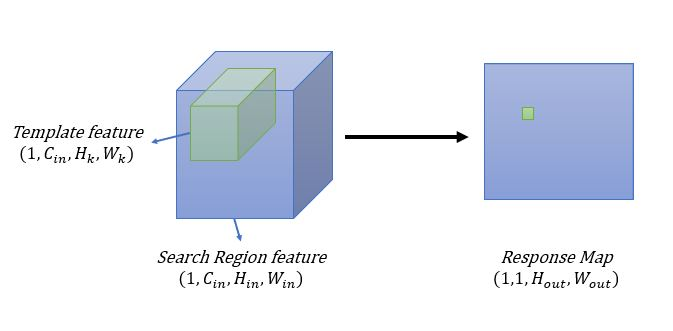
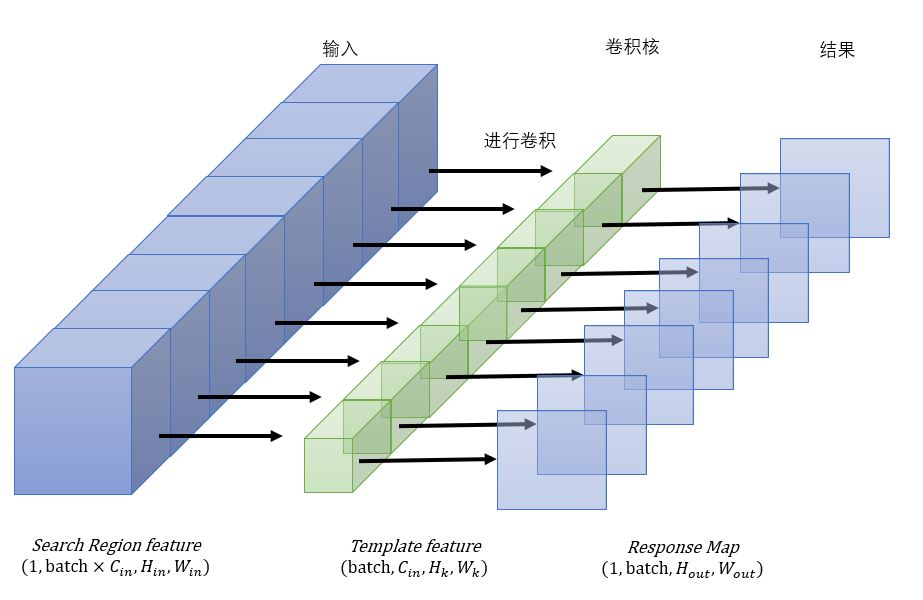

# 前言
是在研究训练过程中遇到的

# F.conv2d与nn.Conv2d
也就是torch.nn.functional.conv2d实际上是torch.nn.Conv2d的另一个用法，**可以直接指定卷积核和偏置的值。** 这在通常情况下是用不到的，因为卷积核的值都是训练得到的。但在一些相关运算（correlation）时，需要指定卷积核的值。首先回顾一下nn.Conv2d

```python
# Conv2d的用法
import torch
x1 = torch.rand([1,256,255,255])
conv = torch.nn.Conv2d(in_channels=256,
                       out_channels=1,
                       kernel_size=3)
out = conv(x1)
```
<!--more-->

计算过程可由下图得到。具体分析，详见上一篇博客[Pytorch中的卷积、空洞卷积和组卷积](https://blog.csdn.net/a171232886/article/details/121467164)
<div align="center"> 
 
</div> 

对于输入$(1,C_{in},H_{in},W_{in})$，输出${C_{out}}$个维度时，所需要的的卷积核维度为$(C_{out}，C_{in},H_{k},W_{k})$。先假设BatchSize大小 $B$ 与这个过程无关，也就是一个Batch中的所有输入$(B,C_{in},H_{in},W_{in})$都被同一组卷积核卷积，因此上图只画出了其中一个输入的卷积过程。

## F.conv2d
先看看官方定义
```torch.nn.functional.conv2d(input, weight, bias=None, stride=1, padding=0, dilation=1, groups=1) → Tensor```
<div align="center"> 
 
</div>

看着和Conv2d一样，但其中的groups在里面是干什么的？不要紧，先看一个最基础的例子，即输入$(1,C_{in},H_{in},W_{in})$，输出通道数$C_{out}=1$。根据上面的分析，可以得到卷积核的维度为$(1,C_{in},H_{k},W_{k})$

```python
import torch
import torch.nn.functional as f

z1 = torch.rand([1,256,127,127]).cuda()  # 卷积核
x1 = torch.rand([1,256,255,255]).cuda()  # 输入

out_1 = f.conv2d(x1, z1)
print(out_1.shape)

# 结果
torch.Size([1, 1, 129, 129])
```
于是我们可以到一个直观的理解：**F.conv2d 中的weight，就是卷积核，其维度是$(C_{out},C_{in},H_{k},W_{k})$**。

上面这句话是全文的核心。改变weight的第一个维度，直接影响输出大小。

上面那个例子也就是目标跟踪中SiamFC在跟踪时的Correlation过程，
<div align="center"> 
 
</div> 

# 标准卷积考虑Batch的影响
上面是假设BatchSize大小$B$与这个过程无关，也就是一个Batch中的所有输入$(B,C_{in},H_{in},W_{in})$都被同一组卷积核卷积。那要不是这样呢，比如**SiamFC的训练过程**。

输入x维度$(B,C_{in},H_{in},W_{in})$，被用作卷积核的z输入维度$(B,C_{in},H_{k},W_{k})$。想要达成的效果是：
`x[0,:,:,:]`和`z[0,:,:,:]`进行卷积，`x[1,:,:,:]`和`z[1,:,:,:]`进行卷积，以此类推。每个卷积的过程就是标准卷积。

**此时需要用到分组卷积和reshape，针对输入**，关于分组卷积详见上一篇博客[Pytorch中的卷积、空洞卷积和组卷积](https://blog.csdn.net/a171232886/article/details/121467164)

```python
batch = 8
z8 = torch.rand([batch,256,127,127]).cuda()
x8 = torch.rand([batch,256,255,255]).cuda()

x8_ = x8.reshape([1,256*batch,255,255])
out_3 = (f.conv2d(x8_, z8, groups=batch))

print(out_3.shape）

# 结果
torch.Size([1, 8, 129, 129])
```

然后进行```out_3.reshape([8, 1, 129, 129])```，即可。

这里你可能会问reshape不影响顺序，进而会导致错误吗？**pytorch中的reshape时是首先填满最内侧维度的，然后才填充外侧维度。这种方式不影响计算结果。**

直观一点的图
<div align="center"> 
 
</div> 

# 深度可分离卷积

Depth-corr，SiamRPN++中的使用方式。先研究简的跟踪过程：
要求输入x的维度$(1,C_{in},H_{in},W_{in})$，z的维度$(1,C_{in},H_{k},W_{k})$，输出维度$(1,C_{in},H_{out},W_{out})$，也就是x的第一个维度和z的第一个维度进行卷积，第二个和第二个，依次类推。。。

有了上面的基础，现在研究起来也变得容易了，还是**用分组卷积和reshape，针对卷积核**

```python
chanel = 256
z1 = torch.rand([1,chanel,127,127])
x1 = torch.rand([1,chanel,255,255])

z1_dw = z1.reshape([chanel,1,127,127])
out_2 = f.conv2d(x1, z1_dw, groups=chanel)

print(out_2.shape)

# 输出
torch.Size([1, 256, 129, 129])
```

# 深度可分离卷积考虑Batch
也就相当于SiamRPN++的训练过程。

输入x维度$(B,C_{in},H_{in},W_{in})$，被用作卷积核的z输入维度$(B,C_{in},H_{k},W_{k})$。想要达成的效果是：
`x[0,:,:,:]`和`z[0,:,:,:]`进行卷积，`x[1,:,:,:]`和`z[1,:,:,:]`进行卷积，以此类推。每个卷积的过程就是深度可分离卷积。

如果前面看懂了，这里应该就能学以致用了。

```python
z8 = torch.rand([batch,channel,127,127])
x8 = torch.rand([batch,channel,255,255])

x8_ = x8.reshape([1,batch*channel,255,255])
z8_dw = z8.reshape([batch*channel,1,127,127])

out_4 = f.conv2d(x8_, z8_dw, groups=channel*batch)
print(out_1.shape)

# 输出
torch.Size([1, 2048, 129, 129])
```

# 参考
1. https://pytorch.org/docs/1.3.1/nn.functional.html?highlight=conv2d#torch.nn.functional.conv2d