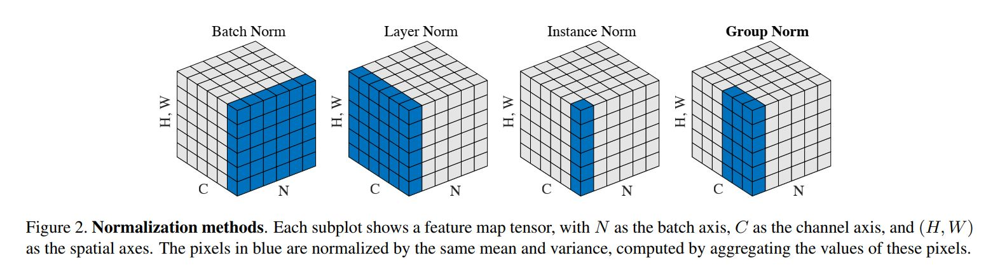
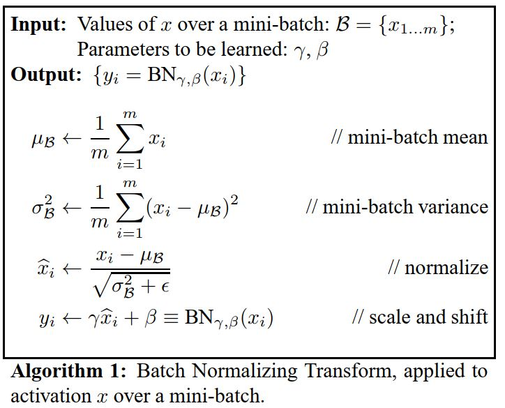
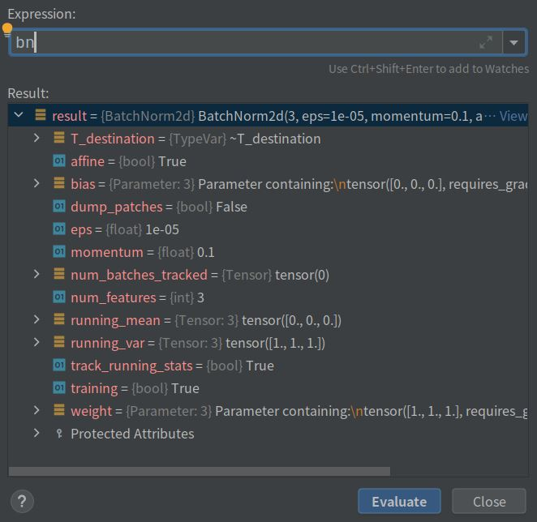
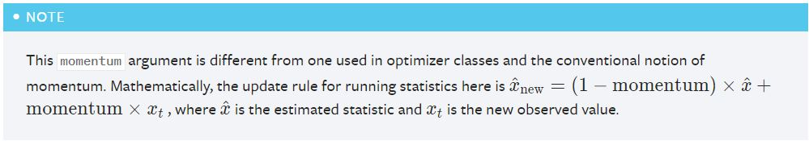

#  前言
首先放一张四种归一化的对比

<div align="center"> 
 
</div> 

<!--more-->

# BatchNorm
最基础的这个。原论文给出的流程：

<div align="center"> 
 
</div> 
就是先对送进来的数据计算均值和方差，然后归一化，最后再拟合一下。
再对应一下pytorch中的公式。没问题，可以完美对应。

$$y=\frac{x-\mathrm{E}[x]}{\sqrt{\operatorname{Var}[x]+\epsilon}} * \gamma+\beta$$

## 先看看Pytorch怎么使用的

```torch.nn.BatchNorm2d(num_features, eps=1e-05, momentum=0.1, affine=True, track_running_stats=True)```

```python
x = torch.randn([1,3,255,255])
bn = torch.nn.BatchNorm2d(3)
# bn.eval()
y = bn(x)

print(bn.running_mean)  # 均值
print(bn.running_var)   # 方差

tensor([-0.0029,  0.0019,  0.0008])
tensor([0.9955, 0.9959, 1.0055])
```
有以下的地方需要注意：

（1）bn.eval()会使bn.training=False,running_mean和running_var不再更新；train()则相反。

（2）bn.running_mean为均值，bn.running_var是方差。

再看看bn都包含什么
<div align="center"> 
 
</div> 
可以发现：

（1）running_mean和running_var是初始值分别是0和1，而维度是输入channel的值。

（2）weight和bias默认为1和0

（3）training=True（你可能会说track_running_stats=True，但我至今没发现这两项的实际作用有啥区别），running_mean和running_var默认随数据更新。

```python
        if self.training and self.track_running_stats:
            # TODO: if statement only here to tell the jit to skip emitting this when it is None
            if self.num_batches_tracked is not None:  # type: ignore[has-type]
                self.num_batches_tracked = self.num_batches_tracked + 1  # type: ignore[has-type]
                if self.momentum is None:  # use cumulative moving average
                    exponential_average_factor = 1.0 / float(self.num_batches_tracked)
                else:  # use exponential moving average
                    exponential_average_factor = self.momentum
```
也就是training 和 track_running_stats同时为True的时候才更新状态。

（4）还有一项难以解释的，momentum默认为0.1

## momentum
这一项看了好半天，去看原论文[Batch Normalization: Accelerating Deep Network Training by Reducing Internal Covariate Shift](https://arxiv.org/abs/1502.03167)，里面没提到（给出的流程在上面。)

而pytorch官方解释也是不太清楚
<div align="center"> 
 
</div> 
明显，momentum用于更新均值和方差。但是这个x的上标是怎么回事？对拟合后的数据进行计算均值和方差？

咱还是想办法试一下吧。用两个输入x1~N(0,1) 和 x2~N(1,4)

```python
# x1~N(0,1)
x1 = torch.randn([1,3,255,255])
bn = torch.nn.BatchNorm2d(3)
y1 = bn(x1)

print(bn.running_mean)
print(bn.running_var)
print('data:',torch.mean(y1),torch.var(y1))

# x2~N(1,4)
x2 = torch.randn([1,3,255,255]) * 2 +1
y2 = bn(x2)

print(bn.running_mean)
print(bn.running_var)
print('data:',torch.mean(y2),torch.var(y2))


tensor([ 0.0001,  0.0001, -0.0006])
tensor([1.0004, 1.0002, 0.9998])
data: tensor(0., grad_fn=<MeanBackward0>) tensor(1.0000, grad_fn=<VarBackward0>)
tensor([0.1006, 0.1004, 0.1006])
tensor([1.2988, 1.3021, 1.2999])
data: tensor(2.9724e-09, grad_fn=<MeanBackward0>) tensor(1.0000, grad_fn=<VarBackward0>)
```
此时没有反向传播，所以weight和bias一直是1和0。首先来看，bn的输出y1,y2~N(0,1)达到了预期效果。在执行y1 = bn(x1)后的running_mean和bn.running_var也很好解释。

问题在于在执行y2 = bn(x2)后，running_mean和bn.running_var分别是0.1和1.3，这是怎么来的？

看Pytorch的解释的意思，难道是计算E((1-m)\*x1+m\*x2)和D((1-m)\*x1+m\*x2)，结果怎么算怎么不对。

**实际上应该是这样**
**running_mean = (1-m)\*E(x1) + m\*E(x2) = (1-0.1)\*0+0.1\*1 = 0.1**
**running_var = (1-m)\*D(x1) + m\*D(x2) = (1-0.1)\*1+0.1\*4 = 1.3**


# 参考文献
1. [Group Normalization](https://arxiv.org/abs/1803.08494)
2. [Batch Normalization: Accelerating Deep Network Training by Reducing Internal Covariate Shift](https://arxiv.org/abs/1502.03167)