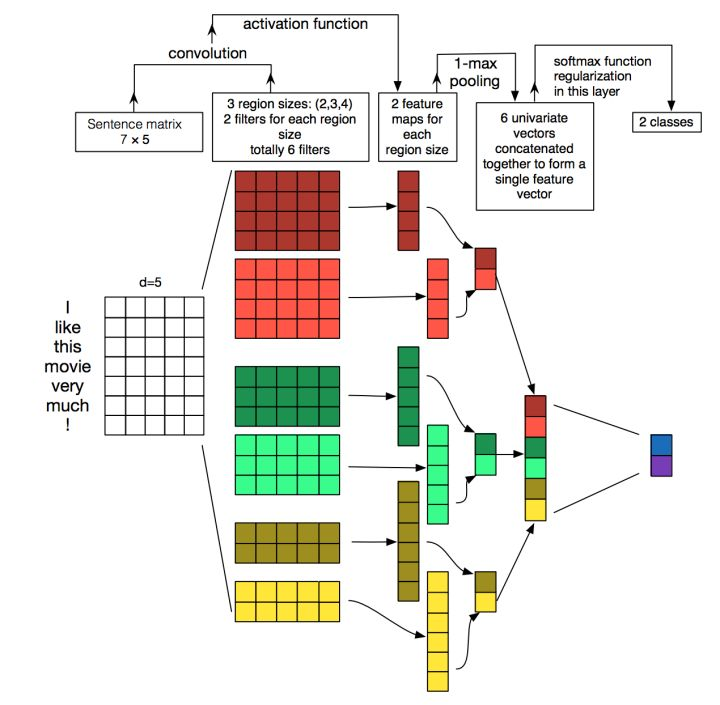
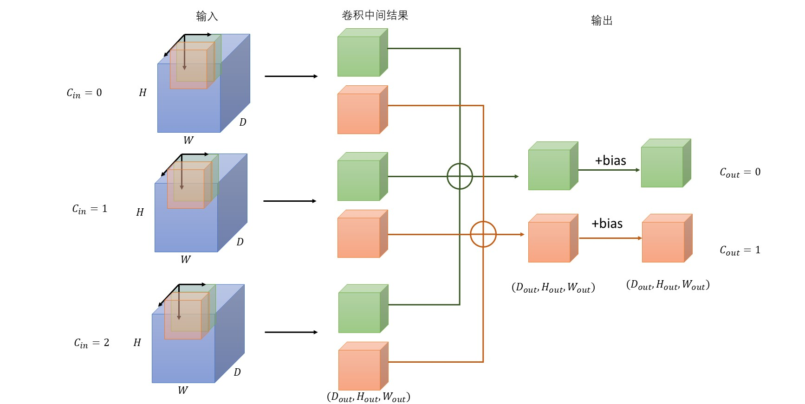

# Conv1d
```torch.nn.Conv1d(in_channels, out_channels, kernel_size, stride=1, padding=0, dilation=1, groups=1, bias=True, padding_mode='zeros')```

和Conv2d处理`[N,C,H,W]`相比，只是处理处理的数据为`[N,C,L]`，其余相同。

<!--more-->

```python
>>> x = torch.ones([1,5,7])
>>> f = torch.nn.Conv1d(in_channels=5,out_channels=2,kernel_size=4)
>>> y = f(x)
>>> print(y.shape)

torch.Size([1, 2, 4])
```

下图的红色部分的计算过程，实际上就是这段代码。
<div align="center"> 
 
</div> 

# Conv3d
```torch.nn.Conv3d(in_channels, out_channels, kernel_size, stride=1, padding=0, dilation=1, groups=1, bias=True, padding_mode='zeros')```

处理数据为`[N,C,D,H,W]`，针对视频数据。对于公式计算，完全可以将D维度等同于H和W处理。

```python
>>> x = torch.ones([1,3,10,255,255])
>>> f = torch.nn.Conv3d(in_channels=3,out_channels=2,kernel_size=(4,3,3))
>>> y = f(x)
>>> print(y.shape)

torch.Size([1, 2, 7, 253, 253])
```

上述代码可以看做有10帧图像，每帧图像3通道，宽高为[255,255]。3d卷积核size在(D,H,W)三个维度上分别为（4,3,3）。输出为2通道的253*253的图像，共8帧。


对于上述代码情况，我将其过程图画在下面。(花了半个晚上才画好)
<div align="center"> 
 
</div> 

注意：
1. 每个卷积核为$(D_k,h_k,W_k)$，所有卷积核（Weight）的维度为$(C_{out},C_{in},D_k,h_k,W_k)$。

2. 输出channel为2，因此有2种颜色的卷积核；输入channel为3，因为每个颜色的卷积核有3个（蓝块内）。

3. 卷积核在输入数据（蓝块）内有三个移动方向，分别为D方向、H方向和W方向。三个方向优先级等同，就像在二维卷积中无所谓先遍历H方向，还是先遍历W方向。
4. 参考二维卷积，应该是卷积核和对应位置的输入数据先相乘再求和得到一个值，然后在三个方向上移动，最终生成中间的“卷积中间结果”。将相同颜色的“卷积中间结果”相加得到最终的输出，即得到对应的输出通道值。
5. bias的维度是$[C_{out}]$，一个输出维度对应一个偏置量。
		


# 参考
1. [Convolutional Neural Networks for Sentence Classification](https://arxiv.org/abs/1408.5882)
2. [Pytorch API](https://pytorch.org/docs/1.4.0/nn.html?highlight=conv3d#torch.nn.Conv3d)
