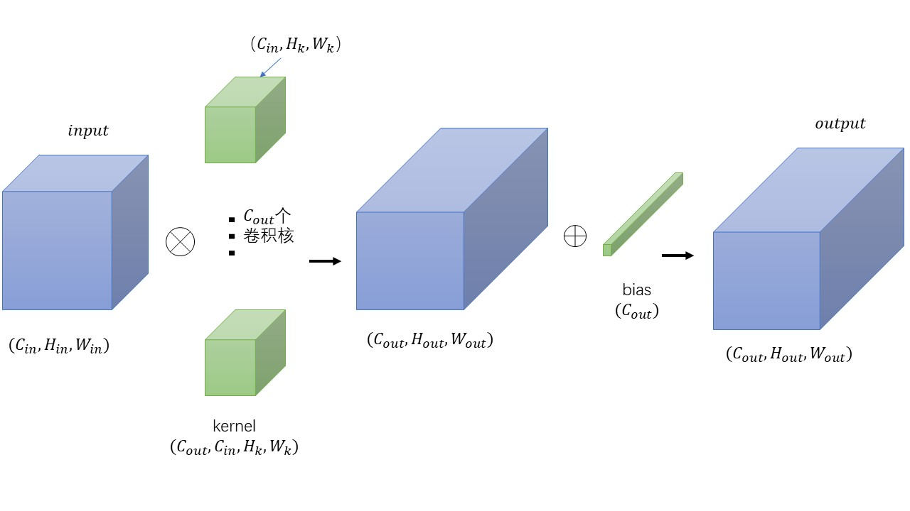
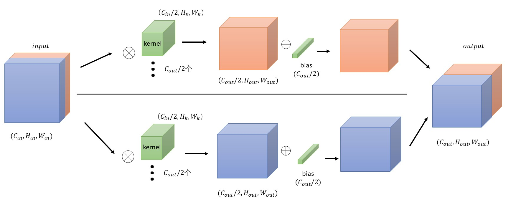

# 标准卷积Conv2d
最基础的卷积。下面图虽然丑了点，但足够说明问题了。
<div align="center"> 
 
</div> 
注：
	（1） kernel的值在初始化中是随机生成的，可以每个值之间都不一样。				   
	（2）每个通道只对应一个bias值。

<!--more-->	

## 具体操作

```torch.nn.Conv2d(in_channels, out_channels, kernel_size, stride=1, padding=0, dilation=1, groups=1, bias=True, padding_mode='zeros')```

```python
x = torch.rand([1,10,7,7])
a = torch.nn.Conv2d(10,20,1)
y = a(x)
```


$$
         Input:(N, C_{in}, H_{in}, W_{in}) \\
        Output:(N, C_{out}, H_{out}, W_{out})
$$

$$  H_{out} = \left\lfloor\frac{H_{in}  + 2 \times \text{padding}[0] - \text{dilation}[0]
                        \times (\text{kernel\_size}[0] - 1) - 1}{\text{stride}[0]} + 1\right\rfloor $$
$$ W_{out} = \left\lfloor\frac{W_{in}  + 2 \times \text{padding}[1] - \text{dilation}[1]
                        \times (\text{kernel\_size}[1] - 1) - 1}{\text{stride}[1]} + 1\right\rfloor$$
注意：
（1）如果把dilation=1带入，就是最基础的公式。
（2）**输出的H和W都会向下取整**

# 空洞卷积
通过torch.nn.Conv2d实现，设置不同的dilation。

作用是（1）用于扩大感受野。（2）不同的空洞率可以生成不同尺度的感受野。也就是可以通过不同空洞率来完成多尺度。这对于语义分割很有帮助。

缺点也很明显，跳过了一些信息。

先来一张示意图（图来自于网络）。
<div align="center"> 
 
</div> 
上图表明：当kernel_size=3时，如果将dilation=2，就可以获得相当于kernel_size=5的感受野效果。dilation=3，相当于kernel_size=7。。。通过上面的公式计算，也可以验证。

关于dilation的值可以这么理解，**（dilation-1）就是两个卷积核的点之间插入的空格数**。
上图中卷积核中两个值的空余部分，可以是0。Pytorch中如何实现有待考证。


# 组卷积
通过torch.nn.Conv2d实现，设置不同的groups。

1.	groups = 1（默认值），就如同普通的卷积

2.	groups = 2 分组卷积 ，相当于有两个卷积层，每一层的输入为原来输入通道数的一半，输出也为原来输出的一半，然后再连接：

	<div align="center"> 
	 
	</div> 
	
	```python
		x = torch.ones([1,10,7,7])
		a1 = torch.nn.Conv2d(10,20,3,groups=2,bias=False)
		# 对权重强行赋值，前半部分全为0，后半部分全为1
		a1.weight.data[0:10,...] = torch.zeros([10,5,3,3])
		a1.weight.data[10:,...] = torch.ones([10,5,3,3])
		# 查看y的值，发现前10个通道的值均为0，后10个通道的值均为45
		y = a1(x)
	```

	当group=3，4，...时，可按相同思路考虑。
	

3.	**深度卷积depthwise，此时group=in_channels**，也就是对每一个输入的通道分别用不同的卷积核卷积。out_channels必须是in_channels的整数倍。

 	$$ k=out\_channels /s in\_channels $$

	可以这样理解：

	假设`torch.nn.Conv2d(in_channels=10,out_channels=20,kernel_size=3,groups=10)`，**input的第0个通道**的值负责生成**output的第0,1通道的值**,input的第1个通道的值负责生成output的第2,3通道的值，以此类推。
	
	类似的，当k = 1时，out_channels = in_channels,每一个卷积核分别和每一个输入的通道进行卷积，最后在concat起来。


# 参考文献
1. https://github.com/vdumoulin/conv_arithmetic/blob/master/README.md
2. https://pytorch.org/docs/1.4.0/