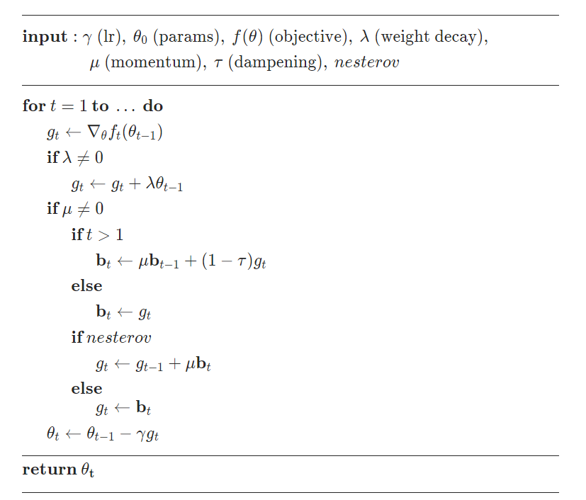
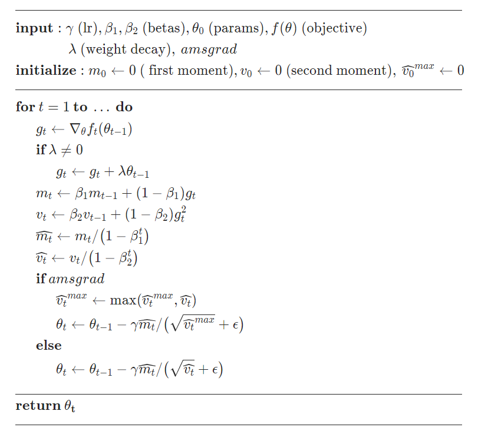
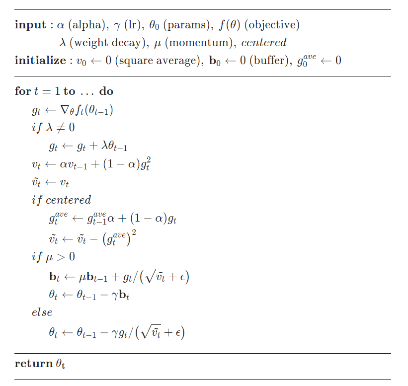

# 前言
我总觉得，书本上说的是一回事，实际是另一回事。应实际看看优化器到底怎么算的，用矩阵运算把结果复现出来。

# SGD
[官方文档](https://pytorch.org/docs/1.10.0/generated/torch.optim.SGD.html#torch.optim.SGD)

随机梯度下降(Stochastic Gradient Descent)，这要强调和GD的区别。书本上的GD是遍历完所有的样本之后进行一次梯度下降，SGD是在得到一个样本后进行一次梯度下降，mini-batch是进行一定数量的样本之后才进行一次梯度下降。而我们实际使用的时候，输入到optimizer的本身就是根据一个batch的样本得到的梯度。**因此，尽管代码中名为“SGD”，实际上执行效果是书本上的mini-batch方案。**

<!--more-->

<div align="center"> 
 
</div> 

说的已经比较明白了，但有三点要注意：

1. $\theta_0$就是初始参数，$g_0$是第一次的梯度值  

2. **nesterov的分支与实际情况不符，实际为$g_t = g_t + \mu b_t$**

3.  当想使用nesterov时，要保证dampening=0且momentum>0，否则出错。
 
    ```python
    if nesterov and (momentum <= 0 or dampening != 0):
        raise ValueError("Nesterov momentum requires a momentum and zero dampening")
    ```

**此外，官方文档明确指出：实现的算法和论文中的有一定出入！** 有兴趣的可以进去看看，就是学习率位置的区别。

# Adam
[官方文档](https://pytorch.org/docs/1.10.0/generated/torch.optim.Adam.html#torch.optim.Adam)
<div align="center"> 
 
</div> 
注意：

amsgrad分支不同，实际情况为

 - $\hat{v}_{t}^{max}=max(\hat{v}_{t}^{max}, v_{t})$
 - $\theta_t=\theta_{t-1}-\gamma m_t /(\sqrt (\hat{v}_{t}^{max}/(1-\beta_2^t))+\epsilon)$

# RMSprop
<div align="center"> 
 
</div> 


# 代码实现
通过改变```use_torch_optim```的值，来确定使用pytorch中的优化器（=1），还是自己写的优化器（=0）。观察两者的输出是否一样即可。

模型很简单，pred=WX，loss=mean(pred-Y)

```python
import torch
import torch.nn as nn
import numpy as np
import os


def seed_torch(seed=0):
    # random.seed(seed)
    os.environ['PYTHONHASHSEED'] = str(seed)
    np.random.seed(seed)
    torch.manual_seed(seed)
    torch.cuda.manual_seed(seed)
    torch.backends.cudnn.benchmark = False
    torch.backends.cudnn.deterministic = True


class Model(nn.Module):
    def __init__(self):
        super(Model, self).__init__()

        self.para = torch.nn.Parameter(torch.ones([3, 1]))

        # 用于存储optim的相关变量
        self.para_pre = self.para

        # SGD相关
        self.gradient_pre = 0
        self.buffer = 0  # buffer, 相当于存速度

        # Adam相关
        self.moment = 0
        self.velocity = 0
        self.velocity_max = torch.zeros([3,1])

        # RMSprop相关
        self.gradient_ave = 0

    def calculate(self, x, y):

        pred = torch.mm(x.to(self.para), self.para)
        loss = torch.mean(pred - y)

        return pred, loss


def pytorch_optimizer(idx, model, x, y, optimizer):

    pred, loss = model.calculate(x, y)
    optimizer.zero_grad()  # 置零导数
    loss.backward()
    optimizer.step()

    return model.para


def matrix_sgd(idx, model, x, y, lr, momentum=0, dampening=0, weight_decay=0, nesterov=False):

    pred, loss = model.calculate(x, y)

    # 得到梯度
    gradient = torch.mean(x, dim=0).reshape([3, 1])

    if weight_decay != 0:
        gradient = gradient + weight_decay * model.para_pre

    if momentum != 0:
        if idx > 0:
            model.buffer = momentum * model.buffer + (1 - dampening) * gradient
        else:
            model.buffer = gradient
            model.gradient_pre = gradient

        if nesterov:
            gradient = gradient + momentum * model.buffer
        else:
            gradient = model.buffer

    # 执行下降
    model.para.data = model.para - lr * gradient  # 若按流程图，应是model.gradient_pre

    # 保存当前梯度
    model.gradient_pre = gradient

    return model.para


def matrix_adam(idx, model, x, y, lr, betas=[0.9, 0.999], eps=1e-8, weight_decay=0.1, amsgrad=False):

    beta1, beta2 = betas

    pred, loss = model.calculate(x, y)
    # 得到梯度
    gradient = torch.mean(x, dim=0).reshape([3, 1])

    if weight_decay != 0:
        gradient = gradient + weight_decay * model.para_pre

    model.moment = beta1 * model.moment + (1-beta1) * gradient
    model.velocity = beta2 * model.velocity + (1 - beta2) * (gradient * gradient.conj())

    moment = model.moment / (1 - (beta1 ** (idx + 1)))
    velocity = model.velocity / (1 - (beta2 ** (idx + 1)))

    if amsgrad:
        model.velocity_max = torch.maximum(model.velocity_max, model.velocity)
        model.para.data = model.para- lr * moment / \
                          (torch.sqrt(model.velocity_max / (1 - (beta2 ** (idx + 1)))) + eps)
    else:
        model.para.data = model.para - lr * moment / (torch.sqrt(velocity) + eps)

    return model.para

def matrix_rmsprop(idx, model, x, y, lr,momentum=0.1, alpha=0.99, eps=1e-8, weight_decay=0.1, centered=False):

    pred, loss = model.calculate(x, y)
    # 得到梯度
    gradient = torch.mean(x, dim=0).reshape([3, 1])

    if weight_decay != 0:
        gradient = gradient + weight_decay * model.para_pre
    
    model.velocity = alpha * model.velocity + (1-alpha) * (gradient * gradient.conj())
    velocity = model.velocity

    if centered:
        model.gradient_ave = alpha * model.gradient_ave + (1-alpha) * gradient
        velocity = velocity - model.gradient_ave * model.gradient_ave.conj()
    
    if momentum > 0:
        model.buffer = momentum * model.buffer + gradient / (velocity.sqrt() + eps)
        model.para.data = model.para - lr * model.buffer
    else:
        model.para.data = model.para - lr * gradient / (velocity.sqrt() + eps)

    return model.para


if __name__ == "__main__":

    seed_torch(123)
    use_torch_optim = 0  # 判断是否采用pytorch的优化器

    x = torch.rand([1000, 3])
    y = torch.rand([1000, 1])

    lr = 0.01
    batchsize = 4

    model = Model()

    # 一定要在开始训练之前定义optimizer，
    # 不要再循环中定义！
    # 否则每次训练optimizer都认为是一个新开始
    # 相当于momentum=0的效果，dampening和nesterov也无效。

    # optimizer = torch.optim.SGD(model.parameters(), lr=lr,
    #                             momentum=0.1,
    #                             dampening=0.1,
    #                             weight_decay=0.1,
    #                             nesterov=True)

    optimizer = torch.optim.Adam(model.parameters(), lr=lr,
                                 betas=[0.9, 0.999],
                                 eps=1e-8,
                                 weight_decay=0.1,
                                 amsgrad=True)

    # optimizer = torch.optim.RMSprop(model.parameters(), lr=lr,
    #                                 momentum=0.1,
    #                                 alpha=0.99,
    #                                 eps=1e-8,
    #                                 weight_decay=0.1,
    #                                 centered=True)

    for idx in range(100):

        if use_torch_optim:
            out = pytorch_optimizer(idx, model, x, y, optimizer)

        else:
            # out = matrix_sgd(idx, model, x, y, lr,
            #                  momentum=0.1,
            #                  dampening=0,
            #                  weight_decay=0.1,
            #                  nesterov=True)

            out = matrix_adam(idx, model, x, y, lr,
                                betas=[0.9, 0.999],
                                eps=1e-8,
                                weight_decay=0.1,
                                amsgrad=True)

            # out = matrix_rmsprop(idx, model, x, y, lr,
            #                     momentum=0.1,
            #                     alpha=0.99,
            #                     eps=1e-8,
            #                     weight_decay=0.1,
            #                     centered=True)

        print(out)

```


# 参考
1. https://pytorch.org/docs/1.10.0/optim.html?highlight=torch%20optim#module-torch.optim