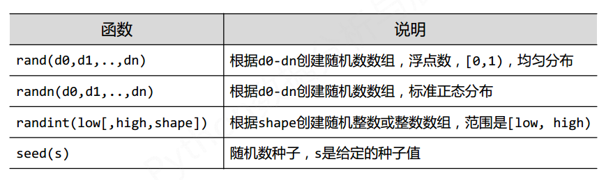
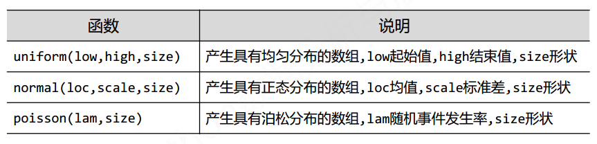
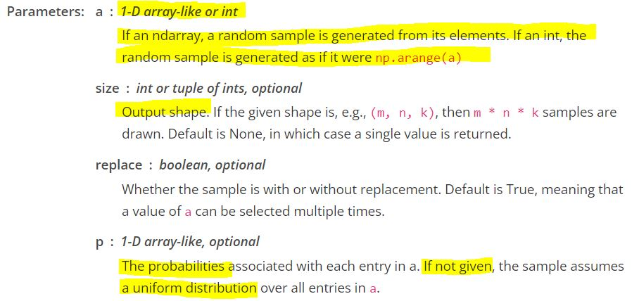

# 前言

作为测试用例，生成随机矩阵或者tensor很重要。可这个操作在numpy和Pytorch中略有区别。故在此处整理出。

<!--more-->

# Numpy
## numpy.random 生成随机数

如```numpy.random.rand(2,3)```
<div align="center"> 
 
</div> 
<div align="center"> 
 
</div> 

### 推荐使用方式

```python
# 带键值对的方式，好记
a = np.random.uniform(low=1,high=2,size=[255,255,3])
a = np.random.normal(loc=1,scale=2,size=[255,255,3])
# 若需要改变类型
a.astype(np.int)
```

## numpy.random.choice 随机挑选
注意，这是对一维数据
```random.choice(a, size=None, replace=True, p=None)```

<div align="center"> 
 
</div> 

```python
>>>np.random.choice(5, 3)
array([0, 3, 4]) 

>>>aa_milne_arr = ['pooh', 'rabbit', 'piglet', 'Christopher']
>>>np.random.choice(aa_milne_arr, 5, p=[0.5, 0.1, 0.1, 0.3])
array(['pooh', 'pooh', 'pooh', 'Christopher', 'piglet'], 
      dtype='<U11')

np.random.choice(5, 3, p=[0.1, 0, 0.3, 0.6, 0])
array([3, 3, 0])
```

## numpy.random.shuffle 打乱顺序
1. 只对最外侧维度进行，内层不变
2. **没有返回值**

```python
>>>a1 = np.arange(9).reshape((3, 3))
>>>a1
array([[0, 1, 2],
       [3, 4, 5],
       [6, 7, 8]])
>>>np.random.shuffle(a1)
>>>a1
array([[3, 4, 5],
       [0, 1, 2],
       [6, 7, 8]])
```


# Pytorch
## 生成随机tensor
1. torch.rand

	在[0,1)上均匀分布，一般这个就够用了。
    
	```torch.rand(*size, out=None, dtype=None, layout=torch.strided, device=None, requires_grad=False) → Tensor```

	```python
	a = torch.rand(size=[3,2])
	```
2. torch.rand_like
	返回和某个tensor一样size的tensor，在[0,1)上均匀分布，并且dtype、device、layout相同。

	```torch.rand_like(input, dtype=None, layout=None, device=None, requires_grad=False) → Tensor```
	```python
	a = torch.tensor([3., 4.])
	b = torch.rand_like(a)
	```
3. torch.randn
	标准正态分布，~N(0,1)

	```torch.randn(*size, out=None, dtype=None, layout=torch.strided, device=None, requires_grad=False) → Tensor```
	```python
	c = torch.randn(size=[3,2])
	```
4. torch.randint
    指定范围的均匀分布，并且是返回整数类型

    ``torch.randint(low=0, high, size, *, generator=None, out=None, dtype=None, layout=torch.strided, device=None, requires_grad=False) → Tensor``
	```python
	c = torch.randint(low=0,high=5,size=[3,2])
	```
5. 类似的
	类似于torch.rand_like，还有torch.randn_like和torch.randint_like
	
# 参考
1. Python数据分析与展示 - 北京理工大学
2. https://numpy.org/doc/stable/reference/index.html
3. https://pytorch.org/docs/1.4.0/

