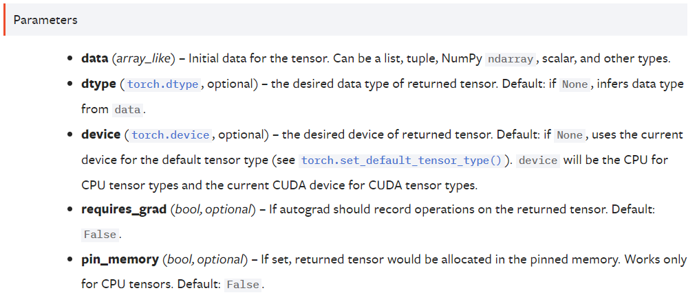
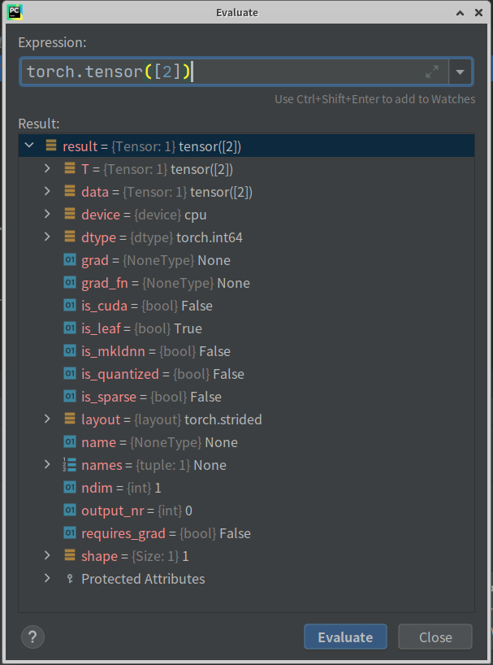
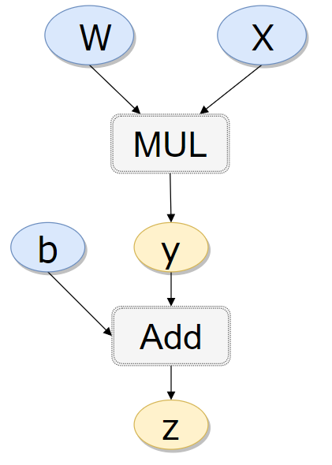

代码写着写着，发现要学习一下基础的知识。这里只举最简单的例子，以便说明各属性的功能。

<!--more-->

# 一、tensor的创建

按[官方的教程](https://pytorch.org/docs/1.4.0/torch.html?highlight=tensor#torch.tensor)

```torch.tensor(data, dtype=None, device=None, requires_grad=False, pin_memory=False) → Tensor ```

<div align="center"> 
 
</div> 
注：

1. data就是数据，若输入1，创建标量，若输入[1], 创建向量

2. dtype：输入数据若是整数，dtype默认为torch.int64;输入小数，dtype默认torch.float（torch.float32和torch.float相同）。可以指定数据类型，按照[torch.dtype](https://pytorch.org/docs/1.4.0/tensor_attributes.html#tensor-attributes-doc)

3. device，默认cpu，可以写‘cpu’，‘cuda’(默认0卡)，‘cuda:0’。按照[torch.device](https://pytorch.org/docs/1.4.0/tensor_attributes.html#tensor-attributes-doc)

4. requires_grad, 这个tensor是否要求梯度，默认False

# 二、tensor的属性
创建完之后，结果调试一看：“嚯，这都什么玩意！”。

其实这里面好多都是 [autograd](https://pytorch.org/docs/1.4.0/autograd.html#tensor-autograd-functions)重的东西，挑几个重要的（用过的）研究了一下。因为涉及一些其他重要概念，所以这一部分会多一些。

<div align="center"> 
 
</div> 

## （一）is_leaf，grad，grad_fn

假设最简单的情况，
$$
y=wx \\
z=y+b
$$

```python
x = torch.tensor([2.,1.])
w = torch.tensor([1.0,1.0], requires_grad=True)
b = torch.tensor(2.0, requires_grad=True)
y = w*x
z = y + b
```

构成一张前项计算图。
<div align="center"> 
 
</div> 

<center>

[图片引用来源](https://github.com/chenyuntc/pytorch-book/blob/master/chapter03-tensor_and_autograd/imgs/com_graph.svg)

</center>


1. 其中w，x，b称为leaf node，所以这几个tensor的**is_leaf=True**,而z称为根节点。

2. z和y因为是在w,b的基础上进行计算，他们的requires_grad自动为True

### 进行反向传播

**backward()只能对标量进行**

```python
z.sum().backward()
```

 1. 我们可以输出那些**is_leaf=True**，**requires_grad=True**的梯度信息,比如w的梯度。
    ```python
    print(w.grad)
    ```
    输出：tensor(2.) ，注意，这是z对x的梯度。

 3. 非leaf node的z和y，**grad_fn**不为None，grad_fn表示求导函数，比如z.grad_fn为<AddBackward0 object at 0x7fb6b8991290>

 4. **如果只运行z.backward()，只能看为leaf node的grad，而不能看非leaf node的grad。grad_fn只有非leaf node的节点才不为None。**

**那如果要是想看z对y求的梯度呢? 可以如下操作**

```python
print(torch.autograd.grad(z,y))
```

## （二）shape和ndim

只有一点需要注意：
若是标量，
shape为torch.Size([])，ndim为0

若是向量（矩阵），shape就是维度比如torch.Size([1, 3, 127, 127])，ndim是维度数，比如4

## （三）Tensor.data, Tensor.detach()和Tensor.detach_()

### 结论

 1. 三者的作用类似，都常用于梯度截断。

 2. 只要不需要对tensor原内容更改，三个都可以。但推荐detach()

 - 下面这种，就不是对原内容更改
    ```python
    y1=y.detach()
    y1=y1+1
    ```
 - 下面这种写法，才会对原内容产生影响
    ```python
    y1=y.detach()
    y1[:]=y1[:]+1
    ```

### 具体来说，三者的区别是

   参考于[pytorch .detach() .detach_() 和 .data用于切断反向传播](https://www.cnblogs.com/wanghui-garcia/p/10677071.html)

 1. detach()
 
 - 返回一个新的Variable，从当前计算图中分离下来的，但是仍指向原变量的存放位置,不同之处只是requires_grad为false，得到的这个Variable永远不需要计算其梯度，不具有grad。
 - 当使用detach()，但是没有对原内容进行更改时，并不会影响backward()
 - 当使用detach()，对原内容进行更改时，backward()则会报错
 
 
  2. detach_()
  
   - 相当于变量之间的关系本来是x -> m -> y,这里的叶子variable是x，但是这个时候对m进行了.detach_()操作,其实就是进行了两个操作：
   - 将m的grad_fn的值设置为None,这样m就不会再与前一个节点x关联，这里的关系就会变成x, m -> y,此时的m就变成了叶子结点
   - 然后会将m的requires_grad设置为False，这样对y进行backward()时就不会求m的梯度

  3. data 
     与detach的不同之处：当使用.data ，对原内容进行更改时，backward()尽管不会报错但输出的数据却是错误的。

### 如何梯度截断

```python
#前期处理过程
x = torch.tensor([2.,1.])
w = torch.tensor([1.0,1.0], requires_grad=True)
b = torch.tensor(2.0, requires_grad=True)
y = w*x
z = y + b

#后期使用过程，只使用到y作为输入，而不再需要对前期处理的梯度
c = y.detach()
d = torch.tensor([1.,2.],requires_grad=True)
c2 = c*d
c2.sum().backward()
print(x.grad)
print(d.grad)
```
输出：
None
tensor([2., 1.])

## （四）layout

Memory layout：中文叫做内存布局，是告诉你这个tensor是怎么在内存中排列的

参考[Pytorch中torch.layout到底是个什么东西](https://blog.csdn.net/Li7819559/article/details/104295023)