# 前言
先来解释一下这个标题
 - 为什么要远程连接

  这里主要是针对实验室的情况。比如实验室有一台服务器，上面有多个账户，每个用户每次使用都要跑到服务器面前，这是很不合适的，也很不方便。更重要的是，即便用户不嫌麻烦每次都跑过去，但是这种使用服务器的方式，每次仅限一人使用，不能多人同时使用。
   
  远程连接，可以解决这个问题。**它不仅可以让你在你自己的座位上使用服务器，更是支持多人同时使用一台服务器。** 目前远程连接的代表性软件，就是Teamviewer。

<!--more-->

 - 为什么使用mstsc

     用Teamviewer连远程连接不好吗？Teamviewer确实好用，但是它现在收费了。**而微软自带的mstsc（远程桌面连接）就是Teamviewer优秀的替代品之一。** mstsc不仅在win10上有，在win7上也有，它的使用很简单：给出目标的IP地址，输入自己设置的登录名和密码，即可使用。
 

 - 为什么使用Zerotier One
 
    如果说这个实验室的所有用户（包括服务器），都连接在同一个路由器上，那么所有用户将会组成一个局域网（内网）。这种情况下，用户使用路由器分配给服务器的内网的IP，就可以使用mstsc。此时不仅不用网费，速度既快还稳定。

    但是，用户要是不在实验室呢，比方说在宿舍，他就连不了实验室的路由器，进不了实验室内网。这种情况下，就需要组建一个虚拟专用网络（VPN），**而zerotier one就是组建这个“虚拟内网”的**。我相信说到这，大学上过计算机网络的同学，应该能理解了。不妨说得再细一点，Zerotier one可将一些在不同地方的零散的用户节点，通过一些技术，组建成一个“虚拟内网”，达到“这些用户都连在同一个路由器”的效果。
    
     不过值得一提的是，这种“虚拟内网”的连接速度不如真正内网，还会产生网络通信费用。

     回到问题，为什么使用Zerotier One。**因为Zerotier One现在还是免费的。** 你可以在上面自己创建一个账户，然后自己创建一个Network。只要其他用户进了这个Network，就相当于进了“虚拟内网”。一个Network，最多可免费支持100个设备连入。

 - 最后一个问题，为什么是Ubuntu和win10
    
   win10操作系统用着多熟练？服务器上为什么不装win10？我也想啊，但是事实不允许。
   
   我们忽略底层自由度的问题，说点更实际的。实验室的服务器是用于跑代码的，Github上开源的论文代码基本上都是针对Ubuntu系统下的。即使你都用Pycharm和Anaconda，代码在Ubuntu和win10下的环境配置还是略有不同的。如果服务器只是运行现成封装好的程序，兴许可以装win10。
   
   更为重要的是，**Ubuntu系统支持多用户同时访问，win10似乎不能支持。** 至少我目前尝试的是这样。

下文，我就是小王同学，描述一下如何从装Ubuntu系统到使用mstsc。

# Ubuntu 18.04 的安装
 链接1：[官方教程](https://ubuntu.com/tutorials/install-ubuntu-desktop#1-overview)
 链接2：[参考过的教程](https://www.cnblogs.com/masbay/p/11627727.html)

Ubuntu最新版安装文件[官方下载地址](https://ubuntu.com/download/desktop)（写这篇文章时最新的是20.04.1）。按照我以往的习惯，不会安装最新版本的，理由是在使用最新版本时遇到问题，网上可能还没有经验分享。Ubuntu 18.04.4安装文件[官方下载地址](https://ubuntu.com/download/alternative-downloads)，注意网页要下拉才能看见
<div align="center"> 
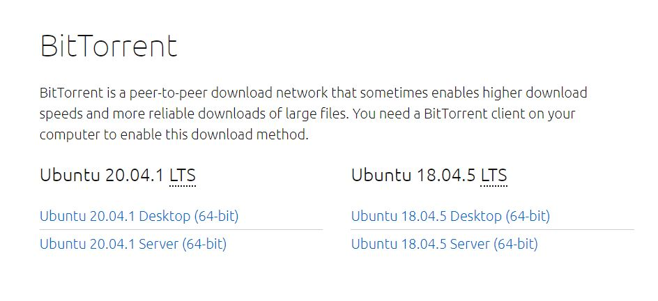 
</div> 


使用U盘安装Ubuntu的大致的步骤是

 1. 下载Ubuntu安装iso文件
 2. 制作U盘启动器:

 - （1）[官方教程](https://ubuntu.com/tutorials/create-a-usb-stick-on-windows#1-overview)
 - （2）需要下载一个[Rufus](https://rufus.ie/)作为在WIndows系统下的U盘启动器制作软件，使用方式根据教程即可
 
3. （若是想装双系统的话）将目标电脑的磁盘，空出一部分空间（比如70G）。这一步可以先新建出一块70G的分区，然后删除分区。这部分空间将用于安装Ubuntu系统
4. 设置BIOS启动项优先级
5. 安装Ubuntu

如果连win10都没有，可以先装个win10，[教程](https://mp.weixin.qq.com/s/jzM3s_TGpOUjcolSmUPgWA)

# Ubuntu上mstsc安装相关
这部分主要参考（搬运）SauryGo的[教程](https://blog.csdn.net/sean2100/article/details/80998437)，感谢大佬！另外小王同学也融合了一点自己的经验。打开终端：

 1. 安装xfce4（或xubuntu）
```bash
sudo apt-get install xfce4
```
或者
```bash
sudo apt-get install xubuntu-desktop
```
 2. 安装xrdp和协议，依次执行
```bash
sudo apt-get install xrdp 
sudo apt-get install vnc4server tightvncserver
```
 3. 启动xrdp
```bash
sudo /etc/init.d/xrdp restart
```
 4. 配置文件
```bash
echo xfce4-session >~/.xsession
```

小王同学**并没有执行下面这句**，发现也可以。反倒是执行之后就蓝屏了，需要重启。

```bash
sudo service xrdp restart
```

有时候重启也不行，这里放一个使用xrdp连接ubuntu然后蓝屏或者闪退的[解决方案](https://blog.csdn.net/cxn304/article/details/99733711)，同时也感谢cxn304大佬！这里我直接搬运过来，依次执行这几条命令：
```bash
wget http://www.c-nergy.be/downloads/install-xrdp-3.0.zip
unzip install-xrdp-3.0.zip
sudo chmod 777 Install-xrdp-3.0.sh
./Install-xrdp-3.0.sh
sudo shutdown -r now
```
如果第四条命令Install执行失败或者报错，很有可能是因为你系统默认的是中文。假设你的用户名是ubuntu，Install安装路径是/home/ubuntu/Downloads，而你的ubuntu下面有文件夹“下载”，却没有“Downloads”。此时只需在/home/ubuntu/下面，创建一个文件夹“Downloads”，再执行第四条命令。


# Ubuntu添加用户
对于服务器而言，需要分配多账户，同时供多人使用。打开终端：

 1. 添加用户的登录名（如：dogdog）
```bash
sudo adduser dogdog
```

- 然后终端输出：
```bash
输入新的 UNIX 口令：  #设置dogdog的登录密码
```
```bash
重新输入新的 UNIX 口令：  #再次输入确认密码
```

- 接着输入一些无关紧要的信息，如无误，输入Y并回车：
<div align="center"> 
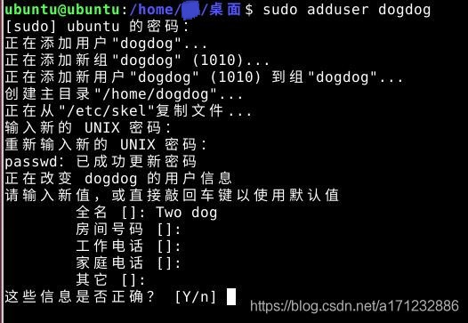 
</div> 

2. 设置新用户的sudo权限。打开终端：
```bash
sudo gedit /etc/sudoers
```
- 添加‘’dogdog ALL=(ALL:ALL) ALL‘’，保存退出
<div align="center"> 
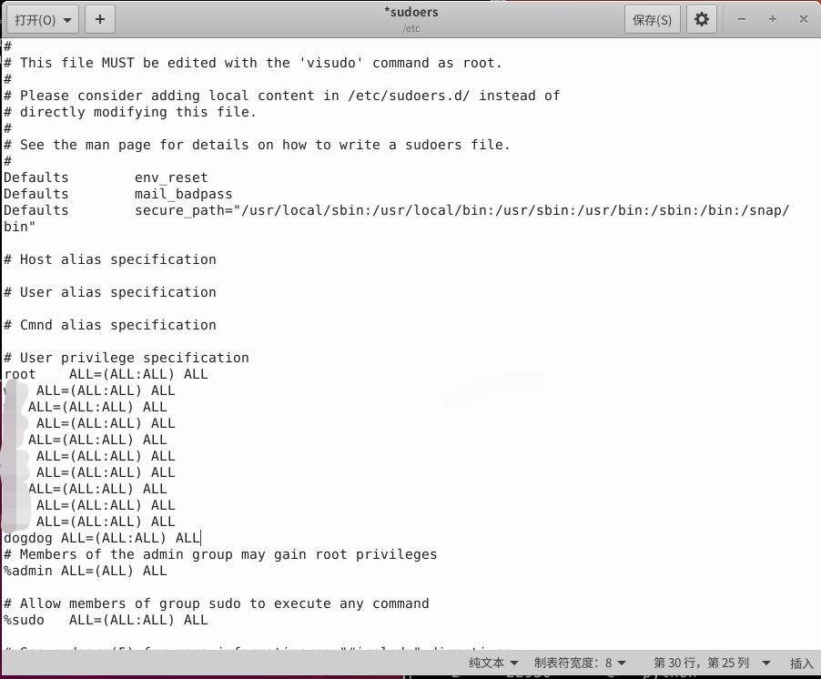 
</div> 

3. 配置文件
- 切换用户
```bash
su dogdog
```
- 输入密码后，然后执行
```bash
echo xfce4-session >~/.xsession
```

# Zerotier One的注册与使用
实际上对于办公室内的局域网而言，上述步骤已经足够了。但对于想远程办公的人来说，需要使用Zerotier One。这是一个内网穿透平台，可以这样理解：只要加入一个Network，就相当于进入了这个Network内部的局域网。

**重要的是，Zerotier One目前还是免费的！**[Zerotier One官网链接](https://www.zerotier.com/)

可以参考这个[教程](https://www.jianshu.com/p/9f7691cb32d3)

## 1. 注册Zerotier One账户，并创建网络
  - 按照提示即可
- 这里要提醒一下，你登录进去后，Networks才是你创建的“局域网”。（第一次给妹子表演如何用Zerotier One时，小王同学表演崩了就是因为没找到这个“局域网”）
<div align="center"> 
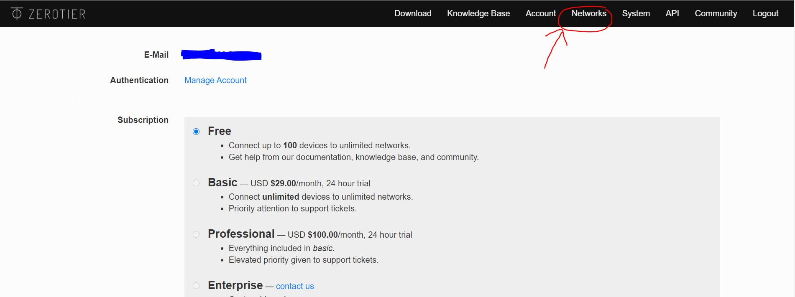 
</div> 


## 2. 安装在Ubuntu上
- [官方教程](https://www.zerotier.com/download/)，其实就一条命令：
```bash
curl -s https://install.zerotier.com | sudo bash
```
 -  如果Ubuntu告诉你没有curl，先安装：
```bash
sudo apt-get install curl
```
- 让Ubuntu加入你的Network
```bash
sudo zerotier-cli join 你的network ID
```
- Ubuntu即使有多个用户，加入一次Network即可对所有用户生效
- Ubuntu加入后，登录Zerotier One中进入到你的Network
<div align="center"> 
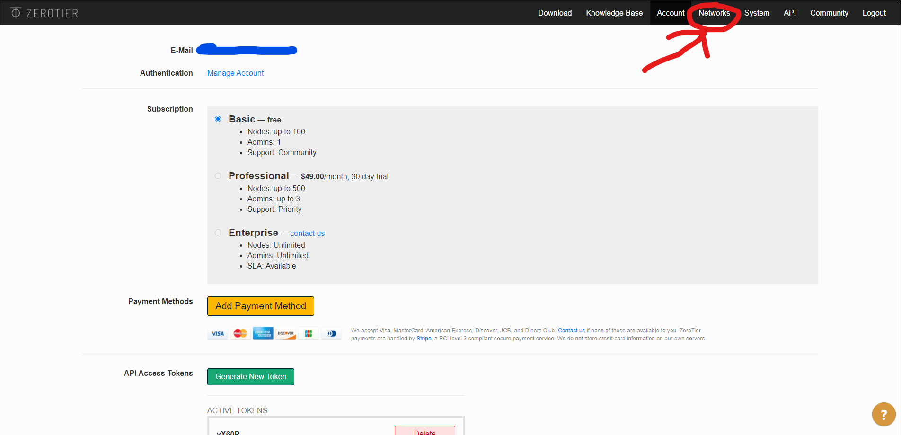 
</div> 
<div align="center"> 
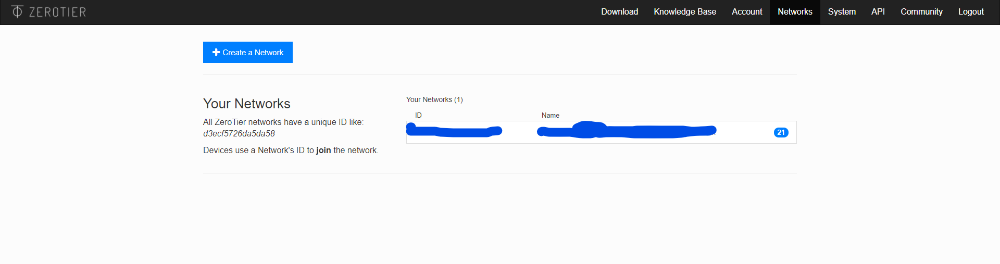 
</div> 

 


- 找到新加入的设备，在前面打钩（表示授权），并可以修改备注。	小王同学建议先改备注，后打√。Managed IPs一栏就是该设备在这个“局域网”的IP地址。“局域网”内部的设备可通过这个IP相互访问。
<div align="center"> 
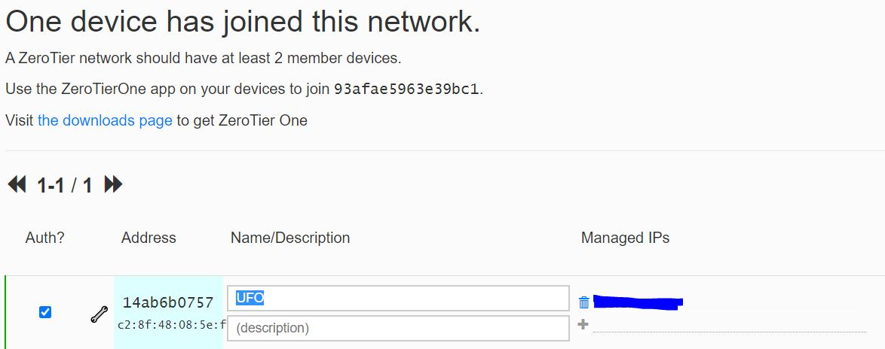 
</div> 

## 3. 安装在Win10上
- 安装文件下载：[官网连接](https://zerotier.com/download/)
<div align="center"> 
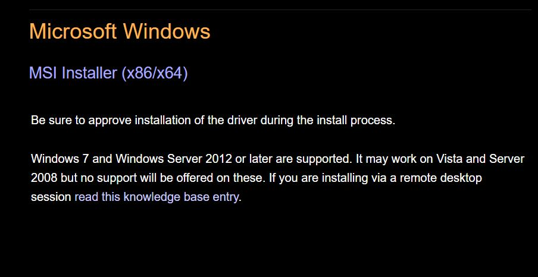 
</div> 


- 安装好之后运行，在任务栏图标右键，选 join networks
<div align="center"> 
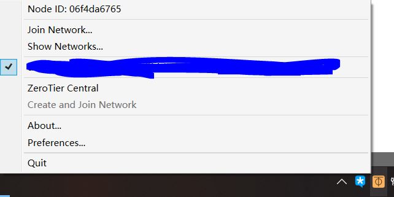 
</div> 
- 输入你的network ID，然后join。你的win10申请加入后，在Zerotier One中进入到你的Network，找到新加入的设备，在前面打钩（表示授权）同意申请。（同上述Ubuntu对应步骤）
- 之后win10应该会弹出下图“网络”，点是。然后在你在网络名称之前出现对勾，就是上图蓝色马赛克之前的那个√。

<div align="center">
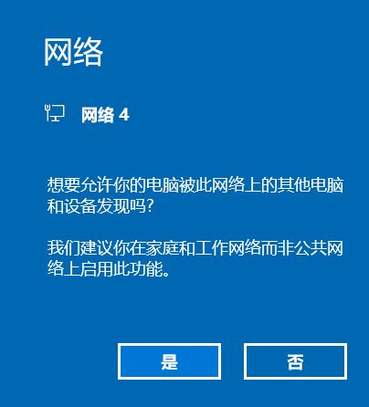
</div>

# mstsc的使用

1. 打开“运行”，输入“mstsc”，回车。

<div align="center">
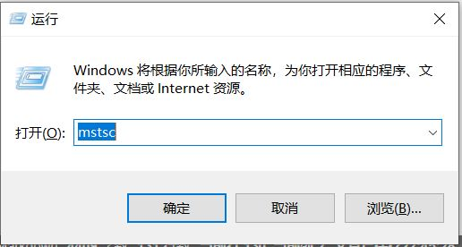
</div>

<div align="center">
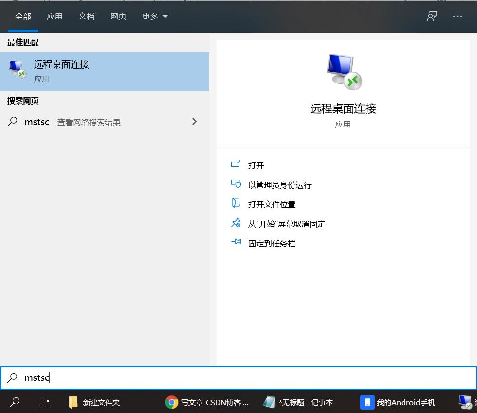
</div>


2. 出现对话框，输入“局域网”内的IP地址，回车

<div align="center">
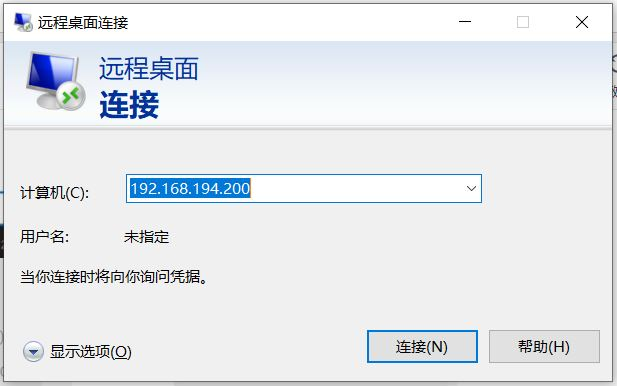
</div>

- 这里的IP地址可以是办公室局域网内部的ip，也可以是通过Zerotier One搭建的虚拟局域网IP，查询虚拟局域网IP详见上文“Zerotier One的注册与使用 / Ubuntu的安装”最后一步

3. 输入登录名和密码

<div align="center">
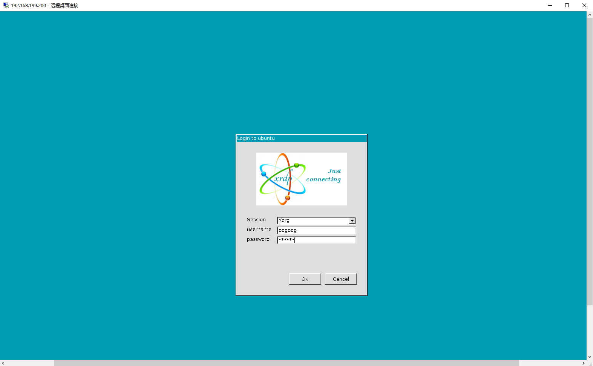
</div>

4. 点OK，连接上，开始办公!

# 总结与致谢
- 与其说这是个教程，不如说这是给自己写的总结笔记。
- 感谢李师兄前期艰苦探索，前人栽树，后人乘凉。
- 感谢实验室同学对小王同学的忍耐。毕竟在初期尝试阶段，服务器被我反复蹂躏，光系统就重装了两次。
- 这是小王第一次写CSDN，对上述流程也是囫囵吞枣。说起来，在探索的时候也闹了不少笑话，甚至经常丢人。但是如有错误，小王同学恳请大家指正！