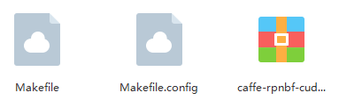
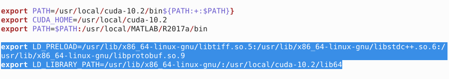
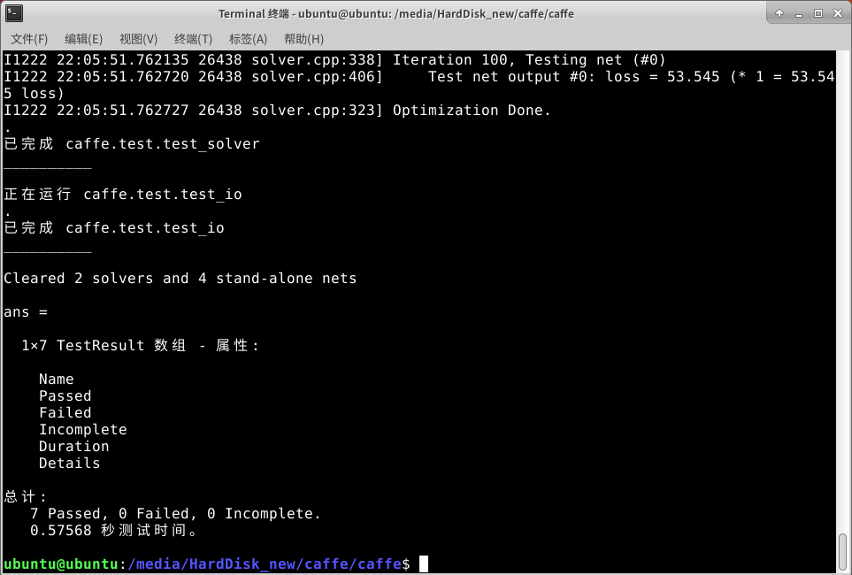
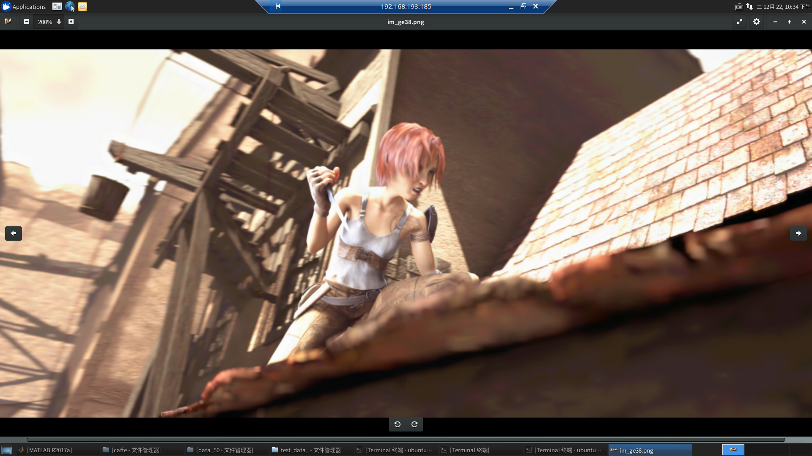
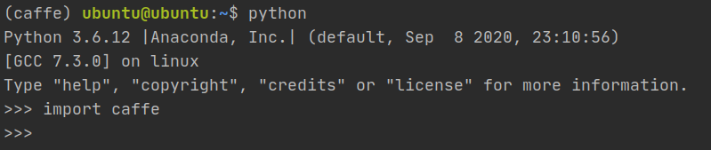

# 前言
之前为了重装系统，不得不先保证自己可以会配Caffe的GPU版本的MATLAB接口，才敢大胆地删掉师姐辛辛苦苦配成的代码环境。毕竟一重装系统，那些代码环境都烟消云散了。我是在Ubuntu18.04上完成的这件事：Caffe的GPU版本（安装了CUDA但没有安装CUDNN，结果上并不影响代码使用显卡资源）配置MatlabR2017a的接口。

<!--more-->

在网上找啊找，有很多讲如何配置Caffe的Python接口的，就是没有一篇详细地从头到尾讲如何配置Caffe的Matlab接口的。以摸索整整四天时间的代价，换来现在这一个经验教程。**为了让看到这篇文章的人省事，我把Caffe配置文件中该填的坑都填了，只需要把几行命令复制粘贴执行即可。如果顺利的话，十分钟就能装完。**

我从给机器安装Ubuntu开始写，为了阅读体验，分成了几个博客。这是最后一个，也是最关键的一个。因为这个接口非常容易出错，之前尝试了很多次，查了很多经验贴，这里直接上最终版方案。

**在看这篇博客之前，你需要已经装好了Ubuntu18.04，CUDA，MatlabR2017a，OpenCV3.4.2，版本不一定严格对应。** 没有的可以看看这两篇
[Ubuntu18.04安装和CUDA安装](https://blog.csdn.net/a171232886/article/details/112069313)
[Ubuntu18.04安装MatlabR2017a和OpenCV3.4.2](https://blog.csdn.net/a171232886/article/details/112075763)

没错，这两篇都是为了现在这篇的准备工作。“Ubuntu18.04安装MatlabR2017a和OpenCV3.4.2”，看看这前言不搭后语的题目，其实可以一共写5篇的，但为了简洁，就这样吧。

# 安装Caffe
## 安装Caffe相关文件
[官方教程地址](http://caffe.berkeleyvision.org/install_apt.html)，写的太简略，难以看懂

1.安装相关的软件和依赖
```bash
sudo apt install caffe-cuda
sudo apt-get install libprotobuf-dev libleveldb-dev libsnappy-dev libopencv-dev libhdf5-serial-dev protobuf-compiler libopenblas-dev liblapack-dev libatlas-base-dev libgflags-dev libgoogle-glog-dev liblmdb-dev
sudo apt-get install --no-install-recommends libboost-all-dev
sudo apt-get install cmake-qt-gui
```
2.下载Caffe源代码

[官方Github地址](https://github.com/BVLC/caffe/)，亲测可完成sudo make runtest，但无法完成sudo make mattest，会出错误，如[ubuntu16.04 matlab2017b 编译caffe的matlab接口 吐血经历](https://blog.csdn.net/sethinking/article/details/90441407)。同时感谢这位大佬提供的解决方案，本文正是按照此种方案完成的。

[**正确Caffe代码地址**](https://github.com/gy1874/caffe-rpnbf-cudnn5)，如果下的慢可以使用[百度网盘链接](https://pan.baidu.com/s/1Uhf1pUBnAsyDsGWwW3GM4Q )提取码：bmq9

我的百度网盘分享中包含三个文件，压缩包是那个正确Caffe代码（Github下载），剩下的两个是我配置好的文件，可以直接用的那种。
<div align="center"> 
 
</div> 

 - 把压缩包解压，对应的文件夹名caffe-rpnbf-cudnn5-master改为caffe（不改也行，只是为了方便）
 - 把Makefile和Makefile.config替换掉caffe文件夹下的同名文件
 

3.网盘中Makefile.config文件相对于Makefile.config.example的修改

 - Cuda路径
Makefile.config第30行
```bash
CUDA_DIR := /usr/local/cuda-10.2
```

 - Matlab路径
 Makefile.config第68行
 ```bash
 MATLAB_DIR := /usr/local/MATLAB/R2017a
```
如果是CUDA和MATLAB安装时选择默认路径的话，以上两项不必再改。对于不求甚解的同学，只关注上两个地方即可，==**下面可跳过**==。以下为网盘中Makefile.config文件相对于Makefile.config.example的其他修改处。
 - CUDA_ARCH
  Makefile.config第39行开始，相较于原来,将前两项注释掉，修改为:
 ```bash
  CUDA_ARCH := #-gencode arch=compute_20,code=sm_20 \
		#-gencode arch=compute_20,code=sm_21 \
		-gencode arch=compute_30,code=sm_30 \
		-gencode arch=compute_35,code=sm_35 \
		-gencode arch=compute_50,code=sm_50 \
		-gencode arch=compute_52,code=sm_52 \
		-gencode arch=compute_60,code=sm_60 \
		-gencode arch=compute_61,code=sm_61 \
		-gencode arch=compute_61,code=compute_61
```
 - 依赖项
 Makefile.config第98行，修改如下
  ```bash
  INCLUDE_DIRS := $(PYTHON_INCLUDE) /usr/local/include /usr/include/hdf5/serial/
  LIBRARY_DIRS := $(PYTHON_LIB) /usr/lib/x86_64-linux-gnu/hdf5/serial \
              /usr/local/lib /usr/lib
  ```

 - OpenCV
 Makefile.config第23行，去掉注释，修改如下
  ```bash
  OPENCV_VERSION := 3
  ```

4.网盘中Makefile文件相对于Makefile原文件的修改 ==**（可跳过）**== 
参考[recipe for target '.build_release/lib/libcaffe.so.1.0.0' failed](https://blog.csdn.net/qq_33144323/article/details/81741671)
Makefile第181行，修改为
  ```bash
  LIBRARIES += glog gflags protobuf boost_system boost_filesystem m hdf5_serial_hl hdf5_serial
  ```

## 修改环境变量和相关依赖项

1. 修改环境变量

 - 打开环境变量
  ```bash
  sudo gedit ~/.bashrc
  ```
 - 在.bashrc最后添加
  ```bash
  export LD_PRELOAD=/usr/lib/x86_64-linux-gnu/libtiff.so.5:/usr/lib/x86_64-linux-gnu/libstdc++.so.6:/usr/lib/x86_64-linux-gnu/libprotobuf.so.9
  export LD_LIBRARY_PATH=/usr/lib/x86_64-linux-gnu/:/usr/local/cuda-10.2/lib64
  ```
  <div align="center"> 
   
  </div> 

 - 使修改的环境变量生效
  ```bash
  source ~/.bashrc
  ```

2. 修改Matlab中的文件
参考[Doesn't Matlab work on ubuntu 16.04?
](https://askubuntu.com/questions/758892/doesnt-matlab-work-on-ubuntu-16-04)
将/usr/local/MATLAB/R2017a/sys/os/glnxa64/中的libstdc++.so.6重命名为libstdc++.so.6.old，使其失效。

## 配置Caffe的MATLAB接口

依次运行以下命令。-j32是指32核cpu同时运行，这样会快很多。（建议先查一下机器是多少核cpu，我这里是32核。）
  ```bash
sudo make all matcaffe -j32
sudo make mattest  -j32
```

也可直接运行以下命令，会自动执行第一个命令
  ```bash
sudo make mattest  -j32
```
==**若看见下图，恭喜！编译成功！**==
<div align="center"> 
 
</div> 

# 在MatlabR2017a中使用Caffe

```bash
CAFFEPATH = '/media/HardDisk_C/caffe/';   % Caffe文件夹所在路径
                        
USE_GPU = true;         % set to false, if no GPU available -> slowest
GPU_ID = 0;             % 使用第0块显卡
addpath([CAFFEPATH '/matlab'])

if USE_GPU
  caffe.set_mode_gpu();
  caffe.set_device(GPU_ID);
else
  caffe.set_mode_cpu();
end
```
**此时，需保证第0块显卡有足够的显存空间，否则Matlab会闪退！**

下图是我从代码运行结果中挑出的一张比较喜欢的图片
<div align="center"> 
 
</div> 
大功告成！

# 值得参考的经验资料

1.[ubuntu16.04 matlab2017b 编译caffe的matlab接口 吐血经历 解决几乎所有make mattest问题](https://blog.csdn.net/sethinking/article/details/90441407)

2.[ubuntu18.04系统安装caffe过程](https://www.cnblogs.com/yangyuqing/p/12932434.html)

3.[caffe常错问题及解决方案](https://blog.csdn.net/qq_36429298/article/details/68314590)

4.[Ubuntu18.04LTS下基于 Anaconda3 安装和编译 Caffe-GPU](https://blog.csdn.net/CAU_Ayao/article/details/83536320#1__18)

5.[糟心的caffe+ matlab编译路程](https://www.cnblogs.com/captain-dl/p/11012710.html)


# 附：Caffe的Python接口
1.用conda安装不香吗？
  ```bash
conda install caffe-gpu
```
只要有Anaconda，运行这条命令即可，不必在装cuda，下caffe，改环境变量，conda包办一切。

2.使用import caffe
<div align="center"> 
 
</div> 

# 结语
鉴于小王同学在研究Caffe的MATLAB接口时，没有一篇博客的方法从头到尾对他所在的情况都是正确的。小王在一些问题的解决方案上，甚至搞出了排列组合，所以他纯粹是试出来的。鉴于这种情况，小王想起了一句话：万物皆虚,万事皆允。

