# 安装MatlabR2017a
## 文件下载
明显只能[百度网盘](https://pan.baidu.com/s/1KKcxNSArKZXYtA50kI6cIg)，提取码：hj0x
我把文件保存到了/media/HardDisk/公共安装包/MATLAB_R2017a_install/文件夹下

<!--more-->

## 挂载镜像
- 为了避免麻烦，先修改一下读写权限
```bash
sudo chmod -R 777 /media/HardDisk/公共安装包/MATLAB_R2017a_install/
```

- 创建一个文件夹，用于挂载镜像

```bash
sudo mkdir /media/HardDisk/公共安装包/MATLAB_R2017a_install/matlab/ 
```
- 挂载镜像，格式为  sudo mount -o loop iso文件 用于挂载的文件夹

```bash
sudo mount -o loop '/media/HardDisk/公共安装包/MATLAB_R2017a_install/matlab/R2017a_glnxa64_dvd1.iso' '/media/HardDisk/公共安装包/MATLAB_R2017a_install/matlab/matlab'
```
## 开始安装
启动安装

```bash
cd 
sudo /media/HardDisk/公共安装包/MATLAB_R2017a_install/matlab/install
```
1. 使用文件安装密钥，下一步
<div align="center"> 
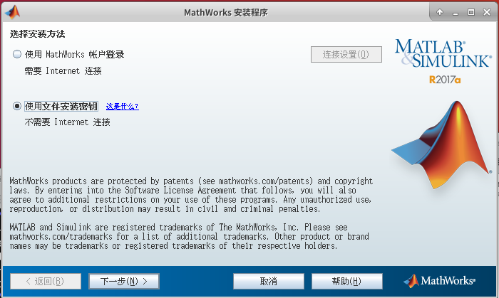 
</div> 
2. 是，下一步
<div align="center"> 
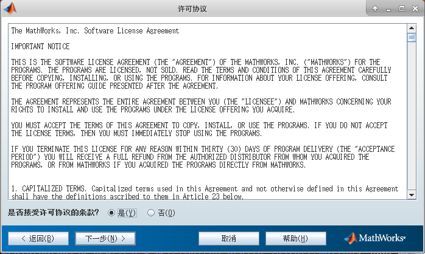 
</div> 
3. 输入密钥09806-07443-53955-64350-21751-41297，下一步
<div align="center"> 
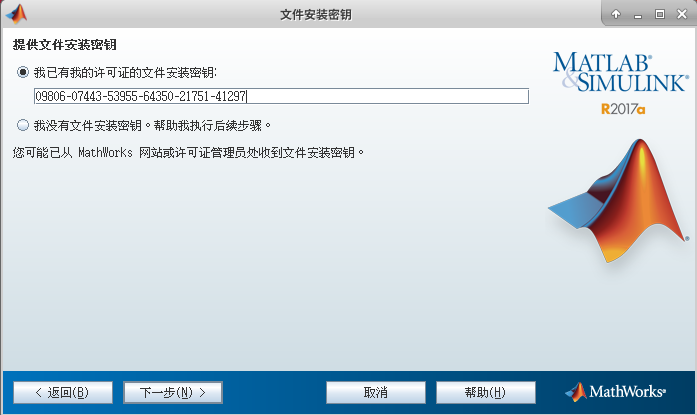 
</div> 
4. 默认路径即可，下一步
<div align="center"> 
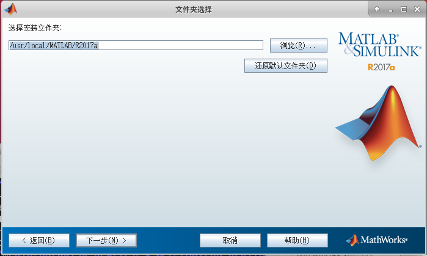 
</div> 
5. 默认全选，下一步
<div align="center"> 
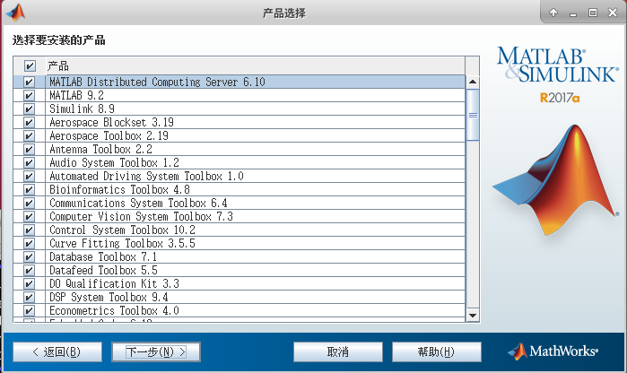 
</div> 
6. 重点来了，需要弹出DVD1 
<div align="center"> 
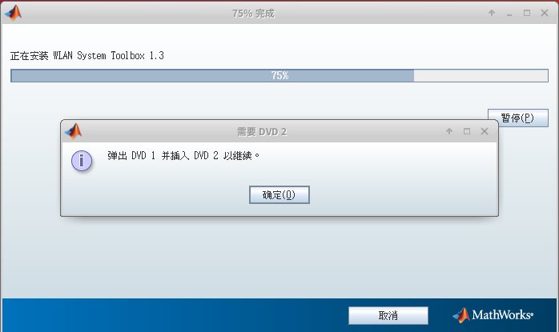 
</div> 

- 方法1：
  ```bash
   sudo umount '/media/HardDisk/公共安装包/MATLAB_R2017a_install/matlab/R2017a_glnxa64_dvd1.iso'
  ```

- 方法2：在文件管理器中找到MATHWORKS_R2017A，右键卸载。（这张图是我在Ubuntu20.04上安装Matlab照的，Ubuntu18.04一样）
<div align="center"> 
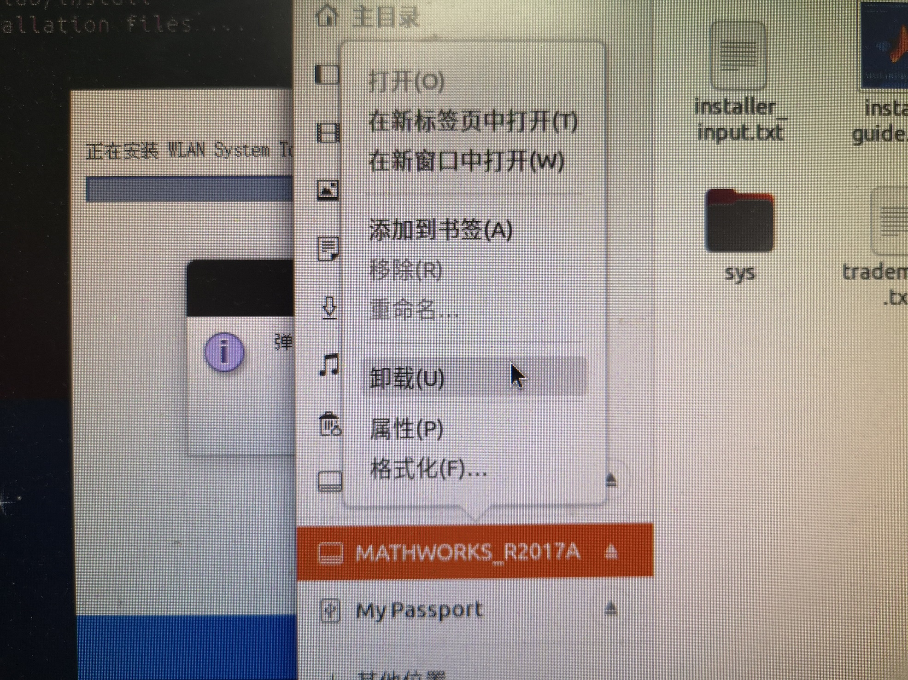 
</div> 
然后挂载DVD2，再点确定

```bash
sudo mount -o loop '/media/HardDisk/公共安装包/MATLAB_R2017a_install/matlab/R2017a_glnxa64_dvd2.iso' '/media/HardDisk/公共安装包/MATLAB_R2017a_install/matlab/matlab'
```

7. 安装结束
<div align="center"> 
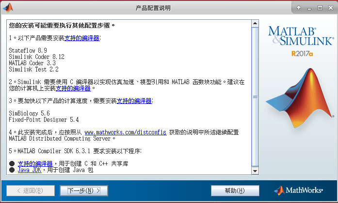 
</div> 

## 破解

1.把Matlab+2017a+Linux64+Crack.zip中的两个文件复制到对应位置

```bash
sudo cp license_standalone.lic /usr/local/MATLAB/R2017a/licenses/ 
sudo cp libmwservices.so /usr/local/MATLAB/R2017a/bin/glnxa64/
```
2.运行Matlab，Ubuntu20.04直接出现以下窗口
```bash
/usr/local/MATLAB/R2017a/bin/matlab
```
<div align="center"> 
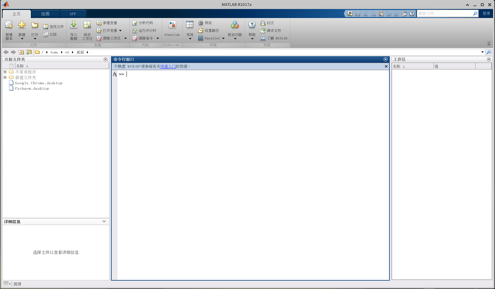 
</div> 
Ubuntu18.04可能会出现以下窗口，按步骤来即可
<div align="center"> 
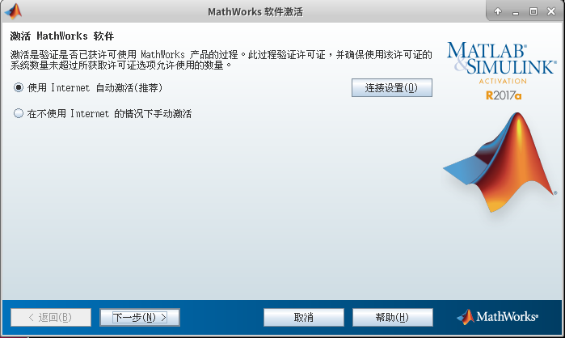 
</div> 
许可证就是Matlab+2017a+Linux64+Crack.zip中的license_standalone.lic
<div align="center"> 
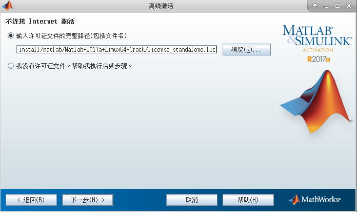 
</div> 
<div align="center"> 
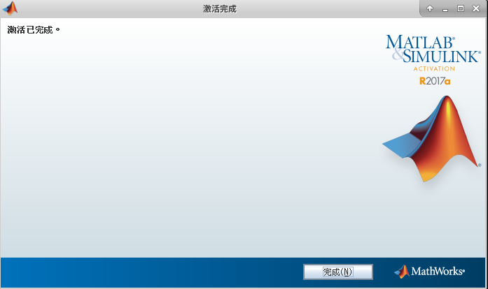 
</div> 
如果遇到权限不够情况，就加上sudo
```bash
sudo /usr/local/MATLAB/R2017a/bin/matlab
```

## Xfce4下的快捷方式设置

1.桌面右键，创建启动器

<div align="center"> 
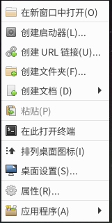 
</div> 

2.名称随便写一个，比如Matlab。

- 命令```/usr/local/MATLAB/R2017a/bin/matlab```，
  或者```sudo /usr/local/MATLAB/R2017a/bin/matlab```。
- 选上在终端运行。
<div align="center"> 
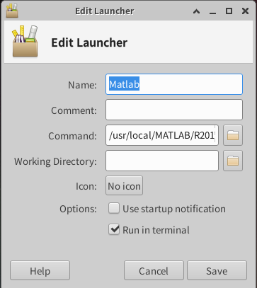 
</div> 

3.下次直接点创建的启动器就可以了
<div align="center"> 
 
</div> 

# 安装OpenCV3.4.5（使用cmake-gui）

## 文件下载和其他准备

1.安装cmake-gui和其他相关文件

```bash
sudo apt-get install build-essential
sudo apt-get install cmake git libgtk2.0-dev pkg-config libavcodec-dev libavformat-dev libswscale-dev
sudo apt-get install python-dev python-numpy libtbb2 libtbb-dev libjpeg-dev libpng-dev libtiff-dev libjasper-dev libdc1394-22-dev
sudo apt-get install cmake-qt-gui
```
2.OpenCV3.4.5文件下载
[官网链接](https://opencv.org/releases/)，可以选合适的版本
[百度网盘](https://pan.baidu.com/s/1fEsxmnSEb3RLjSL2cqKmcA)，提取码：chtk

## 安装

1. 将OpenCV3.4.5压缩包解压以后，在OpenCV3.4.5文件夹路径下运行终端

```bash
mkdir build
cd build 
cmake-gui ..
```
2. 弹出如下界面。
 - 选择source code，就是OpenCV3.4.5文件夹
 - build路径，就是刚才建立的build文件夹
<div align="center"> 
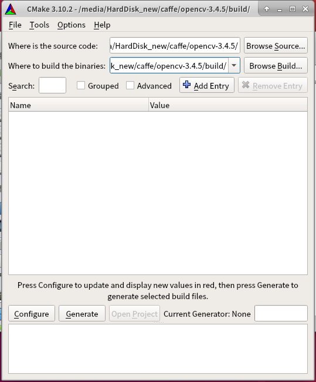 
</div> 

3. 弹出以下对话框，不用管，默认即可，点Finish
<div align="center"> 
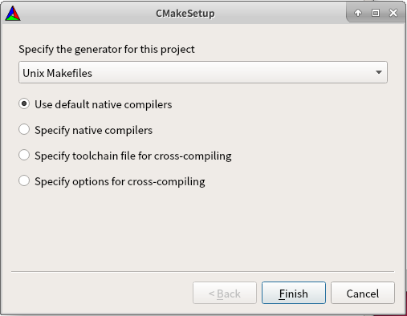 
</div> 

4. 可以见到如下界面。
见到Configuring Done即可
<div align="center"> 
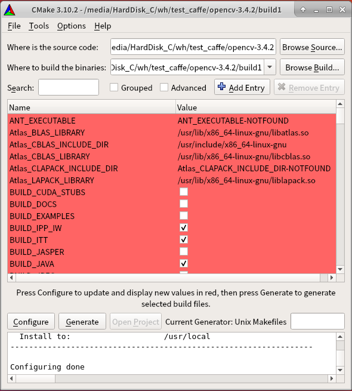 
</div> 

去掉三个地方的√，ENABLE_PRECOMPILED_HEADERS，WITH_CUDA，WITH_CUFFT
（此处参考[ubuntu18.04系统安装caffe过程](https://www.cnblogs.com/yangyuqing/p/12932434.html)，这里装OpenCV是为了安装Caffe）

<div align="center"> 
 
</div> 

<div align="center"> 
 
</div> 

<div align="center"> 
 
</div> 

点击Generate生成配置文件
<div align="center"> 
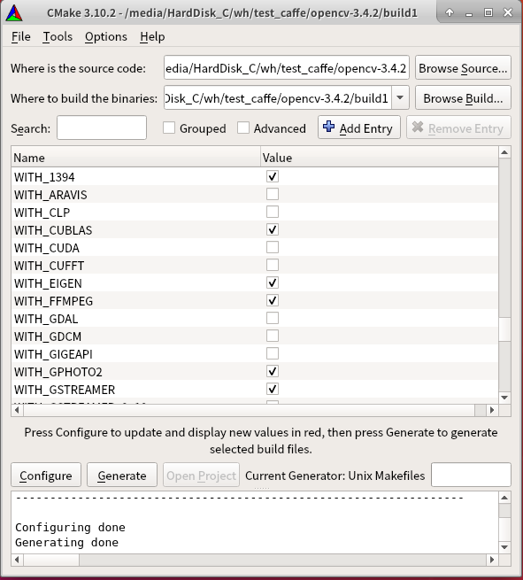 
</div> 


5. 在build目录下，运行以下代码，开始安装

```bash
make
sudo make install
```
最终可以看到
<div align="center"> 
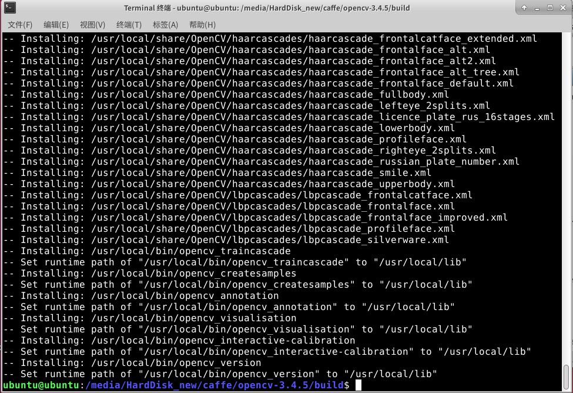 
</div> 
6. 运行代码查看OpenCV版本

```bash
pkg-config --modversion opencv
```

<div align="center"> 
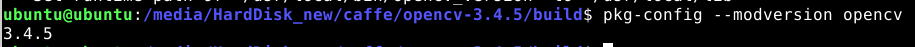 
</div> 
安装完成！

# 值得参考的经验资料
1. [Ubuntu 18.04安装OpenCV4.0和环境配置](https://blog.csdn.net/new_delete_/article/details/84797041?utm_medium=distribute.pc_relevant.none-task-blog-BlogCommendFromMachineLearnPai2-3.control&depth_1-utm_source=distribute.pc_relevant.none-task-blog-BlogCommendFromMachineLearnPai2-3.control)
2. [Ubuntu16.04中用CMake-gui安装OpenCV3.2.0和OpenCV_contrib-3.2.0](https://blog.csdn.net/jindunwan7388/article/details/80397700?utm_medium=distribute.pc_relevant.none-task-blog-baidujs_title-3&spm=1001.2101.3001.4242)
3. [Ubuntu18.04安装MatlabR2017b](https://blog.csdn.net/beizhengren/article/details/100514590)