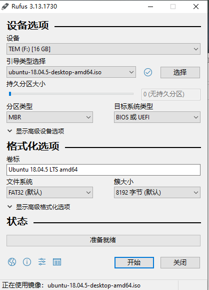
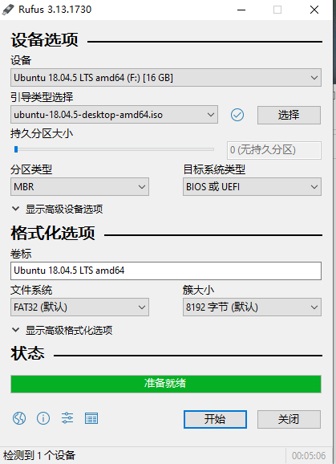
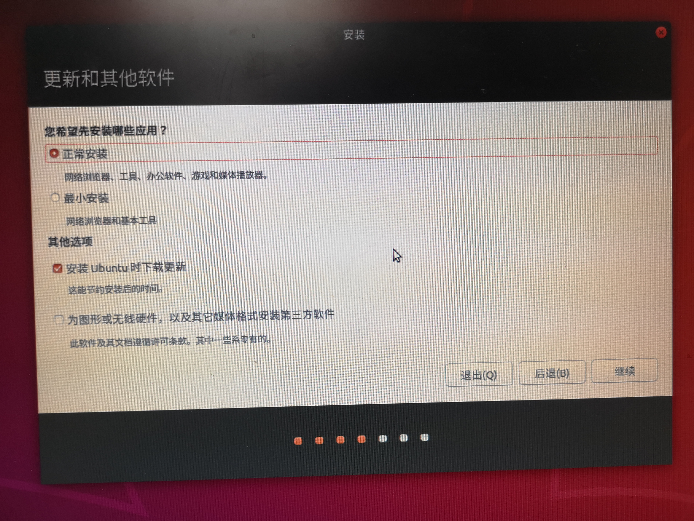
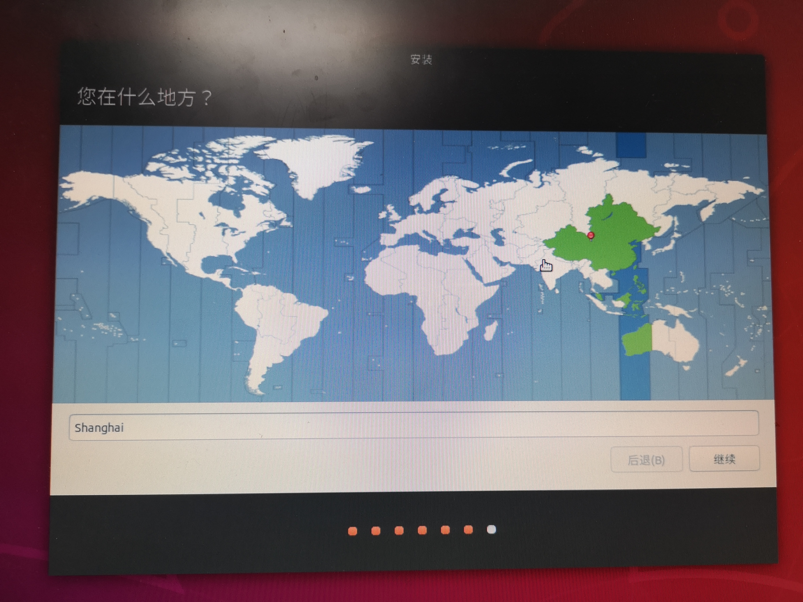
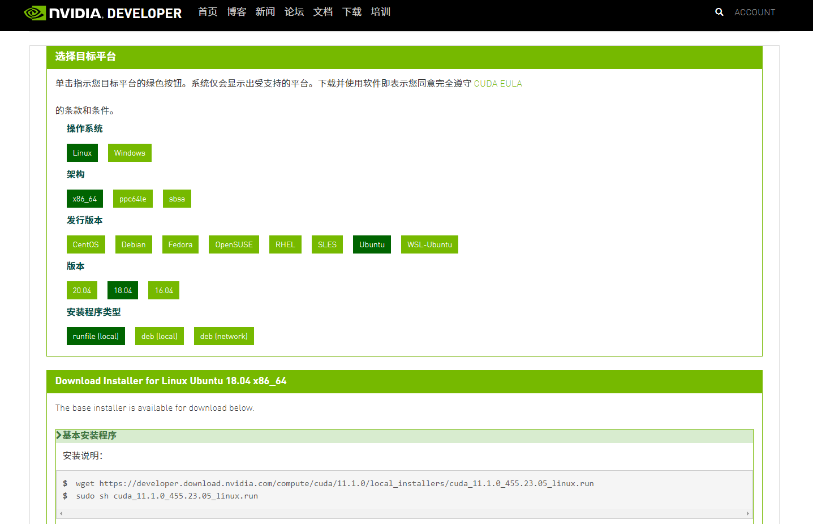
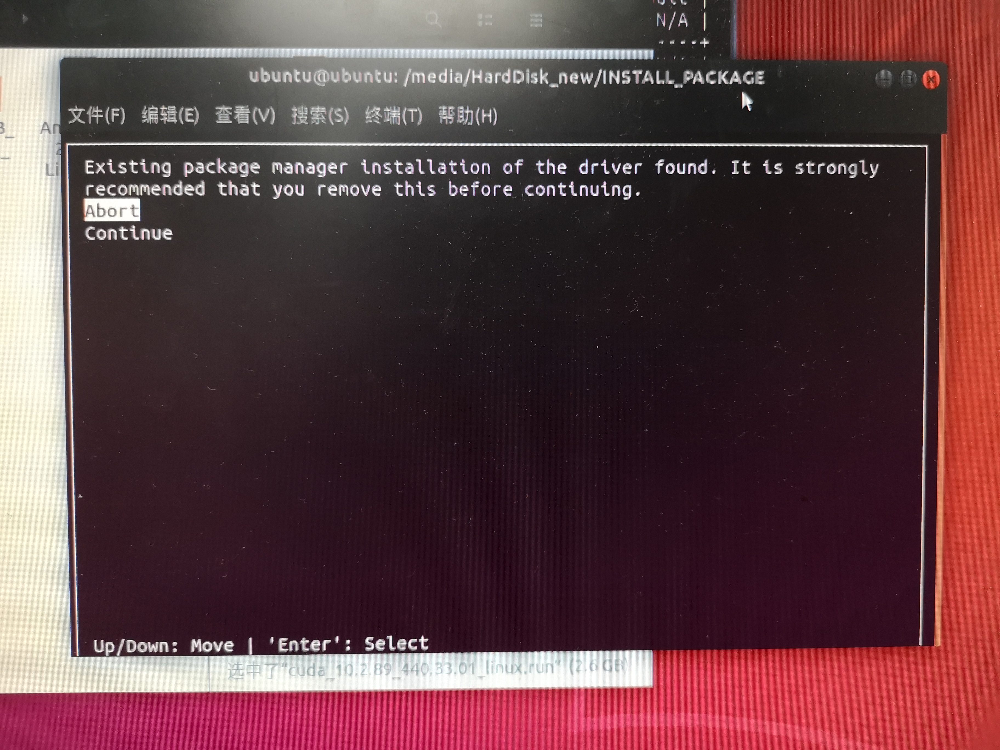
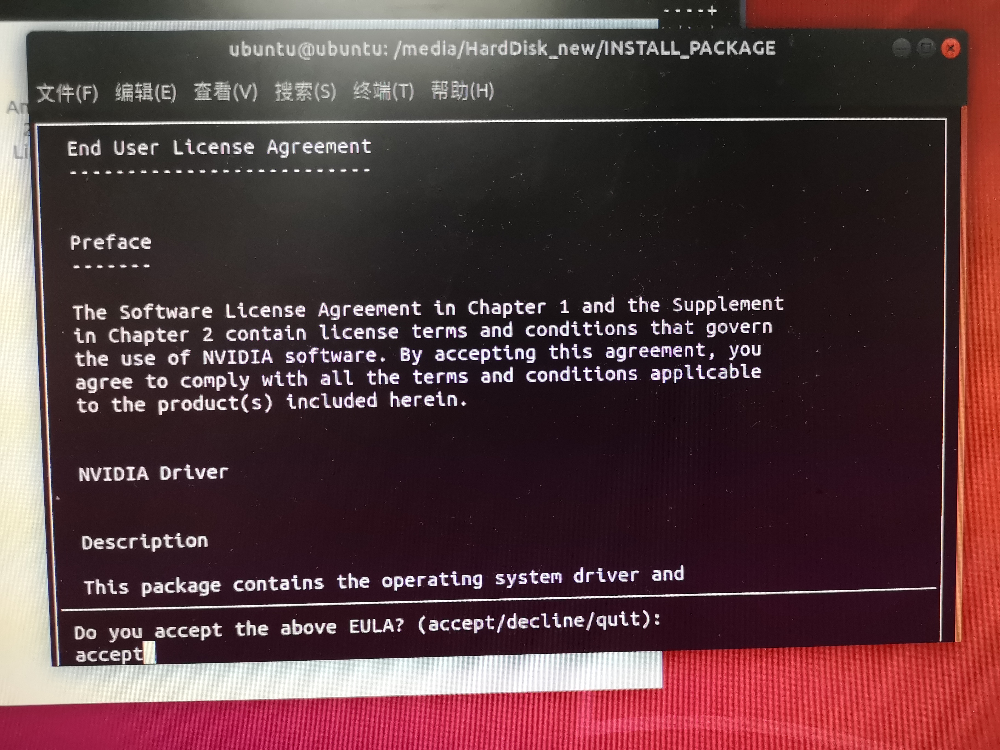
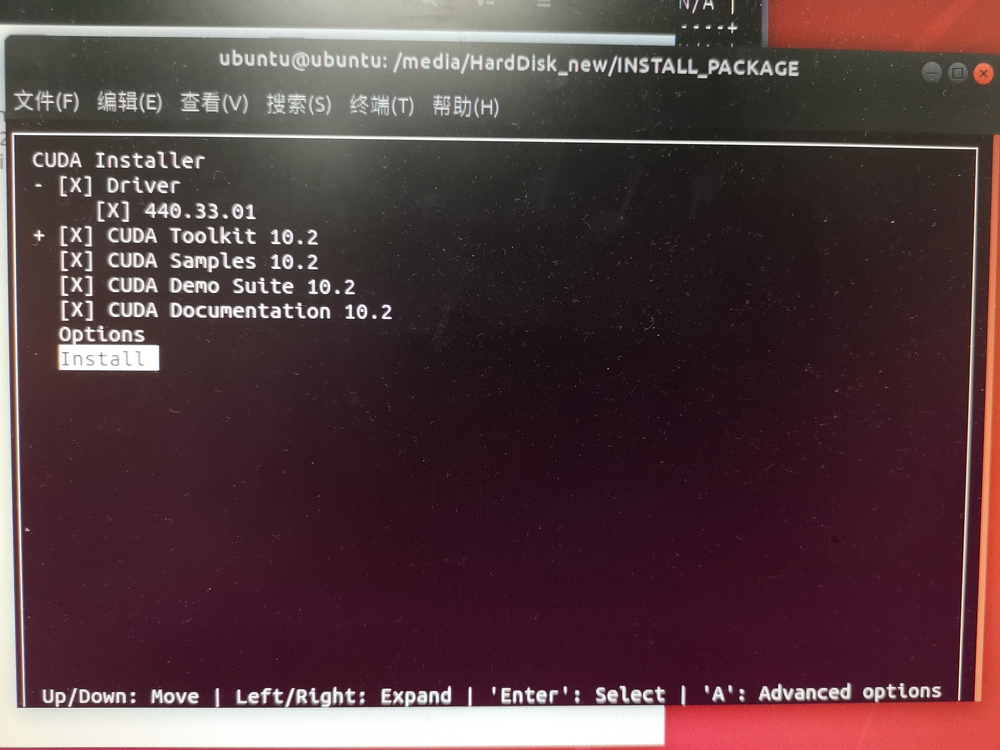
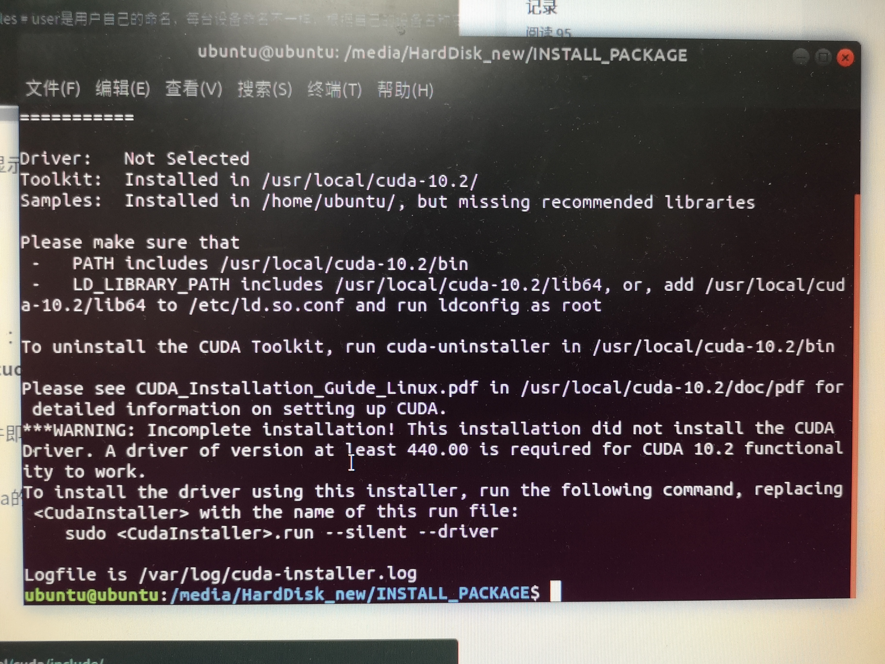

# Ubuntu18.04安装
## 安装文件下载
[Ubuntu18.04官方链接64位](https://releases.ubuntu.com/18.04/ubuntu-18.04.5-desktop-amd64.iso.torrent?_ga=2.100472542.1350456251.1609506650-303532577.1607936879)
[Rufus官方下载](https://github.com/pbatard/rufus/releases/download/v3.13/rufus-3.13.exe)
[以上两者的百度网盘](https://pan.baidu.com/s/1fiQVe_QjokMF4sN7kWe2LQ)，提取码：ico2

<!--more-->

## 制作U盘启动器
1.运行Rufus

<div align="center"> 
 
</div> 

2.选择U盘（设备），选择镜像文件（引导类型选择），其余默认。然后点击开始，制作完成。

<div align="center"> 
 
</div> 

## 更改BIOS启动顺序

 - 进入BIOS的快捷键因机器而异，仔细观察机器的启动界面总会有所发现。
 - 将启动顺序优先级最高调整为USB，若有好几个带USB的选项，就都试一下，只要进入以下界面就可以。
<div align="center"> 
 
</div> 

## 按提示安装Ubuntu
1. 上图选择中文（简体），然后点安装Ubuntu

2. 键盘布局，不用管，点继续
<div align="center"> 
 
</div> 
3. 继续
<div align="center"> 
 
</div> 
4. 创建第一个账号，可以随便写。它要是说此名称已经被使用，那就把网线拔了，再写，点继续以后再把网线插上就行。
<div align="center"> 
 
</div> 

5. ==**关键一步**==
- 第一个选项是相当于清楚现存的操作系统（可以是win10，也可以是Ubuntu16.04），然后装Ubuntu18.04
- 第二个选项是相当于装双系统
- 第三个选项没点过，应该是清除机器上的全部数据，再装Ubuntu
<div align="center"> 
 
</div> 

6. 继续
<div align="center"> 
 
</div> 

7. 等待安装完成，并按提示拔出U盘启动器

## 装完系统之后的几件事
- 更新系统
```bash
sudo apt-get update
sudo apt-get upgrade
```
- 设置root密码，关键时刻有用
```bash
sudo passwd
```
- 安装vim文本编辑器，关键时刻有用
```bash
sudo apt-get install vim
```
- 安装驱动，特别是显卡驱动。就这一条命令就行了。
```bash
sudo ubuntu-drivers autoinstall
```
 这时候运行下面这条命令，应该会看见
```bash
nvidia-smi
```
应该会看见，
```bash
Fri Jan  1 22:04:39 2021       
+-----------------------------------------------------------------------------+
| NVIDIA-SMI 455.38       Driver Version: 455.38       CUDA Version: 11.1     |
|-------------------------------+----------------------+----------------------+
| GPU  Name        Persistence-M| Bus-Id        Disp.A | Volatile Uncorr. ECC |
| Fan  Temp  Perf  Pwr:Usage/Cap|         Memory-Usage | GPU-Util  Compute M. |
|                               |                      |               MIG M. |
|===============================+======================+======================|
|   0  GeForce GTX 108...  Off  | 00000000:01:00.0 Off |                  N/A |
| 22%   38C    P8    10W / 250W |    121MiB / 11177MiB |      0%      Default |
|                               |                      |                  N/A |
+-------------------------------+----------------------+----------------------+
|   1  GeForce GTX 108...  Off  | 00000000:02:00.0 Off |                  N/A |
| 21%   30C    P8     9W / 250W |     11MiB / 11178MiB |      0%      Default |
|                               |                      |                  N/A |
+-------------------------------+----------------------+----------------------+
                                                                               
+-----------------------------------------------------------------------------+
| Processes:                                                                  |
|  GPU   GI   CI        PID   Type   Process name                  GPU Memory |
|        ID   ID                                                   Usage      |
|=============================================================================|
|    0   N/A  N/A      1286      G   /usr/lib/xorg/Xorg                 14MiB |
|    0   N/A  N/A      1562      G   /usr/bin/gnome-shell               14MiB |
|    0   N/A  N/A     20063      G   /usr/lib/xorg/Xorg                 65MiB |
|    0   N/A  N/A     20185      G   /usr/bin/gnome-shell               21MiB |
|    1   N/A  N/A      1286      G   /usr/lib/xorg/Xorg                  4MiB |
|    1   N/A  N/A      1562      G   /usr/bin/gnome-shell                0MiB |
|    1   N/A  N/A     20063      G   /usr/lib/xorg/Xorg                  4MiB |
|    1   N/A  N/A     20185      G   /usr/bin/gnome-shell                0MiB |
+-----------------------------------------------------------------------------+
```
可以再尝试一下

```bash
watch -n 1 nvidia-smi
```

# 安装CUDA
## 下载CUDA版本
- 根据[NVIDIA官方](https://developer.nvidia.com/zh-cn/cuda-downloads?target_os=Linux&target_arch=x86_64&target_distro=Ubuntu&target_version=1804&target_type=runfilelocal)，选择合适的CUDA（会自动帮你选）
<div align="center"> 
 
</div> 
比如，他就推荐我安装CUDA11.1。这里不必过于纠结装哪个版本的CUDA，特别是对于使用Anaconda管理Python环境的同学。若是用Anaconda管理Python环境，不装CUDA都行，因为它会在你所安装的库（比如tensorflow-gpu）需要的时候，自动给你装对应版本的cudatoolkit。

  运行他给出的命令。

```bash
wget https://developer.download.nvidia.com/compute/cuda/11.1.0/local_installers/cuda_11.1.0_455.23.05_linux.run
sudo sh cuda_11.1.0_455.23.05_linux.run
```
- 也可以根据[CUDA Toolkit Archive](https://developer.nvidia.com/cuda-toolkit-archive)，自己挑选适合自己的CUDA版本

## 按提示安装
1.选Continue
<div align="center"> 
 
</div> 

2. 输入accept
<div align="center"> 
 
</div> 

3. 选要安装的文件，因为刚才已经安装过驱动了，所以把Driver前的×去掉，不装。也由此可见，Anaconda安装的cudatoolkit是cuda的一部分。然后Install
<div align="center"> 
 
</div> 

4. 看到这个界面就是装完了
<div align="center"> 
 
</div> 

5. 设置环境变量

 - 打开环境变量
 ```bash
sudo gedit ~/.bashrc
 ```
 - 在.bashrc最后添加
  ```bash
export PATH=/usr/local/cuda-10.2/bin${PATH:+:$PATH}}
export CUDA_HOME=/usr/local/cuda-10.2
```
 - 使修改的环境变量生效
  ```bash
source ~/.bashrc
```
 - 运行nvcc -V，查看CUDA版本
 

```bash
nvcc -V
```

```bash
nvcc: NVIDIA (R) Cuda compiler driver
Copyright (c) 2005-2019 NVIDIA Corporation
Built on Wed_Oct_23_19:24:38_PDT_2019
Cuda compilation tools, release 10.2, V10.2.89
```
安装成功！