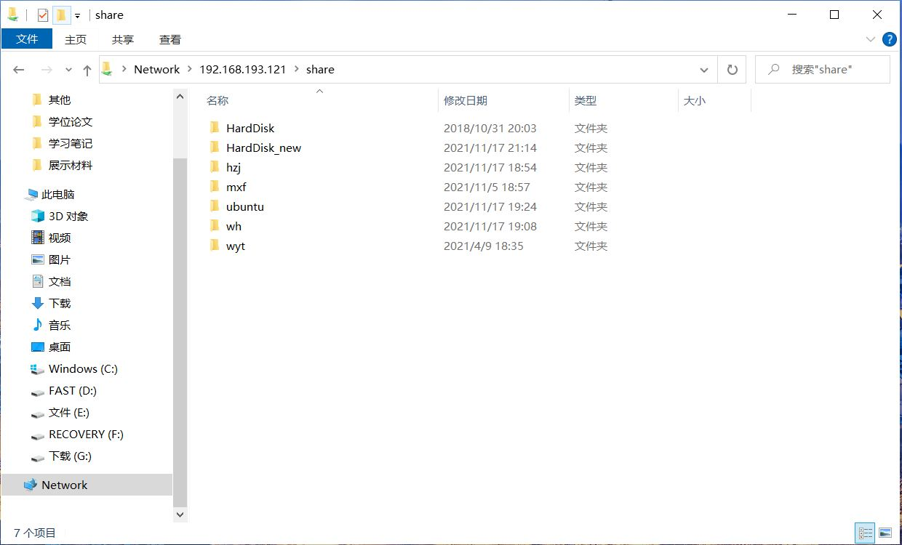
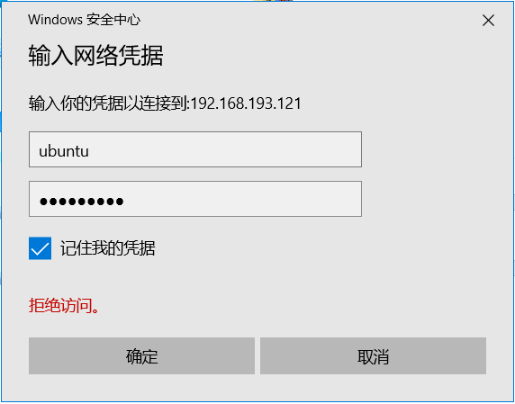
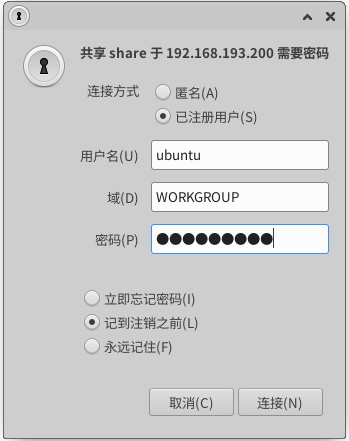
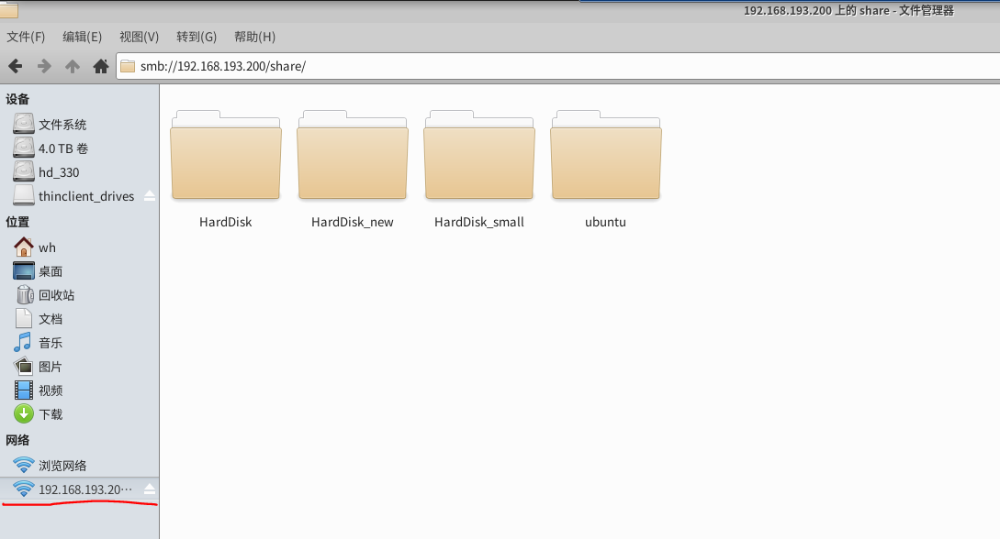

# 前言
预想达到的效果：多台Ubuntu之间，Ubuntu和win10之间，只用ip地址就可可以进行==图形化界面文件共享==。比如以下效果，看上去就是一个特殊的文件夹。
<div align="center"> 
 
</div> 

这样的效果对于含多台ubuntu服务器的实验室来说是很有帮助的，**既可以免去用硬盘在多服务器上拷贝数据的痛苦，又可以用自己的win10电脑轻易查看服务器文件**。

我们使用的插件是samba，**只需在ubuntu上进行安装**，即可实现上述效果。
官方要求Ubuntu16.04，**实测Ubuntu18.04,Ubuntu20.04也可以**。

<!--more-->

其实你完全可以按照[官方教程](https://ubuntu.com/tutorials/install-and-configure-samba#4-setting-up-user-accounts-and-connecting-to-share)来操作，官方写的挺好的没有坑。这本是去年这个时候在实验室里倒腾明白的东西，现在毕业了才突然想起来写篇博客。

# 安装samba
```bash
sudo apt update
sudo apt install samba
```

检测一下是否安装正确，

```bash
whereis samba
```
应该返回
```bash
samba: /usr/sbin/samba /usr/lib/samba /etc/samba /usr/share/samba /usr/share/man/man7/samba.7.gz /usr/share/man/man8/samba.8.gz
```
# 设置共享文件夹
可新建一个用于共享的文件夹，这个文件夹下面的文件，都可以远程读写。也可以直接用已有的文件夹。
```bash
 sudo mkdir /home/ubuntu/sambashare/
```

编辑samba文件

```bash
sudo nano /etc/samba/smb.conf
```
在最后添加以下代码，

```bash
[share]
    comment = Samba on Ubuntu
    path = /media/
    read only = no
    browsable = yes
```
```Ctrl-O```保存修改，```Ctrl-X```退出。

重启samba服务

```bash
sudo service smbd restart
```
防火墙相关设置
```bash
sudo ufw allow samba
```


附：（1）上述代码说明
```bash
[share] # 远程访问时共享文件夹的名字，官方是sambashare
    comment = Samba on Ubuntu
    path = /media/  # 共享文件夹路径，比如将整个media文件夹共享
    read only = no  # 此时允许远程修改文件
    browsable = yes # Ubuntu中共享文件夹可在文件管理器中出现在左侧栏
```

（2）如果你用的是```vim```文本编辑器(```sudo nano /etc/samba/smb.conf```)：
- 先输入```i```然后回车,在最后添加代码，
- 按esc退出输入模式
- 输入```:wq```保存推迟

还是建议使用```nano```，一是有操作提示，二是提示还是中文的。如果你用的```gedit```那就更方便了。

# 设置访问账号
samba使用==ubuntu中已有的登录账号==，比如设置用户名为ubuntu的账号

```bash
sudo smbpasswd -a ubuntu
```
如果一个服务器多账户，建议每个账户都设置一遍。

# Win10访问
在文件管理器地址栏，输入```\\ip地址\\共享文件夹显示名```，比如```\\192.168.193.121\share```。（==注意斜线方向==）弹出对话框，输入账户密码，确定。
<div align="center"> 
 
</div> 
<div align="center"> 
 
</div> 

# Ubuntu访问
在文件管理器地址栏，输入```smb://ip地址/共享文件夹显示名```，比如```smb://192.168.193.200/share```。输入账户密码，确定。
<div align="center"> 
 
</div> 

注意左下角，如果上面选择“记到注销之前”或者“永远记住”，是会保留的。
<div align="center"> 
 
</div> 

# 多说一点
如果在远程文件夹中打开终端，会发现有一串地址，比如
<div align="center"> 
 
</div> 
这个地址（蓝色部分）甚至可以在Python程序中使用，完成对文件的远程读写。读写速度主要取决于网速。

# 最后
写了这么多，真正要执行的只有六条核心命令，其余都是验证性或辅助性的。

既然已经毕业了，这应该是小王关于实验室服务器管理写的最后一篇博客吧。回过头来看，管理实验室服务器固然事情繁杂琐碎，但是也得到了很多东西，有技术上的，更有技术之外的感动和收获。总结起来，实验室服务器管理更像是非代码技术，因为管理的核心是管理使用服务器的人。

# 参考
1. [install-and-configure-samba](https://ubuntu.com/tutorials/install-and-configure-samba#1-overview)
