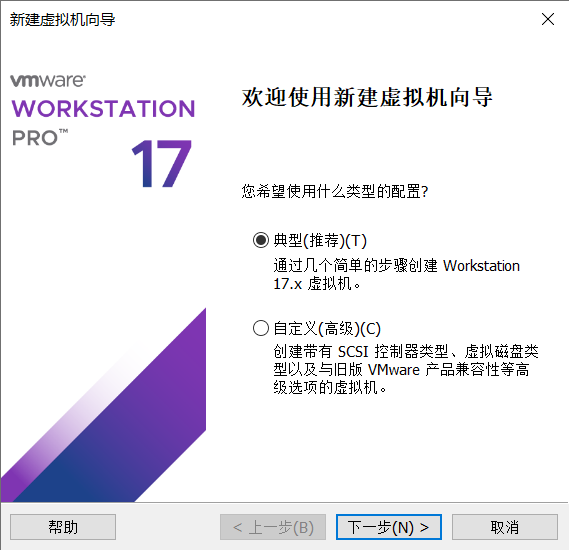
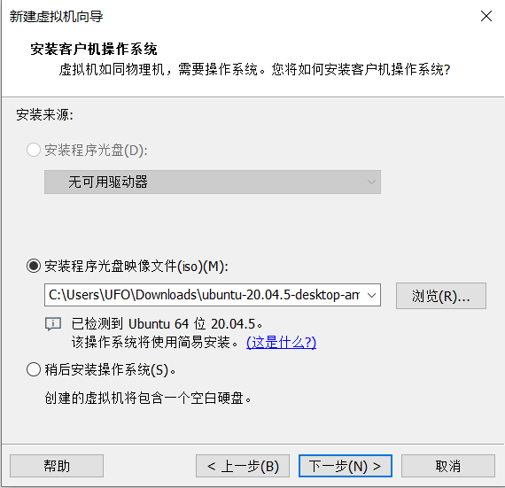
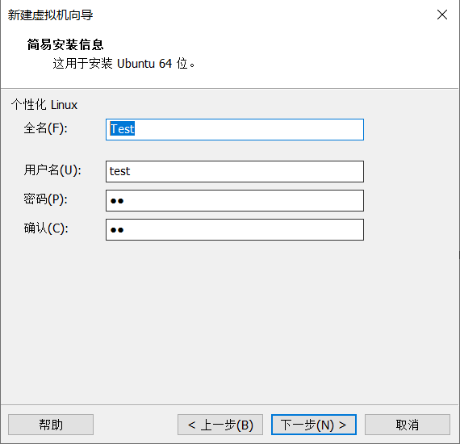
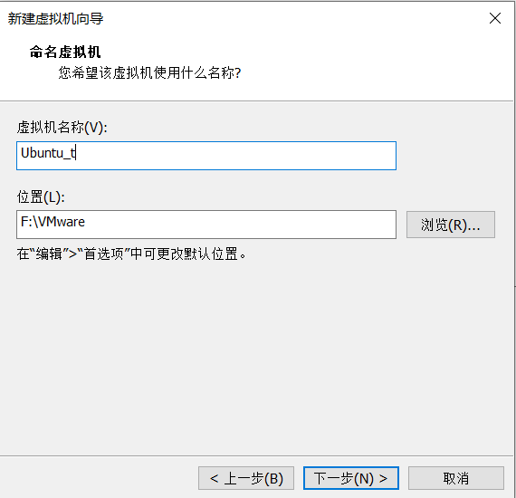
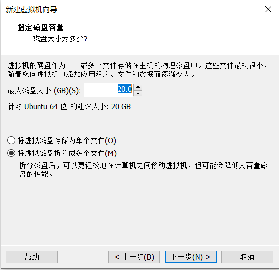
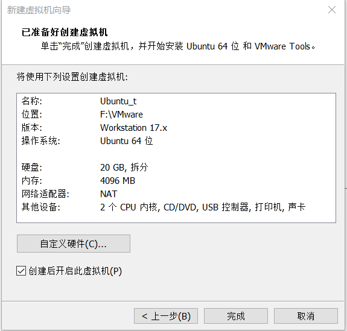
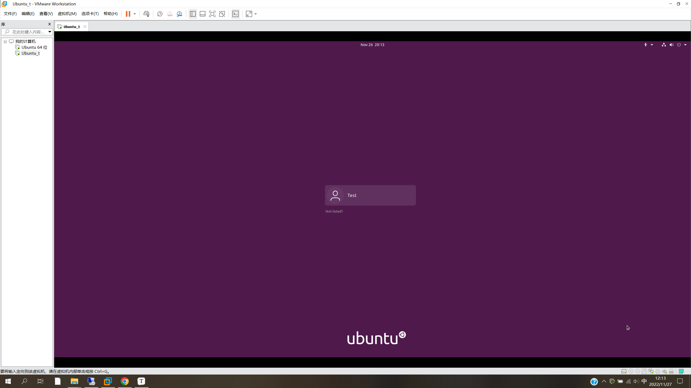
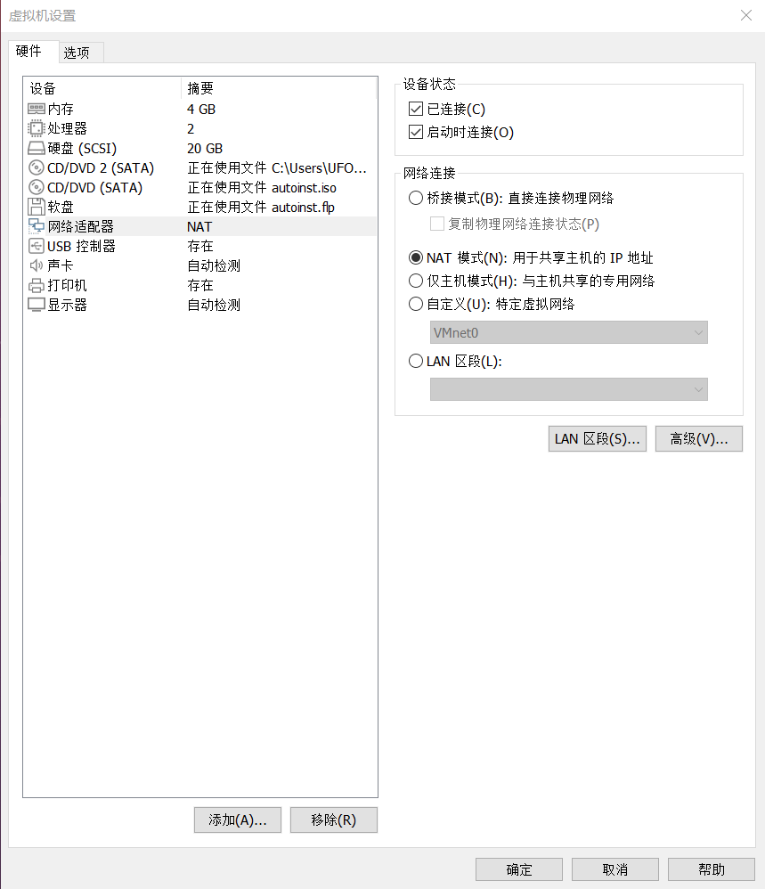
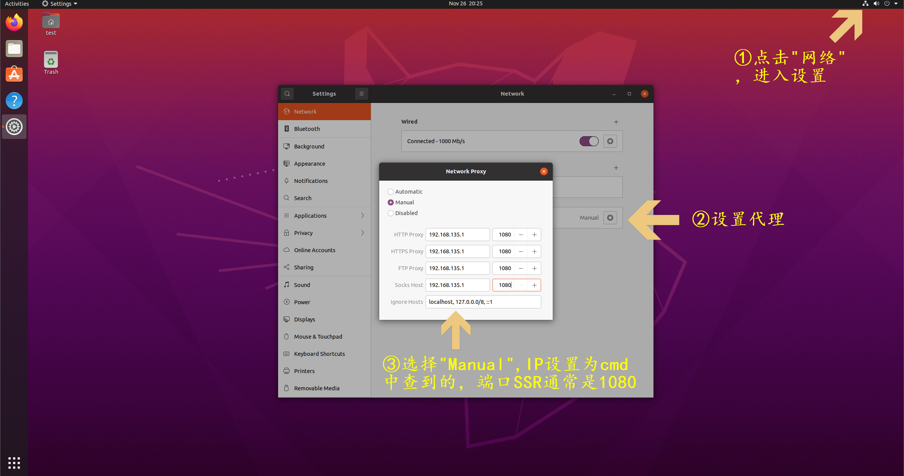

# 0. 前言

对于研究生或者科研人员来讲，通常需要同时用到Win10和Ubutnu。如果手底下只有一个机器，最好最安全也是最便捷的方法是创建Ubuntu虚拟机。

<!--more-->

# 1. 下载Ubuntu镜像文件

Ubuntu官网：https://cn.ubuntu.com/download/desktop

Ubutnu官方镜像站：https://launchpad.net/ubuntu/+cdmirrors

北交镜像：https://mirror.bjtu.edu.cn/ubuntu-releases/


这里我用的是北交镜像的Ubuntu20.04.5：https://mirror.bjtu.edu.cn/ubuntu-releases/20.04.5/，
iso下载地址：https://mirror.bjtu.edu.cn/ubuntu-releases/20.04.5/ubuntu-20.04.5-desktop-amd64.iso


# 2. 安装 VMware

VMware 17 官网：https://www.vmware.com/cn/products/workstation-pro/workstation-pro-evaluation.html

[知乎网友](https://zhuanlan.zhihu.com/p/584758211)提供的密钥：MC60H-DWHD5-H80U9-6V85M-8280D 


# 3. 创建虚拟机

1. 打开VMware，菜单栏点击“文件”->"新建虚拟机"

   

2. 选择镜像并输入相关信息，并开始安装

   

   

   

   

   

3. 等待安装完毕，显示

   


# 4. 设置虚拟机代理

为了git等命令的方便

1. 在Win10上cmd中输入`ipconfig`查看`以太网适配器 VMware Network Adapter VMnet1`的IPv4

   ```
   以太网适配器 VMware Network Adapter VMnet1:
   
      连接特定的 DNS 后缀 . . . . . . . :
      本地链接 IPv6 地址. . . . . . . . : ***********************
      IPv4 地址 . . . . . . . . . . . . : 192.168.135.1
      子网掩码  . . . . . . . . . . . . : 255.255.255.0
   ```

2. VMware设置。在左侧栏中选择虚拟机（这里是Ubuntu_t），右键“设置”。弹出对话框，“网络适配器”->"网络连接"->"NAT模式"->"确定"。

   

3. Ubutnu的设置

   

4. 在Ubuntu中打开浏览器看看某些国外网站（如Github）访问是否流畅。

   

# 5. 参考

1. https://zhuanlan.zhihu.com/p/584758211