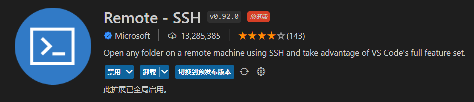

# 0. 前言

对于远程开发而言，目前最好的IDE是VSCode。可使用SSH时，不仅每次连接远程服务器都要属于一次密码，关键是每次打开一个新目录都要输入密码。过于繁琐的操作，直接影响心情。

这里记录一下如何设置，达到VSCode免密登录远程主机的效果.

<!--more-->


# 1. 预备

1. 远程主机（Ubuntu）已安装ssh，未安装可用以下命令

   ```bash
   sudo apt-get install ssh
   ```

2. 本地机（Win10）一般都有ssh
3. 本地机安装VSCode，**并且在VSCode中安装插件：Remote-SSH 和Remote Development**

	
	


# 2. 将本地公钥传到远端

1. 生成ssh的公钥私钥。（若之前已经生成过则跳过）打开cmd输入，

   ```cmd
   ssh-keygen
   ```

   文件一般保存在目录`C:\Users\Administrator\.ssh`下面，包含两个文件`id_rsa`和`id_rsa.pub`，其中`id_rsa.pub`就是公钥。

2. 传输到远程主机对应的ssh目录下。这里为了便于后续管理，我将`id_rsa.pub`重命名为`WORK_id_rsa.pub`

   ```cmd
   scp WORK_id_rsa.pub wh@192.168.131.131:/home/wh/.ssh/
   ```

3. 远程主机中，生成`authorized_keys`

   ```bash
   cd /home/wh/.ssh/
   cat WORK_id_rsa.pub  >> authorized_keys
   ```

   注：linux的cat命令，`>`是覆盖，`>>`是添加。


# 3. 设置VSCode的SSH

(有些地方不需要这步)

文件一般是`C:\Users\Administrator\.ssh\config`

添加私钥：在原来的后面添加一行` IdentityFile "C:\Users\Administrator\.ssh\id_rsa"`即可

```
Host 192.168.131.131
  HostName 192.168.131.131
  User wh
  IdentityFile "C:\Users\Administrator\.ssh\id_rsa"
```

（如有必要，重启VSCode）即可享受免密登录


# 4. 参考

1. https://zhuanlan.zhihu.com/p/222452460