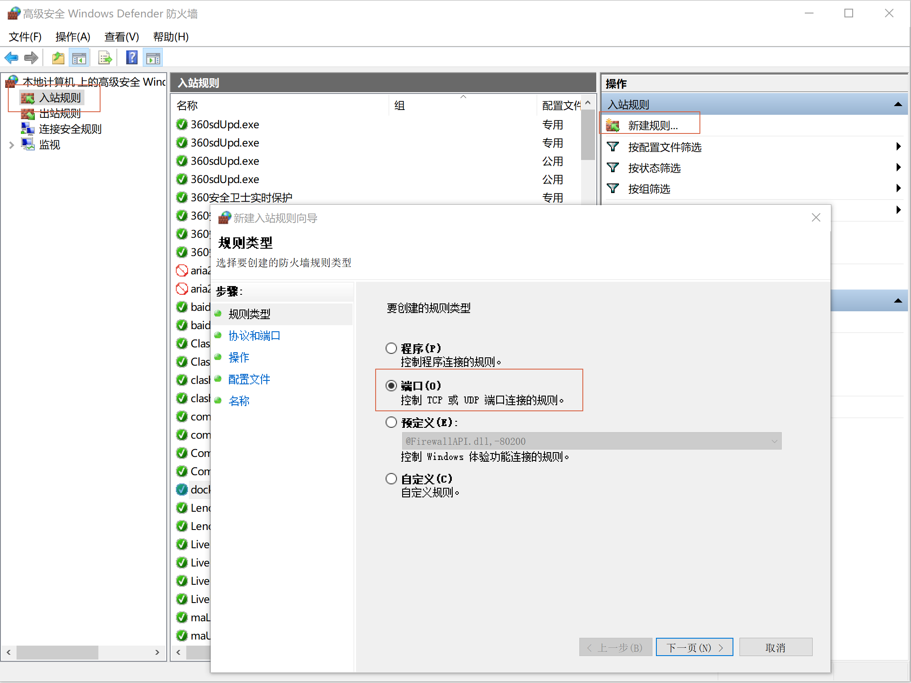
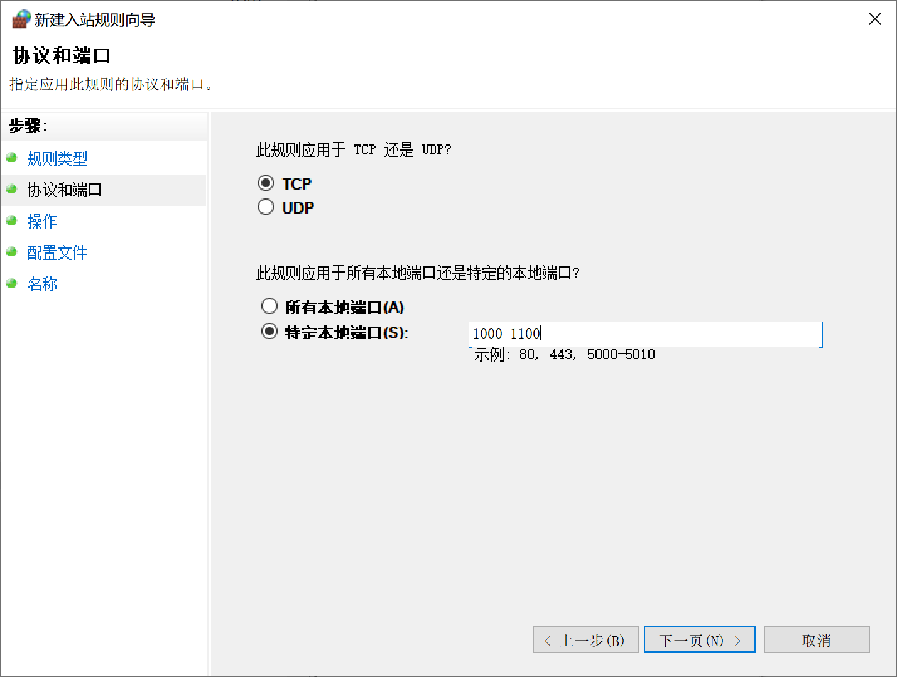

为兼顾可移植性和效率，选用Docker进行虚拟机管理平台，但底层适配使用wsl

（此教程建立在对docker使用有基础的情况下）

<!--more-->

# 1. wsl2与ubuntu

管理员权限打开cmd

1. 安装wsl

   ```
   dism.exe /online /enable-feature /featurename:Microsoft-Windows-Subsystem-Linux /all /norestart
   ```

2. 升级到wsl2

   ```
   dism.exe /online /enable-feature /featurename:VirtualMachinePlatform /all /norestart
   ```


3. 更新Linux对应版本

   ```
   wsl.exe --update
   ```

   [旧版 WSL 的手动安装步骤 | Microsoft Learn](https://learn.microsoft.com/zh-cn/windows/wsl/install-manual#step-4---download-the-linux-kernel-update-package)

5. 设置默认版本

   ```
   wsl --set-default-version 2
   ```

5. Microsoft Store中安装Ubuntu
   - 创建用户，输入用户名和密码


# 2. Docker Desktop

1. 下载Docker Desktop

   - https://www.docker.com/products/docker-desktop/

2. 拉取镜像

   ```
   docker pull ubuntu:22.04
   ```

3. 启动

   ```
   docker run -it -p 1022:22 ubuntu:22.04 bash
   ```

   将主机的1022端口映射到Container的22端口

4. 按照需求正常配置container

   

# 3. SSH远程连接

## 3.1 Container中常规设置

1. 安装完了ssh一定要启动

   ```
   apt install ssh
   ```

   ```
   ssh-keygen
   service ssh start
   ```

2. 修改`/etc/ssh/sshd_config`

   ```
   PermitRootLogin yes
   PubkeyAuthentication yes
   PasswordAuthentication yes
   ```

   ```
   service ssh restart
   ```

3. 添加主机公钥到`authorized_keys`用于免密链接


## 3.2 Container设置ssh为开机启动

1. 创建脚本

   ```bash
   # /root/start_ssh.sh
   #!/bin/bash
   service ssh start 
   ```
   修改权限
   
   ```bash
   chmod +x /root/start_ssh.sh
   ```

2. 修改`~/.bashrc`

   ```bash
   # startup run
   if [ -f /root/start_ssh.sh ]; then
         bash /root/start_ssh.sh
   fi
   ```

   

## 3.3 主机防火墙设置

最暴力方法：关闭Windows Defender

详细设置规则：

1. 任务栏`搜索` -> `Windows Defender 防火墙` -> `启用或关闭 Windows Defender 防火墙`

2. 在Windows Defender中的`高级设置`的`入站规则`中细致处理

   新建规则->端口

   


3. 设置具体端口，比如1000-1100

   其余部分直接下一步即可

   

4. 启用规则

5. SSH连接

    ```
    ssh -p 1022 root@localhost
    ```
   - 1022 是因为container启动时，已经将主机的1022端口映射到container中的22端口
   
   - root是指docker中的用户名字
   
   - localhost是指本地
   
     


# 参考

1. [如何使用 WSL 在 Windows 上安装 Linux](https://learn.microsoft.com/zh-cn/windows/wsl/install)
2. [WSL 的基本命令](https://learn.microsoft.com/zh-cn/windows/wsl/basic-commands)
3. [WSL 2 上的 Docker 远程容器入门](https://learn.microsoft.com/zh-cn/windows/wsl/tutorials/wsl-containers)

