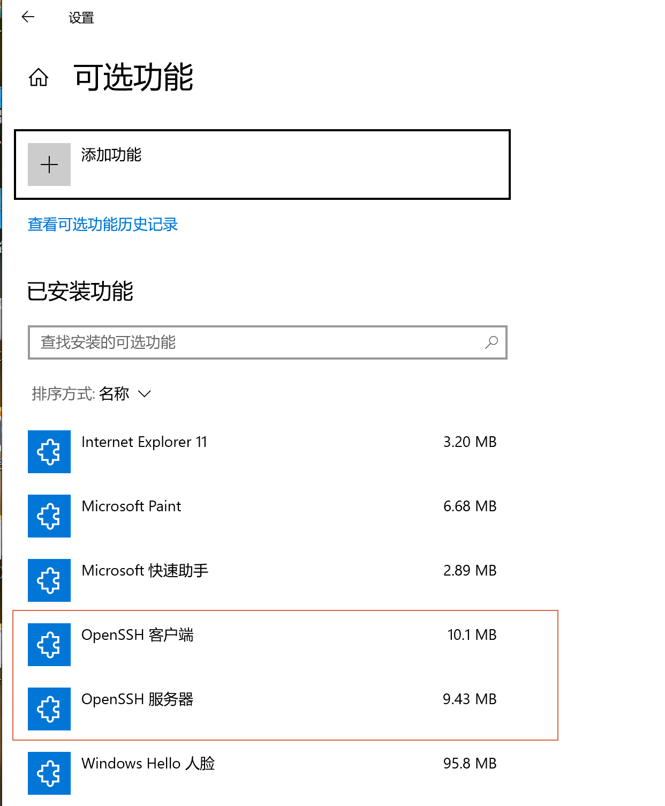
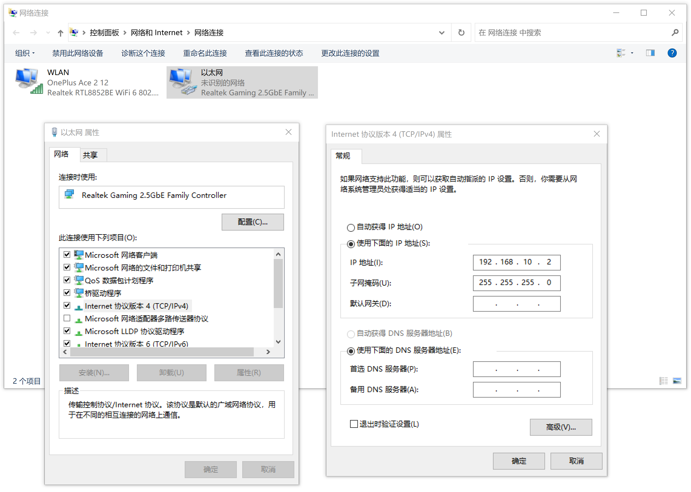
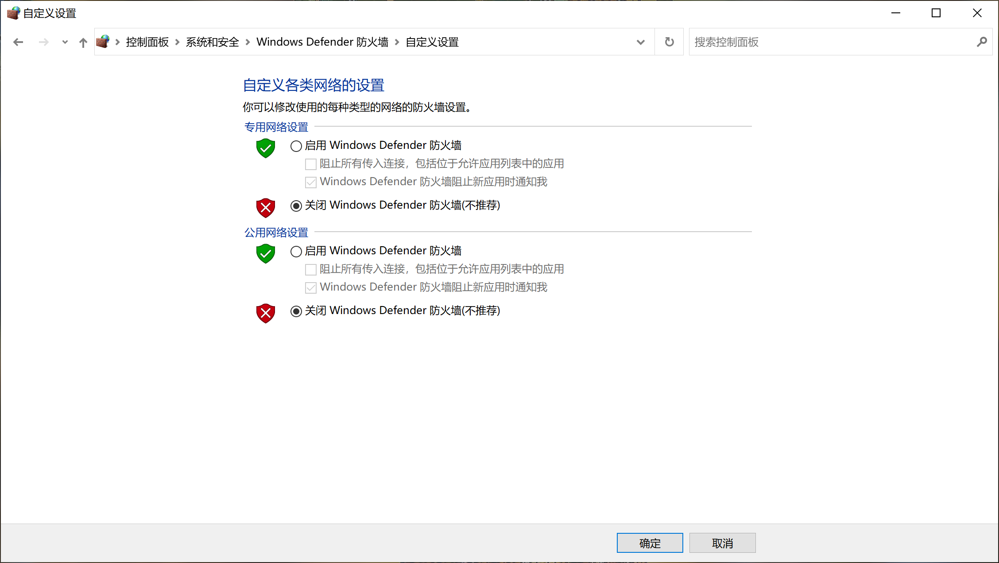
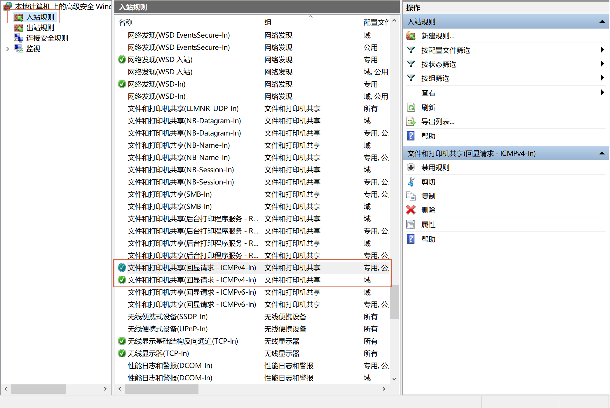

# 场景

1. 一根网线，实现两台win10主机之间的网络直连

2. 使用ssh / scp实现文件高速传输

<!--more-->

# 1. SSH

1. 任务栏`搜索` -> `可选功能`-> `添加功能`

   - 添加`OpenSSH 客户端`和`OpenSSH 服务器`

   

2. 使用管理员权限打开cmd

   ```
   ssh-keygen
   ```

   一路确认。生成公钥和私钥

   

3. 在cmd中输入， 启动ssh

   ```
   net start sshd
   ```

   输出

   ```
   OpenSSH SSH Server 服务正在启动 .
   OpenSSH SSH Server 服务已经启动成功。
   ```

   **注意**：在网络可以ping通，但ssh连不上的时候，通常是因为对方ssh服务未开


# 2. ip设置

网线将两个win10主机连接后，

任务栏`搜索` -> `查看网络连接` -> `以太网` -> `属性` --> `Internet 协议版本 4 (TCP/IPv4) ` -> `属性`



1. 主机A设置为

   - IP：192.168.10.2
   - 子网掩码：255.255.255.0

   

2. 主机B设置为
   - IP：192.168.10.1
   - 子网掩码：255.255.255.0


# 3. 防火墙设置

## 3.1 简单方法：关闭防火墙

1. 任务栏`搜索` -> `Windows Defender 防火墙` -> `启用或关闭 Windows Defender 防火墙`

   然后关闭防火墙

   

## 3.2 细致方法：配置防火墙

在Windows Defender中的`高级设置`的`入站规则`和`出站规则`中进行细致的处理，而不是直接关闭防火墙

1. 设置文件和打印机共享：在`入站规则`中启用规则

   - 文件和打印机共享（回显请求 - ICMPv4-In），专用，公用
   - 文件和打印机共享（回显请求 - ICMPv4-In），域

   此时，对方可以正常使用`ping`查看网络连接是否通畅

   

## 4. 传输文件

使用scp 命令，比如

```
scp -r A@192.168.10.2:E:\1 .\1
```

将A主机的文件夹拷贝到本地


# 参考

1. [适用于 Windows Server 和 Windows 的 OpenSSH 服务器配置](https://learn.microsoft.com/zh-cn/windows-server/administration/openssh/openssh_server_configuration)
2. [适用于 Windows 的 OpenSSH 入门](https://learn.microsoft.com/zh-cn/windows-server/administration/openssh/openssh_install_firstuse?tabs=gui)